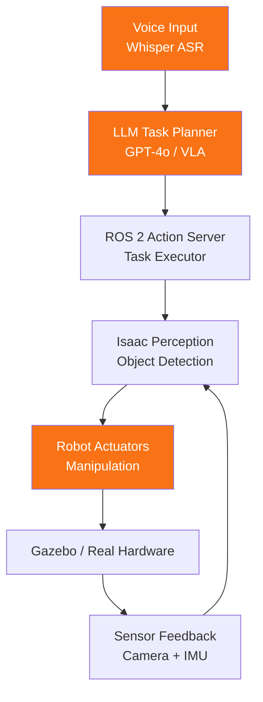

# Capstone Project: Autonomous Humanoid Robot

## Project Goal

Apply all four modules to build an **autonomous humanoid robot** capable of receiving natural language voice commands, perceiving its environment, planning actions, and executing object manipulation tasks.

## Prerequisites

Complete all four modules before starting the capstone:

| Module | Topic | Required Concepts |
|--------|-------|-------------------|
| Module 1 | ROS 2 Fundamentals | Nodes, topics, services, actions, TF2 |
| Module 2 | Digital Twin Simulation | Gazebo, physics engines, sensor plugins |
| Module 3 | NVIDIA Isaac Platform | Perception pipeline, sim-to-real transfer |
| Module 4 | VLA Robotics | Whisper ASR, LLM planning, VLA models |

## System Architecture

The capstone project consists of five integrated subsystems:

### 1. Perception Stack (Isaac SDK)
- RGB-D camera input via Isaac ROS
- Object detection and 6-DOF pose estimation
- Semantic scene understanding for manipulation planning

### 2. Voice Interface (Whisper + LLM)
- Real-time speech-to-text via OpenAI Whisper
- Intent recognition and task decomposition via GPT-4o-mini
- Natural language to robot action sequence mapping

### 3. Motion Planning (ROS 2 + MoveIt 2)
- Inverse kinematics for arm joint planning
- Collision-aware trajectory generation
- ROS 2 action interfaces for asynchronous execution

### 4. Simulation Environment (Gazebo Fortress)
- Full humanoid model with URDF and SDF descriptors
- Physics-accurate object interaction and gravity
- Sensor simulation: camera, IMU, force/torque

### 5. Real Hardware Integration (Optional)
- Jetson Orin Nano deployment of all subsystems
- ROS 2 driver bridging simulation to real actuators
- Safety limits and emergency stop integration

## Hardware Requirements

### Minimum (Simulation Only)
- CPU: 8-core modern processor (Intel i7 / AMD Ryzen 7)
- RAM: 16 GB
- GPU: NVIDIA GPU with CUDA support (for Isaac)
- Storage: 50 GB free space
- OS: Ubuntu 22.04 LTS

### Recommended (Real Hardware)
- NVIDIA Jetson Orin Nano Developer Kit (8 GB)
- USB camera or CSI camera module
- Compatible robot platform (see [Hardware Guides](/docs/hardware/robot-platforms))
- Wi-Fi or Ethernet connection to development machine

## Expected Outcomes

By the end of the capstone project, students will have:

- [ ] A functioning Gazebo simulation environment with a humanoid robot model
- [ ] Voice command pipeline converting speech to robot actions
- [ ] Isaac-powered object detection integrated with ROS 2
- [ ] Manipulation task execution (pick, place, navigate)
- [ ] A recorded demo video of the complete system

## Estimated Effort

| Phase | Effort |
|-------|--------|
| Environment setup | ~4 hours |
| Perception integration | ~6 hours |
| Voice pipeline | ~4 hours |
| Motion planning | ~8 hours |
| Integration and testing | ~6 hours |
| **Total** | **~28 hours** |

## Getting Started

Proceed to the [Step-by-Step Guide](/docs/capstone/steps) to begin implementation.

:::tip Start with Simulation
Even if you plan to use real hardware, always develop and validate in Gazebo first. The sim-to-real gap is much easier to close when the simulation behaviour is correct.
:::
