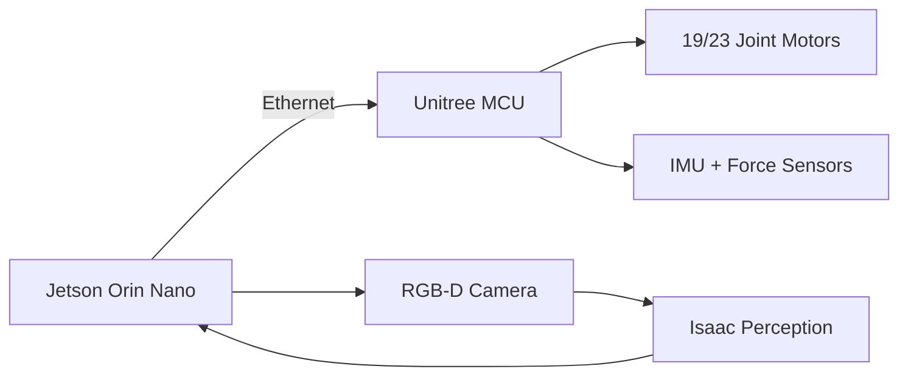

# Supported Robot Platforms

This page compares humanoid and mobile robot platforms compatible with the capstone project curriculum. All platforms run ROS 2 Humble on Jetson Orin Nano.

## Platform Comparison

| Platform | Type | DOF | Cost | ROS 2 Support | Jetson Compatible |
|----------|------|-----|------|---------------|------------------|
| **Unitree H1** | Full Humanoid | 19 | ~$90K | ✅ Official SDK | ✅ |
| **Unitree G1** | Full Humanoid | 23 | ~$16K | ✅ Official SDK | ✅ |
| **PAL Robotics TIAGo** | Mobile Manipulator | 15 | ~$50K | ✅ Official ROS 2 | ✅ |
| **Hello Robot Stretch 3** | Mobile Manipulator | 8 | ~$25K | ✅ Official ROS 2 | ✅ |
| **Yahboom ROSMASTER X3** | Wheeled + Arm | 6 | ~$500 | ✅ Community | ✅ |
| **Waveshare JETANK** | Tracked + Arm | 5 | ~$300 | ✅ Community | ✅ |

## Platform Details

### Unitree H1 / G1 (Full Humanoid)

The Unitree H1 and G1 are production-grade bipedal humanoid robots optimized for research and industrial applications.



**ROS 2 Driver Setup:**

```bash
# Install Unitree ROS 2 SDK
cd ~/capstone_ws/src
git clone https://github.com/unitreerobotics/unitree_ros2.git

# Install dependencies
cd ~/capstone_ws
rosdep install --from-paths src --ignore-src -r -y
colcon build --packages-select unitree_ros2

# Launch
source install/setup.bash
ros2 launch unitree_ros2 h1_bringup.launch.py
```

**Verify**: `ros2 topic list | grep joint` should show joint state topics.

---

### Hello Robot Stretch 3 (Budget-Friendly)

The Stretch 3 is an excellent platform for beginners — lightweight, safe, and fully ROS 2 native.

```bash
# Official Stretch ROS 2 package
sudo apt-get install -y ros-humble-stretch-ros

# Home the robot
stretch_robot_home.py

# Launch in ROS 2
ros2 launch stretch_core stretch_driver.launch.py
```

**Key Specs:**
- Telescoping arm: 0 to 52 cm reach
- Mobile base: differential drive, 8 cm/s max
- Gripper: parallel-jaw, 0 to 6 cm opening
- Weight: 24 kg

---

### Yahboom ROSMASTER X3 (Educational, Low-Cost)

Ideal for students who need a physical platform at minimal cost. Ackermann steering + 5-DOF arm.

```bash
# Install Yahboom ROS 2 packages
cd ~/capstone_ws/src
git clone https://github.com/YahboomTechnology/rosmaster_x3_ros2.git

colcon build --packages-select rosmaster_x3_ros2
source install/setup.bash

ros2 launch rosmaster_x3_ros2 bringup.launch.py
```

---

## Assembly Guide (Yahboom ROSMASTER X3)

For students assembling a kit robot:

### Required Tools
- Phillips screwdriver (#2 and #0)
- Hex key set (M2, M3, M4)
- Wire stripper
- Multimeter (for power verification)

### Assembly Steps

1. **Frame assembly** — attach chassis plates per printed assembly guide (30 min)
2. **Motor wiring** — connect DC motors to motor driver board; verify polarity with multimeter
3. **Arm installation** — mount servo motors on arm joints; calibrate zero position
4. **Jetson mounting** — secure Jetson Orin Nano to chassis top plate with M3 standoffs
5. **Camera mount** — attach USB or CSI camera on mast at 15° downward angle
6. **Power distribution** — connect LiPo battery (11.1V 5200mAh) to power board; verify 5V rail for Jetson

### Power Budget

| Component | Current Draw |
|-----------|-------------|
| Jetson Orin Nano (max) | 2.5A @ 5V = 12.5W |
| Drive motors (×4) | 1.5A @ 11.1V = 16.6W |
| Arm servos (×5) | 0.5A @ 6V = 3W |
| Camera | 0.5A @ 5V = 2.5W |
| **Total** | **~35W** |

Use a battery with at least 45W sustained output capacity.

---

## ROS 2 Driver Quick Reference

### Verifying a Robot Connection

```bash
# After launching robot bringup, check these topics exist:
ros2 topic list | grep -E 'joint_states|cmd_vel|odom|camera'

# Check joint states publishing at expected rate
ros2 topic hz /joint_states

# Send a test velocity command (very slow, safe)
ros2 topic pub /cmd_vel geometry_msgs/msg/Twist \
  '{linear: {x: 0.05}, angular: {z: 0.0}}' --once
```

### Common Driver Issues

| Symptom | Likely Cause | Fix |
|---------|-------------|-----|
| `/joint_states` not publishing | USB disconnected | Re-plug and relaunch |
| Robot jerks unpredictably | Low battery voltage | Charge battery (> 11V) |
| Camera image distorted | Lens dirty or focus off | Clean lens, adjust focus ring |
| High latency (> 100 ms) | Wi-Fi interference | Use Ethernet tether |

---

## Simulation-Only Option

If you don't have a physical robot, all capstone tasks can be completed in simulation using the Gazebo-based virtual robot (see [Capstone Overview](/docs/capstone/overview)):

```bash
# Launch virtual robot (no hardware required)
ros2 launch capstone_robot simulation_only.launch.py

# This provides the same ROS 2 topic interface as real hardware
ros2 topic list
# /joint_states
# /cmd_vel
# /image_raw
# /detectnet/detections
```

:::tip Simulation First
Even if you have hardware, always validate your code in simulation before running on the physical robot. This prevents hardware damage and speeds up iteration.
:::
