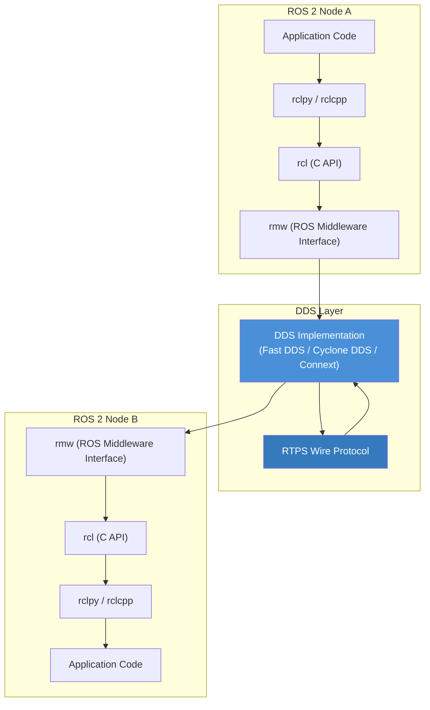
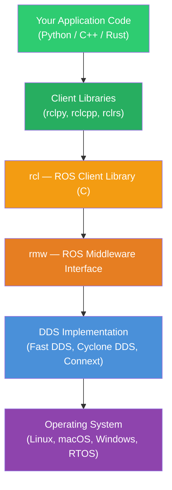
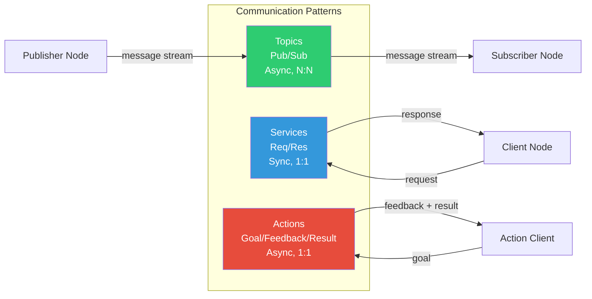
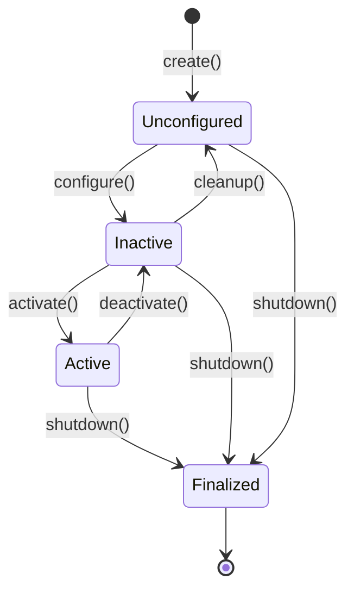

# ROS 2 Architecture

Robot Operating System 2 (ROS 2) is the de facto standard middleware framework for building robot software. Despite its name, ROS is not an operating system -- it is a collection of libraries, tools, and conventions that simplify the development of complex robotic applications. In this chapter, we explore the architecture of ROS 2, understand how it differs from its predecessor, and build our first minimal node.

---

## 1.1 Why ROS 2?

ROS 1 served the robotics community well for over a decade, but it was designed primarily for academic single-robot research in controlled environments. As robots moved into production -- factories, warehouses, hospitals, and public roads -- several limitations became critical:

| Limitation in ROS 1 | How ROS 2 Addresses It |
|---|---|
| Single point of failure (roscore) | Decentralized discovery via DDS |
| No real-time support | Deterministic executor with real-time-capable layers |
| Limited security | Built-in DDS Security (authentication, encryption, access control) |
| Linux-only | Cross-platform: Linux, macOS, Windows, RTOS |
| Unreliable networking | QoS policies for lossy networks (Wi-Fi, 5G) |
| No lifecycle management | Managed (lifecycle) nodes with state machines |

ROS 2 is not merely an upgrade; it is a ground-up redesign that retains the best ideas from ROS 1 -- the computation graph, message passing, tooling ecosystem -- while replacing the fragile transport layer with industrial-grade middleware.

---

## 1.2 ROS 2 vs ROS 1: Key Differences

### Communication Middleware

ROS 1 used a custom TCP/UDP transport (TCPROS/UDPROS) coordinated by a central **roscore** process. If roscore crashed, the entire system became unrecoverable.

ROS 2 delegates all communication to the **Data Distribution Service (DDS)**, an OMG standard used in aerospace, defense, and financial systems. DDS provides:

- **Decentralized discovery** -- nodes find each other without a central broker.
- **Quality of Service (QoS)** -- fine-grained control over reliability, durability, and deadlines.
- **Security** -- built-in encryption, authentication, and access control.

### Build System

| Aspect | ROS 1 | ROS 2 |
|---|---|---|
| Build tool | catkin / catkin_make | colcon |
| Package format | package.xml v1/v2 | package.xml v3 |
| Python packaging | Custom | Standard setuptools |
| CMake integration | catkin macros | ament_cmake |

### API and Client Libraries

ROS 2 provides a common C layer called **rcl** (ROS Client Library) on top of which language-specific bindings are built:

- **rclcpp** -- C++ client library
- **rclpy** -- Python client library
- **rclrs** -- Rust client library (community)

---

## 1.3 The DDS Middleware Layer

DDS (Data Distribution Service) is the communication backbone of ROS 2. It implements a **publish-subscribe** model with automatic peer discovery, making it possible for nodes to communicate without any central coordinator.



### How DDS Discovery Works

When a ROS 2 node starts, it announces its presence on the network using the **Simple Discovery Protocol (SDP)**. Other nodes detect this announcement and establish direct peer-to-peer connections. There is no central broker -- every node maintains its own view of the network.

### RMW: The Abstraction Layer

ROS 2 does not depend on any single DDS vendor. The **ROS Middleware Interface (rmw)** provides a vendor-neutral abstraction. You can swap DDS implementations at runtime:

```bash
# Use Cyclone DDS (default in many distributions)
export RMW_IMPLEMENTATION=rmw_cyclonedds_cpp

# Use Fast DDS (eProsima)
export RMW_IMPLEMENTATION=rmw_fastrtps_cpp

# Use RTI Connext DDS
export RMW_IMPLEMENTATION=rmw_connextdds
```

---

## 1.4 The ROS 2 Architecture Stack

The full ROS 2 architecture can be visualized as a layered stack:



**Layer Responsibilities:**

1. **Application Code** -- Your robot logic: perception, planning, control.
2. **Client Libraries** -- Language-specific APIs (create nodes, publish messages, call services).
3. **rcl** -- Language-agnostic C implementation of core ROS 2 concepts.
4. **rmw** -- Thin abstraction over DDS vendors, enabling vendor portability.
5. **DDS** -- Handles serialization, transport, discovery, QoS, and security.
6. **OS** -- Process scheduling, networking, file systems.

---

## 1.5 Core Concepts

ROS 2 organizes robot software around four primary communication primitives:

### Nodes

A **node** is a single-purpose process that performs one computation. For example, a camera driver node, an object detection node, and a motor controller node might work together in a perception-to-action pipeline. Nodes are the fundamental unit of computation in ROS 2.

### Topics

**Topics** are named buses for asynchronous, many-to-many message passing. A node **publishes** messages to a topic; one or more nodes **subscribe** to that topic. Topics are best for continuous data streams (sensor data, commands, status updates).

### Services

**Services** implement a synchronous request-response pattern. A **service server** advertises a named service; a **service client** sends a request and waits for a response. Services are best for discrete operations (set a parameter, trigger a calibration).

### Actions

**Actions** extend services with feedback and cancellation for long-running tasks. An **action server** accepts a goal, provides periodic feedback, and returns a result. Actions are best for tasks that take time (navigate to a waypoint, grasp an object).



---

## 1.6 ROS 2 Workspace Structure

A ROS 2 workspace follows a standard directory layout:

```
my_ros2_ws/                    # Workspace root
├── src/                       # Source packages go here
│   ├── my_robot_description/  # URDF, meshes, launch files
│   │   ├── package.xml
│   │   ├── setup.py
│   │   ├── urdf/
│   │   └── launch/
│   ├── my_robot_perception/   # Camera drivers, detection
│   │   ├── package.xml
│   │   ├── setup.py
│   │   └── my_robot_perception/
│   └── my_robot_control/      # Motor drivers, controllers
│       ├── package.xml
│       ├── CMakeLists.txt      # C++ package uses CMake
│       └── src/
├── build/                     # Build artifacts (auto-generated)
├── install/                   # Installed packages (auto-generated)
└── log/                       # Build logs (auto-generated)
```

### Setting Up a Workspace

```bash
# Create workspace directory
mkdir -p ~/ros2_ws/src
cd ~/ros2_ws

# Clone or create packages in src/
cd src
ros2 pkg create --build-type ament_python my_first_package

# Build the workspace
cd ~/ros2_ws
colcon build

# Source the workspace overlay
source install/setup.bash

# Verify the package is discoverable
ros2 pkg list | grep my_first_package
```

:::tip Overlay Model
ROS 2 uses an **overlay** model. When you source `install/setup.bash`, your workspace packages are layered on top of the base ROS 2 installation. This means your packages can override system packages without modifying them.
:::

---

## 1.7 Your First ROS 2 Node

Let us build a minimal ROS 2 node in Python using the `rclpy` client library. This node simply starts up, logs a message, and spins (waits for events).

### Minimal Node

```python
#!/usr/bin/env python3
"""
minimal_node.py
A minimal ROS 2 node that demonstrates the basic node lifecycle.
"""

import rclpy
from rclpy.node import Node


class MinimalNode(Node):
    """A minimal ROS 2 node that logs a greeting on startup."""

    def __init__(self):
        # Initialize the node with the name 'minimal_node'
        super().__init__('minimal_node')

        # Log an informational message
        self.get_logger().info('Hello from the MinimalNode!')

        # Create a timer that fires every 2 seconds
        self.timer = self.create_timer(2.0, self.timer_callback)
        self.counter = 0

    def timer_callback(self):
        """Called every 2 seconds by the timer."""
        self.counter += 1
        self.get_logger().info(f'Timer fired {self.counter} time(s)')


def main(args=None):
    # Initialize the rclpy library
    rclpy.init(args=args)

    # Create the node
    node = MinimalNode()

    try:
        # Spin the node so callbacks are executed
        rclpy.spin(node)
    except KeyboardInterrupt:
        node.get_logger().info('Node interrupted by user.')
    finally:
        # Clean up and shut down
        node.destroy_node()
        rclpy.shutdown()


if __name__ == '__main__':
    main()
```

### Understanding the Code

Let us walk through each section:

1. **`rclpy.init(args=args)`** -- Initializes the ROS 2 Python client library. This must be called before creating any nodes. The `args` parameter allows passing command-line arguments (remappings, parameters).

2. **`super().__init__('minimal_node')`** -- Every node must have a unique name. This name appears in `ros2 node list` and is used for logging, parameter namespacing, and debugging.

3. **`self.create_timer(2.0, self.timer_callback)`** -- Creates a wall timer that calls `timer_callback` every 2 seconds. Timers are the simplest way to schedule periodic work.

4. **`rclpy.spin(node)`** -- Enters an event loop that processes callbacks (timers, subscriptions, services) until the node is shut down. Without spinning, no callbacks will fire.

5. **`node.destroy_node()` and `rclpy.shutdown()`** -- Clean up resources. Always call these in a `finally` block to avoid resource leaks.

### Running the Node

```bash
# Option 1: Run directly with Python
cd ~/ros2_ws/src/my_first_package/my_first_package
python3 minimal_node.py

# Option 2: Run as an installed entry point (after configuring setup.py)
ros2 run my_first_package minimal_node
```

Expected output:

```
[INFO] [1700000000.000000000] [minimal_node]: Hello from the MinimalNode!
[INFO] [1700000002.000000000] [minimal_node]: Timer fired 1 time(s)
[INFO] [1700000004.000000000] [minimal_node]: Timer fired 2 time(s)
[INFO] [1700000006.000000000] [minimal_node]: Timer fired 3 time(s)
```

---

## 1.8 Node Lifecycle: Managed Nodes

ROS 2 introduces **managed (lifecycle) nodes** that follow a state machine, giving operators fine-grained control over node startup and shutdown:



**State descriptions:**

| State | Description |
|---|---|
| **Unconfigured** | Node is created but not configured. No resources allocated. |
| **Inactive** | Node is configured (parameters loaded, connections made) but not processing data. |
| **Active** | Node is fully operational, processing callbacks. |
| **Finalized** | Node is shutting down and releasing all resources. |

Lifecycle nodes are essential for production systems where you need to bring up a fleet of nodes in a controlled sequence -- for example, ensuring the camera driver is active before the perception pipeline starts.

---

## 1.9 ROS 2 CLI Tools

ROS 2 ships with a powerful set of command-line tools for introspection and debugging:

```bash
# List all running nodes
ros2 node list

# Get info about a specific node
ros2 node info /minimal_node

# List all active topics
ros2 topic list

# Echo messages on a topic in real time
ros2 topic echo /chatter

# Show the type of a topic
ros2 topic type /chatter

# List all available services
ros2 service list

# Call a service from the command line
ros2 service call /add_two_ints example_interfaces/srv/AddTwoInts "{a: 1, b: 2}"

# List parameters for a node
ros2 param list /minimal_node

# Launch a system of nodes
ros2 launch my_package my_launch.py
```

These tools are invaluable during development and debugging. They allow you to inspect the running computation graph, inject test data, and verify that nodes are communicating correctly.

---

## 1.10 Chapter Summary

In this chapter, you learned:

- **Why ROS 2 exists** -- addressing ROS 1 limitations around reliability, security, and real-time performance.
- **The DDS middleware** -- decentralized discovery, QoS policies, and vendor portability through the rmw abstraction.
- **Core abstractions** -- nodes, topics, services, and actions as the building blocks of robot software.
- **Workspace structure** -- how to organize packages and build with colcon.
- **Your first node** -- creating, running, and understanding a minimal ROS 2 Python node.
- **Lifecycle nodes** -- managed state machines for production deployments.
- **CLI tools** -- introspecting and debugging the running system.

In the next chapter, we will dive deep into **Nodes and Topics**, building publisher and subscriber nodes that communicate over the ROS 2 computation graph.

---

## Exercises

1. **Environment Setup**: Install ROS 2 Humble or Iron on your system. Verify the installation by running `ros2 doctor`.

2. **Modify the Minimal Node**: Change the timer period to 0.5 seconds and add a parameter that controls the greeting message.

3. **Explore DDS**: Set `RMW_IMPLEMENTATION` to different DDS vendors and observe any differences in discovery time using `ros2 topic hz`.

4. **CLI Exploration**: Start the minimal node in one terminal and use `ros2 node info`, `ros2 topic list`, and `ros2 param list` in another terminal to inspect it.
