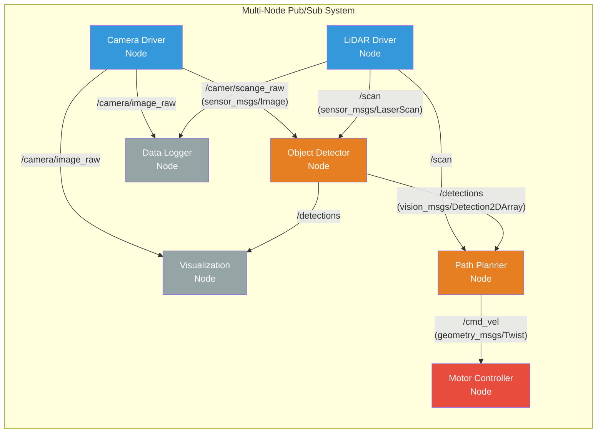
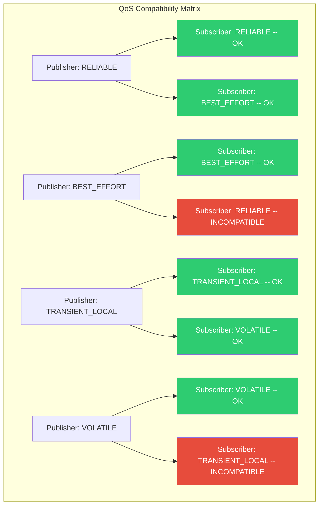
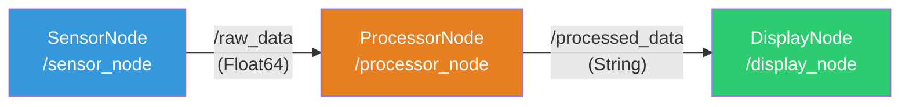

import KnowledgeCheck from '@site/src/components/KnowledgeCheck';


# Nodes & Topics

Nodes and topics are the fundamental building blocks of any ROS 2 application. In the previous chapter, we built a minimal node with a timer. In this chapter, we go much deeper -- building publisher and subscriber nodes, defining custom message types, configuring Quality of Service policies, and orchestrating multi-node systems that communicate over the ROS 2 computation graph.

---

## 2.1 Nodes in Depth

A **node** is the smallest unit of computation in ROS 2. Each node should have a single, well-defined responsibility. A typical robot system consists of dozens or even hundreds of nodes, each handling one concern: reading a sensor, processing data, controlling an actuator, or logging state.

### Why Single-Responsibility Nodes?

| Benefit | Explanation |
|---|---|
| **Fault isolation** | If a perception node crashes, the motor controller keeps running. |
| **Reusability** | A camera driver node can be reused across different robots. |
| **Scalability** | Nodes can run on different machines in a distributed system. |
| **Testability** | Each node can be tested in isolation with mock inputs. |
| **Lifecycle control** | Individual nodes can be started, stopped, or restarted independently. |

### Node Names and Namespaces

Every node must have a unique name within its namespace. Names follow these rules:

- Must start with a letter or underscore
- Can contain letters, numbers, and underscores
- Are case-sensitive
- Can be placed in namespaces using `/` separators

```bash
# Running a node with a custom name
ros2 run my_package my_node --ros-args -r __node:=custom_name

# Running a node inside a namespace
ros2 run my_package my_node --ros-args -r __ns:=/robot1

# The full node name becomes: /robot1/custom_name
```

:::tip Multi-Robot Systems
Namespaces are critical for multi-robot deployments. By placing each robot's nodes under a unique namespace (`/robot1`, `/robot2`), you avoid name collisions and can run identical software stacks on multiple robots simultaneously.
:::

### Node Introspection

```bash
# List all running nodes
ros2 node list

# Detailed info about a node: publishers, subscribers, services, actions
ros2 node info /camera_driver

# Output example:
# /camera_driver
#   Subscribers:
#     /parameter_events: rcl_interfaces/msg/ParameterEvent
#   Publishers:
#     /camera/image_raw: sensor_msgs/msg/Image
#     /camera/camera_info: sensor_msgs/msg/CameraInfo
#   Service Servers:
#     /camera_driver/describe_parameters: ...
#   Action Servers:
#     None
```

---

## 2.2 Topics: The Pub/Sub Communication Channel

**Topics** are named channels through which nodes exchange messages asynchronously. They implement a **publish-subscribe** pattern:

- **Publishers** send messages to a topic.
- **Subscribers** receive messages from a topic.
- The relationship is many-to-many: multiple publishers can write to the same topic, and multiple subscribers can read from it.



### Topic Names and Types

Every topic has:

- A **name** (e.g., `/camera/image_raw`) that follows the same naming rules as nodes.
- A **message type** (e.g., `sensor_msgs/msg/Image`) that defines the data structure.

All publishers and subscribers on a topic must agree on the message type. If they do not match, no data will be exchanged.

```bash
# List all active topics with their types
ros2 topic list -t

# Show the message definition
ros2 interface show sensor_msgs/msg/Image

# Measure publishing frequency
ros2 topic hz /camera/image_raw

# Show bandwidth usage
ros2 topic bw /camera/image_raw
```

---

## 2.3 Building a Publisher Node

Let us build a complete publisher node that simulates a temperature sensor, publishing readings at a regular interval.

```python
#!/usr/bin/env python3
"""
temperature_publisher.py
Publishes simulated temperature readings to /sensor/temperature.
"""

import random

import rclpy
from rclpy.node import Node
from std_msgs.msg import Float64
from rcl_interfaces.msg import ParameterDescriptor


class TemperaturePublisher(Node):
    """Simulates a temperature sensor and publishes readings."""

    def __init__(self):
        super().__init__('temperature_publisher')

        # Declare parameters with descriptors for self-documentation
        self.declare_parameter(
            'publish_rate_hz',
            10.0,
            ParameterDescriptor(description='Publishing rate in Hz')
        )
        self.declare_parameter(
            'base_temperature',
            22.0,
            ParameterDescriptor(description='Base temperature in Celsius')
        )
        self.declare_parameter(
            'noise_amplitude',
            0.5,
            ParameterDescriptor(description='Random noise amplitude')
        )

        # Read parameter values
        rate = self.get_parameter('publish_rate_hz').value
        self.base_temp = self.get_parameter('base_temperature').value
        self.noise = self.get_parameter('noise_amplitude').value

        # Create publisher: topic name, message type, queue size
        self.publisher_ = self.create_publisher(
            Float64,
            '/sensor/temperature',
            10  # Queue size (QoS history depth)
        )

        # Create a timer that calls publish_temperature at the configured rate
        timer_period = 1.0 / rate
        self.timer = self.create_timer(timer_period, self.publish_temperature)

        self.get_logger().info(
            f'Temperature publisher started at {rate} Hz '
            f'(base={self.base_temp} C, noise={self.noise})'
        )

    def publish_temperature(self):
        """Generate a noisy temperature reading and publish it."""
        msg = Float64()
        msg.data = self.base_temp + random.uniform(
            -self.noise, self.noise
        )

        self.publisher_.publish(msg)
        self.get_logger().debug(f'Published: {msg.data:.2f} C')


def main(args=None):
    rclpy.init(args=args)
    node = TemperaturePublisher()

    try:
        rclpy.spin(node)
    except KeyboardInterrupt:
        node.get_logger().info('Shutting down temperature publisher.')
    finally:
        node.destroy_node()
        rclpy.shutdown()


if __name__ == '__main__':
    main()
```

### Key Concepts in the Publisher

1. **`declare_parameter()`** -- Declares node parameters with default values and descriptions. Parameters can be overridden at runtime via the command line, launch files, or YAML files.

2. **`create_publisher(msg_type, topic_name, qos)`** -- Creates a publisher. The `qos` argument can be an integer (interpreted as history depth with default profile) or a full `QoSProfile` object.

3. **`self.publisher_.publish(msg)`** -- Sends a message to all subscribers. This is non-blocking; the DDS middleware handles delivery.

:::caution Queue Size Matters
If a subscriber cannot keep up with the publisher, messages accumulate in the queue. Once the queue is full, the oldest messages are dropped (with the default `KEEP_LAST` QoS). For safety-critical data, configure QoS carefully -- see Section 2.6.
:::

---

## 2.4 Building a Subscriber Node

Now let us build a subscriber that receives the temperature readings, maintains a rolling average, and warns if the temperature exceeds a threshold.

```python
#!/usr/bin/env python3
"""
temperature_subscriber.py
Subscribes to /sensor/temperature and monitors readings.
"""

from collections import deque

import rclpy
from rclpy.node import Node
from std_msgs.msg import Float64
from rcl_interfaces.msg import ParameterDescriptor


class TemperatureMonitor(Node):
    """Monitors temperature readings and alerts on threshold breach."""

    def __init__(self):
        super().__init__('temperature_monitor')

        # Declare parameters
        self.declare_parameter(
            'warning_threshold',
            30.0,
            ParameterDescriptor(description='Temperature warning threshold (C)')
        )
        self.declare_parameter(
            'window_size',
            50,
            ParameterDescriptor(description='Rolling average window size')
        )

        self.threshold = self.get_parameter('warning_threshold').value
        window = self.get_parameter('window_size').value

        # Rolling window for computing average
        self.readings = deque(maxlen=window)

        # Create subscription
        self.subscription = self.create_subscription(
            Float64,
            '/sensor/temperature',
            self.temperature_callback,
            10  # QoS history depth
        )

        self.get_logger().info(
            f'Temperature monitor started '
            f'(threshold={self.threshold} C, window={window})'
        )

    def temperature_callback(self, msg: Float64):
        """Process each incoming temperature reading."""
        temperature = msg.data
        self.readings.append(temperature)

        # Compute rolling average
        avg = sum(self.readings) / len(self.readings)

        # Log at different severity levels
        if temperature > self.threshold:
            self.get_logger().warn(
                f'HIGH TEMP: {temperature:.2f} C '
                f'(avg: {avg:.2f} C) -- exceeds {self.threshold} C!'
            )
        else:
            self.get_logger().info(
                f'Temperature: {temperature:.2f} C (avg: {avg:.2f} C)'
            )


def main(args=None):
    rclpy.init(args=args)
    node = TemperatureMonitor()

    try:
        rclpy.spin(node)
    except KeyboardInterrupt:
        node.get_logger().info('Shutting down temperature monitor.')
    finally:
        node.destroy_node()
        rclpy.shutdown()


if __name__ == '__main__':
    main()
```

### Key Concepts in the Subscriber

1. **`create_subscription(msg_type, topic, callback, qos)`** -- Registers a callback that fires every time a new message arrives on the topic.

2. **Callback signature** -- The callback receives a single argument: the deserialized message object. You access fields directly (e.g., `msg.data`).

3. **`deque(maxlen=N)`** -- A fixed-size buffer that automatically discards the oldest element when full. This is a common pattern for rolling statistics in ROS 2 nodes.

---

## 2.5 Custom Message Types

Standard messages (`std_msgs`, `sensor_msgs`, `geometry_msgs`) cover many use cases, but robotics applications often need domain-specific data structures. ROS 2 lets you define custom message types.

### Defining a Custom Message

Create a file `msg/TemperatureReading.msg` in your package:

```
# TemperatureReading.msg
# A timestamped temperature reading with sensor metadata.

builtin_interfaces/Time stamp      # When the reading was taken
string sensor_id                    # Unique sensor identifier
string location                     # Physical location of the sensor
float64 temperature_celsius         # Temperature in Celsius
float64 humidity_percent            # Relative humidity (0-100)
bool is_valid                       # Whether the reading passed sanity checks
```

### Message Type Rules

| Feature | Supported Types |
|---|---|
| **Primitives** | `bool`, `byte`, `char`, `float32`, `float64`, `int8`, `int16`, `int32`, `int64`, `uint8`, `uint16`, `uint32`, `uint64`, `string` |
| **Arrays** | Fixed: `float64[3]`, Unbounded: `float64[]`, Bounded: `float64[<=10]` |
| **Nested messages** | `geometry_msgs/Point`, `std_msgs/Header` |
| **Constants** | `uint8 STATUS_OK=0`, `uint8 STATUS_ERROR=1` |
| **Default values** | `float64 temperature_celsius 0.0` |

### Using the Custom Message in Code

After building the package with `colcon build`, the message is available in Python:

```python
#!/usr/bin/env python3
"""
custom_temp_publisher.py
Publisher using a custom TemperatureReading message.
"""

import random

import rclpy
from rclpy.node import Node
from rclpy.clock import Clock
from my_sensors.msg import TemperatureReading


class CustomTempPublisher(Node):
    """Publishes structured temperature readings."""

    def __init__(self):
        super().__init__('custom_temp_publisher')

        self.publisher_ = self.create_publisher(
            TemperatureReading,
            '/sensor/temperature_reading',
            10
        )
        self.timer = self.create_timer(1.0, self.publish_reading)
        self.sensor_id = 'TEMP_SENSOR_001'
        self.location = 'server_room_rack_3'

        self.get_logger().info('Custom temperature publisher started.')

    def publish_reading(self):
        msg = TemperatureReading()
        msg.stamp = self.get_clock().now().to_msg()
        msg.sensor_id = self.sensor_id
        msg.location = self.location
        msg.temperature_celsius = 22.0 + random.uniform(-1.0, 3.0)
        msg.humidity_percent = 45.0 + random.uniform(-5.0, 5.0)
        msg.is_valid = msg.temperature_celsius > -40.0

        self.publisher_.publish(msg)
        self.get_logger().info(
            f'[{msg.sensor_id}] {msg.temperature_celsius:.1f} C, '
            f'{msg.humidity_percent:.1f}% RH'
        )


def main(args=None):
    rclpy.init(args=args)
    node = CustomTempPublisher()
    try:
        rclpy.spin(node)
    except KeyboardInterrupt:
        pass
    finally:
        node.destroy_node()
        rclpy.shutdown()


if __name__ == '__main__':
    main()
```

:::tip Message Design Best Practices
Always include a `stamp` field (from `builtin_interfaces/Time`) in your custom messages. Timestamps are essential for data synchronization, latency measurement, and debugging replay scenarios with `rosbag2`.
:::

---

## 2.6 Quality of Service (QoS) Profiles

Quality of Service policies control how DDS delivers messages. QoS is one of the most powerful features of ROS 2 -- and one of the most commonly misconfigured.

### QoS Dimensions

| Policy | Options | Default | Description |
|---|---|---|---|
| **Reliability** | `RELIABLE`, `BEST_EFFORT` | `RELIABLE` | Whether to guarantee delivery with retransmissions. |
| **Durability** | `VOLATILE`, `TRANSIENT_LOCAL` | `VOLATILE` | Whether late joiners receive the last published message. |
| **History** | `KEEP_LAST(N)`, `KEEP_ALL` | `KEEP_LAST(10)` | How many messages to buffer. |
| **Deadline** | Duration | `0` (infinite) | Maximum expected time between messages. |
| **Lifespan** | Duration | `0` (infinite) | How long a message is considered valid. |
| **Liveliness** | `AUTOMATIC`, `MANUAL_BY_TOPIC` | `AUTOMATIC` | How to detect if a publisher is still alive. |

### QoS Compatibility

Publishers and subscribers must have **compatible** QoS settings to communicate. The key compatibility rules are:



:::caution Incompatible QoS = Silent Failure
When QoS settings are incompatible, **no error is raised** -- messages simply do not flow. This is the number one source of "my subscriber is not receiving data" bugs. Always check QoS compatibility first using `ros2 topic info -v /topic_name`.
:::

### Configuring QoS in Python

```python
#!/usr/bin/env python3
"""
qos_examples.py
Demonstrates various QoS profile configurations.
"""

from rclpy.qos import (
    QoSProfile,
    QoSReliabilityPolicy,
    QoSDurabilityPolicy,
    QoSHistoryPolicy,
    QoSLivelinessPolicy,
)
from rclpy.duration import Duration


# Profile 1: Sensor data (high frequency, tolerate drops)
sensor_qos = QoSProfile(
    reliability=QoSReliabilityPolicy.BEST_EFFORT,
    durability=QoSDurabilityPolicy.VOLATILE,
    history=QoSHistoryPolicy.KEEP_LAST,
    depth=5,
)

# Profile 2: Command data (must not be lost)
command_qos = QoSProfile(
    reliability=QoSReliabilityPolicy.RELIABLE,
    durability=QoSDurabilityPolicy.TRANSIENT_LOCAL,
    history=QoSHistoryPolicy.KEEP_LAST,
    depth=10,
)

# Profile 3: Safety-critical with deadline enforcement
safety_qos = QoSProfile(
    reliability=QoSReliabilityPolicy.RELIABLE,
    durability=QoSDurabilityPolicy.VOLATILE,
    history=QoSHistoryPolicy.KEEP_LAST,
    depth=1,
    deadline=Duration(seconds=0, nanoseconds=100_000_000),  # 100ms
    lifespan=Duration(seconds=0, nanoseconds=500_000_000),  # 500ms
    liveliness=QoSLivelinessPolicy.AUTOMATIC,
    liveliness_lease_duration=Duration(seconds=1),
)

# Using QoS in a publisher
# self.pub = self.create_publisher(Twist, '/cmd_vel', command_qos)

# Using QoS in a subscriber
# self.sub = self.create_subscription(
#     LaserScan, '/scan', self.scan_callback, sensor_qos
# )
```

### Built-in QoS Profiles

ROS 2 provides several preset profiles:

```python
from rclpy.qos import qos_profile_sensor_data
from rclpy.qos import qos_profile_system_default
from rclpy.qos import qos_profile_services_default
from rclpy.qos import qos_profile_parameters
from rclpy.qos import qos_profile_parameter_events

# Use sensor data profile for a LiDAR subscriber
# self.sub = self.create_subscription(
#     LaserScan, '/scan', self.callback, qos_profile_sensor_data
# )
```

| Profile | Reliability | Durability | History |
|---|---|---|---|
| `qos_profile_sensor_data` | BEST_EFFORT | VOLATILE | KEEP_LAST(5) |
| `qos_profile_system_default` | RELIABLE | VOLATILE | KEEP_LAST(10) |
| `qos_profile_services_default` | RELIABLE | VOLATILE | KEEP_LAST(10) |
| `qos_profile_parameters` | RELIABLE | VOLATILE | KEEP_LAST(1000) |

---

## 2.7 Topic Remapping

Remapping allows you to redirect topic names at runtime without modifying source code. This is essential for integrating third-party nodes and reusing components across different robots.

### Command-Line Remapping

```bash
# Remap a single topic
ros2 run my_package temperature_publisher \
    --ros-args -r /sensor/temperature:=/robot1/sensor/temperature

# Remap node name and topic simultaneously
ros2 run my_package temperature_publisher \
    --ros-args \
    -r __node:=robot1_temp_pub \
    -r /sensor/temperature:=/robot1/temperature

# Remap using namespace (affects all topics)
ros2 run my_package temperature_publisher \
    --ros-args -r __ns:=/robot1
```

### Remapping in Launch Files

```python
from launch import LaunchDescription
from launch_ros.actions import Node


def generate_launch_description():
    return LaunchDescription([
        Node(
            package='my_package',
            executable='temperature_publisher',
            name='temp_pub_robot1',
            namespace='/robot1',
            remappings=[
                ('/sensor/temperature', '/robot1/env/temperature'),
            ],
            parameters=[{
                'publish_rate_hz': 5.0,
                'base_temperature': 25.0,
            }],
        ),
        Node(
            package='my_package',
            executable='temperature_publisher',
            name='temp_pub_robot2',
            namespace='/robot2',
            remappings=[
                ('/sensor/temperature', '/robot2/env/temperature'),
            ],
            parameters=[{
                'publish_rate_hz': 10.0,
                'base_temperature': 20.0,
            }],
        ),
    ])
```

---

## 2.8 Multi-Node System: Complete Example

Let us build a realistic multi-node system where a sensor node publishes data, a processor node transforms it, and a display node logs the result.



### Sensor Node

```python
#!/usr/bin/env python3
"""sensor_node.py -- Publishes raw sensor data."""

import math
import rclpy
from rclpy.node import Node
from std_msgs.msg import Float64


class SensorNode(Node):
    def __init__(self):
        super().__init__('sensor_node')
        self.pub = self.create_publisher(Float64, '/raw_data', 10)
        self.timer = self.create_timer(0.1, self.publish)
        self.t = 0.0
        self.get_logger().info('SensorNode started.')

    def publish(self):
        msg = Float64()
        # Simulate a sine wave sensor signal
        msg.data = 5.0 * math.sin(self.t) + 20.0
        self.pub.publish(msg)
        self.t += 0.1


def main(args=None):
    rclpy.init(args=args)
    node = SensorNode()
    try:
        rclpy.spin(node)
    except KeyboardInterrupt:
        pass
    finally:
        node.destroy_node()
        rclpy.shutdown()

if __name__ == '__main__':
    main()
```

### Processor Node

```python
#!/usr/bin/env python3
"""processor_node.py -- Subscribes to raw data, publishes processed data."""

from collections import deque

import rclpy
from rclpy.node import Node
from std_msgs.msg import Float64, String


class ProcessorNode(Node):
    def __init__(self):
        super().__init__('processor_node')
        self.sub = self.create_subscription(
            Float64, '/raw_data', self.on_raw_data, 10
        )
        self.pub = self.create_publisher(String, '/processed_data', 10)
        self.window = deque(maxlen=20)
        self.get_logger().info('ProcessorNode started.')

    def on_raw_data(self, msg: Float64):
        self.window.append(msg.data)
        avg = sum(self.window) / len(self.window)
        min_val = min(self.window)
        max_val = max(self.window)

        out = String()
        out.data = (
            f'avg={avg:.2f}, min={min_val:.2f}, '
            f'max={max_val:.2f}, samples={len(self.window)}'
        )
        self.pub.publish(out)


def main(args=None):
    rclpy.init(args=args)
    node = ProcessorNode()
    try:
        rclpy.spin(node)
    except KeyboardInterrupt:
        pass
    finally:
        node.destroy_node()
        rclpy.shutdown()

if __name__ == '__main__':
    main()
```

### Display Node

```python
#!/usr/bin/env python3
"""display_node.py -- Subscribes to processed data and displays it."""

import rclpy
from rclpy.node import Node
from std_msgs.msg import String


class DisplayNode(Node):
    def __init__(self):
        super().__init__('display_node')
        self.sub = self.create_subscription(
            String, '/processed_data', self.on_processed, 10
        )
        self.msg_count = 0
        self.get_logger().info('DisplayNode started.')

    def on_processed(self, msg: String):
        self.msg_count += 1
        self.get_logger().info(
            f'[#{self.msg_count}] Processed: {msg.data}'
        )


def main(args=None):
    rclpy.init(args=args)
    node = DisplayNode()
    try:
        rclpy.spin(node)
    except KeyboardInterrupt:
        pass
    finally:
        node.destroy_node()
        rclpy.shutdown()

if __name__ == '__main__':
    main()
```

### Running the Multi-Node System

```bash
# Terminal 1
ros2 run my_sensors sensor_node

# Terminal 2
ros2 run my_sensors processor_node

# Terminal 3
ros2 run my_sensors display_node

# Terminal 4: Inspect the graph
ros2 node list
ros2 topic list -t
ros2 topic echo /processed_data
```

:::tip rqt_graph
Use `rqt_graph` to visualize the running computation graph. It shows all nodes and the topics connecting them, making it easy to verify that your system is wired correctly.
```bash
ros2 run rqt_graph rqt_graph
```
:::

---

## 2.9 Advanced: Callback Groups and Multi-Threaded Execution

By default, ROS 2 uses a **SingleThreadedExecutor** that processes callbacks sequentially. For performance-critical applications, you can use a **MultiThreadedExecutor** with callback groups.

```python
#!/usr/bin/env python3
"""
multithreaded_node.py
Demonstrates multi-threaded callback execution.
"""

import rclpy
from rclpy.node import Node
from rclpy.executors import MultiThreadedExecutor
from rclpy.callback_groups import (
    MutuallyExclusiveCallbackGroup,
    ReentrantCallbackGroup,
)
from std_msgs.msg import Float64, String


class MultiThreadedNode(Node):
    def __init__(self):
        super().__init__('multithreaded_node')

        # Callbacks in the same MutuallyExclusive group never run in parallel
        self.sensor_group = MutuallyExclusiveCallbackGroup()

        # Callbacks in a Reentrant group CAN run in parallel
        self.processing_group = ReentrantCallbackGroup()

        self.sub_temp = self.create_subscription(
            Float64, '/sensor/temperature', self.on_temperature, 10,
            callback_group=self.sensor_group,
        )
        self.sub_humidity = self.create_subscription(
            Float64, '/sensor/humidity', self.on_humidity, 10,
            callback_group=self.processing_group,
        )

        self.get_logger().info('Multi-threaded node ready.')

    def on_temperature(self, msg: Float64):
        self.get_logger().info(f'Temperature: {msg.data:.2f} C')

    def on_humidity(self, msg: Float64):
        self.get_logger().info(f'Humidity: {msg.data:.2f}%')


def main(args=None):
    rclpy.init(args=args)
    node = MultiThreadedNode()

    # Use MultiThreadedExecutor with 4 threads
    executor = MultiThreadedExecutor(num_threads=4)
    executor.add_node(node)

    try:
        executor.spin()
    except KeyboardInterrupt:
        pass
    finally:
        node.destroy_node()
        rclpy.shutdown()

if __name__ == '__main__':
    main()
```

| Callback Group | Behavior | Use Case |
|---|---|---|
| **MutuallyExclusiveCallbackGroup** | Only one callback in the group runs at a time | Shared state without explicit locking |
| **ReentrantCallbackGroup** | Multiple callbacks can run simultaneously | Independent, stateless processing |

---

## 2.10 Chapter Summary

In this chapter, you learned:

- **Nodes** are single-responsibility computation units with unique names and optional namespaces.
- **Topics** implement asynchronous, many-to-many publish-subscribe communication.
- **Publishers** send messages to topics; **subscribers** receive them via callbacks.
- **Custom message types** allow you to define domain-specific data structures.
- **QoS profiles** control reliability, durability, history depth, deadlines, and liveliness -- and mismatched QoS causes silent communication failures.
- **Topic remapping** redirects topic names at runtime for flexibility and multi-robot deployments.
- **Multi-node systems** compose simple nodes into complex data-processing pipelines.
- **Callback groups** and the **MultiThreadedExecutor** enable concurrent callback processing.

In the next chapter, we explore **Services and Actions** -- ROS 2's patterns for request-response communication and long-running tasks with feedback.

---

## Exercises

1. **Temperature Alert System**: Modify the `TemperatureMonitor` subscriber to publish an alert message to a new topic `/alerts` whenever the temperature exceeds the threshold. Create a third node that subscribes to `/alerts` and logs them.

2. **Custom Message Pipeline**: Define a custom message `EnvironmentReading` with fields for temperature, humidity, pressure, and a timestamp. Build a publisher that populates all fields and a subscriber that logs only readings where pressure drops below a threshold.

3. **QoS Experiment**: Create a publisher using `BEST_EFFORT` reliability and a subscriber using `RELIABLE`. Observe that no messages are received. Then fix the QoS mismatch and verify communication. Document your findings.

4. **Multi-Robot Remapping**: Using the multi-node example from Section 2.8, launch two complete sensor-processor-display pipelines in namespaces `/robot_a` and `/robot_b`. Use a launch file to configure both pipelines.

5. **Throughput Benchmark**: Create a publisher that sends 1000-byte messages at increasing rates (10 Hz, 100 Hz, 1000 Hz). Write a subscriber that measures the actual received rate and reports dropped messages. Compare `RELIABLE` vs `BEST_EFFORT` QoS.

---

## Knowledge Check

<KnowledgeCheck
  chapterTitle="Nodes & Topics"
  questions={[
    {
      id: 1,
      question: "When a publisher uses RELIABLE QoS and a subscriber uses BEST_EFFORT QoS, what happens?",
      options: [
        "ROS 2 automatically negotiates a compatible QoS",
        "The subscriber receives all messages but ignores errors",
        "No connection is established — the subscriber receives no messages",
        "The publisher downgrades to BEST_EFFORT to match"
      ],
      correctIndex: 2,
      explanation: "QoS compatibility in ROS 2 is asymmetric. A BEST_EFFORT subscriber cannot guarantee delivery from a RELIABLE publisher. No connection is formed, resulting in zero messages received.",
      sectionRef: "#quality-of-service-for-topics",
      sectionLabel: "Quality of Service for Topics"
    },
    {
      id: 2,
      question: "What is the purpose of topic remapping in ROS 2?",
      options: [
        "It changes the data type of messages on a topic",
        "It lets you rename topics at launch time without modifying source code",
        "It creates a backup copy of all messages for logging",
        "It filters messages based on a namespace prefix"
      ],
      correctIndex: 1,
      explanation: "Topic remapping separates the topic name a node uses internally from the name it appears as in the system. This lets you run the same node multiple times with different names, or connect components with different naming conventions, without editing code.",
      sectionRef: "#topic-remapping-and-namespaces",
      sectionLabel: "Topic Remapping and Namespaces"
    },
    {
      id: 3,
      question: "What does the `depth` parameter in a QoS profile control?",
      options: [
        "The maximum number of subscribers that can receive messages",
        "The number of undelivered messages to buffer before dropping the oldest",
        "The frequency at which the publisher sends messages",
        "The size in bytes of each individual message"
      ],
      correctIndex: 1,
      explanation: "The depth parameter sets the message queue size. If a subscriber cannot process messages fast enough, the oldest are dropped to stay within the depth limit. A depth of 1 is common for real-time sensor data where only the latest reading matters.",
      sectionRef: "#quality-of-service-for-topics",
      sectionLabel: "Quality of Service for Topics"
    },
    {
      id: 4,
      question: "What is the `rclpy.spin()` function doing in a ROS 2 Python node?",
      options: [
        "It rotates the robot by spinning the base motors",
        "It runs the node indefinitely, processing callbacks as events arrive",
        "It publishes a heartbeat message to indicate the node is alive",
        "It connects to the ROS master and registers the node"
      ],
      correctIndex: 1,
      explanation: "`rclpy.spin(node)` starts the executor event loop, blocking indefinitely and dispatching incoming messages, timer expirations, and service calls to the appropriate callback functions.",
      sectionRef: "#creating-a-publisher-node",
      sectionLabel: "Creating a Publisher Node"
    },
    {
      id: 5,
      question: "How does a ROS 2 node declare itself as a subscriber to a topic?",
      options: [
        "By calling `ros2 topic subscribe` from the command line before starting the node",
        "By calling `self.create_subscription(MessageType, topic, callback, qos)` in the node constructor",
        "By registering with the topic in a configuration file",
        "By sending a subscription request to the publisher node directly"
      ],
      correctIndex: 1,
      explanation: "In rclpy, `create_subscription` registers the node as a subscriber. You provide the message type, topic name, callback function, and QoS depth. The callback is invoked automatically whenever a message arrives.",
      sectionRef: "#creating-a-subscriber-node",
      sectionLabel: "Creating a Subscriber Node"
    }
  ]}
/>
