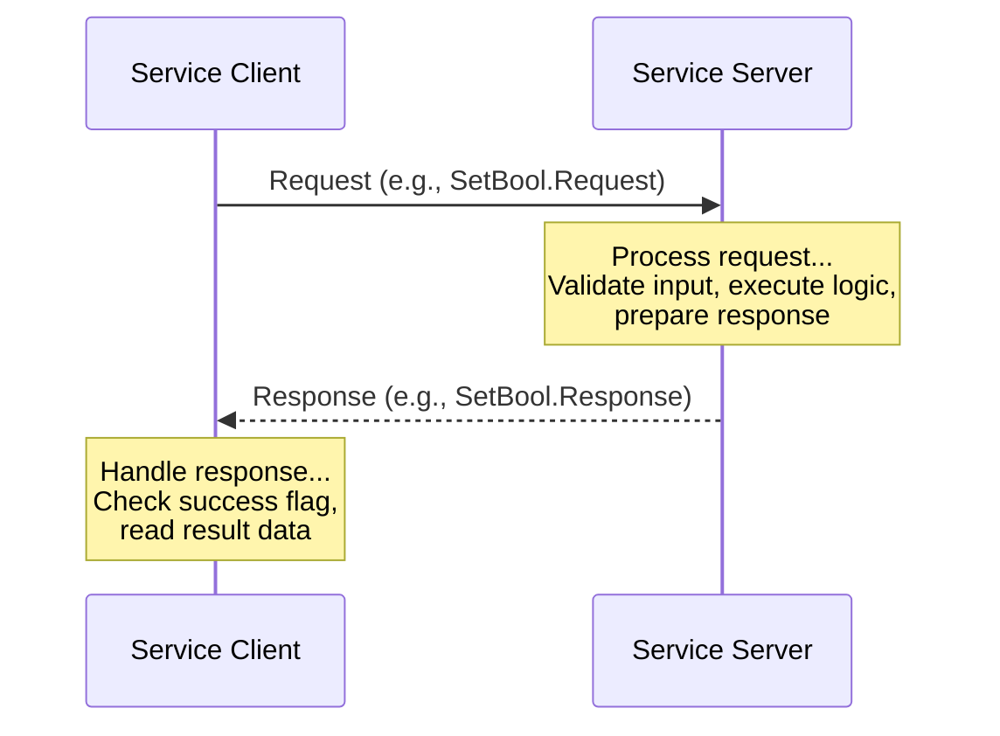
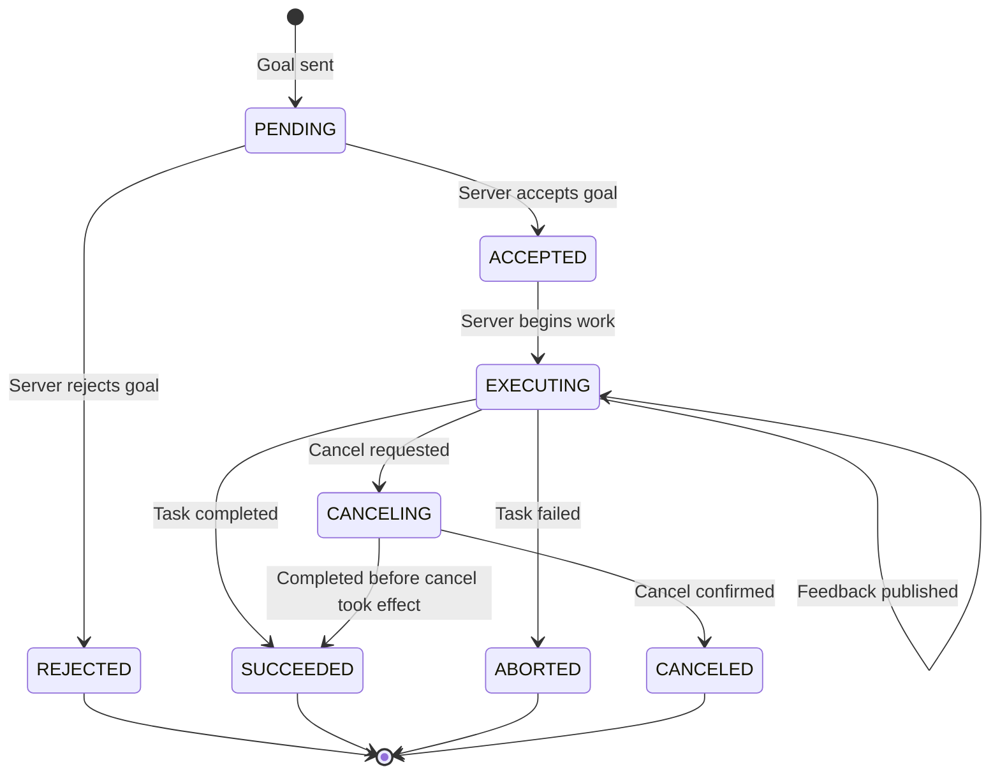
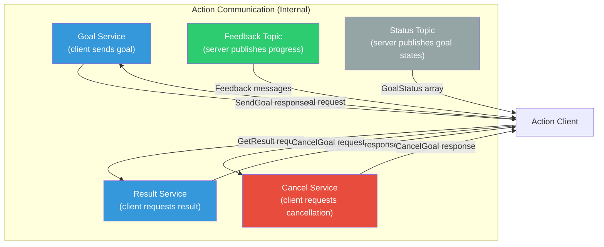
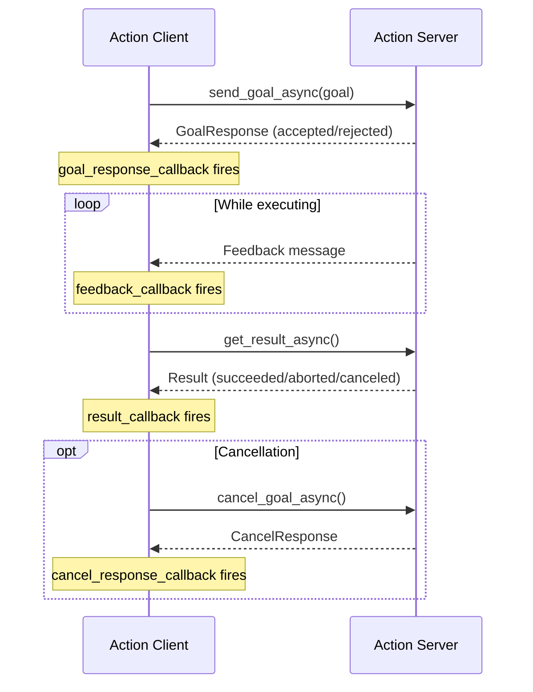
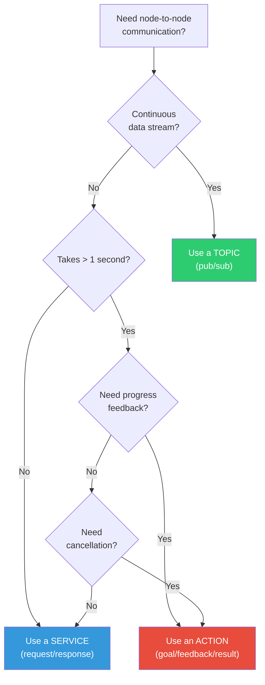

# Services & Actions

Topics are ideal for continuous data streams, but many robot operations follow different patterns. Sometimes you need a synchronous request-response exchange -- "calibrate this sensor and tell me the result." Other times you need to start a long-running task, monitor its progress, and optionally cancel it -- "navigate to waypoint B and report your progress." ROS 2 provides **services** and **actions** for these two patterns.

---

## 3.1 Services: Request-Response Communication

A **service** implements a synchronous call-and-return pattern. It has two parts:

- A **service server** that advertises a named service and handles incoming requests.
- A **service client** that sends a request and waits for a response.

Unlike topics, services are one-to-one: one client sends a request, one server processes it. Multiple clients can call the same server, but each call is handled independently.



### When to Use Services vs Topics

| Criteria | Topics | Services |
|---|---|---|
| **Communication pattern** | Continuous stream | One-shot request/response |
| **Cardinality** | Many-to-many | One-to-one (per call) |
| **Blocking** | Non-blocking | Blocking (synchronous) or async |
| **Use cases** | Sensor data, commands, state | Configuration, calibration, queries |
| **Examples** | Camera images, velocity commands | Get map, set parameter, trigger action |

:::caution Do Not Block the Executor
Never call a service synchronously from within a callback (e.g., a timer or subscription callback) in a single-threaded executor. This causes a **deadlock** because the executor cannot process the service response while it is waiting for the callback to return. Use asynchronous service calls or a multi-threaded executor instead.
:::

---

## 3.2 Defining a Service Interface

Service interfaces are defined in `.srv` files with a request and response separated by `---`:

```
# srv/CalibrateJoint.srv
# Request: which joint to calibrate and the target position
string joint_name
float64 target_position
bool force_recalibration
---
# Response: whether calibration succeeded and diagnostics
bool success
string message
float64 actual_position
float64 error_magnitude
float64 calibration_duration_sec
```

### Standard Service Types

ROS 2 includes many predefined service types:

| Package | Service | Purpose |
|---|---|---|
| `std_srvs` | `SetBool` | Enable/disable a feature |
| `std_srvs` | `Trigger` | Trigger a one-shot action |
| `std_srvs` | `Empty` | Signal with no data |
| `example_interfaces` | `AddTwoInts` | Simple addition (tutorial) |
| `rcl_interfaces` | `SetParameters` | Set node parameters |
| `rcl_interfaces` | `GetParameters` | Get node parameters |

---

## 3.3 Service Server Implementation

Let us build a calibration service server that simulates joint calibration:

```python
#!/usr/bin/env python3
"""
calibration_server.py
Service server that simulates joint calibration.
"""

import time
import random

import rclpy
from rclpy.node import Node
from example_interfaces.srv import SetBool
# In a real package, you would use your custom service:
# from my_robot_interfaces.srv import CalibrateJoint


class CalibrationServer(Node):
    """Provides a joint calibration service."""

    VALID_JOINTS = [
        'shoulder_pan', 'shoulder_lift', 'elbow',
        'wrist_1', 'wrist_2', 'wrist_3',
    ]

    def __init__(self):
        super().__init__('calibration_server')

        # Create the service server
        self.srv = self.create_service(
            SetBool,                    # Service type
            '/calibrate_joint',         # Service name
            self.handle_calibration     # Callback function
        )

        self.calibration_count = 0
        self.get_logger().info(
            'Calibration service ready at /calibrate_joint'
        )

    def handle_calibration(self, request, response):
        """
        Handle incoming calibration requests.

        Args:
            request: SetBool.Request with a 'data' field (bool).
            response: SetBool.Response with 'success' and 'message' fields.

        Returns:
            The populated response object.
        """
        self.calibration_count += 1
        request_id = self.calibration_count

        self.get_logger().info(
            f'[Request #{request_id}] Calibration requested '
            f'(force={request.data})'
        )

        # Simulate calibration work
        calibration_time = random.uniform(0.5, 2.0)
        self.get_logger().info(
            f'[Request #{request_id}] Calibrating... '
            f'(estimated {calibration_time:.1f}s)'
        )
        time.sleep(calibration_time)  # Simulate work

        # Simulate success/failure (90% success rate)
        if random.random() < 0.9:
            response.success = True
            response.message = (
                f'Calibration #{request_id} completed in '
                f'{calibration_time:.2f}s. Error: 0.001 rad.'
            )
            self.get_logger().info(
                f'[Request #{request_id}] Calibration succeeded.'
            )
        else:
            response.success = False
            response.message = (
                f'Calibration #{request_id} failed: '
                f'joint did not reach target position.'
            )
            self.get_logger().warn(
                f'[Request #{request_id}] Calibration failed!'
            )

        return response


def main(args=None):
    rclpy.init(args=args)
    node = CalibrationServer()

    try:
        rclpy.spin(node)
    except KeyboardInterrupt:
        node.get_logger().info('Shutting down calibration server.')
    finally:
        node.destroy_node()
        rclpy.shutdown()


if __name__ == '__main__':
    main()
```

### Key Points

1. **`create_service(srv_type, name, callback)`** -- Registers the callback to handle requests on the named service.
2. **Callback signature** -- Receives `(request, response)` and must return the populated `response` object.
3. **Thread safety** -- The callback runs in the executor thread. With a single-threaded executor, only one request is processed at a time.

---

## 3.4 Service Client Implementation

Now let us build a client that calls the calibration service:

```python
#!/usr/bin/env python3
"""
calibration_client.py
Service client that requests joint calibration.
"""

import sys
import rclpy
from rclpy.node import Node
from example_interfaces.srv import SetBool


class CalibrationClient(Node):
    """Client that requests joint calibration."""

    def __init__(self):
        super().__init__('calibration_client')

        # Create the service client
        self.client = self.create_client(
            SetBool,                # Service type
            '/calibrate_joint'      # Service name
        )

        # Wait for the service to become available
        self.get_logger().info('Waiting for calibration service...')
        while not self.client.wait_for_service(timeout_sec=5.0):
            self.get_logger().warn(
                'Service not available, still waiting...'
            )

        self.get_logger().info('Service found! Ready to send requests.')

    def send_request(self, force_recalibration: bool):
        """
        Send a calibration request and wait for the result.

        Args:
            force_recalibration: Whether to force recalibration.

        Returns:
            The service response.
        """
        request = SetBool.Request()
        request.data = force_recalibration

        self.get_logger().info(
            f'Sending calibration request (force={force_recalibration})...'
        )

        # Asynchronous call -- returns a Future
        future = self.client.call_async(request)

        # Spin until the future is complete
        rclpy.spin_until_future_complete(self, future)

        return future.result()

    def send_request_with_callback(self, force_recalibration: bool):
        """
        Send a calibration request using a callback pattern.

        This approach does not block the executor and is safe
        to use inside other callbacks.
        """
        request = SetBool.Request()
        request.data = force_recalibration

        future = self.client.call_async(request)
        future.add_done_callback(self.calibration_response_callback)

    def calibration_response_callback(self, future):
        """Handle the service response asynchronously."""
        response = future.result()
        if response.success:
            self.get_logger().info(f'SUCCESS: {response.message}')
        else:
            self.get_logger().error(f'FAILURE: {response.message}')


def main(args=None):
    rclpy.init(args=args)
    client = CalibrationClient()

    # Send a calibration request
    force = '--force' in sys.argv
    response = client.send_request(force)

    if response.success:
        client.get_logger().info(f'Result: {response.message}')
    else:
        client.get_logger().error(f'Result: {response.message}')

    client.destroy_node()
    rclpy.shutdown()


if __name__ == '__main__':
    main()
```

### Synchronous vs Asynchronous Calls

| Method | Behavior | When to Use |
|---|---|---|
| `call_async()` + `spin_until_future_complete()` | Blocks until response | Simple scripts, CLI tools |
| `call_async()` + `add_done_callback()` | Non-blocking, callback on completion | Inside other callbacks, event-driven code |

:::tip Service Discovery
Always call `wait_for_service()` before sending requests. If the server is not running, `call_async()` will return a future that never completes. The timeout parameter lets you detect and handle unavailable services gracefully.
:::

---

## 3.5 Actions: Long-Running Tasks with Feedback

**Actions** are the most complex communication primitive in ROS 2. They are designed for tasks that:

- Take a significant amount of time (seconds to minutes).
- Need to report progress while running.
- Can be cancelled by the client.

An action has three message types:

| Component | Direction | Purpose |
|---|---|---|
| **Goal** | Client --> Server | What the server should do |
| **Feedback** | Server --> Client | Progress updates during execution |
| **Result** | Server --> Client | Final outcome when the task completes |

### Action State Machine



### Under the Hood

Actions are built on top of topics and services:



---

## 3.6 Defining an Action Interface

Action interfaces are defined in `.action` files with three sections separated by `---`:

```
# action/NavigateToPoint.action

# Goal: where to go and how fast
float64 target_x
float64 target_y
float64 target_theta
float64 max_velocity
---
# Result: final outcome
bool success
float64 final_x
float64 final_y
float64 final_theta
float64 total_distance_traveled
float64 total_time_sec
string message
---
# Feedback: progress updates
float64 current_x
float64 current_y
float64 current_theta
float64 distance_remaining
float64 estimated_time_remaining
float64 percent_complete
```

---

## 3.7 Action Server Implementation

Let us build a navigation action server that simulates moving a robot to a target point:

```python
#!/usr/bin/env python3
"""
navigate_server.py
Action server that simulates point-to-point navigation.
"""

import math
import time

import rclpy
from rclpy.node import Node
from rclpy.action import ActionServer, GoalResponse, CancelResponse
from rclpy.callback_groups import ReentrantCallbackGroup
from rclpy.executors import MultiThreadedExecutor
from example_interfaces.action import Fibonacci
# In a real package: from my_robot_interfaces.action import NavigateToPoint


class NavigateServer(Node):
    """Simulates robot navigation as a ROS 2 action."""

    def __init__(self):
        super().__init__('navigate_server')

        # Current simulated position
        self.current_x = 0.0
        self.current_y = 0.0
        self.current_theta = 0.0

        # Action server with a reentrant callback group
        # to allow concurrent goal handling
        self._action_server = ActionServer(
            self,
            Fibonacci,
            '/navigate_to_point',
            execute_callback=self.execute_callback,
            goal_callback=self.goal_callback,
            cancel_callback=self.cancel_callback,
            callback_group=ReentrantCallbackGroup(),
        )

        self.get_logger().info(
            'Navigation action server ready at /navigate_to_point'
        )

    def goal_callback(self, goal_request):
        """
        Called when a new goal is received.
        Decide whether to accept or reject it.
        """
        self.get_logger().info('Received navigation goal request.')

        # Example validation: reject if order (used as a proxy
        # for distance) is negative
        if goal_request.order < 0:
            self.get_logger().warn('Rejecting goal: negative order.')
            return GoalResponse.ACCEPT

        self.get_logger().info('Accepting goal.')
        return GoalResponse.ACCEPT

    def cancel_callback(self, goal_handle):
        """
        Called when a cancel request is received.
        Decide whether to accept the cancellation.
        """
        self.get_logger().info('Received cancel request.')
        return CancelResponse.ACCEPT

    async def execute_callback(self, goal_handle):
        """
        Execute the navigation goal.
        Publishes feedback and returns a result.
        """
        self.get_logger().info('Executing navigation goal...')

        # Use the Fibonacci goal's 'order' as number of steps
        total_steps = max(goal_handle.request.order, 1)
        feedback_msg = Fibonacci.Feedback()
        feedback_msg.sequence = [0, 1]

        for step in range(1, total_steps + 1):
            # Check for cancellation
            if goal_handle.is_cancel_requested:
                goal_handle.canceled()
                self.get_logger().info('Goal canceled.')
                result = Fibonacci.Result()
                result.sequence = feedback_msg.sequence
                return result

            # Simulate navigation progress
            next_val = feedback_msg.sequence[-1] + feedback_msg.sequence[-2]
            feedback_msg.sequence.append(next_val)

            # Publish feedback
            goal_handle.publish_feedback(feedback_msg)
            self.get_logger().info(
                f'Step {step}/{total_steps}: '
                f'sequence length = {len(feedback_msg.sequence)}'
            )

            # Simulate time passing
            time.sleep(0.5)

        # Goal completed successfully
        goal_handle.succeed()

        result = Fibonacci.Result()
        result.sequence = feedback_msg.sequence

        self.get_logger().info(
            f'Navigation complete! '
            f'Final sequence length: {len(result.sequence)}'
        )
        return result


def main(args=None):
    rclpy.init(args=args)
    node = NavigateServer()

    # Use MultiThreadedExecutor for concurrent goal handling
    executor = MultiThreadedExecutor()
    executor.add_node(node)

    try:
        executor.spin()
    except KeyboardInterrupt:
        node.get_logger().info('Shutting down navigation server.')
    finally:
        node.destroy_node()
        rclpy.shutdown()


if __name__ == '__main__':
    main()
```

### Goal and Cancel Callbacks

| Callback | Return Value | Meaning |
|---|---|---|
| `goal_callback` | `GoalResponse.ACCEPT` | Server will execute this goal |
| `goal_callback` | `GoalResponse.REJECT` | Server refuses this goal |
| `cancel_callback` | `CancelResponse.ACCEPT` | Server will attempt to cancel |
| `cancel_callback` | `CancelResponse.REJECT` | Server will not cancel |

:::tip Concurrent Goals
By default, a new goal preempts the current one. If you want to handle multiple goals simultaneously, use a `ReentrantCallbackGroup` and manage goal handles in a dictionary. The `MultiThreadedExecutor` is required for true concurrent execution.
:::

---

## 3.8 Action Client Implementation

Now let us build a client that sends a navigation goal, monitors feedback, and handles the result:

```python
#!/usr/bin/env python3
"""
navigate_client.py
Action client that sends a navigation goal and monitors progress.
"""

import rclpy
from rclpy.node import Node
from rclpy.action import ActionClient
from action_msgs.msg import GoalStatus
from example_interfaces.action import Fibonacci


class NavigateClient(Node):
    """Sends navigation goals and monitors feedback."""

    def __init__(self):
        super().__init__('navigate_client')

        self._action_client = ActionClient(
            self,
            Fibonacci,
            '/navigate_to_point'
        )

        self.get_logger().info(
            'Navigation action client ready.'
        )

    def send_goal(self, order: int):
        """Send a navigation goal and register callbacks."""

        # Wait for the action server
        self.get_logger().info('Waiting for action server...')
        self._action_client.wait_for_server()

        # Create goal message
        goal_msg = Fibonacci.Goal()
        goal_msg.order = order

        self.get_logger().info(
            f'Sending navigation goal (order={order})...'
        )

        # Send goal with feedback callback
        self._send_goal_future = self._action_client.send_goal_async(
            goal_msg,
            feedback_callback=self.feedback_callback
        )
        self._send_goal_future.add_done_callback(
            self.goal_response_callback
        )

    def goal_response_callback(self, future):
        """Called when the server accepts or rejects the goal."""
        goal_handle = future.result()

        if not goal_handle.accepted:
            self.get_logger().error('Goal was rejected by the server.')
            return

        self.get_logger().info('Goal accepted! Waiting for result...')

        # Request the result
        self._get_result_future = goal_handle.get_result_async()
        self._get_result_future.add_done_callback(
            self.result_callback
        )

    def feedback_callback(self, feedback_msg):
        """Called each time the server publishes feedback."""
        feedback = feedback_msg.feedback
        seq_len = len(feedback.sequence)
        last_val = feedback.sequence[-1] if feedback.sequence else 0

        self.get_logger().info(
            f'Feedback: sequence length={seq_len}, '
            f'last value={last_val}'
        )

    def result_callback(self, future):
        """Called when the action completes."""
        result = future.result()
        status = result.status

        if status == GoalStatus.STATUS_SUCCEEDED:
            self.get_logger().info(
                f'Navigation SUCCEEDED! '
                f'Final sequence: {result.result.sequence}'
            )
        elif status == GoalStatus.STATUS_CANCELED:
            self.get_logger().warn('Navigation was CANCELED.')
        elif status == GoalStatus.STATUS_ABORTED:
            self.get_logger().error('Navigation ABORTED.')
        else:
            self.get_logger().error(
                f'Navigation ended with unknown status: {status}'
            )

        # Shutdown after receiving result
        rclpy.shutdown()

    def cancel_goal(self):
        """Cancel the current goal."""
        self.get_logger().info('Requesting goal cancellation...')
        if hasattr(self, '_goal_handle'):
            cancel_future = self._goal_handle.cancel_goal_async()
            cancel_future.add_done_callback(self.cancel_response_callback)

    def cancel_response_callback(self, future):
        """Handle the cancel response."""
        cancel_response = future.result()
        if len(cancel_response.goals_canceling) > 0:
            self.get_logger().info('Goal cancellation accepted.')
        else:
            self.get_logger().warn('Goal cancellation was rejected.')


def main(args=None):
    rclpy.init(args=args)
    client = NavigateClient()

    # Send a goal (order = number of navigation steps)
    client.send_goal(order=10)

    try:
        rclpy.spin(client)
    except KeyboardInterrupt:
        client.get_logger().info('Interrupted by user.')
    finally:
        if rclpy.ok():
            client.destroy_node()
            rclpy.shutdown()


if __name__ == '__main__':
    main()
```

### Action Client Flow



---

## 3.9 Running the Action System

```bash
# Terminal 1: Start the action server
ros2 run my_navigation navigate_server

# Terminal 2: Start the action client
ros2 run my_navigation navigate_client

# Terminal 3: Monitor the action from the CLI
ros2 action list
ros2 action info /navigate_to_point
ros2 action send_goal /navigate_to_point example_interfaces/action/Fibonacci "{order: 5}"

# Send a goal with feedback display
ros2 action send_goal /navigate_to_point \
    example_interfaces/action/Fibonacci "{order: 5}" --feedback
```

---

## 3.10 Error Handling and Timeouts

Production-grade service and action clients must handle failures gracefully:

```python
#!/usr/bin/env python3
"""
robust_service_client.py
Service client with comprehensive error handling.
"""

import rclpy
from rclpy.node import Node
from example_interfaces.srv import SetBool


class RobustServiceClient(Node):
    """Service client with timeout and error handling."""

    def __init__(self):
        super().__init__('robust_client')
        self.client = self.create_client(SetBool, '/calibrate_joint')

    def call_with_timeout(self, request_data: bool, timeout_sec: float = 5.0):
        """
        Call the service with a timeout.

        Returns:
            The response, or None if the call failed.
        """
        # Step 1: Check if service is available
        if not self.client.wait_for_service(timeout_sec=timeout_sec):
            self.get_logger().error(
                f'Service not available after {timeout_sec}s. '
                'Is the server running?'
            )
            return None

        # Step 2: Send the request
        request = SetBool.Request()
        request.data = request_data

        try:
            future = self.client.call_async(request)

            # Step 3: Wait with timeout
            rclpy.spin_until_future_complete(
                self, future, timeout_sec=timeout_sec
            )

            if future.done():
                response = future.result()
                if response is None:
                    self.get_logger().error(
                        'Service call returned None '
                        '(server may have crashed).'
                    )
                    return None
                return response
            else:
                self.get_logger().error(
                    f'Service call timed out after {timeout_sec}s.'
                )
                future.cancel()
                return None

        except Exception as e:
            self.get_logger().error(f'Service call failed: {e}')
            return None

    def call_with_retry(
        self, request_data: bool,
        max_retries: int = 3,
        timeout_sec: float = 5.0
    ):
        """
        Call the service with retry logic.

        Returns:
            The response, or None if all retries failed.
        """
        for attempt in range(1, max_retries + 1):
            self.get_logger().info(
                f'Attempt {attempt}/{max_retries}...'
            )
            response = self.call_with_timeout(request_data, timeout_sec)

            if response is not None and response.success:
                self.get_logger().info(
                    f'Success on attempt {attempt}: {response.message}'
                )
                return response

            if response is not None:
                self.get_logger().warn(
                    f'Attempt {attempt} failed: {response.message}'
                )
            else:
                self.get_logger().warn(
                    f'Attempt {attempt}: no response received.'
                )

        self.get_logger().error(
            f'All {max_retries} attempts failed.'
        )
        return None


def main(args=None):
    rclpy.init(args=args)
    client = RobustServiceClient()

    response = client.call_with_retry(
        request_data=True,
        max_retries=3,
        timeout_sec=10.0,
    )

    if response:
        print(f'Final result: {response.message}')
    else:
        print('Calibration failed after all retries.')

    client.destroy_node()
    rclpy.shutdown()


if __name__ == '__main__':
    main()
```

:::tip Production Patterns
In production systems, always implement:
1. **Service discovery timeout** -- Do not wait forever for a service.
2. **Call timeout** -- Set a maximum wait time for the response.
3. **Retry with backoff** -- Retry failed calls with increasing delays.
4. **Circuit breaker** -- After N consecutive failures, stop calling and alert.
:::

---

## 3.11 Comparing Services and Actions

| Feature | Service | Action |
|---|---|---|
| **Pattern** | Request/Response | Goal/Feedback/Result |
| **Duration** | Short (milliseconds to seconds) | Long (seconds to minutes) |
| **Feedback** | None | Periodic progress updates |
| **Cancellation** | Not supported | Built-in cancel protocol |
| **Preemption** | Not applicable | New goals can preempt current |
| **Implementation** | Simple (one callback) | Complex (goal, cancel, execute callbacks) |
| **Built on** | DDS services | Topics + services internally |
| **Blocking** | Yes (or async) | Always asynchronous |
| **Typical use** | Get/set configuration, trigger | Navigation, manipulation, scanning |

### Decision Flowchart



---

## 3.12 Chapter Summary

In this chapter, you learned:

- **Services** implement synchronous request-response communication for short, discrete operations.
- **Service servers** register a callback to handle requests; **service clients** send requests and receive responses.
- **Asynchronous service calls** (`call_async`) avoid blocking the executor and prevent deadlocks in single-threaded applications.
- **Actions** handle long-running tasks with periodic feedback and built-in cancellation support.
- **Action servers** manage goal acceptance, execution with feedback, and cancellation through dedicated callbacks.
- **Action clients** send goals, receive feedback, request results, and can cancel in-progress goals.
- **Error handling** with timeouts, retries, and circuit breakers is essential for production-grade service and action clients.
- **Choosing the right pattern** -- topics for streams, services for quick operations, actions for long tasks with feedback -- is a critical architecture decision.

In the next chapter, we will learn how to package all of these nodes, services, and actions into proper **ROS 2 Python packages** with build configurations, launch files, and automated tests.

---

## Exercises

1. **Joint Calibration Service**: Implement a custom service type `CalibrateJoint.srv` with fields for `joint_name` (string), `target_position` (float64), and response fields for `success` (bool), `actual_position` (float64), and `error_magnitude` (float64). Build a server that simulates calibration with random errors and a client that calibrates all six joints in sequence.

2. **Navigation Action with Real Geometry**: Modify the navigation action server to use actual 2D geometry. The goal specifies `(target_x, target_y)`, the feedback reports `(current_x, current_y, distance_remaining)`, and the result reports `(total_distance_traveled, total_time_sec)`. Simulate the robot moving at a configurable velocity.

3. **Action Cancellation**: Using your navigation action, write a client that sends a goal to a distant point and cancels it after 3 seconds. Verify that the server's execute callback detects the cancellation and cleans up properly.

4. **Service + Action Composition**: Build a system where an action server (performing a patrol route) calls a service (to check battery level) before each waypoint. If the battery is below 20%, the action aborts gracefully with an appropriate result message.

5. **Timeout Testing**: Start a service client without the server running. Verify that your timeout logic detects the missing server within 5 seconds. Then start the server and verify the retry logic succeeds.
