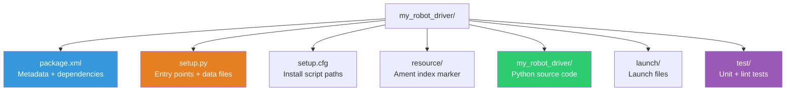
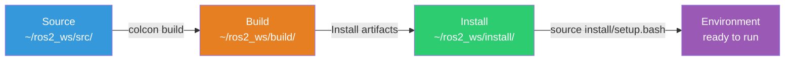
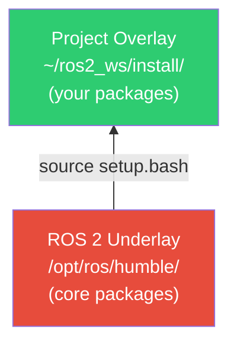

# Python Packages

Every piece of ROS 2 software — a single node, a library of utilities, a collection of launch files — lives inside a **package**. A package is the fundamental unit of code organization, dependency management, and distribution in ROS 2. In this chapter, we build Python packages from scratch, understand every configuration file, and master the build-test-run workflow.

---

## 4.1 Why Packages?

Packages enforce modularity. Instead of a monolithic codebase where a camera driver, a planner, and a motor controller all live in one directory, ROS 2 encourages splitting each responsibility into its own package. This brings several benefits:

| Benefit | Description |
|---|---|
| **Independent builds** | Change one package without rebuilding the entire system |
| **Explicit dependencies** | Each package declares exactly what it needs |
| **Reusability** | Packages can be shared across robots and teams |
| **Testability** | Each package has its own test suite |
| **Versioning** | Packages can be versioned and released independently |

---

## 4.2 Anatomy of a Python Package

A ROS 2 Python package (build type `ament_python`) has a standard layout:

```
my_robot_driver/
├── package.xml                # Package metadata and dependencies
├── setup.py                   # Python build configuration
├── setup.cfg                  # Install script directories
├── resource/
│   └── my_robot_driver        # Empty marker file (ament index)
├── my_robot_driver/           # Python module (same name as package)
│   ├── __init__.py
│   ├── driver_node.py         # A ROS 2 node
│   └── utils.py               # Shared utilities
├── launch/
│   └── driver.launch.py       # Launch file
├── config/
│   └── params.yaml            # Parameter files
└── test/
    ├── test_copyright.py      # Linter: copyright headers
    ├── test_flake8.py         # Linter: PEP 8 style
    ├── test_pep257.py         # Linter: docstring conventions
    └── test_driver_logic.py   # Your unit tests
```



### 4.2.1 package.xml

The `package.xml` file (format 3) is the identity card of your package. It declares the package name, version, description, maintainer, license, and — critically — all dependencies.

```xml
<?xml version="1.0"?>
<?xml-model href="http://download.ros.org/schema/package_format3.xsd"
  schematypens="http://www.w3.org/2001/XMLSchema"?>
<package format="3">
  <name>my_robot_driver</name>
  <version>0.1.0</version>
  <description>Motor driver interface for the humanoid robot.</description>
  <maintainer email="engineer@example.com">Jane Engineer</maintainer>
  <license>Apache-2.0</license>

  <!-- Build system -->
  <buildtool_depend>ament_python</buildtool_depend>

  <!-- Runtime dependencies -->
  <exec_depend>rclpy</exec_depend>
  <exec_depend>std_msgs</exec_depend>
  <exec_depend>geometry_msgs</exec_depend>

  <!-- Test dependencies -->
  <test_depend>ament_copyright</test_depend>
  <test_depend>ament_flake8</test_depend>
  <test_depend>ament_pep257</test_depend>
  <test_depend>python3-pytest</test_depend>

  <export>
    <build_type>ament_python</build_type>
  </export>
</package>
```

**Dependency tags explained:**

| Tag | When Installed | Use Case |
|---|---|---|
| `<depend>` | Build + runtime | Needed at both stages (common for C++) |
| `<build_depend>` | Build only | Code generation tools |
| `<exec_depend>` | Runtime only | Python library dependencies |
| `<test_depend>` | Test only | pytest, linters |
| `<buildtool_depend>` | Build system | ament_python, ament_cmake |

:::tip When to Use `<depend>` vs `<exec_depend>`
For pure Python packages, most dependencies are runtime-only, so `<exec_depend>` is the correct choice. Use `<depend>` when a dependency is needed at both build and run time, which is more common in C++ packages.
:::

### 4.2.2 setup.py

The `setup.py` configures Python's setuptools to install your package:

```python
from setuptools import find_packages, setup

package_name = 'my_robot_driver'

setup(
    name=package_name,
    version='0.1.0',
    packages=find_packages(exclude=['test']),
    data_files=[
        # Register with ament resource index
        ('share/ament_index/resource_index/packages',
            ['resource/' + package_name]),
        # Install package.xml
        ('share/' + package_name, ['package.xml']),
        # Install launch files
        ('share/' + package_name + '/launch',
            ['launch/driver.launch.py']),
        # Install config files
        ('share/' + package_name + '/config',
            ['config/params.yaml']),
    ],
    install_requires=['setuptools'],
    zip_safe=True,
    maintainer='Jane Engineer',
    maintainer_email='engineer@example.com',
    description='Motor driver interface for the humanoid robot.',
    license='Apache-2.0',
    tests_require=['pytest'],
    entry_points={
        'console_scripts': [
            'driver_node = my_robot_driver.driver_node:main',
            'diagnostic_node = my_robot_driver.diagnostic_node:main',
        ],
    },
)
```

### 4.2.3 setup.cfg

Tells setuptools where to install executable scripts:

```ini
[develop]
script_dir=$base/lib/my_robot_driver

[install]
install_scripts=$base/lib/my_robot_driver
```

This ensures `ros2 run` can find your executables in `lib/<package_name>/`.

### 4.2.4 The Resource Index Marker

The empty file at `resource/my_robot_driver` registers the package with the **ament resource index**. Without it, `ros2 pkg list` and `ros2 run` will not find your package.

---

## 4.3 Creating a Package with `ros2 pkg create`

The fastest way to scaffold a new package:

```bash
cd ~/ros2_ws/src

ros2 pkg create my_robot_driver \
    --build-type ament_python \
    --dependencies rclpy std_msgs geometry_msgs \
    --description "Motor driver interface for the humanoid robot." \
    --maintainer-name "Jane Engineer" \
    --maintainer-email "engineer@example.com" \
    --license Apache-2.0
```

This generates all required files with the correct structure.

:::note Package Naming Conventions
ROS 2 package names must:
- Use only lowercase letters, digits, and underscores
- Start with a letter
- Not use double underscores or trailing underscores
- Be unique within the workspace

Good: `humanoid_perception`, `arm_control_v2`
Bad: `MyRobotDriver`, `my-robot-driver`, `__driver`
:::

---

## 4.4 The colcon Build Workflow

**colcon** (collective construction) orchestrates the build process for all packages in a workspace.



### Essential Commands

```bash
# Build the entire workspace
cd ~/ros2_ws
colcon build

# Build a specific package only
colcon build --packages-select my_robot_driver

# Build a package and all its dependencies
colcon build --packages-up-to my_robot_driver

# Symlink install (no rebuild needed for Python changes)
colcon build --symlink-install

# Source the workspace overlay
source install/setup.bash
```

### The `--symlink-install` Flag

For Python packages, `--symlink-install` creates symbolic links instead of copying files. Changes to Python source take effect immediately without rebuilding.

```bash
colcon build --symlink-install --packages-select my_robot_driver
source install/setup.bash

# Edit driver_node.py... changes take effect immediately!
ros2 run my_robot_driver driver_node
```

:::caution When You Must Rebuild
Even with `--symlink-install`, you must rebuild when you:
- Add or remove entry points in `setup.py`
- Add new data files (launch files, configs)
- Change `package.xml` dependencies
- Modify `setup.cfg`
:::

---

## 4.5 Entry Points and Console Scripts

Entry points map command names to Python functions, enabling `ros2 run`:

```python
entry_points={
    'console_scripts': [
        # Format: 'command_name = package.module:function'
        'driver_node = my_robot_driver.driver_node:main',
        'calibrate = my_robot_driver.tools.calibrate:main',
    ],
},
```

When you run `ros2 run my_robot_driver driver_node`, ROS 2:
1. Looks up the `driver_node` entry point
2. Imports `my_robot_driver.driver_node`
3. Calls `main()`

### A Complete Node with Entry Point

```python
#!/usr/bin/env python3
"""Motor driver node — subscribes to velocity commands."""

import rclpy
from rclpy.node import Node
from geometry_msgs.msg import Twist
from std_msgs.msg import Float64MultiArray


class MotorDriverNode(Node):
    def __init__(self):
        super().__init__('motor_driver')

        # Declare parameters with defaults
        self.declare_parameter('max_linear_velocity', 1.0)
        self.declare_parameter('max_angular_velocity', 2.0)

        self.max_linear = (
            self.get_parameter('max_linear_velocity')
            .get_parameter_value().double_value
        )
        self.max_angular = (
            self.get_parameter('max_angular_velocity')
            .get_parameter_value().double_value
        )

        self.cmd_sub = self.create_subscription(
            Twist, '/cmd_vel', self.cmd_vel_callback, 10
        )
        self.status_pub = self.create_publisher(
            Float64MultiArray, '/motor_status', 10
        )
        self.timer = self.create_timer(0.02, self.publish_status)
        self.current_cmd = Twist()

        self.get_logger().info(
            f'Motor driver started (max_lin={self.max_linear})'
        )

    def cmd_vel_callback(self, msg: Twist):
        self.current_cmd.linear.x = max(
            -self.max_linear, min(self.max_linear, msg.linear.x)
        )
        self.current_cmd.angular.z = max(
            -self.max_angular, min(self.max_angular, msg.angular.z)
        )

    def publish_status(self):
        status = Float64MultiArray()
        status.data = [
            self.current_cmd.linear.x,
            self.current_cmd.angular.z,
        ]
        self.status_pub.publish(status)


def main(args=None):
    rclpy.init(args=args)
    node = MotorDriverNode()
    try:
        rclpy.spin(node)
    except KeyboardInterrupt:
        node.get_logger().info('Shutting down motor driver.')
    finally:
        node.destroy_node()
        rclpy.shutdown()


if __name__ == '__main__':
    main()
```

---

## 4.6 Launch Files in Python

Launch files start multiple nodes, set parameters, and compose complex systems.

```python
"""launch/driver.launch.py — Start the motor driver system."""

from launch import LaunchDescription
from launch.actions import DeclareLaunchArgument, LogInfo
from launch.substitutions import LaunchConfiguration
from launch_ros.actions import Node


def generate_launch_description():
    max_vel_arg = DeclareLaunchArgument(
        'max_linear_velocity',
        default_value='1.5',
        description='Maximum linear velocity in m/s'
    )

    driver_node = Node(
        package='my_robot_driver',
        executable='driver_node',
        name='motor_driver',
        namespace='base',
        parameters=[{
            'max_linear_velocity':
                LaunchConfiguration('max_linear_velocity'),
            'max_angular_velocity': 2.0,
        }],
        remappings=[
            ('/cmd_vel', '/base/cmd_vel'),
        ],
        output='screen',
    )

    return LaunchDescription([
        max_vel_arg,
        LogInfo(msg='Starting motor driver system...'),
        driver_node,
    ])
```

```bash
# Run with defaults
ros2 launch my_robot_driver driver.launch.py

# Override arguments
ros2 launch my_robot_driver driver.launch.py max_linear_velocity:=2.0
```

:::tip YAML Parameter Files
For complex configurations, load from YAML instead of inlining:

```python
import os
from ament_index_python.packages import get_package_share_directory

config_path = os.path.join(
    get_package_share_directory('my_robot_driver'),
    'config', 'params.yaml'
)

driver_node = Node(
    package='my_robot_driver',
    executable='driver_node',
    parameters=[config_path],
)
```
:::

---

## 4.7 Testing with pytest

ROS 2 Python packages use **pytest**. The default template includes linting tests; you should add your own unit and integration tests.

### Unit Tests

```python
# test/test_driver_logic.py
"""Unit tests for velocity clamping logic."""

import pytest


class TestVelocityClamping:
    def test_within_limits(self):
        max_vel = 1.0
        assert max(-max_vel, min(max_vel, 0.5)) == 0.5

    def test_exceeds_positive(self):
        max_vel = 1.0
        assert max(-max_vel, min(max_vel, 2.5)) == 1.0

    def test_exceeds_negative(self):
        max_vel = 1.0
        assert max(-max_vel, min(max_vel, -3.0)) == -1.0

    def test_zero(self):
        max_vel = 1.0
        assert max(-max_vel, min(max_vel, 0.0)) == 0.0
```

### Running Tests

```bash
# Run all tests in workspace
colcon test

# Test a specific package
colcon test --packages-select my_robot_driver

# View results
colcon test-result --verbose

# Run pytest directly for faster iteration
cd ~/ros2_ws/src/my_robot_driver
python -m pytest test/ -v
```

---

## 4.8 Workspace Overlays

ROS 2 uses a layered workspace model. Each workspace can **overlay** another:



```bash
# Always source the underlay first
source /opt/ros/humble/setup.bash

# Then source your workspace
source ~/ros2_ws/install/setup.bash
```

Packages in your workspace override identically-named packages from the underlay, enabling isolated development without modifying the system installation.

---

## 4.9 Best Practices

1. **One responsibility per package** — perception, control, and drivers should be separate packages
2. **Common prefix** for related packages: `humanoid_perception`, `humanoid_control`
3. **Separate interface packages** — put custom message/service definitions in `_interfaces` packages
4. **Declare all dependencies explicitly** in `package.xml`
5. **Use `rosdep`** to install system dependencies:
   ```bash
   rosdep install --from-paths src --ignore-src -r -y
   ```
6. **Run linters on every build** — the default linting tests enforce style consistency
7. **Use `--symlink-install`** during development to avoid constant rebuilds

---

## 4.10 Chapter Summary

In this chapter, you learned:

- **Package structure** — `package.xml`, `setup.py`, `setup.cfg`, and the ament resource index marker
- **`ros2 pkg create`** scaffolds new packages with correct structure
- **colcon** builds packages; `--symlink-install` eliminates rebuilds for Python changes
- **Entry points** map command names to Python functions for `ros2 run`
- **Launch files** start multiple nodes with parameters and remappings
- **pytest** is the standard test runner for ROS 2 Python packages
- **Workspace overlays** layer your packages on top of the ROS 2 underlay

In the next chapter, we explore **URDF and Transforms** — describing robot geometry and tracking coordinate frames across a kinematic chain.

---

## Exercises

1. **Create a Sensor Package**: Create `humanoid_sensors` with dependencies on `rclpy` and `sensor_msgs`. Write a node that subscribes to `/imu/data` and publishes a computed `/stability_index`. Build, run, and verify with `ros2 topic echo`.

2. **Multi-Node Launch**: Write a launch file that starts three instances of your sensor node with different namespaces (`/left_leg`, `/right_leg`, `/torso`) and different parameter values.

3. **Unit Testing**: Write four unit tests for the stability index computation. Run with `colcon test` and verify they pass.

4. **Overlay Experiment**: Create two workspaces with a package of the same name but different output. Source them in different orders and observe which version runs.
