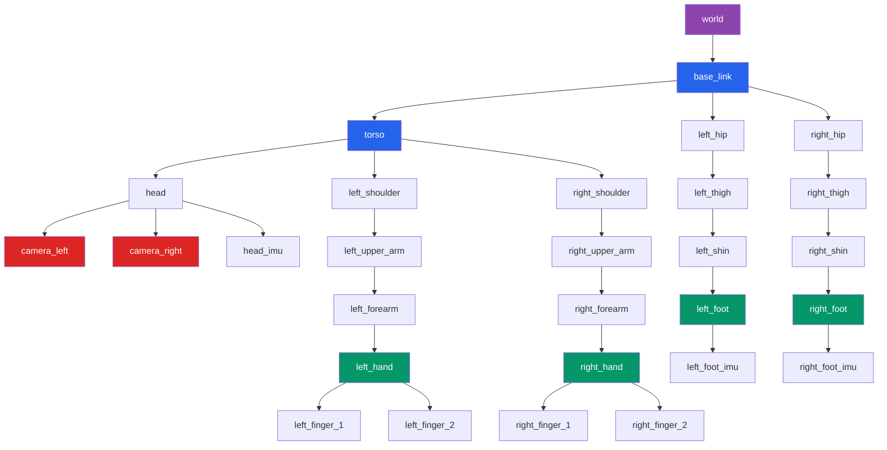
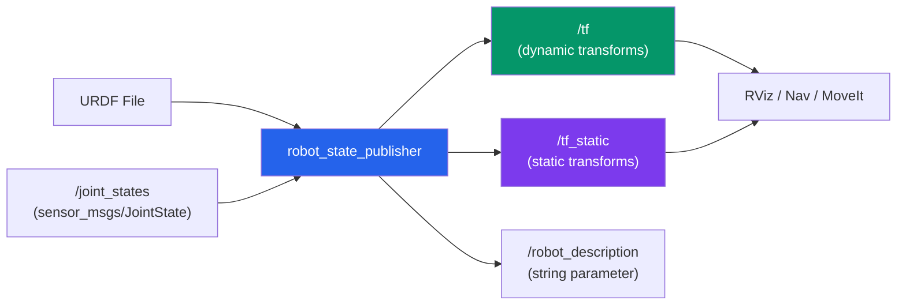

import KnowledgeCheck from '@site/src/components/KnowledgeCheck';


# URDF & Transforms

Every robot is a kinematic tree -- a hierarchy of rigid bodies connected by joints. Before a robot can plan motions, avoid collisions, or interpret sensor data, the software stack must know the exact geometry of the robot and the spatial relationships between all of its parts. In ROS 2, this knowledge is captured in two complementary systems: **URDF** for static robot description and **TF2** for dynamic coordinate frame tracking.

In this chapter, you will learn how to write URDF files from scratch, understand every element in the format, broadcast and listen to transforms with TF2, and visualize everything in RViz.

---

## 5.1 What Is URDF?

The **Unified Robot Description Format (URDF)** is an XML specification for describing the physical structure of a robot. It defines:

- **Links** -- the rigid bodies (e.g., torso, upper arm, forearm, hand).
- **Joints** -- the connections between links, specifying how they move relative to each other.
- **Visual geometry** -- what the robot looks like (for rendering in RViz and Gazebo).
- **Collision geometry** -- simplified shapes used for collision detection.
- **Inertial properties** -- mass and moments of inertia for physics simulation.
- **Materials** -- colors and textures for visualization.

:::note URDF vs SDF
URDF is the standard in ROS for robot description, but it has limitations: it only supports tree-structured kinematic chains (no closed loops) and lacks native support for sensors, lights, and world elements. **SDF** (Simulation Description Format) is more expressive and is the native format for Gazebo. In practice, you write URDF for your robot and convert or embed it into SDF worlds for simulation.
:::

---

## 5.2 URDF XML Structure

A URDF file is a single `<robot>` element containing `<link>` and `<joint>` children. Here is the high-level structure:

```xml
<?xml version="1.0"?>
<robot name="my_robot" xmlns:xacro="http://www.ros.org/wiki/xacro">

  <!-- Materials (colors) -->
  <material name="blue">
    <color rgba="0.0 0.0 0.8 1.0"/>
  </material>

  <!-- Links (rigid bodies) -->
  <link name="base_link">
    <visual> ... </visual>
    <collision> ... </collision>
    <inertial> ... </inertial>
  </link>

  <!-- Joints (connections between links) -->
  <joint name="joint_1" type="revolute">
    <parent link="base_link"/>
    <child link="link_1"/>
    <origin xyz="0 0 0.1" rpy="0 0 0"/>
    <axis xyz="0 0 1"/>
    <limit lower="-1.57" upper="1.57" effort="10" velocity="1.0"/>
  </joint>

</robot>
```

### URDF Element Hierarchy

| Element | Parent | Purpose |
|---------|--------|---------|
| `<robot>` | Root | Top-level container; `name` attribute required |
| `<link>` | `<robot>` | Defines a rigid body with visual, collision, and inertial properties |
| `<joint>` | `<robot>` | Connects two links; defines motion type and limits |
| `<material>` | `<robot>` or `<visual>` | Named color/texture for visualization |
| `<visual>` | `<link>` | Rendering geometry (what it looks like) |
| `<collision>` | `<link>` | Simplified geometry for collision checking |
| `<inertial>` | `<link>` | Mass and inertia tensor for dynamics |
| `<origin>` | `<joint>`, `<visual>`, `<collision>`, `<inertial>` | Pose offset (xyz translation + rpy rotation) |
| `<axis>` | `<joint>` | Axis of rotation or translation |
| `<limit>` | `<joint>` | Position, velocity, and effort bounds |

---

## 5.3 Links in Detail

A link represents a single rigid body. It can have up to three sub-elements:

### Visual Element

The `<visual>` element defines the appearance used for rendering:

```xml
<link name="upper_arm">
  <visual>
    <origin xyz="0 0 0.15" rpy="0 0 0"/>
    <geometry>
      <cylinder radius="0.04" length="0.30"/>
    </geometry>
    <material name="blue"/>
  </visual>
</link>
```

Supported geometry primitives:

| Primitive | Attributes | Example |
|-----------|-----------|---------|
| `<box>` | `size="x y z"` | `<box size="0.1 0.1 0.1"/>` |
| `<cylinder>` | `radius`, `length` | `<cylinder radius="0.05" length="0.3"/>` |
| `<sphere>` | `radius` | `<sphere radius="0.08"/>` |
| `<mesh>` | `filename`, `scale` | `<mesh filename="package://pkg/meshes/arm.stl"/>` |

### Collision Element

The `<collision>` element defines simplified geometry for the physics engine and collision detection. It often uses simpler shapes than the visual mesh for performance:

```xml
<collision>
  <origin xyz="0 0 0.15" rpy="0 0 0"/>
  <geometry>
    <cylinder radius="0.045" length="0.32"/>
  </geometry>
</collision>
```

:::tip Performance Tip
Always use primitive shapes (boxes, cylinders, spheres) for collision geometry rather than complex meshes. The physics engine performs orders of magnitude faster with primitives. Reserve mesh-based collision only for gripper fingers or other parts where precise contact geometry matters.
:::

### Inertial Element

The `<inertial>` element specifies the mass and the 3x3 inertia tensor for dynamics simulation:

```xml
<inertial>
  <origin xyz="0 0 0.15" rpy="0 0 0"/>
  <mass value="2.5"/>
  <inertia
    ixx="0.019" ixy="0.0" ixz="0.0"
    iyy="0.019" iyz="0.0"
    izz="0.002"/>
</inertial>
```

The inertia tensor for a solid cylinder about its center of mass is:

$$
I_{xx} = I_{yy} = \frac{1}{12}m(3r^2 + h^2), \quad I_{zz} = \frac{1}{2}mr^2
$$

:::caution Inertia Values Matter
Incorrect inertia values are the most common cause of unstable physics simulation. If your robot explodes or vibrates uncontrollably in Gazebo, check the inertial parameters first. Use tools like `meshlab` or the `gz sdf --inertial` command to compute inertia from meshes.
:::

---

## 5.4 Joint Types

URDF supports four joint types that cover all common kinematic connections in robotics:

| Joint Type | DOF | Motion | Use Case |
|-----------|-----|--------|----------|
| **`revolute`** | 1 | Rotation about an axis, with position limits | Elbows, knees, fingers |
| **`continuous`** | 1 | Rotation about an axis, no position limits | Wheels, propellers |
| **`prismatic`** | 1 | Translation along an axis, with position limits | Linear actuators, telescoping joints |
| **`fixed`** | 0 | No motion; rigidly attaches child to parent | Sensor mounts, structural connections |

### Revolute Joint

The most common joint type in humanoid robotics. It rotates about a single axis within defined limits:

```xml
<joint name="shoulder_pitch" type="revolute">
  <parent link="torso"/>
  <child link="upper_arm"/>
  <origin xyz="0 0.18 0.3" rpy="0 0 0"/>
  <axis xyz="0 1 0"/>
  <limit lower="-2.09" upper="2.09" effort="50.0" velocity="2.0"/>
  <dynamics damping="0.5" friction="0.1"/>
</joint>
```

### Continuous Joint

Like revolute, but without position limits -- the joint can spin indefinitely:

```xml
<joint name="wheel_joint" type="continuous">
  <parent link="chassis"/>
  <child link="wheel"/>
  <origin xyz="0.15 0 -0.05" rpy="-1.5708 0 0"/>
  <axis xyz="0 0 1"/>
  <dynamics damping="0.01" friction="0.005"/>
</joint>
```

### Prismatic Joint

Translates (slides) along a single axis:

```xml
<joint name="gripper_slide" type="prismatic">
  <parent link="wrist"/>
  <child link="finger_left"/>
  <origin xyz="0 0 0.05" rpy="0 0 0"/>
  <axis xyz="0 1 0"/>
  <limit lower="0.0" upper="0.04" effort="20.0" velocity="0.5"/>
</joint>
```

### Fixed Joint

No motion -- rigidly attaches the child link to the parent:

```xml
<joint name="camera_mount" type="fixed">
  <parent link="head"/>
  <child link="camera_link"/>
  <origin xyz="0.05 0 0.02" rpy="0 0 0"/>
</joint>
```

---

## 5.5 Complete URDF: A 3-DOF Robotic Arm

The following is a complete, functional URDF for a 3-DOF articulated arm with a base, shoulder, elbow, and wrist:

```xml title="three_dof_arm.urdf"
<?xml version="1.0"?>
<robot name="three_dof_arm">

  <!-- ==================== Materials ==================== -->
  <material name="grey">
    <color rgba="0.5 0.5 0.5 1.0"/>
  </material>
  <material name="blue">
    <color rgba="0.0 0.0 0.8 1.0"/>
  </material>
  <material name="orange">
    <color rgba="0.9 0.5 0.1 1.0"/>
  </material>
  <material name="red">
    <color rgba="0.8 0.1 0.1 1.0"/>
  </material>

  <!-- ==================== Base Link ==================== -->
  <link name="base_link">
    <visual>
      <geometry>
        <cylinder radius="0.08" length="0.04"/>
      </geometry>
      <material name="grey"/>
    </visual>
    <collision>
      <geometry>
        <cylinder radius="0.08" length="0.04"/>
      </geometry>
    </collision>
    <inertial>
      <mass value="5.0"/>
      <inertia ixx="0.0083" ixy="0" ixz="0"
               iyy="0.0083" iyz="0" izz="0.016"/>
    </inertial>
  </link>

  <!-- ==================== Link 1: Shoulder ==================== -->
  <link name="shoulder_link">
    <visual>
      <origin xyz="0 0 0.15" rpy="0 0 0"/>
      <geometry>
        <cylinder radius="0.04" length="0.30"/>
      </geometry>
      <material name="blue"/>
    </visual>
    <collision>
      <origin xyz="0 0 0.15" rpy="0 0 0"/>
      <geometry>
        <cylinder radius="0.045" length="0.32"/>
      </geometry>
    </collision>
    <inertial>
      <origin xyz="0 0 0.15" rpy="0 0 0"/>
      <mass value="2.0"/>
      <inertia ixx="0.0155" ixy="0" ixz="0"
               iyy="0.0155" iyz="0" izz="0.0016"/>
    </inertial>
  </link>

  <!-- Joint 1: Base to Shoulder (yaw) -->
  <joint name="shoulder_yaw" type="revolute">
    <parent link="base_link"/>
    <child link="shoulder_link"/>
    <origin xyz="0 0 0.02" rpy="0 0 0"/>
    <axis xyz="0 0 1"/>
    <limit lower="-3.14" upper="3.14" effort="50.0" velocity="1.5"/>
    <dynamics damping="0.5" friction="0.1"/>
  </joint>

  <!-- ==================== Link 2: Upper Arm ==================== -->
  <link name="upper_arm_link">
    <visual>
      <origin xyz="0 0 0.125" rpy="0 0 0"/>
      <geometry>
        <cylinder radius="0.035" length="0.25"/>
      </geometry>
      <material name="orange"/>
    </visual>
    <collision>
      <origin xyz="0 0 0.125" rpy="0 0 0"/>
      <geometry>
        <cylinder radius="0.04" length="0.27"/>
      </geometry>
    </collision>
    <inertial>
      <origin xyz="0 0 0.125" rpy="0 0 0"/>
      <mass value="1.5"/>
      <inertia ixx="0.008" ixy="0" ixz="0"
               iyy="0.008" iyz="0" izz="0.0009"/>
    </inertial>
  </link>

  <!-- Joint 2: Shoulder to Upper Arm (pitch) -->
  <joint name="shoulder_pitch" type="revolute">
    <parent link="shoulder_link"/>
    <child link="upper_arm_link"/>
    <origin xyz="0 0 0.30" rpy="0 0 0"/>
    <axis xyz="0 1 0"/>
    <limit lower="-2.09" upper="2.09" effort="40.0" velocity="1.5"/>
    <dynamics damping="0.3" friction="0.08"/>
  </joint>

  <!-- ==================== Link 3: Forearm ==================== -->
  <link name="forearm_link">
    <visual>
      <origin xyz="0 0 0.10" rpy="0 0 0"/>
      <geometry>
        <cylinder radius="0.03" length="0.20"/>
      </geometry>
      <material name="orange"/>
    </visual>
    <collision>
      <origin xyz="0 0 0.10" rpy="0 0 0"/>
      <geometry>
        <cylinder radius="0.035" length="0.22"/>
      </geometry>
    </collision>
    <inertial>
      <origin xyz="0 0 0.10" rpy="0 0 0"/>
      <mass value="1.0"/>
      <inertia ixx="0.0036" ixy="0" ixz="0"
               iyy="0.0036" iyz="0" izz="0.00045"/>
    </inertial>
  </link>

  <!-- Joint 3: Upper Arm to Forearm (elbow pitch) -->
  <joint name="elbow_pitch" type="revolute">
    <parent link="upper_arm_link"/>
    <child link="forearm_link"/>
    <origin xyz="0 0 0.25" rpy="0 0 0"/>
    <axis xyz="0 1 0"/>
    <limit lower="-2.35" upper="0.0" effort="30.0" velocity="2.0"/>
    <dynamics damping="0.2" friction="0.05"/>
  </joint>

  <!-- ==================== End Effector ==================== -->
  <link name="end_effector">
    <visual>
      <geometry>
        <sphere radius="0.025"/>
      </geometry>
      <material name="red"/>
    </visual>
    <collision>
      <geometry>
        <sphere radius="0.025"/>
      </geometry>
    </collision>
    <inertial>
      <mass value="0.2"/>
      <inertia ixx="0.00004" ixy="0" ixz="0"
               iyy="0.00004" iyz="0" izz="0.00004"/>
    </inertial>
  </link>

  <!-- Fixed joint: Forearm to End Effector -->
  <joint name="wrist_fixed" type="fixed">
    <parent link="forearm_link"/>
    <child link="end_effector"/>
    <origin xyz="0 0 0.20" rpy="0 0 0"/>
  </joint>

</robot>
```

### Validating the URDF

Always validate your URDF before using it:

```bash
# Install the URDF tools if not already present
sudo apt-get install -y liburdfdom-tools

# Check for XML and structural errors
check_urdf three_dof_arm.urdf

# Generate a graphical view of the kinematic tree
urdf_to_graphiz three_dof_arm.urdf
# This creates three_dof_arm.gv and three_dof_arm.pdf
```

Expected output from `check_urdf`:

```
robot name is: three_dof_arm
---------- Successfully Coverage URDF ---------------
root Link: base_link has 1 child(ren)
    child(1):  shoulder_link
        child(1):  upper_arm_link
            child(1):  forearm_link
                child(1):  end_effector
```

---

## 5.6 The TF2 Transform System

While URDF describes the static structure of the robot, **TF2** is the ROS 2 subsystem that tracks the dynamic spatial relationships between all coordinate frames at runtime. Every link in your URDF becomes a coordinate frame, and TF2 maintains a time-stamped tree of transforms between them.

### Why TF2?

Consider a humanoid robot picking up an object. To plan the grasp, the system needs to know:

- Where is the object relative to the camera? (perception)
- Where is the camera relative to the robot's base? (kinematics)
- Where is the robot's hand relative to the base? (kinematics)
- Where is the object relative to the hand? (grasp planning)

TF2 answers all of these questions by maintaining a continuously updated transform tree.

### TF2 Concepts

| Concept | Description |
|---------|-------------|
| **Frame** | A named coordinate system (e.g., `base_link`, `camera_optical`, `left_hand`) |
| **Transform** | A 6-DOF pose (translation + rotation) between two frames |
| **Static Transform** | A transform that never changes (e.g., camera mount on head) |
| **Dynamic Transform** | A transform that changes over time (e.g., joint angles) |
| **Transform Tree** | A tree-structured graph of all frames, rooted at a common frame |
| **Broadcaster** | A node that publishes transforms to the tree |
| **Listener** | A node that queries transforms from the tree |

### TF2 Transform Tree for a Humanoid



:::note Frame Naming Convention
ROS 2 convention uses `snake_case` for frame names. Sensor frames often have an `_optical` suffix (e.g., `camera_left_optical`) to indicate the optical coordinate convention (Z forward, X right, Y down) rather than the body convention (X forward, Y left, Z up).
:::

---

## 5.7 robot_state_publisher

The **`robot_state_publisher`** node is the bridge between your URDF and TF2. It does two things:

1. Reads the URDF and publishes all **fixed joints** as static transforms (on `/tf_static`).
2. Subscribes to `/joint_states` messages and computes the transforms for all **movable joints**, publishing them on `/tf`.



### Launching robot_state_publisher

```python title="launch/display_arm.launch.py"
import os
from launch import LaunchDescription
from launch_ros.actions import Node
from ament_index_python.packages import get_package_share_directory


def generate_launch_description():
    """Launch robot_state_publisher and RViz for the 3-DOF arm."""

    urdf_file = os.path.join(
        get_package_share_directory('my_arm_description'),
        'urdf',
        'three_dof_arm.urdf'
    )

    with open(urdf_file, 'r') as f:
        robot_description_content = f.read()

    return LaunchDescription([
        # Publish the robot description and compute transforms
        Node(
            package='robot_state_publisher',
            executable='robot_state_publisher',
            name='robot_state_publisher',
            parameters=[{
                'robot_description': robot_description_content,
                'publish_frequency': 50.0,
            }],
            output='screen',
        ),

        # Joint State Publisher GUI for manual joint control
        Node(
            package='joint_state_publisher_gui',
            executable='joint_state_publisher_gui',
            name='joint_state_publisher_gui',
            output='screen',
        ),

        # RViz for visualization
        Node(
            package='rviz2',
            executable='rviz2',
            name='rviz2',
            arguments=['-d', os.path.join(
                get_package_share_directory('my_arm_description'),
                'rviz',
                'arm_display.rviz'
            )],
            output='screen',
        ),
    ])
```

```bash
# Install required packages
sudo apt-get install -y \
  ros-humble-robot-state-publisher \
  ros-humble-joint-state-publisher-gui \
  ros-humble-rviz2

# Launch the visualization
ros2 launch my_arm_description display_arm.launch.py
```

---

## 5.8 TF2 Static Broadcaster

A **static transform broadcaster** publishes transforms that never change -- for example, the fixed offset from the robot's base to a mounted sensor. These are published once on the `/tf_static` topic with a latched (transient local) QoS.

```python title="static_tf_broadcaster.py"
#!/usr/bin/env python3
"""
Publish a static transform between two coordinate frames.

This is typically used for sensor mounts, fixed structural
offsets, or calibration transforms that do not change at runtime.
"""

import rclpy
from rclpy.node import Node
from geometry_msgs.msg import TransformStamped
from tf2_ros import StaticTransformBroadcaster
import math


class StaticFramePublisher(Node):
    """Broadcasts a static transform from base_link to camera_link."""

    def __init__(self):
        super().__init__('static_tf_broadcaster')

        # Create the static transform broadcaster
        self.broadcaster = StaticTransformBroadcaster(self)

        # Build the transform message
        transform = TransformStamped()

        # Header: timestamp and parent frame
        transform.header.stamp = self.get_clock().now().to_msg()
        transform.header.frame_id = 'head'

        # Child frame
        transform.child_frame_id = 'camera_rgb'

        # Translation: 5 cm forward, 0 lateral, 2 cm up from head
        transform.transform.translation.x = 0.05
        transform.transform.translation.y = 0.0
        transform.transform.translation.z = 0.02

        # Rotation: 15-degree downward tilt (pitch)
        # Convert Euler angles to quaternion
        pitch = math.radians(-15.0)
        transform.transform.rotation.x = 0.0
        transform.transform.rotation.y = math.sin(pitch / 2.0)
        transform.transform.rotation.z = 0.0
        transform.transform.rotation.w = math.cos(pitch / 2.0)

        # Publish the static transform
        self.broadcaster.sendTransform(transform)
        self.get_logger().info(
            f'Published static transform: head -> camera_rgb '
            f'(xyz=[0.05, 0.0, 0.02], pitch=-15 deg)'
        )


def main(args=None):
    rclpy.init(args=args)
    node = StaticFramePublisher()

    try:
        rclpy.spin(node)
    except KeyboardInterrupt:
        pass
    finally:
        node.destroy_node()
        rclpy.shutdown()


if __name__ == '__main__':
    main()
```

You can also publish static transforms from the command line:

```bash
# Static transform: base_link -> lidar_link
# Translation: x=0.1, y=0, z=0.5
# Rotation (quaternion): x=0, y=0, z=0, w=1 (identity)
ros2 run tf2_ros static_transform_publisher \
  --x 0.1 --y 0.0 --z 0.5 \
  --qx 0.0 --qy 0.0 --qz 0.0 --qw 1.0 \
  --frame-id base_link --child-frame-id lidar_link
```

---

## 5.9 TF2 Dynamic Broadcaster

A **dynamic transform broadcaster** publishes transforms that change over time -- typically joint angles computed from encoder readings or commanded positions:

```python title="dynamic_tf_broadcaster.py"
#!/usr/bin/env python3
"""
Broadcast a dynamic transform that changes over time.

This example simulates a rotating sensor platform by
continuously updating the transform between base_link
and a sensor_platform frame.
"""

import rclpy
from rclpy.node import Node
from geometry_msgs.msg import TransformStamped
from tf2_ros import TransformBroadcaster
import math


class DynamicFramePublisher(Node):
    """Broadcasts a continuously rotating transform."""

    def __init__(self):
        super().__init__('dynamic_tf_broadcaster')

        # Create the dynamic transform broadcaster
        self.broadcaster = TransformBroadcaster(self)

        # Timer to publish at 50 Hz
        self.timer = self.create_timer(0.02, self.broadcast_transform)
        self.angle = 0.0
        self.angular_velocity = 0.5  # radians per second

        self.get_logger().info('Dynamic TF broadcaster started.')

    def broadcast_transform(self):
        """Publish the current transform."""
        transform = TransformStamped()

        # Timestamp and frames
        transform.header.stamp = self.get_clock().now().to_msg()
        transform.header.frame_id = 'base_link'
        transform.child_frame_id = 'sensor_platform'

        # Fixed translation: platform is 0.3m above base
        transform.transform.translation.x = 0.0
        transform.transform.translation.y = 0.0
        transform.transform.translation.z = 0.3

        # Rotating around Z axis
        transform.transform.rotation.x = 0.0
        transform.transform.rotation.y = 0.0
        transform.transform.rotation.z = math.sin(self.angle / 2.0)
        transform.transform.rotation.w = math.cos(self.angle / 2.0)

        self.broadcaster.sendTransform(transform)

        # Increment angle (0.5 rad/s * 0.02s = 0.01 rad per tick)
        self.angle += self.angular_velocity * 0.02
        if self.angle > 2 * math.pi:
            self.angle -= 2 * math.pi


def main(args=None):
    rclpy.init(args=args)
    node = DynamicFramePublisher()

    try:
        rclpy.spin(node)
    except KeyboardInterrupt:
        pass
    finally:
        node.destroy_node()
        rclpy.shutdown()


if __name__ == '__main__':
    main()
```

---

## 5.10 TF2 Listener

A **TF2 listener** queries the transform tree to find the spatial relationship between any two frames. This is the consumer side of the TF2 system:

```python title="tf_listener.py"
#!/usr/bin/env python3
"""
Listen for transforms between two coordinate frames.

This node demonstrates how to look up the transform from
base_link to end_effector, which is essential for computing
forward kinematics, planning grasps, and aligning sensor data.
"""

import rclpy
from rclpy.node import Node
from tf2_ros import Buffer, TransformListener
from tf2_ros import LookupException, ConnectivityException, ExtrapolationException
import math


class FrameListener(Node):
    """Periodically looks up transforms between frames."""

    def __init__(self):
        super().__init__('tf_listener')

        # TF2 buffer stores recent transforms (default 10 seconds)
        self.tf_buffer = Buffer()

        # TransformListener subscribes to /tf and /tf_static
        # and populates the buffer automatically
        self.tf_listener = TransformListener(self.tf_buffer, self)

        # Query transforms at 10 Hz
        self.timer = self.create_timer(0.1, self.on_timer)

        self.get_logger().info('TF Listener started. Waiting for transforms...')

    def on_timer(self):
        """Look up the transform from base_link to end_effector."""
        try:
            # Look up the latest available transform
            transform = self.tf_buffer.lookup_transform(
                target_frame='base_link',
                source_frame='end_effector',
                time=rclpy.time.Time(),  # Use latest available
            )

            # Extract translation
            t = transform.transform.translation
            self.get_logger().info(
                f'end_effector position in base_link frame: '
                f'x={t.x:.3f}, y={t.y:.3f}, z={t.z:.3f}'
            )

            # Extract rotation as quaternion
            r = transform.transform.rotation
            self.get_logger().debug(
                f'Orientation (quat): '
                f'x={r.x:.4f}, y={r.y:.4f}, z={r.z:.4f}, w={r.w:.4f}'
            )

            # Convert quaternion to Euler angles for readability
            roll, pitch, yaw = self.quaternion_to_euler(r.x, r.y, r.z, r.w)
            self.get_logger().debug(
                f'Orientation (RPY): '
                f'roll={math.degrees(roll):.1f} deg, '
                f'pitch={math.degrees(pitch):.1f} deg, '
                f'yaw={math.degrees(yaw):.1f} deg'
            )

        except LookupException:
            self.get_logger().warn('Transform not yet available.')
        except ConnectivityException:
            self.get_logger().error('Frames are not connected in the TF tree.')
        except ExtrapolationException:
            self.get_logger().warn('Transform requires extrapolation.')

    @staticmethod
    def quaternion_to_euler(x: float, y: float, z: float, w: float):
        """Convert a quaternion to Euler angles (roll, pitch, yaw)."""
        # Roll (rotation around X)
        sinr_cosp = 2.0 * (w * x + y * z)
        cosr_cosp = 1.0 - 2.0 * (x * x + y * y)
        roll = math.atan2(sinr_cosp, cosr_cosp)

        # Pitch (rotation around Y)
        sinp = 2.0 * (w * y - z * x)
        if abs(sinp) >= 1.0:
            pitch = math.copysign(math.pi / 2, sinp)
        else:
            pitch = math.asin(sinp)

        # Yaw (rotation around Z)
        siny_cosp = 2.0 * (w * z + x * y)
        cosy_cosp = 1.0 - 2.0 * (y * y + z * z)
        yaw = math.atan2(siny_cosp, cosy_cosp)

        return roll, pitch, yaw


def main(args=None):
    rclpy.init(args=args)
    node = FrameListener()

    try:
        rclpy.spin(node)
    except KeyboardInterrupt:
        pass
    finally:
        node.destroy_node()
        rclpy.shutdown()


if __name__ == '__main__':
    main()
```

---

## 5.11 Visualizing in RViz

**RViz** is the primary visualization tool in ROS 2. It renders the robot model, TF frames, sensor data, and more in a 3D viewport.

### Key RViz Display Types for URDF and TF2

| Display Type | What It Shows | Topic / Config |
|-------------|--------------|----------------|
| **RobotModel** | The robot rendered from URDF | `/robot_description` parameter |
| **TF** | All coordinate frames as axes | `/tf` and `/tf_static` |
| **Axes** | A single coordinate frame | Specific frame name |
| **MarkerArray** | Custom 3D markers | Custom topic |

### RViz Configuration Tips

```bash
# Launch RViz with an empty configuration
rviz2

# In the Displays panel:
# 1. Set Fixed Frame to "base_link"
# 2. Add > By display type > RobotModel
#    - Set Description Source to "Topic"
#    - Set Description Topic to "/robot_description"
# 3. Add > By display type > TF
#    - Enable "Show Names" and "Show Axes"
# 4. Save the configuration: File > Save Config As
```

### TF2 Debugging Commands

```bash
# View the entire transform tree as a PDF
ros2 run tf2_tools view_frames

# Monitor the transform between two frames
ros2 run tf2_ros tf2_monitor base_link end_effector

# Echo the transform between two frames
ros2 run tf2_ros tf2_echo base_link end_effector

# Check for TF2 issues
ros2 run tf2_tools view_frames --help
```

The `view_frames` command generates a `frames.pdf` file showing the complete TF tree with frame rates and timestamps -- invaluable for debugging transform chain issues.

:::tip Debugging Broken TF Trees
If your robot model appears broken or invisible in RViz, run `ros2 run tf2_tools view_frames` and check: (1) all expected frames are present, (2) no frames have stale timestamps, and (3) the tree is fully connected with no disconnected subgraphs.
:::

---

## 5.12 Xacro: URDF Macros

Writing URDF by hand becomes tedious for complex robots. **Xacro** (XML Macros) is a preprocessor that adds variables, math expressions, conditionals, and reusable macros to URDF:

```xml title="arm_macro.urdf.xacro"
<?xml version="1.0"?>
<robot xmlns:xacro="http://www.ros.org/wiki/xacro" name="parametric_arm">

  <!-- Properties (variables) -->
  <xacro:property name="link_radius" value="0.04"/>
  <xacro:property name="link_1_length" value="0.30"/>
  <xacro:property name="link_2_length" value="0.25"/>
  <xacro:property name="link_1_mass" value="2.0"/>
  <xacro:property name="link_2_mass" value="1.5"/>

  <!-- Reusable macro for a cylindrical link -->
  <xacro:macro name="cylinder_link" params="name length radius mass color">
    <link name="${name}">
      <visual>
        <origin xyz="0 0 ${length/2}" rpy="0 0 0"/>
        <geometry>
          <cylinder radius="${radius}" length="${length}"/>
        </geometry>
        <material name="${color}"/>
      </visual>
      <collision>
        <origin xyz="0 0 ${length/2}" rpy="0 0 0"/>
        <geometry>
          <cylinder radius="${radius * 1.1}" length="${length + 0.02}"/>
        </geometry>
      </collision>
      <inertial>
        <origin xyz="0 0 ${length/2}" rpy="0 0 0"/>
        <mass value="${mass}"/>
        <inertia
          ixx="${(1.0/12.0) * mass * (3 * radius**2 + length**2)}"
          ixy="0" ixz="0"
          iyy="${(1.0/12.0) * mass * (3 * radius**2 + length**2)}"
          iyz="0"
          izz="${0.5 * mass * radius**2}"/>
      </inertial>
    </link>
  </xacro:macro>

  <!-- Use the macro -->
  <xacro:cylinder_link name="shoulder_link"
    length="${link_1_length}" radius="${link_radius}"
    mass="${link_1_mass}" color="blue"/>

  <xacro:cylinder_link name="upper_arm_link"
    length="${link_2_length}" radius="${link_radius}"
    mass="${link_2_mass}" color="orange"/>

</robot>
```

Process the Xacro file into plain URDF:

```bash
# Generate URDF from Xacro
xacro arm_macro.urdf.xacro > arm_generated.urdf

# Validate the generated URDF
check_urdf arm_generated.urdf
```

:::tip Why Xacro Matters for Humanoids
A humanoid robot may have 30+ joints and 40+ links. Without Xacro, you would be copying and pasting hundreds of lines of near-identical XML. With Xacro macros, you define a limb segment once and instantiate it with different parameters for each limb, reducing a 2000-line URDF to 200 lines of Xacro.
:::

---

## 5.13 Chapter Summary

In this chapter, you learned:

- **URDF fundamentals** -- the XML format for describing robot links, joints, materials, visual geometry, collision geometry, and inertial properties.
- **Joint types** -- revolute, continuous, prismatic, and fixed joints, each serving a distinct kinematic role.
- **Complete URDF authoring** -- how to write a functional 3-DOF arm URDF from scratch and validate it with `check_urdf`.
- **TF2 transform system** -- the runtime coordinate frame tracker that maintains a tree of time-stamped transforms between all robot frames.
- **Static and dynamic broadcasters** -- how to publish fixed sensor mounts and time-varying joint transforms.
- **TF2 listeners** -- how to query the transform between any two frames for perception, planning, and control.
- **robot_state_publisher** -- the standard node that bridges URDF and TF2, converting joint states into transform messages.
- **RViz visualization** -- rendering robot models and TF frames for debugging and development.
- **Xacro macros** -- reducing URDF complexity through variables, expressions, and reusable macros.

In the next chapter, we will use these URDF skills to describe a full humanoid robot and deploy it in Gazebo for simulation.

---

## Exercises

1. **Basic URDF**: Write a URDF for a simple 2-link planar arm (base + two revolute joints rotating in the same plane). Validate it with `check_urdf` and visualize it in RViz using `joint_state_publisher_gui`.

2. **Add Collision and Inertia**: Take the 3-DOF arm URDF from Section 5.5 and modify the collision geometry to use boxes instead of cylinders. Verify in Gazebo that the collision shapes are correct by enabling collision visualization.

3. **Simple Humanoid URDF**: Design a minimal humanoid robot with the following structure:
   - A `base_link` (torso) box
   - A `head` sphere connected by a fixed joint
   - Two arms, each with 2 revolute joints (shoulder and elbow)
   - Two legs, each with 2 revolute joints (hip and knee)
   - Use Xacro macros to avoid repeating the arm and leg definitions

4. **TF2 Explorer**: Launch the 3-DOF arm with `robot_state_publisher` and `joint_state_publisher_gui`. Then:
   - Run `ros2 run tf2_tools view_frames` and examine the generated PDF.
   - Use `ros2 run tf2_ros tf2_echo base_link end_effector` to observe how the end-effector position changes as you move the joints.
   - Write a Python node that logs the end-effector position at 10 Hz.

5. **Static Transform Challenge**: Write a node that publishes static transforms for three sensors on the humanoid head: a front-facing RGB camera, a downward-facing depth camera, and an IMU. Verify all three frames appear in the TF tree.

---

## Knowledge Check

<KnowledgeCheck
  chapterTitle="URDF & Transforms"
  questions={[
    {
      id: 1,
      question: "In a URDF file, what is the structural relationship between `<link>` and `<joint>` elements?",
      options: [
        "Joints define physics properties; links define kinematics",
        "Links are rigid bodies; joints connect two links (parent → child), defining relative motion",
        "Each joint must contain exactly one link",
        "Links and joints are interchangeable root elements"
      ],
      correctIndex: 1,
      explanation: "A URDF is a kinematic tree. Links are rigid bodies (with geometry and inertia). Joints connect a parent link to a child link, specifying the type of motion (fixed, revolute, prismatic, continuous) and its axis and limits.",
      sectionRef: "#urdf-structure",
      sectionLabel: "URDF Structure"
    },
    {
      id: 2,
      question: "What is the difference between `revolute` and `continuous` joint types in URDF?",
      options: [
        "Revolute joints rotate; continuous joints translate",
        "Both rotate, but revolute joints have defined angle limits; continuous joints have no limits (e.g., wheels)",
        "Continuous joints can move in multiple axes; revolute joints are single-axis only",
        "Revolute joints are for simulation only; continuous joints work on real hardware"
      ],
      correctIndex: 1,
      explanation: "Both joint types rotate around an axis. Revolute joints have <limit lower='...' upper='...'> attributes. Continuous joints have no limits — ideal for wheels that spin indefinitely. Using revolute for a wheel causes simulation issues when the joint exceeds its limits.",
      sectionRef: "#joint-types",
      sectionLabel: "Joint Types"
    },
    {
      id: 3,
      question: "What does `robot_state_publisher` use the URDF for in a running ROS 2 system?",
      options: [
        "It uses URDF to control motors based on joint angle commands",
        "It reads /joint_states and publishes all coordinate frame transforms to /tf using the URDF kinematic model",
        "It renders the robot in RViz directly",
        "It validates that sensor data matches the physical configuration"
      ],
      correctIndex: 1,
      explanation: "robot_state_publisher takes the URDF and subscribes to /joint_states. It computes forward kinematics for every link and publishes resulting transforms to /tf, making any frame-to-frame transform available system-wide.",
      sectionRef: "#robot-state-publisher",
      sectionLabel: "Robot State Publisher"
    },
    {
      id: 4,
      question: "What does `lookupTransform('target_frame', 'source_frame', time)` return?",
      options: [
        "The velocity of the source frame relative to the target frame",
        "The transformation (translation + rotation) that converts a point from source_frame to target_frame coordinates",
        "The path of transforms connecting the two frames in the TF tree",
        "The timestamp of the most recent transform broadcast"
      ],
      correctIndex: 1,
      explanation: "lookupTransform returns a TransformStamped with translation (x,y,z) and rotation (quaternion) mapping a point from source_frame to target_frame. This is the core operation for sensor fusion — e.g., 'where is the camera point in the robot base frame?'",
      sectionRef: "#using-tf2-in-python",
      sectionLabel: "Using TF2 in Python"
    },
    {
      id: 5,
      question: "Why are quaternions used for rotations in TF2 instead of Euler angles?",
      options: [
        "Quaternions require less storage (3 values vs 4)",
        "Quaternions avoid gimbal lock — the singularity where Euler angles lose a degree of freedom",
        "Euler angles cannot represent 3D rotations",
        "Quaternions are easier to visualize in RViz"
      ],
      correctIndex: 1,
      explanation: "Gimbal lock occurs when two Euler angle axes align, causing undefined behavior. Quaternions represent rotations on the unit sphere — they interpolate smoothly (SLERP) and compose without singularities, making them standard for robotics.",
      sectionRef: "#quaternions-and-rotation",
      sectionLabel: "Quaternions and Rotation"
    }
  ]}
/>
