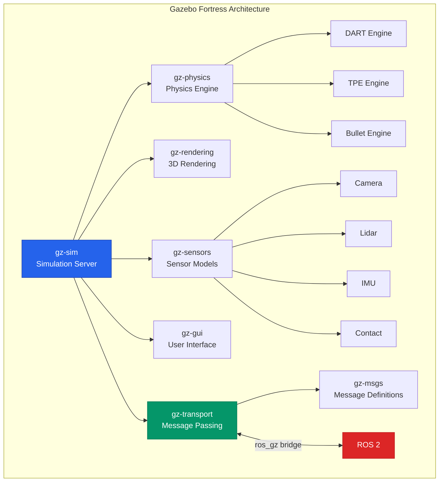
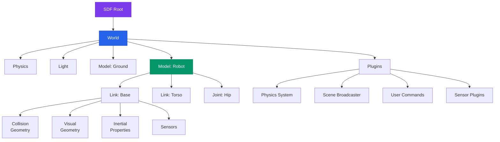
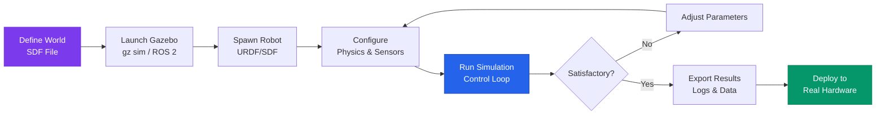

# Gazebo Basics

Simulation is the backbone of modern robotics development. Before a humanoid robot takes its first physical step, it has already walked thousands of virtual miles inside a simulator. **Gazebo** is the most widely used open-source robotics simulator, and in this chapter you will learn how to set it up, create worlds, spawn robots, and control simulations programmatically.

## Why Simulate?

Building and testing on physical hardware is expensive, slow, and risky. Simulation provides:

- **Safety**: Test dangerous scenarios (falls, collisions) without damaging hardware.
- **Speed**: Run thousands of trials overnight; accelerate time beyond real-time.
- **Reproducibility**: Replay exact scenarios for debugging.
- **Cost**: No wear and tear on actuators, sensors, or structures.
- **Parallelism**: Run hundreds of simulations simultaneously on cloud infrastructure.

:::tip Key Insight
In Physical AI, the simulation-to-reality (sim-to-real) transfer is a critical research area. The more realistic your simulation, the smaller the gap between simulated and real-world performance.
:::

## Gazebo Fortress (Ignition Gazebo)

The Gazebo project underwent a major rewrite. The legacy version (Gazebo Classic, versions 1-11) has been succeeded by a new architecture originally called **Ignition Gazebo**, now rebranded simply as **Gazebo** with named releases. **Gazebo Fortress** is a Long-Term Support (LTS) release and the recommended starting point.

### Key Differences from Gazebo Classic

| Feature | Gazebo Classic | Gazebo Fortress |
|---------|---------------|-----------------|
| Architecture | Monolithic | Modular (libraries) |
| Transport | Custom | Ignition Transport |
| Physics | ODE default | DART, TPE, Bullet |
| Rendering | OGRE 1.x | OGRE 2.x |
| Plugin API | Gazebo-specific | `gz-plugin` |
| ROS Integration | `gazebo_ros_pkgs` | `ros_gz` bridge |

### Architecture Overview



This modular design means each component (`gz-physics`, `gz-rendering`, `gz-sensors`) is an independent library. You can swap physics engines, rendering backends, or sensor implementations without modifying the core simulator.

## Installing Gazebo on Ubuntu

### Prerequisites

Gazebo Fortress is best supported on **Ubuntu 22.04 (Jammy)** with ROS 2 Humble. The following instructions assume you have a working ROS 2 Humble installation.

### Step 1: Add the Gazebo Repository

```bash
# Install dependencies
sudo apt-get update
sudo apt-get install -y lsb-release wget gnupg

# Add OSRF repository key
sudo wget https://packages.osrfoundation.org/gazebo.gpg \
  -O /usr/share/keyrings/pkgs-osrf-archive-keyring.gpg

# Add repository
echo "deb [arch=$(dpkg --print-architecture) signed-by=/usr/share/keyrings/pkgs-osrf-archive-keyring.gpg] \
  http://packages.osrfoundation.org/gazebo/ubuntu-stable $(lsb_release -cs) main" | \
  sudo tee /etc/apt/sources.list.d/gazebo-stable.list > /dev/null
```

### Step 2: Install Gazebo Fortress

```bash
sudo apt-get update
sudo apt-get install -y gz-fortress
```

### Step 3: Install the ROS-Gazebo Bridge

```bash
sudo apt-get install -y ros-humble-ros-gz
```

### Step 4: Verify Installation

```bash
# Launch a demo world
gz sim shapes.sdf
```

You should see the Gazebo GUI open with a world containing basic geometric shapes.

:::caution GPU Drivers
Gazebo requires a working GPU with OpenGL support. Ensure your NVIDIA or AMD drivers are properly installed. On headless servers, you can use `gz sim --headless-rendering` for off-screen rendering.
:::

## Creating World Files (SDF Format)

Gazebo uses the **Simulation Description Format (SDF)** to describe worlds, models, lights, and physics. SDF is an XML-based format that is more expressive than URDF and is the native format for Gazebo.

### Minimal World File

```xml title="my_world.sdf"
<?xml version="1.0" ?>
<sdf version="1.8">
  <world name="humanoid_world">

    <!-- Physics configuration -->
    <physics name="default_physics" type="dart">
      <max_step_size>0.001</max_step_size>
      <real_time_factor>1.0</real_time_factor>
      <real_time_update_rate>1000</real_time_update_rate>
    </physics>

    <!-- Scene lighting -->
    <light type="directional" name="sun">
      <cast_shadows>true</cast_shadows>
      <pose>0 0 10 0 0 0</pose>
      <diffuse>0.8 0.8 0.8 1</diffuse>
      <specular>0.2 0.2 0.2 1</specular>
      <direction>-0.5 0.1 -0.9</direction>
    </light>

    <!-- Ground plane -->
    <model name="ground_plane">
      <static>true</static>
      <link name="link">
        <collision name="collision">
          <geometry>
            <plane>
              <normal>0 0 1</normal>
              <size>100 100</size>
            </plane>
          </geometry>
        </collision>
        <visual name="visual">
          <geometry>
            <plane>
              <normal>0 0 1</normal>
              <size>100 100</size>
            </plane>
          </geometry>
          <material>
            <ambient>0.8 0.8 0.8 1</ambient>
            <diffuse>0.8 0.8 0.8 1</diffuse>
          </material>
        </visual>
      </link>
    </model>

    <!-- Gravity -->
    <gravity>0 0 -9.81</gravity>

    <!-- Required plugins for simulation -->
    <plugin
      filename="gz-sim-physics-system"
      name="gz::sim::systems::Physics">
    </plugin>
    <plugin
      filename="gz-sim-scene-broadcaster-system"
      name="gz::sim::systems::SceneBroadcaster">
    </plugin>
    <plugin
      filename="gz-sim-user-commands-system"
      name="gz::sim::systems::UserCommands">
    </plugin>

  </world>
</sdf>
```

### Understanding the SDF Structure



### Adding Objects to the World

You can add primitive shapes or complex meshes. Here is a simple box obstacle:

```xml title="Adding a box obstacle to the world"
<model name="obstacle_box">
  <static>true</static>
  <pose>3 0 0.5 0 0 0</pose>
  <link name="link">
    <collision name="collision">
      <geometry>
        <box>
          <size>1 1 1</size>
        </box>
      </geometry>
    </collision>
    <visual name="visual">
      <geometry>
        <box>
          <size>1 1 1</size>
        </box>
      </geometry>
      <material>
        <ambient>0.9 0.2 0.2 1</ambient>
        <diffuse>0.9 0.2 0.2 1</diffuse>
      </material>
    </visual>
    <inertial>
      <mass>10.0</mass>
      <inertia>
        <ixx>1.667</ixx>
        <iyy>1.667</iyy>
        <izz>1.667</izz>
      </inertia>
    </inertial>
  </link>
</model>
```

## Spawning Robot Models

There are several ways to introduce a robot into your Gazebo world.

### Method 1: Include in the World File

```xml title="Including a robot model in the SDF world"
<include>
  <uri>model://my_humanoid_robot</uri>
  <name>humanoid_01</name>
  <pose>0 0 1.0 0 0 0</pose>
</include>
```

### Method 2: Spawn via the Command Line

```bash
# Spawn a model from a local SDF file
gz service -s /world/humanoid_world/create \
  --reqtype gz.msgs.EntityFactory \
  --reptype gz.msgs.Boolean \
  --timeout 1000 \
  --req 'sdf_filename: "path/to/robot.sdf", name: "humanoid_01", pose: {position: {z: 1.0}}'
```

### Method 3: Spawn via ROS 2 Launch

This is the most common approach in a ROS 2 workflow:

```python title="launch/spawn_robot.launch.py"
from launch import LaunchDescription
from launch.actions import DeclareLaunchArgument, IncludeLaunchDescription
from launch.substitutions import LaunchConfiguration
from launch_ros.actions import Node
from launch.launch_description_sources import PythonLaunchDescriptionSource
import os
from ament_index_python.packages import get_package_share_directory


def generate_launch_description():
    """Launch Gazebo with a humanoid robot model."""

    # Path to the world file
    world_file = os.path.join(
        get_package_share_directory('my_humanoid_description'),
        'worlds',
        'humanoid_world.sdf'
    )

    # Path to the robot URDF/SDF
    robot_description = os.path.join(
        get_package_share_directory('my_humanoid_description'),
        'urdf',
        'humanoid.urdf'
    )

    # Read the URDF file
    with open(robot_description, 'r') as f:
        robot_desc_content = f.read()

    return LaunchDescription([
        # Launch Gazebo with the world file
        IncludeLaunchDescription(
            PythonLaunchDescriptionSource([
                os.path.join(
                    get_package_share_directory('ros_gz_sim'),
                    'launch',
                    'gz_sim.launch.py'
                )
            ]),
            launch_arguments={'gz_args': f'-r {world_file}'}.items(),
        ),

        # Publish the robot description to /robot_description
        Node(
            package='robot_state_publisher',
            executable='robot_state_publisher',
            name='robot_state_publisher',
            output='screen',
            parameters=[{'robot_description': robot_desc_content}],
        ),

        # Spawn the robot in Gazebo
        Node(
            package='ros_gz_sim',
            executable='create',
            arguments=[
                '-name', 'humanoid_01',
                '-topic', 'robot_description',
                '-z', '1.0',
            ],
            output='screen',
        ),
    ])
```

## Basic Simulation Controls

### GUI Navigation

Once Gazebo is running, you interact with the simulation through its GUI:

| Control | Action |
|---------|--------|
| Left-click + drag | Rotate camera |
| Right-click + drag | Pan camera |
| Scroll wheel | Zoom in/out |
| Play button | Start simulation |
| Pause button | Pause simulation |
| Step button | Advance one time step |
| Reset button | Reset world to initial state |

### Command-Line Controls

You can also control the simulation from the terminal:

```bash
# Pause the simulation
gz service -s /world/humanoid_world/control \
  --reqtype gz.msgs.WorldControl \
  --reptype gz.msgs.Boolean \
  --req 'pause: true'

# Step the simulation forward by 100 steps
gz service -s /world/humanoid_world/control \
  --reqtype gz.msgs.WorldControl \
  --reptype gz.msgs.Boolean \
  --req 'multi_step: 100'

# Get the current simulation time
gz topic -e -t /world/humanoid_world/stats -n 1
```

### Programmatic Control with Python

```python title="gazebo_controller.py"
"""
Programmatic control of Gazebo simulation via subprocess and gz commands.
Demonstrates starting, pausing, and stepping the simulation.
"""

import subprocess
import time
import json
from dataclasses import dataclass
from typing import Optional


@dataclass
class SimulationState:
    """Represents the current state of the Gazebo simulation."""
    paused: bool
    sim_time: float
    real_time: float
    real_time_factor: float
    iterations: int


class GazeboController:
    """
    Controller for managing a Gazebo simulation instance.

    Provides methods to start, pause, step, and query
    the state of a running Gazebo simulation.
    """

    def __init__(self, world_name: str = "humanoid_world"):
        self.world_name = world_name
        self.process: Optional[subprocess.Popen] = None

    def start_simulation(self, world_file: str, headless: bool = False) -> None:
        """
        Launch Gazebo with the specified world file.

        Args:
            world_file: Path to the SDF world file.
            headless: If True, run without the GUI.
        """
        cmd = ["gz", "sim", "-r", world_file]
        if headless:
            cmd.append("--headless-rendering")

        self.process = subprocess.Popen(
            cmd,
            stdout=subprocess.PIPE,
            stderr=subprocess.PIPE,
        )
        print(f"Gazebo started with PID {self.process.pid}")

        # Allow time for the simulator to initialize
        time.sleep(5)

    def pause(self) -> bool:
        """Pause the simulation. Returns True on success."""
        return self._send_world_control("pause: true")

    def resume(self) -> bool:
        """Resume a paused simulation. Returns True on success."""
        return self._send_world_control("pause: false")

    def step(self, steps: int = 1) -> bool:
        """
        Advance the simulation by a number of steps.

        Args:
            steps: Number of physics steps to advance.
        """
        return self._send_world_control(f"multi_step: {steps}")

    def reset(self) -> bool:
        """Reset the simulation to its initial state."""
        return self._send_world_control(
            "reset: {all: true}"
        )

    def stop(self) -> None:
        """Terminate the Gazebo process."""
        if self.process:
            self.process.terminate()
            self.process.wait(timeout=10)
            print("Gazebo stopped.")

    def _send_world_control(self, request: str) -> bool:
        """Send a WorldControl service request to Gazebo."""
        result = subprocess.run(
            [
                "gz", "service",
                "-s", f"/world/{self.world_name}/control",
                "--reqtype", "gz.msgs.WorldControl",
                "--reptype", "gz.msgs.Boolean",
                "--timeout", "2000",
                "--req", request,
            ],
            capture_output=True,
            text=True,
        )
        return result.returncode == 0


def main():
    """Demonstrate basic simulation control."""
    controller = GazeboController(world_name="humanoid_world")

    try:
        # Start the simulation
        controller.start_simulation("my_world.sdf", headless=False)

        # Run for 2 seconds then pause
        time.sleep(2)
        controller.pause()
        print("Simulation paused.")

        # Step forward 500 physics steps
        controller.step(500)
        print("Stepped forward 500 steps.")

        # Resume
        controller.resume()
        print("Simulation resumed.")

        # Run for another 3 seconds
        time.sleep(3)

    finally:
        controller.stop()


if __name__ == "__main__":
    main()
```

## The gz CLI Tool

The `gz` command-line tool is your primary interface for interacting with Gazebo outside the GUI.

```bash
# List available topics
gz topic -l

# Echo messages on a topic
gz topic -e -t /world/humanoid_world/pose/info

# List available services
gz service -l

# Get information about a specific model
gz model -m humanoid_01 -l

# List available plugins
gz plugin --list
```

## Simulation Workflow



## Exercises

1. **World Building**: Create an SDF world with a flat ground plane, three box obstacles at different positions, and a directional light. Launch it in Gazebo and navigate around using the GUI.

2. **Model Spawning**: Write a ROS 2 launch file that starts Gazebo with your world and spawns a simple cylinder "robot" at coordinates (0, 0, 0.5).

3. **CLI Exploration**: With a simulation running, use `gz topic -l` to list all available topics. Pick three topics and use `gz topic -e` to observe the messages being published. Document what each topic provides.

4. **Programmatic Control**: Extend the `GazeboController` class to include a `get_model_pose()` method that queries the pose of a named model using `gz model`.

## Summary

In this chapter you learned:

- Why simulation is essential for humanoid robotics development.
- The architecture of Gazebo Fortress and its modular library design.
- How to install Gazebo Fortress on Ubuntu with ROS 2 integration.
- How to create SDF world files with physics, lighting, and models.
- Three methods for spawning robots: SDF include, CLI service call, and ROS 2 launch.
- GUI navigation controls and command-line simulation management.
- Programmatic simulation control using Python.

In the next chapter, we will dive into configuring physics engines and adding realistic sensors to your simulated robots.
