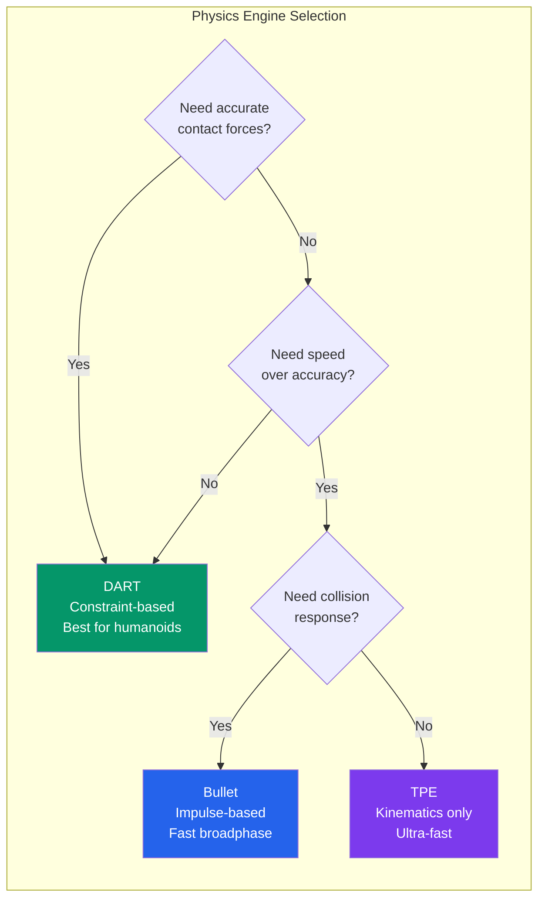
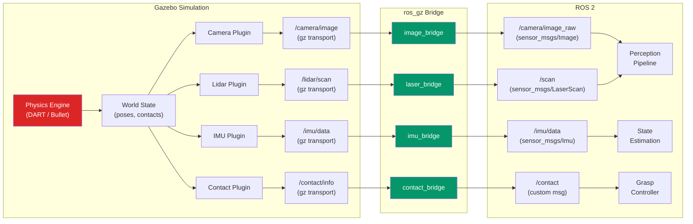

import KnowledgeCheck from '@site/src/components/KnowledgeCheck';


# Physics & Sensors

A simulation is only as useful as its fidelity. Two factors determine whether behavior learned in simulation transfers to real hardware: **physics accuracy** and **sensor realism**. In this chapter, you will learn how to configure Gazebo's physics engines for stable and realistic dynamics, and how to add simulated sensors -- cameras, lidars, IMUs, and contact sensors -- that produce data indistinguishable (to your algorithms) from real hardware.

---

## 2.1 Physics Engine Overview

Gazebo Fortress supports multiple physics engines through a plugin architecture. Each engine makes different trade-offs between speed, accuracy, and feature coverage:

| Engine | Full Name | Strengths | Best For |
|--------|-----------|-----------|----------|
| **DART** | Dynamic Animation and Robotics Toolkit | Accurate contact dynamics, constraint-based solver, joint limits | Humanoid locomotion, manipulation |
| **Bullet** | Bullet Physics | Fast broadphase, GPU acceleration, soft body support | Large scenes, deformable objects |
| **TPE** | Trivial Physics Engine | Extremely fast, no collision response | Sensor-only simulation, testing |

:::tip Recommended Engine
For humanoid robotics, **DART** is the recommended physics engine. It uses a constraint-based Lagrangian dynamics formulation that handles the complex contact scenarios in bipedal walking and dexterous manipulation better than impulse-based alternatives.
:::

### Engine Comparison



---

## 2.2 Physics Configuration in SDF

Physics parameters are defined inside the `<world>` element of your SDF file. Getting these right is critical for simulation stability.

### Core Physics Parameters

```xml title="physics_config.sdf"
<world name="humanoid_world">

  <!-- DART physics engine configuration -->
  <physics name="dart_physics" type="dart">

    <!-- Simulation time step (seconds) -->
    <!-- Smaller = more accurate but slower -->
    <max_step_size>0.001</max_step_size>

    <!-- Target ratio of sim time to wall-clock time -->
    <!-- 1.0 = real-time, 0 = as fast as possible -->
    <real_time_factor>1.0</real_time_factor>

    <!-- Physics updates per second (1 / max_step_size) -->
    <real_time_update_rate>1000</real_time_update_rate>

    <!-- DART-specific solver parameters -->
    <dart>
      <solver>
        <solver_type>dantzig</solver_type>
      </solver>
      <collision_detector>bullet</collision_detector>
    </dart>

  </physics>

  <!-- Gravity vector (m/s^2) -->
  <gravity>0 0 -9.81</gravity>

  <!-- Magnetic field (Tesla) - affects magnetometer sensors -->
  <magnetic_field>5.5645e-06 2.28758e-05 -4.23884e-05</magnetic_field>

  <!-- Atmosphere model for drag calculations -->
  <atmosphere type="adiabatic">
    <temperature>288.15</temperature>
    <pressure>101325</pressure>
  </atmosphere>

</world>
```

### Parameter Reference

| Parameter | Default | Range | Effect |
|-----------|---------|-------|--------|
| `max_step_size` | 0.001 s | 0.0001 - 0.01 | Smaller values increase accuracy but decrease simulation speed |
| `real_time_factor` | 1.0 | 0.0 - inf | Controls simulation speed relative to wall clock; 0 = unlimited |
| `real_time_update_rate` | 1000 Hz | 100 - 10000 | How many physics steps per second of wall time |
| `solver_type` (DART) | `dantzig` | dantzig, pgs | `dantzig` is more accurate; `pgs` is faster for large systems |
| `collision_detector` | `fcl` | fcl, bullet, ode | `bullet` is fastest for broadphase; `fcl` is most accurate |

:::caution Step Size and Stability
If your robot vibrates, drifts, or explodes during simulation, the most likely cause is a step size that is too large. For humanoid robots with stiff joints, start with `0.001` seconds (1 ms). If that is unstable, decrease to `0.0005` or `0.0002`. Each halving of step size doubles the simulation computational cost.
:::

### Switching to Bullet Physics

```xml
<physics name="bullet_physics" type="bullet">
  <max_step_size>0.001</max_step_size>
  <real_time_factor>1.0</real_time_factor>
  <real_time_update_rate>1000</real_time_update_rate>
  <bullet>
    <solver>
      <min_step_size>0.0001</min_step_size>
      <iters>50</iters>
      <sor>1.3</sor>
    </solver>
    <constraints>
      <cfm>0.0</cfm>
      <erp>0.2</erp>
      <contact_surface_layer>0.001</contact_surface_layer>
    </constraints>
  </bullet>
</physics>
```

| Bullet Parameter | Description | Typical Value |
|-----------------|-------------|---------------|
| `iters` | Solver iterations per step | 50 - 200 |
| `sor` | Successive Over-Relaxation factor | 1.0 - 1.5 |
| `cfm` | Constraint Force Mixing (joint softness) | 0.0 (rigid) |
| `erp` | Error Reduction Parameter (correction speed) | 0.1 - 0.8 |
| `contact_surface_layer` | Depth at which contacts are generated | 0.001 m |

---

## 2.3 Sensor Plugins Overview

Gazebo provides a rich set of sensor plugins that generate data streams matching the characteristics of real hardware. Each sensor is defined within an SDF `<link>` and produces data on Gazebo transport topics that can be bridged to ROS 2.

### Sensor Data Flow



---

## 2.4 Camera Sensor

The camera sensor renders the simulated scene from a virtual pinhole camera, producing RGB images, depth maps, or both.

### SDF Camera Definition

```xml title="camera_sensor.sdf"
<link name="camera_link">
  <pose>0.05 0 1.6 0 0 0</pose>

  <!-- Visual representation of the camera body -->
  <visual name="camera_visual">
    <geometry>
      <box><size>0.03 0.08 0.03</size></box>
    </geometry>
    <material>
      <ambient>0.1 0.1 0.1 1</ambient>
      <diffuse>0.2 0.2 0.2 1</diffuse>
    </material>
  </visual>

  <!-- Camera sensor -->
  <sensor name="head_camera" type="camera">
    <always_on>true</always_on>
    <update_rate>30</update_rate>
    <visualize>true</visualize>

    <camera name="head_cam">
      <!-- Resolution -->
      <image>
        <width>640</width>
        <height>480</height>
        <format>R8G8B8</format>
      </image>

      <!-- Clipping planes -->
      <clip>
        <near>0.1</near>
        <far>100.0</far>
      </clip>

      <!-- Camera intrinsics (horizontal FOV in radians) -->
      <horizontal_fov>1.3962634</horizontal_fov>

      <!-- Lens distortion model -->
      <distortion>
        <k1>-0.25</k1>
        <k2>0.12</k2>
        <k3>0.0</k3>
        <p1>-0.00028</p1>
        <p2>-0.00005</p2>
        <center>0.5 0.5</center>
      </distortion>

      <!-- Gaussian noise on pixel values -->
      <noise>
        <type>gaussian</type>
        <mean>0.0</mean>
        <stddev>0.007</stddev>
      </noise>
    </camera>

    <!-- Topic for Gazebo transport -->
    <topic>/head_camera/image</topic>
  </sensor>
</link>
```

### Camera Intrinsics Explained

The relationship between the horizontal field of view (FOV) and the focal length is:

$$
f_x = \frac{W}{2 \cdot \tan(\text{hfov} / 2)}
$$

For a 640x480 image with hfov = 1.3963 rad (80 degrees):

$$
f_x = \frac{640}{2 \cdot \tan(0.6981)} = \frac{640}{2 \cdot 0.8391} = 381.36 \text{ pixels}
$$

| Parameter | Symbol | Formula | Value (example) |
|-----------|--------|---------|-----------------|
| Horizontal FOV | hfov | Set directly | 80 degrees |
| Focal length X | f_x | W / (2 * tan(hfov/2)) | 381.36 px |
| Focal length Y | f_y | f_x * H / W (square pixels) | 381.36 px |
| Principal point X | c_x | W / 2 | 320 px |
| Principal point Y | c_y | H / 2 | 240 px |

### Depth Camera

Add depth sensing by using the `depth_camera` type:

```xml
<sensor name="depth_camera" type="depth_camera">
  <always_on>true</always_on>
  <update_rate>15</update_rate>
  <camera name="depth_cam">
    <image>
      <width>640</width>
      <height>480</height>
      <format>R_FLOAT32</format>
    </image>
    <clip>
      <near>0.3</near>
      <far>10.0</far>
    </clip>
    <horizontal_fov>1.2217</horizontal_fov>
    <noise>
      <type>gaussian</type>
      <mean>0.0</mean>
      <stddev>0.005</stddev>
    </noise>
  </camera>
  <topic>/depth_camera/depth</topic>
</sensor>
```

---

## 2.5 Lidar Sensor

Lidar (Light Detection and Ranging) sensors measure distances by emitting laser pulses and timing their return. In Gazebo, the lidar plugin uses ray casting against the physics world.

### SDF Lidar Definition

```xml title="lidar_sensor.sdf"
<link name="lidar_link">
  <pose>0 0 1.7 0 0 0</pose>

  <visual name="lidar_visual">
    <geometry>
      <cylinder><radius>0.03</radius><length>0.05</length></cylinder>
    </geometry>
    <material>
      <ambient>0.0 0.0 0.0 1</ambient>
      <diffuse>0.1 0.1 0.1 1</diffuse>
    </material>
  </visual>

  <!-- 2D Lidar (single scan plane) -->
  <sensor name="head_lidar" type="gpu_lidar">
    <always_on>true</always_on>
    <update_rate>10</update_rate>
    <visualize>true</visualize>

    <lidar>
      <scan>
        <horizontal>
          <!-- Number of rays per scan -->
          <samples>720</samples>
          <!-- Total angular range (radians) -->
          <min_angle>-3.14159</min_angle>
          <max_angle>3.14159</max_angle>
          <!-- Angular resolution = range / samples -->
          <resolution>1</resolution>
        </horizontal>
        <vertical>
          <!-- Single scan plane (2D lidar) -->
          <samples>1</samples>
          <min_angle>0</min_angle>
          <max_angle>0</max_angle>
        </vertical>
      </scan>

      <range>
        <!-- Minimum and maximum detection range (meters) -->
        <min>0.1</min>
        <max>30.0</max>
        <!-- Range resolution -->
        <resolution>0.01</resolution>
      </range>

      <noise>
        <type>gaussian</type>
        <mean>0.0</mean>
        <stddev>0.01</stddev>
      </noise>
    </lidar>

    <topic>/head_lidar/scan</topic>
  </sensor>
</link>
```

### 3D Lidar Configuration

For a 3D lidar (like Velodyne or Ouster), add vertical scan lines:

```xml
<scan>
  <horizontal>
    <samples>1800</samples>
    <min_angle>-3.14159</min_angle>
    <max_angle>3.14159</max_angle>
  </horizontal>
  <vertical>
    <samples>16</samples>
    <min_angle>-0.2618</min_angle>  <!-- -15 degrees -->
    <max_angle>0.2618</max_angle>   <!-- +15 degrees -->
  </vertical>
</scan>
```

### Lidar Parameter Summary

| Parameter | 2D Lidar (RPLiDAR A3) | 3D Lidar (Velodyne VLP-16) |
|-----------|----------------------|---------------------------|
| Horizontal samples | 720 | 1800 |
| Horizontal FOV | 360 degrees | 360 degrees |
| Vertical samples | 1 | 16 |
| Vertical FOV | 0 degrees | 30 degrees (+/- 15) |
| Range | 0.15 - 25 m | 0.1 - 100 m |
| Update rate | 10 Hz | 20 Hz |
| Noise stddev | 0.01 m | 0.02 m |

---

## 2.6 IMU Sensor

The Inertial Measurement Unit (IMU) measures linear acceleration and angular velocity. It is essential for state estimation, balance control, and locomotion on humanoid robots.

### SDF IMU Definition

```xml title="imu_sensor.sdf"
<link name="imu_link">
  <pose>0 0 0.9 0 0 0</pose>

  <sensor name="torso_imu" type="imu">
    <always_on>true</always_on>
    <update_rate>200</update_rate>
    <visualize>false</visualize>

    <imu>
      <!-- Angular velocity noise model -->
      <angular_velocity>
        <x>
          <noise type="gaussian">
            <mean>0.0</mean>
            <stddev>0.0002</stddev>
            <bias_mean>0.0000075</bias_mean>
            <bias_stddev>0.0000008</bias_stddev>
          </noise>
        </x>
        <y>
          <noise type="gaussian">
            <mean>0.0</mean>
            <stddev>0.0002</stddev>
            <bias_mean>0.0000075</bias_mean>
            <bias_stddev>0.0000008</bias_stddev>
          </noise>
        </y>
        <z>
          <noise type="gaussian">
            <mean>0.0</mean>
            <stddev>0.0002</stddev>
            <bias_mean>0.0000075</bias_mean>
            <bias_stddev>0.0000008</bias_stddev>
          </noise>
        </z>
      </angular_velocity>

      <!-- Linear acceleration noise model -->
      <linear_acceleration>
        <x>
          <noise type="gaussian">
            <mean>0.0</mean>
            <stddev>0.017</stddev>
            <bias_mean>0.1</bias_mean>
            <bias_stddev>0.001</bias_stddev>
          </noise>
        </x>
        <y>
          <noise type="gaussian">
            <mean>0.0</mean>
            <stddev>0.017</stddev>
            <bias_mean>0.1</bias_mean>
            <bias_stddev>0.001</bias_stddev>
          </noise>
        </y>
        <z>
          <noise type="gaussian">
            <mean>0.0</mean>
            <stddev>0.017</stddev>
            <bias_mean>0.1</bias_mean>
            <bias_stddev>0.001</bias_stddev>
          </noise>
        </z>
      </linear_acceleration>

      <!-- Enable orientation output -->
      <enable_orientation>true</enable_orientation>
    </imu>

    <topic>/torso_imu/data</topic>
  </sensor>
</link>
```

### IMU Noise Model Explained

Real IMU sensors have two main noise components:

| Noise Component | Symbol | Unit (Gyro) | Unit (Accel) | Description |
|----------------|--------|-------------|--------------|-------------|
| **White noise** (stddev) | sigma | rad/s | m/s^2 | Random noise on each reading |
| **Bias mean** | b_0 | rad/s | m/s^2 | Constant offset (calibration error) |
| **Bias drift** (bias_stddev) | sigma_b | rad/s | m/s^2 | Slow random walk of the bias over time |

:::note IMU Calibration
In production, you must calibrate the IMU to estimate and compensate for bias. Common techniques include Allan variance analysis for noise characterization and Kalman filtering for online bias estimation. In simulation, setting realistic noise parameters ensures your state estimator is tested against sensor imperfections.
:::

---

## 2.7 Contact Sensor

Contact sensors detect physical contact between links and the environment. They are critical for grasping (detecting when fingers touch an object) and locomotion (detecting foot-ground contact).

### SDF Contact Sensor Definition

```xml title="contact_sensor.sdf"
<link name="left_finger_link">
  <pose>0 0.02 0 0 0 0</pose>

  <collision name="finger_collision">
    <geometry>
      <box><size>0.02 0.01 0.06</size></box>
    </geometry>
    <surface>
      <friction>
        <ode>
          <mu>1.0</mu>
          <mu2>1.0</mu2>
        </ode>
      </friction>
      <contact>
        <ode>
          <kp>1e6</kp>
          <kd>100.0</kd>
          <max_vel>0.01</max_vel>
          <min_depth>0.001</min_depth>
        </ode>
      </contact>
    </surface>
  </collision>

  <sensor name="finger_contact" type="contact">
    <always_on>true</always_on>
    <update_rate>100</update_rate>

    <contact>
      <!-- Monitor this collision element for contacts -->
      <collision>finger_collision</collision>
    </contact>

    <topic>/left_finger/contact</topic>
  </sensor>
</link>
```

### Contact Surface Parameters

| Parameter | Description | Typical Value |
|-----------|-------------|---------------|
| `mu` / `mu2` | Friction coefficients (Coulomb model) | 0.5 - 1.5 |
| `kp` | Contact stiffness (N/m) | 1e5 - 1e8 |
| `kd` | Contact damping (Ns/m) | 10 - 1000 |
| `max_vel` | Maximum corrective velocity (m/s) | 0.01 - 0.1 |
| `min_depth` | Minimum penetration depth before contact (m) | 0.001 |

:::caution Grasp Stability
If objects slip through your gripper fingers in simulation, increase `mu` (friction) and decrease `max_vel` (corrective velocity). If the gripper bounces objects away, decrease `kp` (stiffness). Tuning contact parameters is one of the most important (and finicky) parts of manipulation simulation.
:::

---

## 2.8 ROS 2 Sensor Bridge Configuration

The `ros_gz_bridge` node translates between Gazebo transport topics and ROS 2 topics. You configure it with a YAML file specifying the topic mappings and message types.

### Bridge Configuration File

```yaml title="sensor_bridge.yaml"
# ros_gz_bridge configuration
# Format: gz_topic_name@ros_msg_type[gz_msg_type]

---
# Camera image bridge
- topic_name: /head_camera/image
  ros_type_name: sensor_msgs/msg/Image
  gz_type_name: gz.msgs.Image
  direction: GZ_TO_ROS

# Camera info (intrinsics)
- topic_name: /head_camera/camera_info
  ros_type_name: sensor_msgs/msg/CameraInfo
  gz_type_name: gz.msgs.CameraInfo
  direction: GZ_TO_ROS

# Depth camera
- topic_name: /depth_camera/depth
  ros_type_name: sensor_msgs/msg/Image
  gz_type_name: gz.msgs.Image
  direction: GZ_TO_ROS

# Lidar scan
- topic_name: /head_lidar/scan
  ros_type_name: sensor_msgs/msg/LaserScan
  gz_type_name: gz.msgs.LaserScan
  direction: GZ_TO_ROS

# 3D point cloud from lidar
- topic_name: /head_lidar/points
  ros_type_name: sensor_msgs/msg/PointCloud2
  gz_type_name: gz.msgs.PointCloudPacked
  direction: GZ_TO_ROS

# IMU data
- topic_name: /torso_imu/data
  ros_type_name: sensor_msgs/msg/Imu
  gz_type_name: gz.msgs.IMU
  direction: GZ_TO_ROS

# Joint states (Gazebo -> ROS 2)
- topic_name: /world/humanoid_world/model/humanoid/joint_state
  ros_type_name: sensor_msgs/msg/JointState
  gz_type_name: gz.msgs.Model
  direction: GZ_TO_ROS

# Joint commands (ROS 2 -> Gazebo)
- topic_name: /humanoid/cmd_vel
  ros_type_name: geometry_msgs/msg/Twist
  gz_type_name: gz.msgs.Twist
  direction: ROS_TO_GZ

# Clock synchronization
- topic_name: /clock
  ros_type_name: rosgraph_msgs/msg/Clock
  gz_type_name: gz.msgs.Clock
  direction: GZ_TO_ROS
```

### Launch the Bridge

```python title="launch/sensor_bridge.launch.py"
import os
from launch import LaunchDescription
from launch_ros.actions import Node
from ament_index_python.packages import get_package_share_directory


def generate_launch_description():
    """Launch the ros_gz_bridge with sensor topic mappings."""

    bridge_config = os.path.join(
        get_package_share_directory('my_humanoid_description'),
        'config',
        'sensor_bridge.yaml'
    )

    return LaunchDescription([
        Node(
            package='ros_gz_bridge',
            executable='parameter_bridge',
            name='sensor_bridge',
            parameters=[{
                'config_file': bridge_config,
                'qos_overrides./tf_static.publisher.durability': 'transient_local',
            }],
            output='screen',
        ),
    ])
```

---

## 2.9 Reading Sensor Data in Python

Once the bridge is running, sensor data appears as standard ROS 2 topics. Here is a complete Python node that subscribes to all four sensor types:

```python title="sensor_reader.py"
#!/usr/bin/env python3
"""
Read and process data from all simulated sensors.

Subscribes to camera, lidar, IMU, and contact sensor topics
bridged from Gazebo, and demonstrates basic data processing
for each sensor type.
"""

import rclpy
from rclpy.node import Node
from rclpy.qos import QoSProfile, ReliabilityPolicy, HistoryPolicy

from sensor_msgs.msg import Image, LaserScan, Imu, JointState
from geometry_msgs.msg import Vector3
from std_msgs.msg import Header

import numpy as np
import math
from typing import Optional


class SensorReader(Node):
    """Reads and processes data from all simulated sensors."""

    def __init__(self):
        super().__init__('sensor_reader')

        # QoS profile for sensor data (best-effort for high-rate streams)
        sensor_qos = QoSProfile(
            reliability=ReliabilityPolicy.BEST_EFFORT,
            history=HistoryPolicy.KEEP_LAST,
            depth=5,
        )

        # --- Camera subscriber ---
        self.camera_sub = self.create_subscription(
            Image,
            '/head_camera/image',
            self.camera_callback,
            sensor_qos,
        )
        self.camera_frame_count = 0

        # --- Lidar subscriber ---
        self.lidar_sub = self.create_subscription(
            LaserScan,
            '/head_lidar/scan',
            self.lidar_callback,
            sensor_qos,
        )

        # --- IMU subscriber ---
        self.imu_sub = self.create_subscription(
            Imu,
            '/torso_imu/data',
            self.imu_callback,
            sensor_qos,
        )
        self.imu_msg_count = 0

        # --- Joint state subscriber ---
        self.joint_sub = self.create_subscription(
            JointState,
            '/joint_states',
            self.joint_state_callback,
            10,
        )

        # Periodic summary log
        self.summary_timer = self.create_timer(5.0, self.log_summary)

        self.get_logger().info('SensorReader initialized. Waiting for data...')

    def camera_callback(self, msg: Image):
        """Process incoming camera image."""
        self.camera_frame_count += 1

        # Log every 30th frame (once per second at 30 fps)
        if self.camera_frame_count % 30 == 0:
            self.get_logger().info(
                f'Camera: {msg.width}x{msg.height}, '
                f'encoding={msg.encoding}, '
                f'frame #{self.camera_frame_count}'
            )

            # Convert to numpy array for processing
            if msg.encoding == 'rgb8':
                img_array = np.frombuffer(msg.data, dtype=np.uint8)
                img_array = img_array.reshape((msg.height, msg.width, 3))

                # Compute mean brightness
                brightness = np.mean(img_array)
                self.get_logger().debug(
                    f'  Mean brightness: {brightness:.1f}/255'
                )

    def lidar_callback(self, msg: LaserScan):
        """Process incoming lidar scan."""
        ranges = np.array(msg.ranges)

        # Filter out invalid readings
        valid = ranges[np.isfinite(ranges)]
        valid = valid[(valid >= msg.range_min) & (valid <= msg.range_max)]

        if len(valid) > 0:
            min_range = np.min(valid)
            min_idx = np.argmin(valid)
            min_angle = msg.angle_min + min_idx * msg.angle_increment

            self.get_logger().info(
                f'Lidar: {len(valid)}/{len(ranges)} valid rays, '
                f'closest={min_range:.2f}m at '
                f'{math.degrees(min_angle):.1f} deg'
            )

    def imu_callback(self, msg: Imu):
        """Process incoming IMU data."""
        self.imu_msg_count += 1

        # Log every 200th message (once per second at 200 Hz)
        if self.imu_msg_count % 200 == 0:
            accel = msg.linear_acceleration
            gyro = msg.angular_velocity

            # Compute total acceleration magnitude
            accel_mag = math.sqrt(
                accel.x**2 + accel.y**2 + accel.z**2
            )

            self.get_logger().info(
                f'IMU: accel=[{accel.x:.2f}, {accel.y:.2f}, {accel.z:.2f}] '
                f'(|a|={accel_mag:.2f} m/s^2), '
                f'gyro=[{gyro.x:.4f}, {gyro.y:.4f}, {gyro.z:.4f}] rad/s'
            )

            # Estimate tilt from accelerometer
            # (valid only when robot is near-stationary)
            if accel_mag > 9.0:
                roll_est = math.atan2(accel.y, accel.z)
                pitch_est = math.atan2(
                    -accel.x,
                    math.sqrt(accel.y**2 + accel.z**2)
                )
                self.get_logger().debug(
                    f'  Estimated tilt: roll={math.degrees(roll_est):.1f} deg, '
                    f'pitch={math.degrees(pitch_est):.1f} deg'
                )

    def joint_state_callback(self, msg: JointState):
        """Process incoming joint state data."""
        if len(msg.name) > 0:
            # Log the first 4 joints
            joints_info = ', '.join(
                f'{name}={pos:.3f}'
                for name, pos in zip(msg.name[:4], msg.position[:4])
            )
            self.get_logger().debug(f'Joints: [{joints_info}, ...]')

    def log_summary(self):
        """Periodically log a summary of received data."""
        self.get_logger().info(
            f'--- 5s Summary: camera_frames={self.camera_frame_count}, '
            f'imu_msgs={self.imu_msg_count} ---'
        )


def main(args=None):
    rclpy.init(args=args)
    node = SensorReader()

    try:
        rclpy.spin(node)
    except KeyboardInterrupt:
        node.get_logger().info('Shutting down SensorReader.')
    finally:
        node.destroy_node()
        rclpy.shutdown()


if __name__ == '__main__':
    main()
```

---

## 2.10 Sensor Noise Models

Realistic noise is essential for sim-to-real transfer. Without it, algorithms trained in simulation will fail on real hardware because they have never encountered sensor imperfections.

### Common Noise Types

| Noise Type | Model | Parameters | Effect |
|-----------|-------|-----------|--------|
| **Gaussian** | Normal distribution | mean, stddev | Random per-reading jitter |
| **Bias** | Constant offset | bias_mean, bias_stddev | Systematic offset (calibration error) |
| **Quantization** | Step function | resolution | Discrete value steps |
| **Dropout** | Bernoulli | probability | Missing readings |
| **Salt-and-pepper** | Uniform impulse | probability | Extreme outlier values |

### Noise Configuration Best Practices

```xml
<!-- Conservative noise for development (easy to debug) -->
<noise>
  <type>gaussian</type>
  <mean>0.0</mean>
  <stddev>0.001</stddev>
</noise>

<!-- Realistic noise for sim-to-real transfer -->
<noise>
  <type>gaussian</type>
  <mean>0.0</mean>
  <stddev>0.01</stddev>
</noise>

<!-- Aggressive noise for robustness training -->
<noise>
  <type>gaussian</type>
  <mean>0.0</mean>
  <stddev>0.05</stddev>
</noise>
```

:::tip Domain Randomization
For best sim-to-real transfer, do not use a single fixed noise level. Instead, randomize noise parameters across simulation runs. This technique, called **domain randomization**, forces the learned policy to be robust to a range of sensor characteristics. Vary stddev by +/- 50% across training episodes.
:::

---

## 2.11 Visualizing Sensor Data in RViz

Once your sensors are bridged to ROS 2, you can visualize them in RViz:

| Sensor | RViz Display Type | Topic | Notes |
|--------|------------------|-------|-------|
| Camera | Image | `/head_camera/image` | Shows raw RGB feed |
| Depth Camera | DepthCloud or PointCloud2 | `/depth_camera/depth` | 3D depth visualization |
| 2D Lidar | LaserScan | `/head_lidar/scan` | Red dots in scan plane |
| 3D Lidar | PointCloud2 | `/head_lidar/points` | Colored point cloud |
| IMU | Axes / Marker | `/torso_imu/data` | Orientation arrows |

```bash
# Launch RViz and manually add displays, or use a config file:
rviz2 -d sensor_visualization.rviz

# Useful commands while debugging sensors:
ros2 topic list                          # See all available topics
ros2 topic hz /head_camera/image         # Check camera frame rate
ros2 topic echo /torso_imu/data --once   # Print one IMU message
ros2 topic bw /head_lidar/scan           # Check bandwidth usage
```

---

## 2.12 Complete Sensor Suite: Putting It All Together

Here is a complete SDF snippet that adds a full sensor suite to a humanoid model -- head camera, torso IMU, 2D lidar for navigation, and contact sensors on both feet:

```xml title="humanoid_sensors.sdf"
<!-- Add inside the humanoid model definition -->

<!-- Head camera -->
<link name="head_camera_link">
  <pose relative_to="head">0.05 0 0.02 0 0.2618 0</pose>
  <sensor name="head_rgb" type="camera">
    <always_on>true</always_on>
    <update_rate>30</update_rate>
    <camera>
      <image><width>640</width><height>480</height><format>R8G8B8</format></image>
      <horizontal_fov>1.3963</horizontal_fov>
      <clip><near>0.1</near><far>50.0</far></clip>
      <noise><type>gaussian</type><mean>0.0</mean><stddev>0.007</stddev></noise>
    </camera>
    <topic>/head_camera/image</topic>
  </sensor>
</link>

<!-- Torso IMU -->
<link name="torso_imu_link">
  <pose relative_to="torso">0 0 0 0 0 0</pose>
  <sensor name="torso_imu" type="imu">
    <always_on>true</always_on>
    <update_rate>200</update_rate>
    <imu>
      <angular_velocity>
        <x><noise type="gaussian"><mean>0</mean><stddev>0.0002</stddev></noise></x>
        <y><noise type="gaussian"><mean>0</mean><stddev>0.0002</stddev></noise></y>
        <z><noise type="gaussian"><mean>0</mean><stddev>0.0002</stddev></noise></z>
      </angular_velocity>
      <linear_acceleration>
        <x><noise type="gaussian"><mean>0</mean><stddev>0.017</stddev></noise></x>
        <y><noise type="gaussian"><mean>0</mean><stddev>0.017</stddev></noise></y>
        <z><noise type="gaussian"><mean>0</mean><stddev>0.017</stddev></noise></z>
      </linear_acceleration>
    </imu>
    <topic>/torso_imu/data</topic>
  </sensor>
</link>

<!-- Navigation lidar (waist-mounted) -->
<link name="nav_lidar_link">
  <pose relative_to="torso">0.05 0 -0.1 0 0 0</pose>
  <sensor name="nav_lidar" type="gpu_lidar">
    <always_on>true</always_on>
    <update_rate>10</update_rate>
    <lidar>
      <scan>
        <horizontal><samples>720</samples><min_angle>-3.14159</min_angle><max_angle>3.14159</max_angle></horizontal>
      </scan>
      <range><min>0.1</min><max>25.0</max><resolution>0.01</resolution></range>
      <noise><type>gaussian</type><mean>0</mean><stddev>0.01</stddev></noise>
    </lidar>
    <topic>/nav_lidar/scan</topic>
  </sensor>
</link>

<!-- Left foot contact sensor -->
<link name="left_foot">
  <sensor name="left_foot_contact" type="contact">
    <always_on>true</always_on>
    <update_rate>100</update_rate>
    <contact>
      <collision>left_foot_collision</collision>
    </contact>
    <topic>/left_foot/contact</topic>
  </sensor>
</link>

<!-- Right foot contact sensor -->
<link name="right_foot">
  <sensor name="right_foot_contact" type="contact">
    <always_on>true</always_on>
    <update_rate>100</update_rate>
    <contact>
      <collision>right_foot_collision</collision>
    </contact>
    <topic>/right_foot/contact</topic>
  </sensor>
</link>
```

---

## 2.13 Chapter Summary

In this chapter, you learned:

- **Physics engines** -- DART, Bullet, and TPE each offer different trade-offs between accuracy and speed; DART is recommended for humanoid robotics.
- **Physics configuration** -- step size, real-time factor, solver iterations, and contact parameters are critical for simulation stability.
- **Camera sensors** -- configuring resolution, FOV, clipping planes, distortion, and noise for realistic vision simulation.
- **Lidar sensors** -- defining 2D and 3D lidar with ray counts, angular ranges, detection ranges, and Gaussian noise.
- **IMU sensors** -- modeling angular velocity and linear acceleration with white noise and bias drift.
- **Contact sensors** -- detecting physical contact for grasping and locomotion with friction and stiffness parameters.
- **ROS 2 bridge** -- mapping Gazebo transport topics to ROS 2 topics using `ros_gz_bridge` configuration.
- **Sensor data processing** -- subscribing to bridged sensor topics and performing basic processing in Python.
- **Noise models** -- the importance of realistic noise for sim-to-real transfer, and the domain randomization technique.

In the next chapter, we will explore **Unity Visualization** for creating photorealistic digital twin dashboards and advanced rendering pipelines.

---

## Exercises

1. **Physics Tuning**: Create a Gazebo world with a box sitting on a tilted plane (10 degrees). Experiment with the friction coefficients (`mu`, `mu2`) until the box stays stationary. Then increase the tilt until it slides. Record the critical angle and compare with the theoretical value `arctan(mu)`.

2. **Camera Calibration**: Add a camera sensor to a robot in Gazebo. Use the bridge to get images in ROS 2. Write a Python node that computes the camera intrinsic matrix from the SDF parameters and verifies it matches the `CameraInfo` message published by the bridge.

3. **Lidar Mapping**: Add a 2D lidar to your robot and bridge it to ROS 2. Launch RViz and add a `LaserScan` display. Drive the robot around (or move it manually) and observe the scan in real-time. Take a screenshot showing the lidar scan overlaid on the 3D world.

4. **IMU State Estimation**: Write a Python node that subscribes to the IMU topic and implements a complementary filter to estimate the robot's roll and pitch angles. Compare the filter output with the ground-truth orientation from Gazebo (available via `/tf`).

5. **Sensor Suite Integration**: Add all four sensor types (camera, lidar, IMU, contact) to a single robot model. Write a launch file that starts Gazebo, the bridge, and a sensor monitoring node. Verify in RViz that all sensor data is visible and correctly aligned with the robot model.

---

## Knowledge Check

<KnowledgeCheck
  chapterTitle="Physics & Sensors"
  questions={[
    {
      id: 1,
      question: "What does the physics engine step size (max_step_size) in Gazebo control, and what is the tradeoff?",
      options: [
        "It controls the render frame rate — smaller steps give smoother graphics",
        "It controls simulation accuracy and performance — smaller steps are more accurate but slower to compute",
        "It sets the maximum velocity any object can reach in the simulation",
        "It determines how often Gazebo saves world state to disk"
      ],
      correctIndex: 1,
      explanation: "The step size sets how much simulation time advances per physics iteration. Smaller steps (e.g., 0.001s) give more accurate physics for fast dynamics like contact forces, but require more CPU. Larger steps are faster but can cause instability with stiff joints or high-speed collisions.",
      sectionRef: "#physics-engine-configuration",
      sectionLabel: "Physics Engine Configuration"
    },
    {
      id: 2,
      question: "What is the primary difference between a camera sensor plugin outputting to Gazebo transport and one that outputs to ROS 2 topics directly?",
      options: [
        "Direct ROS 2 output is deprecated; Gazebo transport is the only correct approach",
        "Gazebo transport keeps the simulator decoupled from ROS 2; a bridge translates selectively — better for performance when not all data is needed in ROS 2",
        "Direct ROS 2 output compresses images automatically; Gazebo transport does not",
        "There is no meaningful difference — they produce identical results"
      ],
      correctIndex: 1,
      explanation: "Publishing to Gazebo transport and then bridging only required topics to ROS 2 reduces overhead. Not all sensor data needs to cross the bridge — only what ROS 2 nodes consume. This decoupling also makes the simulation easier to run without a full ROS 2 stack.",
      sectionRef: "#sensor-plugins",
      sectionLabel: "Sensor Plugins"
    },
    {
      id: 3,
      question: "In simulated lidar data (sensor_msgs/LaserScan), what do `range_min` and `range_max` values represent?",
      options: [
        "The minimum and maximum angular resolution of the lidar",
        "The minimum and maximum valid detection distances — readings outside this range are set to inf or nan",
        "The minimum and maximum scan frequency in Hz",
        "The signal strength thresholds for filtering noise"
      ],
      correctIndex: 1,
      explanation: "range_min and range_max define the valid measurement window. Points closer than range_min or farther than range_max are reported as inf (no detection). This matches real lidar behavior and is important for filtering in algorithms like slam_toolbox or nav2 costmaps.",
      sectionRef: "#lidar-sensor-simulation",
      sectionLabel: "Lidar Sensor Simulation"
    },
    {
      id: 4,
      question: "What type of data does a simulated IMU (Inertial Measurement Unit) publish in ROS 2?",
      options: [
        "GPS coordinates and altitude",
        "Linear acceleration (m/s²) and angular velocity (rad/s) with optional orientation estimate as a quaternion",
        "Joint torques and contact forces",
        "Barometric pressure and temperature"
      ],
      correctIndex: 1,
      explanation: "A simulated IMU publishes sensor_msgs/Imu messages containing linear acceleration (from accelerometer), angular velocity (from gyroscope), and optionally an orientation estimate (from fusion). Gaussian noise parameters in the SDF model simulate real IMU measurement noise.",
      sectionRef: "#imu-sensor-simulation",
      sectionLabel: "IMU Sensor Simulation"
    },
    {
      id: 5,
      question: "Why is adding Gaussian noise to simulated sensors important for robot development?",
      options: [
        "Noise makes simulation more visually realistic for demos",
        "Simulated noise forces algorithms to be robust to real-world sensor imperfections, making sim-to-real transfer more successful",
        "Noise reduces simulation performance so developers learn to optimize their code",
        "Gaussian noise is required by the ROS 2 sensor message format specification"
      ],
      correctIndex: 1,
      explanation: "Real sensors always have noise. Algorithms trained on perfect simulated data often fail on real hardware. Adding realistic Gaussian noise to simulated sensors during development forces engineers to build robust filtering and estimation algorithms that transfer successfully to real robots.",
      sectionRef: "#sensor-noise-modeling",
      sectionLabel: "Sensor Noise Modeling"
    }
  ]}
/>
