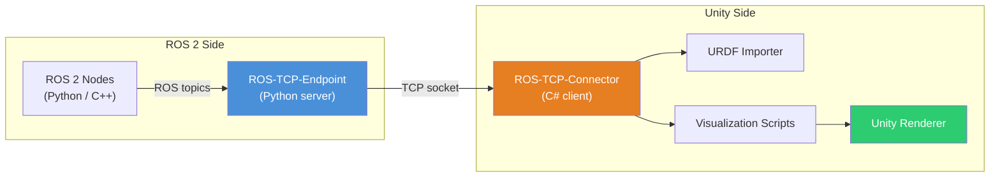
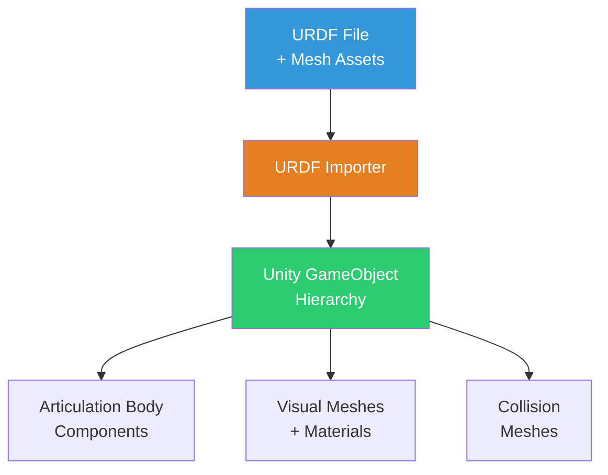
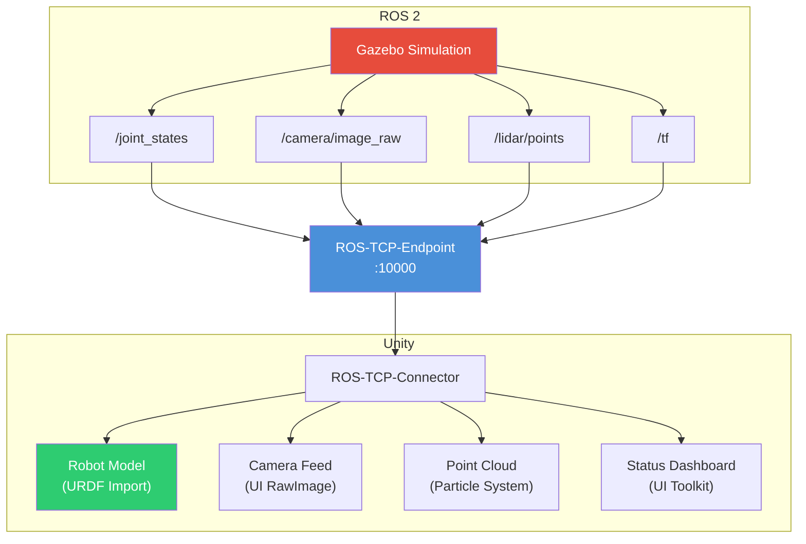

# Unity Visualization

While Gazebo excels at physics simulation, **Unity** offers superior rendering quality, cross-platform deployment, and a mature asset ecosystem. In this chapter, we connect Unity to ROS 2 for real-time 3D visualization of robot state, sensor data, and environment models — creating rich visual interfaces that go beyond what Gazebo's built-in viewer can achieve.

---

## 3.1 Why Unity for Robotics?

| Capability | Gazebo | Unity |
|---|---|---|
| Physics simulation | Excellent (ODE, Bullet, DART) | Good (PhysX) |
| Visual rendering | Functional | Photorealistic (HDRP) |
| Cross-platform builds | Linux-focused | Windows, macOS, Linux, WebGL |
| Asset marketplace | Limited | Thousands of 3D models |
| VR/AR support | Minimal | Native XR toolkit |
| Custom UI overlays | Basic | Full UI toolkit (UGUI, UI Toolkit) |
| Learning curve | Moderate | Moderate (C# scripting) |

Unity is not replacing Gazebo — it complements it. A typical workflow uses Gazebo for physics-accurate simulation and Unity for visualization dashboards, digital twin interfaces, or training data generation with photorealistic rendering.

---

## 3.2 Architecture Overview



The **ROS-TCP-Endpoint** runs as a ROS 2 node, bridging ROS topics to a TCP socket. The **ROS-TCP-Connector** Unity package connects to this socket, enabling bidirectional message passing.

---

## 3.3 Setting Up Unity Robotics Hub

### Prerequisites

- Unity 2021.3 LTS or newer (2022.3 LTS recommended)
- ROS 2 Humble or Iron installed
- Python 3.10+

### Step 1: Install ROS-TCP-Endpoint (ROS 2 side)

```bash
cd ~/ros2_ws/src
git clone -b main https://github.com/Unity-Technologies/ROS-TCP-Endpoint.git
cd ~/ros2_ws
colcon build --packages-select ros_tcp_endpoint
source install/setup.bash
```

### Step 2: Install Unity Packages (Unity side)

In Unity, open **Window > Package Manager > Add package from git URL** and add:

```
https://github.com/Unity-Technologies/ROS-TCP-Connector.git?path=/com.unity.robotics.ros-tcp-connector
```

Then add the URDF Importer:

```
https://github.com/Unity-Technologies/URDF-Importer.git?path=/com.unity.robotics.urdf-importer
```

### Step 3: Configure the Connection

In Unity, go to **Robotics > ROS Settings** and set:

```
ROS IP Address: 127.0.0.1
ROS Port: 10000
Protocol: ROS2
```

Start the endpoint on the ROS 2 side:

```bash
ros2 run ros_tcp_endpoint default_server_endpoint --ros-args \
    -p ROS_IP:=0.0.0.0 -p ROS_PORT:=10000
```

---

## 3.4 Importing URDF Models

The URDF Importer converts robot descriptions into Unity GameObjects with correct joint hierarchies and visual meshes.

### Import Process

1. Copy your URDF file and mesh assets into `Assets/URDF/` in the Unity project
2. Right-click the `.urdf` file in the Project window
3. Select **Import Robot from URDF**
4. Configure import settings:

| Setting | Recommended Value |
|---|---|
| Mesh Decomposer | VHACD |
| Convex Decomposition | Enable for collision meshes |
| Joint Control | Position |
| Axis Type | Y-axis up (Unity convention) |



:::note Coordinate Frame Differences
ROS uses a right-handed coordinate system (X-forward, Y-left, Z-up). Unity uses a left-handed system (X-right, Y-up, Z-forward). The URDF Importer handles this conversion automatically, but custom scripts must account for it when subscribing to ROS pose data.
:::

---

## 3.5 Subscribing to ROS 2 Topics in Unity

The ROS-TCP-Connector provides C# APIs for subscribing to and publishing ROS topics.

### Subscribing to Joint States

```csharp
using UnityEngine;
using Unity.Robotics.ROSTCPConnector;
using RosMessageTypes.Sensor;

public class JointStateSubscriber : MonoBehaviour
{
    [SerializeField] private string topicName = "/joint_states";
    private ArticulationBody[] joints;

    void Start()
    {
        // Find all articulation joints in the robot hierarchy
        joints = GetComponentsInChildren<ArticulationBody>();

        // Register subscriber
        ROSConnection.GetOrCreateInstance()
            .Subscribe<JointStateMsg>(topicName, OnJointStateReceived);
    }

    void OnJointStateReceived(JointStateMsg msg)
    {
        for (int i = 0; i < msg.position.Length && i < joints.Length; i++)
        {
            var drive = joints[i].xDrive;
            drive.target = (float)(msg.position[i] * Mathf.Rad2Deg);
            joints[i].xDrive = drive;
        }
    }
}
```

### Subscribing to Camera Images

```csharp
using UnityEngine;
using UnityEngine.UI;
using Unity.Robotics.ROSTCPConnector;
using RosMessageTypes.Sensor;

public class CameraImageSubscriber : MonoBehaviour
{
    [SerializeField] private RawImage displayImage;
    [SerializeField] private string topicName = "/camera/image_raw";
    private Texture2D texture;

    void Start()
    {
        ROSConnection.GetOrCreateInstance()
            .Subscribe<CompressedImageMsg>(topicName, OnImageReceived);
    }

    void OnImageReceived(CompressedImageMsg msg)
    {
        if (texture == null)
            texture = new Texture2D(2, 2);

        texture.LoadImage(msg.data);
        displayImage.texture = texture;
    }
}
```

---

## 3.6 Publishing from Unity to ROS 2

Unity can also send data back to ROS 2 — for example, user inputs from a VR controller or GUI commands.

```csharp
using UnityEngine;
using Unity.Robotics.ROSTCPConnector;
using RosMessageTypes.Geometry;

public class TwistPublisher : MonoBehaviour
{
    [SerializeField] private string topicName = "/cmd_vel";
    [SerializeField] private float linearSpeed = 0.5f;
    [SerializeField] private float angularSpeed = 1.0f;

    private ROSConnection ros;

    void Start()
    {
        ros = ROSConnection.GetOrCreateInstance();
        ros.RegisterPublisher<TwistMsg>(topicName);
    }

    void Update()
    {
        var twist = new TwistMsg();
        twist.linear.x = Input.GetAxis("Vertical") * linearSpeed;
        twist.angular.z = -Input.GetAxis("Horizontal") * angularSpeed;

        ros.Publish(topicName, twist);
    }
}
```

---

## 3.7 Visualizing Sensor Data

### Point Cloud Visualization

LiDAR point clouds can be rendered in Unity using a particle system or custom mesh:

```csharp
using UnityEngine;
using Unity.Robotics.ROSTCPConnector;
using RosMessageTypes.Sensor;

public class PointCloudVisualizer : MonoBehaviour
{
    [SerializeField] private string topicName = "/lidar/points";
    [SerializeField] private Material pointMaterial;
    [SerializeField] private float pointSize = 0.02f;

    private ParticleSystem particles;
    private ParticleSystem.Particle[] points;

    void Start()
    {
        particles = GetComponent<ParticleSystem>();
        ROSConnection.GetOrCreateInstance()
            .Subscribe<PointCloud2Msg>(topicName, OnPointCloudReceived);
    }

    void OnPointCloudReceived(PointCloud2Msg msg)
    {
        int pointCount = (int)(msg.width * msg.height);
        points = new ParticleSystem.Particle[pointCount];

        int stride = (int)msg.point_step;
        for (int i = 0; i < pointCount; i++)
        {
            int offset = i * stride;
            float x = System.BitConverter.ToSingle(msg.data, offset);
            float y = System.BitConverter.ToSingle(msg.data, offset + 4);
            float z = System.BitConverter.ToSingle(msg.data, offset + 8);

            // Convert ROS (X-forward, Z-up) to Unity (Z-forward, Y-up)
            points[i].position = new Vector3(x, z, y);
            points[i].startSize = pointSize;
            points[i].startColor = Color.green;
        }

        particles.SetParticles(points, pointCount);
    }
}
```

---

## 3.8 Building a Complete Visualization Pipeline



### Performance Tips

| Optimization | Impact |
|---|---|
| Reduce topic publish rate to 10-30 Hz | Lower CPU/network load |
| Use compressed images | 5-10x bandwidth reduction |
| Limit point cloud to 10K points | Smooth rendering |
| Use `LOD Group` for robot meshes | Better frame rate at distance |
| Run Unity in headless mode for CI | No GPU needed for testing |

---

## 3.9 Chapter Summary

In this chapter, you learned:

- **Why Unity complements Gazebo** — superior rendering, cross-platform builds, and a rich asset ecosystem
- **ROS-TCP architecture** — the Endpoint (ROS 2 side) and Connector (Unity side) bridge messages over TCP sockets
- **URDF import** — converting robot descriptions into Unity GameObjects with correct joint hierarchies
- **Topic subscription** — receiving joint states, camera images, and point clouds in Unity C# scripts
- **Topic publishing** — sending commands from Unity back to ROS 2
- **Sensor visualization** — rendering point clouds, camera feeds, and robot state in real time
- **Pipeline design** — composing a full visualization dashboard connecting Gazebo simulation to Unity rendering

In the next chapter, we build an end-to-end **Digital Twin Pipeline** that combines simulation, visualization, and real robot feedback.

---

## Exercises

1. **URDF Import**: Import a humanoid robot URDF into Unity. Verify that all joints are correctly mapped and the robot renders in the correct pose.

2. **Joint State Visualization**: Subscribe to `/joint_states` from a Gazebo simulation and animate the Unity robot model in real time. Verify joint angles match.

3. **Camera Feed Dashboard**: Create a Unity UI panel that displays live camera feeds from two simulated cameras side-by-side.

4. **Bidirectional Control**: Build a Unity UI with a virtual joystick that publishes `/cmd_vel` to ROS 2, controlling a simulated robot in Gazebo while visualizing its movement in Unity.
