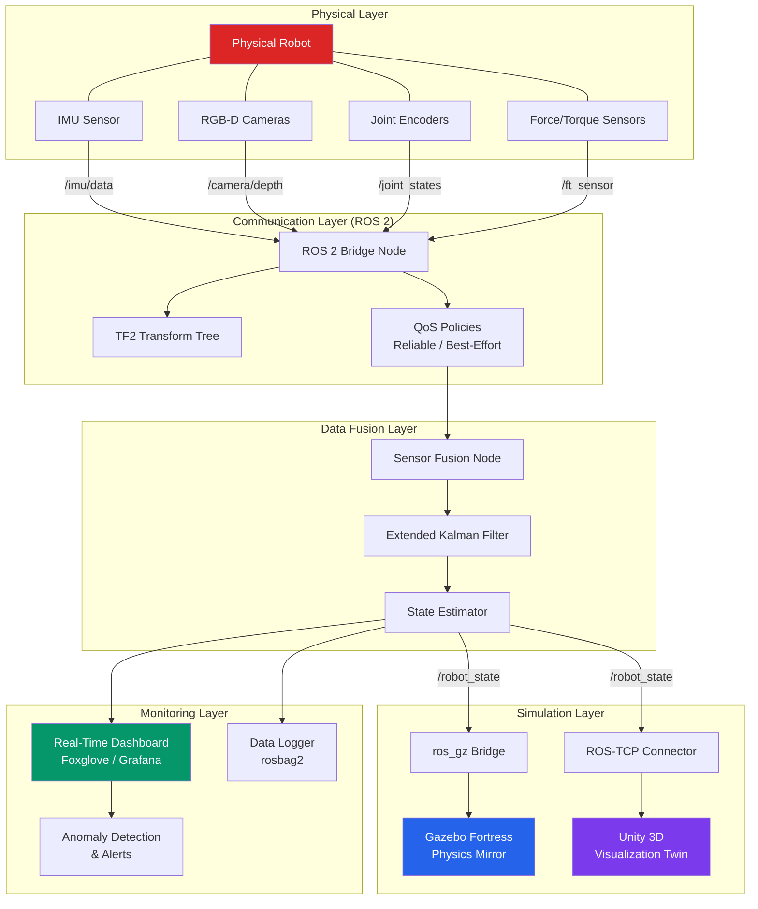
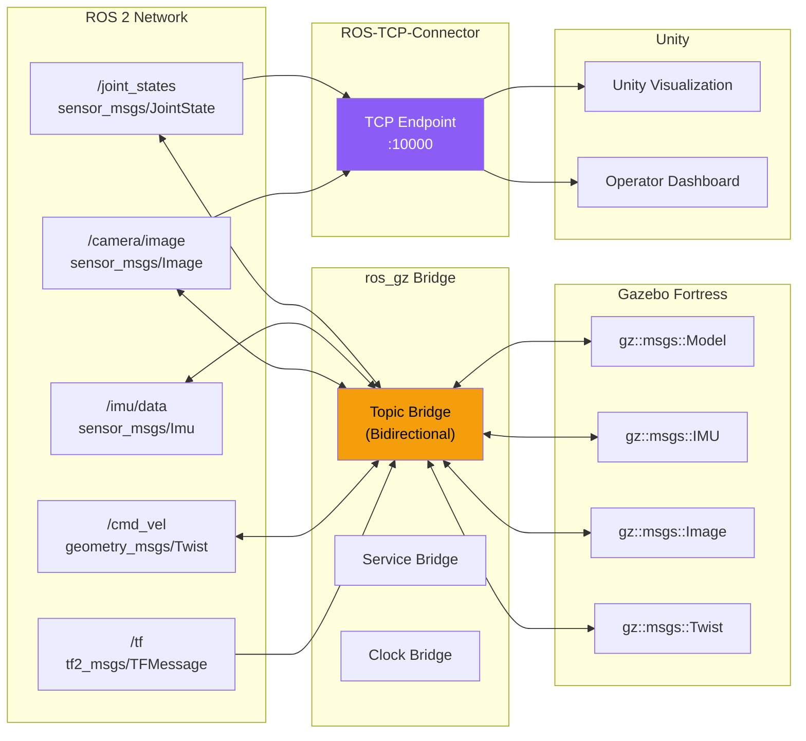
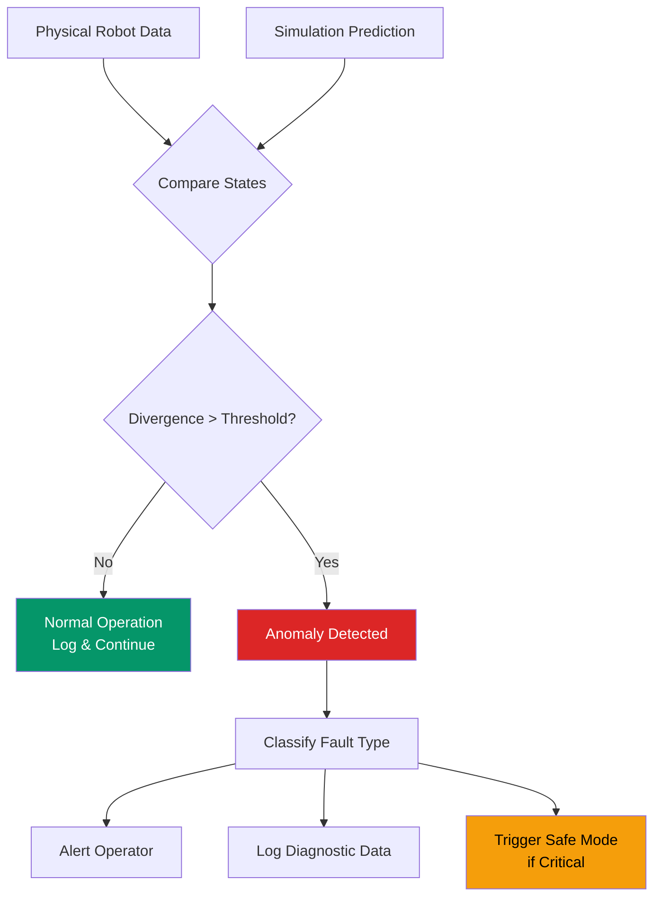

import KnowledgeCheck from '@site/src/components/KnowledgeCheck';


# Digital Twin Pipeline

A **digital twin** is a live, synchronized virtual replica of a physical system. In humanoid robotics, a digital twin mirrors every joint angle, sensor reading, and environmental interaction of a real robot inside a simulation environment. This chapter walks you through building an end-to-end digital twin pipeline that connects a physical robot to its simulated counterpart using ROS 2, Gazebo, and Unity.

---

## 4.1 What Is a Digital Twin?

The concept of a digital twin originated in manufacturing and aerospace engineering. NASA used early digital twin prototypes to model spacecraft systems during the Apollo program. Today, the concept has matured into a core enabler for Physical AI.

A digital twin is more than a static 3D model. It is a **living, data-driven replica** that:

- Receives real-time data from the physical system.
- Mirrors the physical system's state with minimal latency.
- Enables predictive analysis, fault detection, and what-if scenarios.
- Can run faster than real time for planning and optimization.

| Aspect | Static Model | Digital Twin |
|---|---|---|
| Data connection | None | Real-time bidirectional |
| State fidelity | Snapshot at design time | Continuously synchronized |
| Predictive capability | None | Physics-based forecasting |
| Interaction | View only | Command, test, replay |
| Update frequency | Manual | Automatic (10-1000 Hz) |

:::tip Why Digital Twins Matter for Humanoid Robots
Humanoid robots operate in unstructured environments where failures can be costly or dangerous. A digital twin lets you detect anomalies (a joint drifting out of calibration), rehearse recovery behaviors (what happens if the robot trips), and validate software updates -- all without risking the physical hardware.
:::

---

## 4.2 Digital Twin Architecture Overview

A complete digital twin pipeline consists of five layers:

1. **Physical Layer** -- The real robot with its sensors and actuators.
2. **Communication Layer** -- ROS 2 middleware transporting data between physical and virtual.
3. **Data Fusion Layer** -- Combining multiple sensor streams into a coherent state estimate.
4. **Simulation Layer** -- Gazebo and/or Unity rendering the virtual replica.
5. **Monitoring Layer** -- Dashboards and alerting systems for human operators.



---

## 4.3 Data Flow: Physical Robot to Simulation Mirror

The data flow in a digital twin pipeline follows a unidirectional primary path (physical to virtual) with an optional reverse path for sending commands back to the physical robot.

### Forward Path (Sensing)

```
Physical Robot --> Sensor Drivers --> ROS 2 Topics --> Sensor Fusion --> State Estimate --> Simulation
```

### Reverse Path (Commanding)

```
Simulation --> Planned Trajectory --> ROS 2 Action --> Motion Controller --> Physical Robot
```

### Key ROS 2 Topics in the Pipeline

| Topic | Message Type | Direction | Frequency |
|---|---|---|---|
| `/joint_states` | `sensor_msgs/JointState` | Robot to Twin | 100-500 Hz |
| `/imu/data` | `sensor_msgs/Imu` | Robot to Twin | 200-1000 Hz |
| `/camera/color/image_raw` | `sensor_msgs/Image` | Robot to Twin | 30 Hz |
| `/camera/depth/image_raw` | `sensor_msgs/Image` | Robot to Twin | 30 Hz |
| `/ft_sensor/wrench` | `geometry_msgs/WrenchStamped` | Robot to Twin | 500 Hz |
| `/robot_state` | `custom_msgs/RobotState` | Fusion to Twin | 100 Hz |
| `/tf` | `tf2_msgs/TFMessage` | Bidirectional | 100 Hz |
| `/twin/command` | `trajectory_msgs/JointTrajectory` | Twin to Robot | On demand |

:::note Topic Naming Conventions
In production digital twin deployments, prefix physical robot topics with `/physical/` and simulation topics with `/sim/` to prevent accidental cross-talk. Use ROS 2 namespace remapping to achieve this cleanly.
:::

---

## 4.4 Sensor Fusion for State Estimation

Raw sensor data is noisy and arrives at different rates. A sensor fusion node combines IMU, encoder, and force/torque data into a single coherent state estimate using an **Extended Kalman Filter (EKF)**.

```python title="sensor_fusion_node.py"
#!/usr/bin/env python3
"""
Sensor Fusion Node for Digital Twin Pipeline.

Combines IMU, joint encoder, and force/torque sensor data
into a unified robot state estimate using an EKF.
"""

import numpy as np
import rclpy
from rclpy.node import Node
from rclpy.qos import QoSProfile, ReliabilityPolicy, HistoryPolicy
from sensor_msgs.msg import Imu, JointState
from geometry_msgs.msg import WrenchStamped, PoseStamped, TransformStamped
from std_msgs.msg import Header
from tf2_ros import TransformBroadcaster


class SensorFusionNode(Node):
    """
    Fuses multiple sensor streams into a coherent state estimate.

    Subscribes to:
        /imu/data (sensor_msgs/Imu)
        /joint_states (sensor_msgs/JointState)
        /ft_sensor/wrench (geometry_msgs/WrenchStamped)

    Publishes:
        /robot_state/pose (geometry_msgs/PoseStamped)
        /robot_state/joints (sensor_msgs/JointState)
    """

    def __init__(self):
        super().__init__('sensor_fusion_node')

        # Declare parameters
        self.declare_parameter('publish_rate', 100.0)
        self.declare_parameter('imu_weight', 0.7)
        self.declare_parameter('encoder_weight', 0.3)

        publish_rate = self.get_parameter('publish_rate').value
        self.imu_weight = self.get_parameter('imu_weight').value
        self.encoder_weight = self.get_parameter('encoder_weight').value

        # QoS profile for sensor data (best effort for high-rate streams)
        sensor_qos = QoSProfile(
            reliability=ReliabilityPolicy.BEST_EFFORT,
            history=HistoryPolicy.KEEP_LAST,
            depth=10,
        )

        # QoS profile for state output (reliable for twin synchronization)
        state_qos = QoSProfile(
            reliability=ReliabilityPolicy.RELIABLE,
            history=HistoryPolicy.KEEP_LAST,
            depth=10,
        )

        # --- Subscribers ---
        self.imu_sub = self.create_subscription(
            Imu, '/imu/data', self.imu_callback, sensor_qos
        )
        self.joint_sub = self.create_subscription(
            JointState, '/joint_states', self.joint_callback, sensor_qos
        )
        self.ft_sub = self.create_subscription(
            WrenchStamped, '/ft_sensor/wrench', self.ft_callback, sensor_qos
        )

        # --- Publishers ---
        self.pose_pub = self.create_publisher(
            PoseStamped, '/robot_state/pose', state_qos
        )
        self.joint_pub = self.create_publisher(
            JointState, '/robot_state/joints', state_qos
        )

        # TF broadcaster for the fused base_link pose
        self.tf_broadcaster = TransformBroadcaster(self)

        # --- EKF State ---
        # State vector: [x, y, z, roll, pitch, yaw, vx, vy, vz]
        self.state = np.zeros(9)
        self.covariance = np.eye(9) * 0.1

        # Process noise (tuned for humanoid walking)
        self.Q = np.diag([
            0.01, 0.01, 0.01,   # position noise
            0.005, 0.005, 0.005, # orientation noise
            0.1, 0.1, 0.1,      # velocity noise
        ])

        # Measurement noise for IMU
        self.R_imu = np.diag([0.02, 0.02, 0.02, 0.01, 0.01, 0.01])

        # Latest sensor data storage
        self.latest_imu = None
        self.latest_joints = None
        self.latest_ft = None

        # Timer for periodic state publication
        self.timer = self.create_timer(
            1.0 / publish_rate, self.publish_fused_state
        )

        self.get_logger().info(
            f'Sensor Fusion Node initialized at {publish_rate} Hz'
        )

    def imu_callback(self, msg: Imu):
        """Process incoming IMU data."""
        self.latest_imu = msg
        self._ekf_predict(msg)

    def joint_callback(self, msg: JointState):
        """Store latest joint state data."""
        self.latest_joints = msg

    def ft_callback(self, msg: WrenchStamped):
        """Store latest force/torque data for contact detection."""
        self.latest_ft = msg

    def _ekf_predict(self, imu_msg: Imu):
        """
        EKF prediction step using IMU accelerations and angular velocities.

        Updates the state estimate based on the motion model.
        """
        dt = 0.005  # Approximate IMU period (200 Hz)

        # Extract linear acceleration (body frame)
        ax = imu_msg.linear_acceleration.x
        ay = imu_msg.linear_acceleration.y
        az = imu_msg.linear_acceleration.z - 9.81  # Remove gravity

        # Extract angular velocity
        wx = imu_msg.angular_velocity.x
        wy = imu_msg.angular_velocity.y
        wz = imu_msg.angular_velocity.z

        # Simple motion model: integrate accelerations and angular velocities
        # Position update: p += v * dt + 0.5 * a * dt^2
        self.state[0] += self.state[6] * dt + 0.5 * ax * dt**2
        self.state[1] += self.state[7] * dt + 0.5 * ay * dt**2
        self.state[2] += self.state[8] * dt + 0.5 * az * dt**2

        # Orientation update: theta += omega * dt
        self.state[3] += wx * dt  # roll
        self.state[4] += wy * dt  # pitch
        self.state[5] += wz * dt  # yaw

        # Velocity update: v += a * dt
        self.state[6] += ax * dt
        self.state[7] += ay * dt
        self.state[8] += az * dt

        # Covariance prediction
        self.covariance += self.Q * dt

    def publish_fused_state(self):
        """Publish the fused state estimate as a PoseStamped and TF."""
        now = self.get_clock().now().to_msg()

        # --- Publish PoseStamped ---
        pose_msg = PoseStamped()
        pose_msg.header = Header(stamp=now, frame_id='odom')
        pose_msg.pose.position.x = float(self.state[0])
        pose_msg.pose.position.y = float(self.state[1])
        pose_msg.pose.position.z = float(self.state[2])

        # Convert Euler angles to quaternion (simplified)
        roll, pitch, yaw = self.state[3], self.state[4], self.state[5]
        cy, sy = np.cos(yaw / 2), np.sin(yaw / 2)
        cp, sp = np.cos(pitch / 2), np.sin(pitch / 2)
        cr, sr = np.cos(roll / 2), np.sin(roll / 2)

        pose_msg.pose.orientation.w = cr * cp * cy + sr * sp * sy
        pose_msg.pose.orientation.x = sr * cp * cy - cr * sp * sy
        pose_msg.pose.orientation.y = cr * sp * cy + sr * cp * sy
        pose_msg.pose.orientation.z = cr * cp * sy - sr * sp * cy

        self.pose_pub.publish(pose_msg)

        # --- Broadcast TF ---
        t = TransformStamped()
        t.header = Header(stamp=now, frame_id='odom')
        t.child_frame_id = 'base_link_fused'
        t.transform.translation.x = float(self.state[0])
        t.transform.translation.y = float(self.state[1])
        t.transform.translation.z = float(self.state[2])
        t.transform.rotation = pose_msg.pose.orientation
        self.tf_broadcaster.sendTransform(t)

        # --- Forward joint states ---
        if self.latest_joints is not None:
            fused_joints = JointState()
            fused_joints.header = Header(stamp=now, frame_id='')
            fused_joints.name = list(self.latest_joints.name)
            fused_joints.position = list(self.latest_joints.position)
            fused_joints.velocity = list(self.latest_joints.velocity)
            fused_joints.effort = list(self.latest_joints.effort)
            self.joint_pub.publish(fused_joints)


def main(args=None):
    rclpy.init(args=args)
    node = SensorFusionNode()
    try:
        rclpy.spin(node)
    except KeyboardInterrupt:
        node.get_logger().info('Sensor Fusion Node shutting down.')
    finally:
        node.destroy_node()
        rclpy.shutdown()


if __name__ == '__main__':
    main()
```

:::caution EKF Tuning
The process noise (`Q`) and measurement noise (`R`) matrices shown above are starting values. You must tune these for your specific robot and sensor suite. Poor tuning leads to state drift, which causes the digital twin to diverge from the physical robot. Use `rosbag2` recordings of real sensor data to validate your filter offline before deploying live.
:::

---

## 4.5 State Synchronization

State synchronization ensures the simulation mirror accurately reflects the physical robot at all times. There are two primary synchronization strategies:

### Strategy 1: Joint-Level Synchronization

Send joint positions from the physical robot to the simulation. The simulation applies these positions directly to the virtual robot's joints, bypassing its own physics engine for those joints.

**Pros:** Simple, accurate joint tracking.
**Cons:** No physics interaction in simulation; collisions are not realistic.

### Strategy 2: Command-Level Synchronization

Send the same control commands to both the physical robot and the simulation. Both run their own dynamics independently.

**Pros:** Full physics simulation; realistic collision and contact modeling.
**Cons:** State divergence over time due to modeling errors.

### Hybrid Approach (Recommended)

Use command-level synchronization as the primary mode, with periodic joint-level corrections to prevent drift. This gives you realistic physics while maintaining fidelity.

```python title="state_sync_node.py"
#!/usr/bin/env python3
"""
State Synchronization Node for Digital Twin Pipeline.

Synchronizes the physical robot's state with the Gazebo simulation
using a hybrid approach: command-level sync with periodic corrections.
"""

import rclpy
from rclpy.node import Node
from rclpy.qos import QoSProfile, ReliabilityPolicy, HistoryPolicy
from sensor_msgs.msg import JointState
from std_msgs.msg import Float64MultiArray
from builtin_interfaces.msg import Duration


class StateSyncNode(Node):
    """
    Synchronizes physical robot state with the digital twin.

    Subscribes to:
        /robot_state/joints (sensor_msgs/JointState) -- fused joint state
        /sim/joint_states (sensor_msgs/JointState) -- simulation joint state

    Publishes:
        /sim/joint_commands (std_msgs/Float64MultiArray) -- correction commands
    """

    def __init__(self):
        super().__init__('state_sync_node')

        # --- Parameters ---
        self.declare_parameter('correction_threshold_rad', 0.05)
        self.declare_parameter('correction_gain', 0.8)
        self.declare_parameter('sync_rate_hz', 50.0)
        self.declare_parameter('max_correction_velocity', 1.0)

        self.threshold = self.get_parameter('correction_threshold_rad').value
        self.gain = self.get_parameter('correction_gain').value
        self.max_vel = self.get_parameter('max_correction_velocity').value
        sync_rate = self.get_parameter('sync_rate_hz').value

        # QoS profiles
        reliable_qos = QoSProfile(
            reliability=ReliabilityPolicy.RELIABLE,
            history=HistoryPolicy.KEEP_LAST,
            depth=10,
        )

        # --- Subscribers ---
        self.physical_sub = self.create_subscription(
            JointState,
            '/robot_state/joints',
            self.physical_state_callback,
            reliable_qos,
        )
        self.sim_sub = self.create_subscription(
            JointState,
            '/sim/joint_states',
            self.sim_state_callback,
            reliable_qos,
        )

        # --- Publisher ---
        self.cmd_pub = self.create_publisher(
            Float64MultiArray,
            '/sim/joint_commands',
            reliable_qos,
        )

        # State storage
        self.physical_joints = {}
        self.sim_joints = {}

        # Divergence metrics
        self.max_divergence = 0.0
        self.total_corrections = 0

        # Periodic sync timer
        self.sync_timer = self.create_timer(
            1.0 / sync_rate, self.synchronize
        )

        # Metrics logging timer (every 5 seconds)
        self.metrics_timer = self.create_timer(5.0, self.log_metrics)

        self.get_logger().info(
            f'State Sync Node initialized: threshold={self.threshold} rad, '
            f'gain={self.gain}, rate={sync_rate} Hz'
        )

    def physical_state_callback(self, msg: JointState):
        """Store the latest physical robot joint positions."""
        for name, position in zip(msg.name, msg.position):
            self.physical_joints[name] = position

    def sim_state_callback(self, msg: JointState):
        """Store the latest simulation joint positions."""
        for name, position in zip(msg.name, msg.position):
            self.sim_joints[name] = position

    def synchronize(self):
        """
        Compare physical and simulated joint states.
        Apply corrections when divergence exceeds the threshold.
        """
        if not self.physical_joints or not self.sim_joints:
            return

        corrections = []
        joint_names = []

        for joint_name, physical_pos in self.physical_joints.items():
            if joint_name not in self.sim_joints:
                continue

            sim_pos = self.sim_joints[joint_name]
            error = physical_pos - sim_pos

            # Track maximum divergence
            abs_error = abs(error)
            if abs_error > self.max_divergence:
                self.max_divergence = abs_error

            # Apply correction if error exceeds threshold
            if abs_error > self.threshold:
                correction = self.gain * error
                # Clamp correction velocity
                correction = max(-self.max_vel, min(self.max_vel, correction))
                corrections.append(correction)
                joint_names.append(joint_name)
                self.total_corrections += 1

        # Publish corrections if any
        if corrections:
            cmd_msg = Float64MultiArray()
            cmd_msg.data = corrections
            self.cmd_pub.publish(cmd_msg)

            self.get_logger().debug(
                f'Applied corrections to {len(corrections)} joints'
            )

    def log_metrics(self):
        """Log synchronization metrics periodically."""
        num_tracked = len(
            set(self.physical_joints.keys()) & set(self.sim_joints.keys())
        )
        self.get_logger().info(
            f'Sync metrics: tracked_joints={num_tracked}, '
            f'max_divergence={self.max_divergence:.4f} rad, '
            f'total_corrections={self.total_corrections}'
        )
        # Reset max divergence for next reporting window
        self.max_divergence = 0.0


def main(args=None):
    rclpy.init(args=args)
    node = StateSyncNode()
    try:
        rclpy.spin(node)
    except KeyboardInterrupt:
        node.get_logger().info('State Sync Node shutting down.')
    finally:
        node.destroy_node()
        rclpy.shutdown()


if __name__ == '__main__':
    main()
```

---

## 4.6 ROS 2 Bridge Topology

The digital twin pipeline requires bridging data between ROS 2 and the simulation environments. The `ros_gz` bridge handles Gazebo, while the `ROS-TCP-Connector` handles Unity.

### Bridge Architecture



### Configuring the ros_gz Bridge

The `ros_gz` bridge maps ROS 2 topics to Gazebo transport topics. Here is a configuration for the digital twin pipeline:

```yaml title="config/bridge_config.yaml"
# ros_gz bridge configuration for digital twin pipeline
# Maps ROS 2 topics <-> Gazebo transport topics

- ros_topic_name: "/joint_states"
  gz_topic_name: "/world/twin_world/model/humanoid/joint_state"
  ros_type_name: "sensor_msgs/msg/JointState"
  gz_type_name: "gz.msgs.Model"
  direction: GZ_TO_ROS

- ros_topic_name: "/imu/data"
  gz_topic_name: "/world/twin_world/model/humanoid/link/imu_link/sensor/imu/imu"
  ros_type_name: "sensor_msgs/msg/Imu"
  gz_type_name: "gz.msgs.IMU"
  direction: GZ_TO_ROS

- ros_topic_name: "/camera/image_raw"
  gz_topic_name: "/world/twin_world/model/humanoid/link/camera_link/sensor/camera/image"
  ros_type_name: "sensor_msgs/msg/Image"
  gz_type_name: "gz.msgs.Image"
  direction: GZ_TO_ROS

- ros_topic_name: "/cmd_vel"
  gz_topic_name: "/model/humanoid/cmd_vel"
  ros_type_name: "geometry_msgs/msg/Twist"
  gz_type_name: "gz.msgs.Twist"
  direction: ROS_TO_GZ

- ros_topic_name: "/clock"
  gz_topic_name: "/world/twin_world/clock"
  ros_type_name: "rosgraph_msgs/msg/Clock"
  gz_type_name: "gz.msgs.Clock"
  direction: GZ_TO_ROS
```

---

## 4.7 Launch File for the Full Pipeline

The following launch file brings up the entire digital twin pipeline: Gazebo simulation, ROS 2 bridge, sensor fusion, and state synchronization.

```python title="launch/digital_twin_pipeline.launch.py"
#!/usr/bin/env python3
"""
Launch file for the complete Digital Twin Pipeline.

Brings up:
  1. Gazebo Fortress with the twin world
  2. Robot state publisher
  3. ros_gz bridge for topic bridging
  4. Sensor fusion node
  5. State synchronization node
  6. rosbag2 recorder for data logging
"""

import os
from launch import LaunchDescription
from launch.actions import (
    DeclareLaunchArgument,
    ExecuteProcess,
    IncludeLaunchDescription,
    TimerAction,
)
from launch.conditions import IfCondition
from launch.substitutions import LaunchConfiguration
from launch.launch_description_sources import PythonLaunchDescriptionSource
from launch_ros.actions import Node
from ament_index_python.packages import get_package_share_directory


def generate_launch_description():
    """Generate the full digital twin pipeline launch description."""

    # --- Launch Arguments ---
    use_sim_time = LaunchConfiguration('use_sim_time', default='true')
    world_file = LaunchConfiguration('world_file', default='twin_world.sdf')
    enable_recording = LaunchConfiguration('enable_recording', default='true')
    headless = LaunchConfiguration('headless', default='false')

    pkg_share = get_package_share_directory('digital_twin_pipeline')
    world_path = os.path.join(pkg_share, 'worlds', 'twin_world.sdf')
    bridge_config = os.path.join(pkg_share, 'config', 'bridge_config.yaml')
    robot_urdf = os.path.join(pkg_share, 'urdf', 'humanoid.urdf')

    # Read URDF
    with open(robot_urdf, 'r') as f:
        robot_description = f.read()

    return LaunchDescription([
        # --- Declare Arguments ---
        DeclareLaunchArgument(
            'use_sim_time',
            default_value='true',
            description='Use simulation clock',
        ),
        DeclareLaunchArgument(
            'enable_recording',
            default_value='true',
            description='Enable rosbag2 recording',
        ),
        DeclareLaunchArgument(
            'headless',
            default_value='false',
            description='Run Gazebo without GUI',
        ),

        # --- 1. Launch Gazebo Fortress ---
        IncludeLaunchDescription(
            PythonLaunchDescriptionSource([
                os.path.join(
                    get_package_share_directory('ros_gz_sim'),
                    'launch',
                    'gz_sim.launch.py',
                ),
            ]),
            launch_arguments={
                'gz_args': f'-r {world_path}',
            }.items(),
        ),

        # --- 2. Robot State Publisher ---
        Node(
            package='robot_state_publisher',
            executable='robot_state_publisher',
            name='robot_state_publisher',
            output='screen',
            parameters=[{
                'robot_description': robot_description,
                'use_sim_time': use_sim_time,
            }],
        ),

        # --- 3. Spawn Robot in Gazebo ---
        Node(
            package='ros_gz_sim',
            executable='create',
            name='spawn_humanoid',
            arguments=[
                '-name', 'humanoid',
                '-topic', 'robot_description',
                '-z', '1.05',
            ],
            output='screen',
        ),

        # --- 4. ros_gz Bridge ---
        Node(
            package='ros_gz_bridge',
            executable='parameter_bridge',
            name='ros_gz_bridge',
            output='screen',
            arguments=[
                '--ros-args',
                '-p', f'config_file:={bridge_config}',
            ],
            parameters=[{'use_sim_time': use_sim_time}],
        ),

        # --- 5. Sensor Fusion Node ---
        TimerAction(
            period=3.0,  # Delay to let Gazebo initialize
            actions=[
                Node(
                    package='digital_twin_pipeline',
                    executable='sensor_fusion_node',
                    name='sensor_fusion',
                    output='screen',
                    parameters=[{
                        'use_sim_time': use_sim_time,
                        'publish_rate': 100.0,
                        'imu_weight': 0.7,
                        'encoder_weight': 0.3,
                    }],
                ),
            ],
        ),

        # --- 6. State Synchronization Node ---
        TimerAction(
            period=4.0,  # Start after sensor fusion
            actions=[
                Node(
                    package='digital_twin_pipeline',
                    executable='state_sync_node',
                    name='state_sync',
                    output='screen',
                    parameters=[{
                        'use_sim_time': use_sim_time,
                        'correction_threshold_rad': 0.05,
                        'correction_gain': 0.8,
                        'sync_rate_hz': 50.0,
                    }],
                ),
            ],
        ),

        # --- 7. rosbag2 Recording ---
        ExecuteProcess(
            cmd=[
                'ros2', 'bag', 'record',
                '/joint_states',
                '/imu/data',
                '/robot_state/pose',
                '/robot_state/joints',
                '/tf',
                '-o', 'twin_session',
            ],
            output='screen',
            condition=IfCondition(enable_recording),
        ),
    ])
```

---

## 4.8 Real-Time Monitoring Dashboards

A digital twin is only useful if operators can observe it. Two popular options for ROS 2 dashboard visualization are **Foxglove Studio** and **Grafana with the rosbridge plugin**.

### Foxglove Studio Setup

Foxglove Studio connects to ROS 2 via the `rosbridge_server` or native Foxglove bridge:

```bash
# Install the Foxglove bridge for ROS 2
sudo apt install ros-humble-foxglove-bridge

# Launch the bridge (connects Foxglove to your ROS 2 network)
ros2 launch foxglove_bridge foxglove_bridge_launch.xml \
  port:=8765 \
  num_threads:=2
```

### Dashboard Layout for Digital Twin Monitoring

| Panel | Data Source | Purpose |
|---|---|---|
| 3D Viewport | `/tf`, `/robot_description` | Visualize robot pose and joint configuration |
| Joint Position Plot | `/robot_state/joints` | Time-series of all joint angles |
| IMU Orientation | `/imu/data` | Roll, pitch, yaw angles over time |
| Divergence Monitor | Custom from State Sync | Track physical-to-sim drift |
| Camera Feed | `/camera/image_raw` | Live robot camera view |
| Force/Torque Plot | `/ft_sensor/wrench` | Contact forces on end-effectors |
| System Health | `/diagnostics` | Node status, CPU, memory usage |

:::tip Foxglove Layouts
Save your Foxglove panel layout as a `.json` file and version-control it alongside your launch files. This ensures every team member sees the same dashboard configuration.
:::

---

## 4.9 Latency and Performance Considerations

Digital twin fidelity depends on synchronization latency. Here are the key metrics and budgets:

| Metric | Target | Acceptable | Degraded |
|---|---|---|---|
| End-to-end latency | < 10 ms | 10-50 ms | > 50 ms |
| Joint state frequency | > 200 Hz | 100-200 Hz | < 100 Hz |
| IMU update rate | > 500 Hz | 200-500 Hz | < 200 Hz |
| Camera frame rate | > 25 fps | 15-25 fps | < 15 fps |
| State divergence | < 0.01 rad | 0.01-0.05 rad | > 0.05 rad |

### Optimization Techniques

1. **Use Best-Effort QoS** for high-frequency sensor streams where occasional dropped messages are acceptable.
2. **Compress images** before bridging to Unity (use `image_transport` with `compressed` plugin).
3. **Reduce simulation visual complexity** -- the physics mirror does not need high-fidelity rendering.
4. **Run Gazebo in headless mode** when visualization is handled entirely by Unity or Foxglove.
5. **Use DDS shared memory** for co-located nodes (same machine) to eliminate network overhead.

```bash
# Enable shared memory transport in Cyclone DDS
export CYCLONEDDS_URI='<CycloneDDS><Domain><General>
  <AllowMulticast>false</AllowMulticast>
</General><SharedMemory>
  <Enable>true</Enable>
  <LogLevel>info</LogLevel>
</SharedMemory></Domain></CycloneDDS>'
```

:::caution Network Partitioning
When running the physical robot and the simulation on separate machines, DDS discovery may fail across network boundaries. Use DDS discovery servers or configure explicit peer lists to ensure reliable communication. Test your network setup thoroughly before deploying.
:::

---

## 4.10 Fault Detection with Digital Twins

One of the most valuable applications of a digital twin is **anomaly detection**. By comparing the expected behavior (simulation) with the actual behavior (physical robot), you can detect faults early.

### Common Detectable Faults

| Fault Type | Detection Method | Twin Comparison |
|---|---|---|
| Joint motor degradation | Torque vs. velocity curve | Expected vs. actual effort at given speed |
| Sensor drift | Statistical deviation | IMU bias growth over time |
| Mechanical looseness | Vibration spectrum | FFT of joint position error signal |
| Collision event | Sudden force spike | Unexpected contact in force/torque data |
| Software latency | Timing analysis | Command-to-execution delay tracking |



---

## 4.11 Chapter Summary

In this chapter, you learned:

- **What a digital twin is** -- a live, data-driven virtual replica that goes beyond a static 3D model by maintaining real-time state synchronization.
- **The five-layer architecture** -- physical, communication, data fusion, simulation, and monitoring layers that compose a complete pipeline.
- **Data flow patterns** -- forward (sensing) and reverse (commanding) paths through the ROS 2 middleware.
- **Sensor fusion** -- combining IMU, encoder, and force/torque data using an Extended Kalman Filter for coherent state estimation.
- **State synchronization strategies** -- joint-level, command-level, and hybrid approaches for keeping the simulation in sync with reality.
- **ROS 2 bridge topology** -- using `ros_gz` for Gazebo and `ROS-TCP-Connector` for Unity to bridge data between ROS 2 and simulators.
- **Launch file orchestration** -- bringing up the entire pipeline with proper sequencing and parameterization.
- **Real-time monitoring** -- using Foxglove Studio for live dashboards and divergence tracking.
- **Fault detection** -- using the digital twin as a baseline for anomaly detection and predictive maintenance.

In the next chapter, we will explore how to integrate NVIDIA Isaac Sim for high-fidelity synthetic data generation and domain randomization.

---

## Exercises

1. **Simple Digital Twin**: Create a digital twin for a two-joint robot arm. Set up a Gazebo simulation of the arm, write a node that publishes synthetic joint states (simulating a physical robot), and build a state synchronization node that drives the Gazebo model to match. Verify synchronization by introducing deliberate offsets and watching the correction.

2. **Sensor Fusion Tuning**: Record a 60-second `rosbag2` of IMU and joint state data from a simulated robot performing a walking motion. Play back the bag through your sensor fusion node and plot the estimated pose against ground truth. Adjust the EKF noise matrices (`Q` and `R`) until the estimated trajectory matches ground truth within 5 cm.

3. **Dashboard Configuration**: Set up Foxglove Studio with at least four panels: a 3D viewport showing the robot TF tree, a joint position time-series plot, a camera feed, and a custom divergence monitor. Save the layout as a JSON file and include it in your repository.

4. **Fault Injection**: Modify the state synchronization node to inject a simulated fault (gradually increasing bias on one joint encoder). Implement a simple threshold-based anomaly detector that raises a ROS 2 diagnostic warning when the bias exceeds 0.1 radians. Test that the warning fires within 5 seconds of fault onset.

5. **Bridge Performance**: Measure the end-to-end latency of your digital twin pipeline by timestamping a joint command at the publisher and measuring the time until the corresponding state update arrives at the subscriber. Plot a histogram of latencies over 1000 samples and identify any outliers. What QoS settings minimize the p95 latency?

---

## Knowledge Check

<KnowledgeCheck
  chapterTitle="Digital Twin Pipeline"
  questions={[
    {
      id: 1,
      question: "What is a digital twin in the context of robotics?",
      options: [
        "A backup copy of the robot's software running on a secondary computer",
        "A real-time synchronized virtual model of the physical robot that mirrors its state and can predict future behavior",
        "A 3D CAD model of the robot used for mechanical design",
        "A duplicate robot used for testing destructive procedures"
      ],
      correctIndex: 1,
      explanation: "A digital twin is a live virtual replica synchronized with the physical system. It reflects the real robot's current joint angles, sensor readings, and operational status in real time, enabling monitoring, predictive maintenance, and safe planning of future actions without risking the physical asset.",
      sectionRef: "#digital-twin-concept",
      sectionLabel: "Digital Twin Concept"
    },
    {
      id: 2,
      question: "What is the key challenge in maintaining real-time synchronization between a physical robot and its digital twin?",
      options: [
        "The physical robot generates too much data for any network to handle",
        "Latency between real sensor readings and the virtual model must be minimized; state drift accumulates if updates are missed or delayed",
        "Digital twins require a separate ROS 2 instance that conflicts with the robot's control system",
        "Physical robots cannot publish their joint states to ROS 2 topics"
      ],
      correctIndex: 1,
      explanation: "Any delay between a physical event and its reflection in the digital twin reduces its accuracy. State drift accumulates over time if updates are delayed or lost. The synchronization system must handle network latency, packet loss, and timing jitter while maintaining <100ms sync lag for real-time applications.",
      sectionRef: "#state-synchronization",
      sectionLabel: "State Synchronization"
    },
    {
      id: 3,
      question: "In a digital twin pipeline, what does the 'shadow mode' testing pattern enable?",
      options: [
        "It hides the digital twin from network monitoring for security",
        "New control algorithms run in parallel on the digital twin without affecting the real robot, validating them safely before deployment",
        "The physical robot operates in darkness without visual sensors",
        "Shadow mode reduces simulation step size to improve physics accuracy"
      ],
      correctIndex: 1,
      explanation: "Shadow mode runs new algorithms on the digital twin in parallel with the running physical robot. The algorithm receives real sensor data and produces outputs — but those outputs are only logged, not sent to the physical robot. Developers can validate real-world performance safely before switching the algorithm live.",
      sectionRef: "#shadow-mode-testing",
      sectionLabel: "Shadow Mode Testing"
    },
    {
      id: 4,
      question: "What role does anomaly detection play in a production digital twin system?",
      options: [
        "It detects when the simulation physics engine produces invalid results",
        "It compares expected state (from the model) with actual state (from sensors) to flag divergence that indicates hardware faults or unexpected behavior",
        "It monitors CPU and memory usage on the robot's onboard computer",
        "It detects when the digital twin has lost network synchronization"
      ],
      correctIndex: 1,
      explanation: "The digital twin maintains a predictive model of what the robot should do. When real sensor readings diverge from predictions — e.g., a joint reports different torque than expected — the anomaly detector flags this as a potential fault. Early detection prevents minor issues from becoming catastrophic failures.",
      sectionRef: "#anomaly-detection",
      sectionLabel: "Anomaly Detection"
    },
    {
      id: 5,
      question: "What is the benefit of using a message broker (like Apache Kafka) in a large-scale digital twin deployment?",
      options: [
        "Message brokers compress sensor data to reduce storage requirements",
        "They provide durable, scalable buffering of high-velocity sensor streams — decoupling producers from consumers and enabling replay for debugging",
        "Message brokers replace ROS 2 topics for all robot communication",
        "They automatically create digital twin models from sensor data using machine learning"
      ],
      correctIndex: 1,
      explanation: "At scale, a robot can generate millions of messages per hour. A message broker decouples sensors (producers) from analytics and twin-update consumers, provides durable storage for replay and debugging, and handles backpressure when consumers are slower than producers.",
      sectionRef: "#scalable-data-ingestion",
      sectionLabel: "Scalable Data Ingestion"
    }
  ]}
/>
