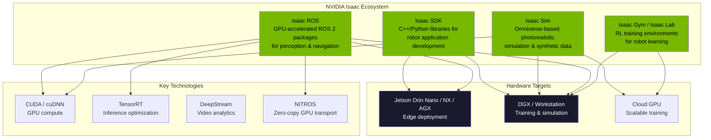
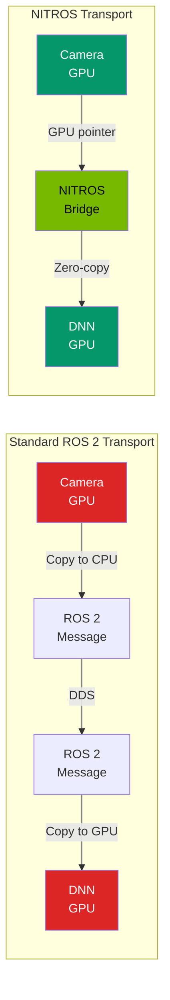

# Isaac SDK Setup

NVIDIA Isaac is a comprehensive platform for developing, simulating, and deploying AI-powered robots. This chapter guides you through setting up the Isaac development environment on both a desktop workstation and a Jetson Orin Nano edge device, installing all necessary dependencies, and running your first Isaac ROS sample application.

---

## 1.1 The NVIDIA Isaac Ecosystem

Before installing anything, it is important to understand the Isaac ecosystem. NVIDIA offers several products under the Isaac umbrella, each serving a different purpose:



### Isaac SDK vs Isaac Sim vs Isaac ROS

| Component | Purpose | Runtime | Primary Users |
|---|---|---|---|
| **Isaac SDK** | Full application framework with C++/Python APIs, codelet system, message passing | Jetson / x86 | Robot application developers |
| **Isaac Sim** | Photorealistic simulation built on Omniverse; synthetic data generation, domain randomization | x86 + RTX GPU | Simulation engineers, ML researchers |
| **Isaac ROS** | GPU-accelerated ROS 2 packages (DNN inference, visual SLAM, stereo depth, Nav2) | Jetson / x86 | ROS 2 developers building perception and navigation |
| **Isaac Gym / Lab** | Massively parallel RL training environments for locomotion, manipulation, dexterous grasping | x86 + GPU | RL researchers, control engineers |

:::tip Which Should You Use?
For this textbook, we focus primarily on **Isaac ROS** because it integrates directly with the ROS 2 ecosystem covered in earlier modules. Isaac Sim is used for synthetic data generation (covered in later chapters), and Isaac Gym/Lab for reinforcement learning (Module 5).
:::

---

## 1.2 System Requirements

### Desktop / Workstation Requirements

| Component | Minimum | Recommended |
|---|---|---|
| **OS** | Ubuntu 22.04 LTS | Ubuntu 22.04 LTS |
| **GPU** | NVIDIA GPU with CUDA compute 7.0+ | RTX 3060 or higher (8+ GB VRAM) |
| **CPU** | 8-core x86_64 | 16-core x86_64 |
| **RAM** | 16 GB | 32+ GB |
| **Storage** | 50 GB free | 100+ GB SSD |
| **NVIDIA Driver** | 525+ | 535+ |
| **CUDA** | 11.8+ | 12.2+ |
| **Docker** | 24.0+ | Latest stable |
| **ROS 2** | Humble Hawksbill | Humble Hawksbill |

### Jetson Orin Nano Requirements

| Component | Specification |
|---|---|
| **Board** | Jetson Orin Nano Developer Kit (8 GB) |
| **JetPack** | 6.0+ (L4T 36.x) |
| **Storage** | 64 GB+ microSD or NVMe SSD |
| **Power** | 15W power supply (included) |
| **Cooling** | Active fan (included with dev kit) |
| **Display** | HDMI for initial setup (optional after SSH) |

:::caution Jetson Orin Nano vs Jetson Nano
The Jetson **Orin** Nano is significantly more powerful than the original Jetson Nano. Isaac ROS packages require the Ampere GPU architecture found in Orin-series devices. The original Jetson Nano (Maxwell architecture) is **not supported** by Isaac ROS 2.0+.
:::

---

## 1.3 Jetson Orin Nano Platform Overview

The Jetson Orin Nano packs an impressive amount of compute into a compact form factor, making it ideal for deploying perception and AI workloads on a humanoid robot.

| Specification | Jetson Orin Nano 8GB |
|---|---|
| **GPU** | 1024-core Ampere with 32 Tensor Cores |
| **CPU** | 6-core Arm Cortex-A78AE |
| **Memory** | 8 GB LPDDR5 (68 GB/s) |
| **AI Performance** | 40 TOPS (INT8) |
| **Video Encode** | 1080p @ 30 fps |
| **Video Decode** | 4K @ 60 fps |
| **CSI Cameras** | Up to 4 MIPI CSI-2 lanes |
| **USB** | 3x USB 3.2 Gen 2, 1x USB 2.0 |
| **Networking** | Gigabit Ethernet |
| **PCIe** | 1x M.2 Key M (NVMe SSD) |
| **Power** | 7W - 15W configurable |

### Initial Jetson Setup

Flash the Jetson Orin Nano with JetPack 6.0 using the NVIDIA SDK Manager on an Ubuntu host:

```bash
# On your Ubuntu host machine:
# 1. Download and install NVIDIA SDK Manager
#    https://developer.nvidia.com/sdk-manager

# 2. Connect Jetson via USB-C in recovery mode
#    (hold recovery button while powering on)

# 3. Launch SDK Manager
sdkmanager

# 4. Select:
#    - Product: Jetson Orin Nano Developer Kit
#    - JetPack: 6.0 (or latest)
#    - Components: Jetson OS + Jetson SDK Components

# 5. Flash and wait (~30 minutes)
```

After flashing, complete the initial Ubuntu setup on the Jetson (create user, set hostname, connect to Wi-Fi), then proceed with the software stack installation.

---

## 1.4 CUDA Toolkit Setup

CUDA is the foundation for GPU-accelerated computing on NVIDIA hardware. On the Jetson, CUDA comes pre-installed with JetPack. On a desktop, you need to install it manually.

### Desktop CUDA Installation

```bash
# Step 1: Install NVIDIA driver (if not already installed)
sudo apt update
sudo apt install -y nvidia-driver-535

# Step 2: Reboot to load the driver
sudo reboot

# Step 3: Verify the driver
nvidia-smi

# Step 4: Install CUDA Toolkit 12.2
wget https://developer.download.nvidia.com/compute/cuda/repos/ubuntu2204/x86_64/cuda-keyring_1.1-1_all.deb
sudo dpkg -i cuda-keyring_1.1-1_all.deb
sudo apt update
sudo apt install -y cuda-toolkit-12-2

# Step 5: Add CUDA to PATH
echo 'export PATH=/usr/local/cuda-12.2/bin:$PATH' >> ~/.bashrc
echo 'export LD_LIBRARY_PATH=/usr/local/cuda-12.2/lib64:$LD_LIBRARY_PATH' >> ~/.bashrc
source ~/.bashrc

# Step 6: Verify CUDA installation
nvcc --version
# Expected output: nvcc: NVIDIA (R) Cuda compiler driver
# Cuda compilation tools, release 12.2, V12.2.xxx
```

### Jetson CUDA Verification

On a Jetson with JetPack already flashed, CUDA is pre-installed:

```bash
# Verify CUDA on Jetson
nvcc --version

# Check JetPack version
sudo apt show nvidia-jetpack

# Run a CUDA sample to verify GPU compute
cd /usr/local/cuda/samples/1_Utilities/deviceQuery
sudo make
./deviceQuery
# Look for: "Result = PASS"
```

### cuDNN Installation (Desktop Only)

cuDNN is pre-installed on Jetson via JetPack. For desktop:

```bash
# Install cuDNN for CUDA 12
sudo apt install -y libcudnn8 libcudnn8-dev libcudnn8-samples

# Verify cuDNN
cat /usr/include/cudnn_version.h | grep CUDNN_MAJOR -A 2
```

### TensorRT Installation

TensorRT is critical for optimizing DNN inference on both Jetson and desktop:

```bash
# Desktop installation
sudo apt install -y tensorrt libnvinfer-dev libnvinfer-plugin-dev

# Verify TensorRT
dpkg -l | grep tensorrt

# Run a TensorRT sample
cd /usr/src/tensorrt/samples/sampleMNIST
sudo make
../../bin/trtexec --help | head -5
```

:::note CUDA Compatibility Matrix
Ensure your CUDA toolkit version, cuDNN version, and TensorRT version are all compatible. Check the NVIDIA support matrix at https://docs.nvidia.com/deeplearning/tensorrt/support-matrix/. Mismatched versions are the most common source of installation failures.
:::

---

## 1.5 Docker-Based Development

NVIDIA provides pre-built Docker containers with all Isaac dependencies configured. This is the **recommended approach** for development, as it avoids dependency conflicts and ensures reproducibility.

### Install Docker and NVIDIA Container Toolkit

```bash
# Step 1: Install Docker
sudo apt update
sudo apt install -y docker.io
sudo systemctl enable --now docker
sudo usermod -aG docker $USER
newgrp docker

# Step 2: Install NVIDIA Container Toolkit
curl -fsSL https://nvidia.github.io/libnvidia-container/gpgkey | \
  sudo gpg --dearmor -o /usr/share/keyrings/nvidia-container-toolkit-keyring.gpg
curl -s -L https://nvidia.github.io/libnvidia-container/stable/deb/nvidia-container-toolkit.list | \
  sed 's#deb https://#deb [signed-by=/usr/share/keyrings/nvidia-container-toolkit-keyring.gpg] https://#g' | \
  sudo tee /etc/apt/sources.list.d/nvidia-container-toolkit.list
sudo apt update
sudo apt install -y nvidia-container-toolkit

# Step 3: Configure Docker to use NVIDIA runtime
sudo nvidia-ctk runtime configure --runtime=docker
sudo systemctl restart docker

# Step 4: Verify GPU access inside Docker
docker run --rm --gpus all nvidia/cuda:12.2.0-base-ubuntu22.04 nvidia-smi
```

### Isaac ROS Development Container

NVIDIA provides purpose-built Docker images for Isaac ROS development:

```bash
# Clone the Isaac ROS common repository
mkdir -p ~/workspaces/isaac_ros-dev/src
cd ~/workspaces/isaac_ros-dev/src
git clone -b release-3.2 \
  https://github.com/NVIDIA-ISAAC-ROS/isaac_ros_common.git

# Launch the development container
cd ~/workspaces/isaac_ros-dev/src/isaac_ros_common
./scripts/run_dev.sh ~/workspaces/isaac_ros-dev
```

The `run_dev.sh` script:
- Pulls the appropriate Isaac ROS Docker image for your platform (x86 or ARM/Jetson).
- Mounts your workspace into the container at `/workspaces/isaac_ros-dev`.
- Enables GPU access, display forwarding, and USB device passthrough.
- Sets up the ROS 2 environment automatically.

### Custom Dockerfile for Your Project

For production deployments, create a custom Dockerfile extending the Isaac ROS base:

```dockerfile title="Dockerfile.isaac_twin"
# Base Isaac ROS image (automatically selects x86 or ARM)
ARG BASE_IMAGE=nvcr.io/nvidia/isaac/ros:aarch64-ros2_humble-release_3.2
FROM ${BASE_IMAGE}

# Install additional ROS 2 packages
RUN apt-get update && apt-get install -y \
    ros-humble-foxglove-bridge \
    ros-humble-rosbag2-storage-mcap \
    ros-humble-robot-state-publisher \
    python3-pip \
    && rm -rf /var/lib/apt/lists/*

# Install Python dependencies
RUN pip3 install \
    numpy>=1.24 \
    scipy>=1.10 \
    transforms3d>=0.4

# Copy your ROS 2 packages
COPY ./src /workspaces/isaac_ros-dev/src

# Build the workspace
WORKDIR /workspaces/isaac_ros-dev
RUN . /opt/ros/humble/setup.sh && \
    colcon build --symlink-install --cmake-args -DCMAKE_BUILD_TYPE=Release

# Source the workspace on container start
RUN echo "source /workspaces/isaac_ros-dev/install/setup.bash" >> ~/.bashrc

ENTRYPOINT ["/ros_entrypoint.sh"]
CMD ["bash"]
```

```bash
# Build the custom image
docker build -t isaac_twin:latest -f Dockerfile.isaac_twin .

# Run the custom container
docker run -it --rm --gpus all \
  --network host \
  --privileged \
  -v /dev:/dev \
  -e DISPLAY=$DISPLAY \
  -v /tmp/.X11-unix:/tmp/.X11-unix \
  isaac_twin:latest
```

---

## 1.6 Isaac ROS Packages Overview

Isaac ROS provides GPU-accelerated drop-in replacements for common ROS 2 perception and navigation tasks. Here are the key packages:

| Package | Function | CPU Equivalent |
|---|---|---|
| `isaac_ros_dnn_inference` | TensorRT/Triton DNN inference | Custom Python inference nodes |
| `isaac_ros_visual_slam` | GPU-accelerated visual SLAM | ORB-SLAM3, RTAB-Map |
| `isaac_ros_stereo_image_proc` | Stereo depth from camera pairs | `stereo_image_proc` |
| `isaac_ros_apriltag` | GPU AprilTag detection | `apriltag_ros` |
| `isaac_ros_centerpose` | 6-DoF object pose estimation | DOPE, CosyPose |
| `isaac_ros_object_detection` | YOLO/SSD object detection | CPU-based detection nodes |
| `isaac_ros_freespace_segmentation` | Drivable area segmentation | Custom segmentation |
| `isaac_ros_nvblox` | GPU 3D reconstruction | OctoMap, Voxblox |
| `isaac_ros_image_pipeline` | GPU image rectification and resize | `image_proc` |
| `isaac_ros_nitros` | Zero-copy GPU data transport | Standard ROS 2 transport |

### NITROS: Zero-Copy GPU Transport

NITROS (NVIDIA Isaac Transport for ROS) is a key innovation that eliminates unnecessary CPU-GPU memory copies. In a standard ROS 2 pipeline, image data is:

1. Captured on GPU (camera driver).
2. Copied to CPU (ROS message serialization).
3. Sent over DDS.
4. Copied back to GPU (DNN inference).

NITROS keeps data on the GPU throughout the pipeline, achieving up to **10x throughput improvement** for perception workloads.



---

## 1.7 Installing Isaac ROS Packages

### Method 1: Pre-Built Debian Packages

```bash
# Add the Isaac ROS apt repository
sudo apt update
sudo apt install -y software-properties-common
sudo add-apt-repository universe

# Install Isaac ROS packages
sudo apt install -y \
  ros-humble-isaac-ros-dnn-inference \
  ros-humble-isaac-ros-visual-slam \
  ros-humble-isaac-ros-apriltag \
  ros-humble-isaac-ros-image-pipeline \
  ros-humble-isaac-ros-nitros
```

### Method 2: Build from Source (Recommended for Development)

```bash
# Inside the Isaac ROS dev container:
cd /workspaces/isaac_ros-dev/src

# Clone the packages you need
git clone -b release-3.2 \
  https://github.com/NVIDIA-ISAAC-ROS/isaac_ros_apriltag.git
git clone -b release-3.2 \
  https://github.com/NVIDIA-ISAAC-ROS/isaac_ros_dnn_inference.git
git clone -b release-3.2 \
  https://github.com/NVIDIA-ISAAC-ROS/isaac_ros_image_pipeline.git
git clone -b release-3.2 \
  https://github.com/NVIDIA-ISAAC-ROS/isaac_ros_object_detection.git

# Install dependencies
cd /workspaces/isaac_ros-dev
rosdep install --from-paths src --ignore-src -r -y

# Build
colcon build --symlink-install --packages-up-to \
  isaac_ros_apriltag \
  isaac_ros_dnn_inference \
  isaac_ros_image_pipeline

# Source the workspace
source install/setup.bash
```

---

## 1.8 Sample Perception Application: AprilTag Detection

Let us build and run a complete Isaac ROS perception application that detects AprilTags using GPU-accelerated processing.

### What Are AprilTags?

AprilTags are fiducial markers (similar to QR codes but optimized for robotics) that provide precise 6-DoF pose estimation. They are widely used for robot calibration, object tracking, and navigation landmarks.

### Launch File for AprilTag Detection

```python title="launch/isaac_apriltag_demo.launch.py"
#!/usr/bin/env python3
"""
Isaac ROS AprilTag Detection Demo.

Launches a GPU-accelerated AprilTag detection pipeline:
  1. USB camera driver
  2. Image rectification (GPU)
  3. AprilTag detection (GPU)
  4. Visualization in RViz2
"""

import os
from launch import LaunchDescription
from launch.actions import DeclareLaunchArgument
from launch.substitutions import LaunchConfiguration
from launch_ros.actions import Node, ComposableNodeContainer
from launch_ros.descriptions import ComposableNode
from ament_index_python.packages import get_package_share_directory


def generate_launch_description():
    """Generate the AprilTag detection demo launch description."""

    camera_device = LaunchConfiguration('camera_device', default='/dev/video0')
    image_width = LaunchConfiguration('image_width', default='1280')
    image_height = LaunchConfiguration('image_height', default='720')
    tag_family = LaunchConfiguration('tag_family', default='tag36h11')
    tag_size = LaunchConfiguration('tag_size', default='0.065')

    # Camera intrinsics (must match your camera calibration)
    camera_info_url = LaunchConfiguration(
        'camera_info_url',
        default='file:///workspaces/isaac_ros-dev/src/camera_info.yaml'
    )

    return LaunchDescription([
        # --- Arguments ---
        DeclareLaunchArgument('camera_device', default_value='/dev/video0'),
        DeclareLaunchArgument('image_width', default_value='1280'),
        DeclareLaunchArgument('image_height', default_value='720'),
        DeclareLaunchArgument('tag_family', default_value='tag36h11'),
        DeclareLaunchArgument('tag_size', default_value='0.065'),

        # --- USB Camera Node ---
        Node(
            package='usb_cam',
            executable='usb_cam_node_exe',
            name='usb_camera',
            parameters=[{
                'video_device': camera_device,
                'image_width': 1280,
                'image_height': 720,
                'pixel_format': 'yuyv',
                'framerate': 30.0,
                'camera_info_url': camera_info_url,
            }],
            remappings=[
                ('image_raw', '/camera/image_raw'),
                ('camera_info', '/camera/camera_info'),
            ],
        ),

        # --- Isaac ROS NITROS Container ---
        # Runs GPU-accelerated nodes in a shared process for zero-copy
        ComposableNodeContainer(
            name='apriltag_container',
            namespace='',
            package='rclcpp_components',
            executable='component_container_mt',
            composable_node_descriptions=[
                # GPU Image Rectification
                ComposableNode(
                    package='isaac_ros_image_pipeline',
                    plugin='nvidia::isaac_ros::image_pipeline'
                           '::RectifyNode',
                    name='rectify_node',
                    parameters=[{
                        'output_width': 1280,
                        'output_height': 720,
                    }],
                    remappings=[
                        ('image_raw', '/camera/image_raw'),
                        ('camera_info', '/camera/camera_info'),
                        ('image_rect', '/camera/image_rect'),
                    ],
                ),
                # GPU AprilTag Detection
                ComposableNode(
                    package='isaac_ros_apriltag',
                    plugin='nvidia::isaac_ros::apriltag'
                           '::AprilTagNode',
                    name='apriltag_node',
                    parameters=[{
                        'family': 'tag36h11',
                        'size': 0.065,
                        'max_tags': 20,
                    }],
                    remappings=[
                        ('image', '/camera/image_rect'),
                        ('camera_info', '/camera/camera_info'),
                        ('tag_detections', '/apriltag/detections'),
                    ],
                ),
            ],
            output='screen',
        ),

        # --- RViz2 for Visualization ---
        Node(
            package='rviz2',
            executable='rviz2',
            name='rviz2',
            arguments=[
                '-d', os.path.join(
                    get_package_share_directory('isaac_apriltag_demo'),
                    'rviz',
                    'apriltag_demo.rviz',
                ),
            ],
        ),
    ])
```

### Running the Demo

```bash
# Inside the Isaac ROS dev container:

# Step 1: Build the demo package
cd /workspaces/isaac_ros-dev
colcon build --packages-select isaac_apriltag_demo
source install/setup.bash

# Step 2: Launch the AprilTag detection pipeline
ros2 launch isaac_apriltag_demo isaac_apriltag_demo.launch.py

# Step 3: In a separate terminal, view the detections
ros2 topic echo /apriltag/detections
```

### Expected Output

When AprilTags are visible to the camera, you will see detection messages:

```
header:
  stamp:
    sec: 1700000000
    nanosec: 123456789
  frame_id: camera_optical_frame
detections:
- family: tag36h11
  id: 5
  hamming: 0
  decision_margin: 120.5
  centre:
    x: 640.0
    y: 360.0
  corners:
  - x: 600.0
    y: 320.0
  - x: 680.0
    y: 320.0
  - x: 680.0
    y: 400.0
  - x: 600.0
    y: 400.0
  pose:
    position:
      x: 0.15
      y: -0.02
      z: 0.45
    orientation:
      x: 0.0
      y: 0.0
      z: 0.0
      w: 1.0
```

---

## 1.9 Verifying Your Installation

Use this checklist to confirm your Isaac development environment is fully operational:

| Check | Command | Expected Result |
|---|---|---|
| NVIDIA Driver | `nvidia-smi` | Driver version and GPU listed |
| CUDA Toolkit | `nvcc --version` | CUDA 12.x compiler info |
| cuDNN | `dpkg -l \| grep cudnn` | libcudnn8 installed |
| TensorRT | `dpkg -l \| grep tensorrt` | tensorrt package installed |
| Docker + GPU | `docker run --gpus all nvidia/cuda:12.2.0-base-ubuntu22.04 nvidia-smi` | GPU info inside container |
| ROS 2 Humble | `ros2 --help` | ROS 2 CLI help output |
| Isaac ROS | `ros2 pkg list \| grep isaac` | Isaac ROS packages listed |
| Camera access | `v4l2-ctl --list-devices` | Camera device listed |

```bash
#!/bin/bash
# verify_isaac_setup.sh
# Quick verification script for Isaac development environment

echo "=== NVIDIA Driver ==="
nvidia-smi --query-gpu=name,driver_version,memory.total \
  --format=csv,noheader

echo ""
echo "=== CUDA Toolkit ==="
nvcc --version 2>/dev/null || echo "CUDA not found in PATH"

echo ""
echo "=== cuDNN ==="
dpkg -l 2>/dev/null | grep cudnn | head -3 || echo "cuDNN not installed"

echo ""
echo "=== TensorRT ==="
dpkg -l 2>/dev/null | grep tensorrt | head -3 || echo "TensorRT not installed"

echo ""
echo "=== Docker ==="
docker --version 2>/dev/null || echo "Docker not installed"

echo ""
echo "=== Docker GPU Access ==="
docker run --rm --gpus all nvidia/cuda:12.2.0-base-ubuntu22.04 \
  nvidia-smi --query-gpu=name --format=csv,noheader 2>/dev/null \
  || echo "Docker GPU access failed"

echo ""
echo "=== ROS 2 ==="
source /opt/ros/humble/setup.bash 2>/dev/null
ros2 doctor --report 2>/dev/null | head -20 || echo "ROS 2 not available"

echo ""
echo "=== Isaac ROS Packages ==="
ros2 pkg list 2>/dev/null | grep isaac || echo "No Isaac ROS packages found"

echo ""
echo "=== Verification Complete ==="
```

:::note Jetson-Specific Checks
On Jetson, also verify the power mode and clock speeds. For maximum performance during development, set the device to `MAXN` mode:

```bash
sudo nvpmodel -m 0        # Set MAXN power mode (15W)
sudo jetson_clocks         # Lock clocks to maximum frequency
sudo nvpmodel -q           # Verify current power mode
```
:::

---

## 1.10 Troubleshooting Common Issues

| Problem | Symptom | Solution |
|---|---|---|
| Docker GPU not available | `nvidia-smi` fails inside container | Install `nvidia-container-toolkit` and restart Docker daemon |
| CUDA version mismatch | Library loading errors | Ensure CUDA toolkit version matches driver capability (`nvidia-smi` shows max CUDA) |
| Camera not found | `v4l2-ctl` shows no devices | Check USB connection; load `uvcvideo` kernel module; verify `/dev/video*` exists |
| ROS 2 nodes cannot communicate | Topics not visible across containers | Use `--network host` when running Docker containers |
| Build fails with memory error | `colcon build` killed by OOM | Limit parallel build jobs: `colcon build --parallel-workers 2` |
| Jetson thermal throttling | Slow inference performance | Attach heatsink/fan; use `tegrastats` to monitor temperature |
| TensorRT engine incompatible | Engine file fails to load | TensorRT engines are hardware-specific; rebuild the engine on the target device |

---

## 1.11 Chapter Summary

In this chapter, you learned:

- **The Isaac ecosystem** -- the distinction between Isaac SDK, Isaac Sim, Isaac ROS, and Isaac Gym/Lab, and when to use each.
- **System requirements** -- hardware and software specifications for both desktop and Jetson Orin Nano development.
- **Jetson Orin Nano setup** -- flashing JetPack, verifying CUDA, and configuring the device for development.
- **CUDA/cuDNN/TensorRT installation** -- setting up the GPU compute stack on desktop machines.
- **Docker-based development** -- using NVIDIA Container Toolkit and Isaac ROS dev containers for reproducible builds.
- **Isaac ROS packages** -- the suite of GPU-accelerated ROS 2 packages and the NITROS zero-copy transport.
- **Sample application** -- building and running a GPU-accelerated AprilTag detection pipeline.
- **Verification and troubleshooting** -- confirming your environment is operational and resolving common setup issues.

In the next chapter, we will build a complete perception pipeline using Isaac ROS for object detection, pose estimation, and depth processing.

---

## Exercises

1. **Environment Setup**: Follow the installation steps in this chapter to set up either a desktop workstation or a Jetson Orin Nano with the full Isaac ROS stack. Run the verification script and confirm all checks pass. Document any issues you encountered and how you resolved them.

2. **Docker Exploration**: Start the Isaac ROS dev container and explore its contents. List all pre-installed ROS 2 packages (`ros2 pkg list`), identify the CUDA version (`nvcc --version`), and check which GPU compute capabilities are available (`nvidia-smi`). Write a brief report comparing the container environment to a bare-metal installation.

3. **AprilTag Detection**: Print at least 3 AprilTags (tag36h11 family, IDs 0-2) at a known size (e.g., 6.5 cm). Set up a USB camera, calibrate it using `ros2 run camera_calibration cameracalibrator`, and run the Isaac ROS AprilTag detection demo. Verify that the detected poses are within 2 cm of ground truth by measuring with a ruler.

4. **Performance Benchmarking**: Run the AprilTag detection pipeline and measure: (a) the inference latency per frame using `ros2 topic hz` and `ros2 topic delay`, (b) GPU utilization using `nvidia-smi dmon`, and (c) CPU usage using `htop`. Compare these metrics with a CPU-only AprilTag detector (`apriltag_ros`) running on the same hardware.

5. **Custom Container**: Create a custom Dockerfile that extends the Isaac ROS base image with your own ROS 2 package. The package should contain a simple node that subscribes to AprilTag detections and publishes the average distance to all detected tags on a custom topic `/apriltag/avg_distance`. Build the container, run it, and verify the custom topic produces correct data.
