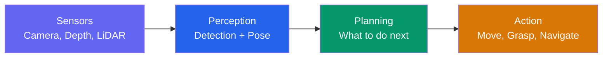
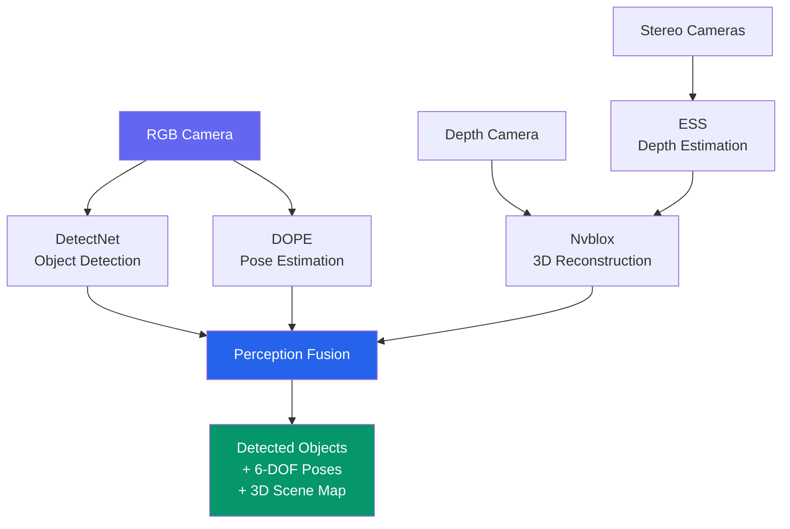
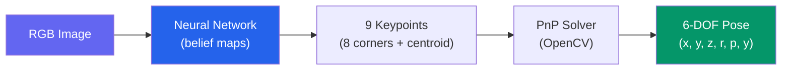
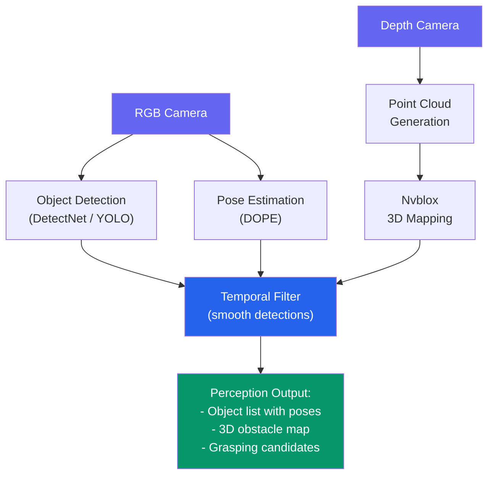

# Perception Pipeline

A humanoid robot that cannot perceive its environment is blind. **Perception** transforms raw sensor data — camera images, depth maps, LiDAR scans — into structured understanding: what objects are present, where they are, and how the robot can interact with them. In this chapter, we build a complete perception pipeline using NVIDIA Isaac's tools and deploy it for real-time inference.

---

## 2.1 Why Perception Matters



Without perception, a robot cannot:
- **Navigate** — it needs to detect obstacles and free space
- **Manipulate** — it needs to locate objects and estimate their pose for grasping
- **Interact with humans** — it needs to detect people, gestures, and facial expressions
- **Adapt** — it needs to recognize when the environment changes

---

## 2.2 NVIDIA Isaac Perception Architecture

NVIDIA Isaac provides GPU-accelerated perception modules that run efficiently on Jetson platforms:

| Module | Function | Input | Output |
|---|---|---|---|
| **DetectNet** | 2D object detection | RGB image | Bounding boxes + classes |
| **DOPE** | 6-DOF pose estimation | RGB image | Object poses (position + orientation) |
| **Nvblox** | 3D reconstruction | Depth + pose | Signed distance field (SDF) |
| **ESS** | Stereo depth estimation | Stereo image pair | Dense depth map |
| **FoundationPose** | Category-level pose estimation | RGB-D | 6-DOF pose for novel objects |



---

## 2.3 Object Detection with DetectNet

DetectNet performs real-time 2D object detection using optimized neural networks running on TensorRT.

### Setting Up a Detection Pipeline

```python
#!/usr/bin/env python3
"""Object detection node using NVIDIA Isaac DetectNet."""

import rclpy
from rclpy.node import Node
from sensor_msgs.msg import Image
from vision_msgs.msg import Detection2DArray, Detection2D
from cv_bridge import CvBridge
import numpy as np


class DetectionNode(Node):
    def __init__(self):
        super().__init__('detection_node')

        self.declare_parameter('confidence_threshold', 0.5)
        self.declare_parameter('model_path', 'detectnet_v2')
        self.threshold = (
            self.get_parameter('confidence_threshold')
            .get_parameter_value().double_value
        )

        self.bridge = CvBridge()

        self.image_sub = self.create_subscription(
            Image, '/camera/image_raw',
            self.image_callback, 10
        )
        self.detection_pub = self.create_publisher(
            Detection2DArray, '/detections', 10
        )

        self.get_logger().info(
            f'Detection node ready (threshold={self.threshold})'
        )

    def image_callback(self, msg: Image):
        cv_image = self.bridge.imgmsg_to_cv2(msg, 'rgb8')

        # Run inference (simplified — actual Isaac inference
        # uses TensorRT engine loaded at init)
        detections = self.run_inference(cv_image)

        # Publish detections
        det_array = Detection2DArray()
        det_array.header = msg.header
        for det in detections:
            if det['confidence'] >= self.threshold:
                d = Detection2D()
                d.bbox.center.position.x = det['cx']
                d.bbox.center.position.y = det['cy']
                d.bbox.size_x = det['width']
                d.bbox.size_y = det['height']
                det_array.detections.append(d)

        self.detection_pub.publish(det_array)

    def run_inference(self, image: np.ndarray) -> list:
        """Run TensorRT inference on the input image."""
        # Placeholder — in production, this calls the TensorRT engine
        return []


def main(args=None):
    rclpy.init(args=args)
    node = DetectionNode()
    try:
        rclpy.spin(node)
    except KeyboardInterrupt:
        pass
    finally:
        node.destroy_node()
        rclpy.shutdown()


if __name__ == '__main__':
    main()
```

### Detection Performance Benchmarks

| Model | Resolution | FPS (Jetson Orin) | FPS (RTX 4090) | mAP |
|---|---|---|---|---|
| DetectNet v2 (ResNet-18) | 640x480 | 120 | 500+ | 78.5 |
| DetectNet v2 (ResNet-34) | 640x480 | 80 | 400+ | 82.3 |
| YOLOv8-nano | 640x640 | 100 | 600+ | 37.3 (COCO) |
| YOLOv8-small | 640x640 | 60 | 400+ | 44.9 (COCO) |

---

## 2.4 6-DOF Pose Estimation

For a robot to grasp an object, it needs the object's full 6-DOF pose: 3D position (x, y, z) and orientation (roll, pitch, yaw).

### DOPE (Deep Object Pose Estimation)

DOPE predicts 3D bounding box keypoints from a single RGB image, then solves a PnP problem to recover the 6-DOF pose.



```python
"""6-DOF pose estimation using DOPE-style keypoint detection."""

import cv2
import numpy as np
from typing import Tuple


def solve_pose_from_keypoints(
    keypoints_2d: np.ndarray,
    keypoints_3d: np.ndarray,
    camera_matrix: np.ndarray,
    dist_coeffs: np.ndarray = None,
) -> Tuple[np.ndarray, np.ndarray]:
    """
    Recover 6-DOF pose from 2D-3D keypoint correspondences.

    Args:
        keypoints_2d: Detected 2D keypoints (N, 2).
        keypoints_3d: Known 3D model keypoints (N, 3).
        camera_matrix: Camera intrinsic matrix (3, 3).
        dist_coeffs: Distortion coefficients (optional).

    Returns:
        rotation_vector: Rodrigues rotation vector (3,).
        translation_vector: Translation vector (3,).
    """
    if dist_coeffs is None:
        dist_coeffs = np.zeros(5)

    success, rvec, tvec = cv2.solvePnP(
        keypoints_3d,
        keypoints_2d,
        camera_matrix,
        dist_coeffs,
        flags=cv2.SOLVEPNP_EPNP,
    )

    if not success:
        raise ValueError("PnP solver failed to find a valid pose.")

    return rvec.flatten(), tvec.flatten()


# Example: known object dimensions (a textbook, 24cm x 17cm x 3cm)
object_keypoints_3d = np.array([
    [-0.12, -0.085, -0.015],  # corner 0
    [ 0.12, -0.085, -0.015],  # corner 1
    [ 0.12,  0.085, -0.015],  # corner 2
    [-0.12,  0.085, -0.015],  # corner 3
    [-0.12, -0.085,  0.015],  # corner 4
    [ 0.12, -0.085,  0.015],  # corner 5
    [ 0.12,  0.085,  0.015],  # corner 6
    [-0.12,  0.085,  0.015],  # corner 7
], dtype=np.float64)
```

---

## 2.5 Depth Processing and Point Clouds

Depth cameras (Intel RealSense, Azure Kinect) produce dense depth maps. These can be converted to 3D point clouds for obstacle detection and scene understanding.

```python
"""Convert depth images to 3D point clouds."""

import numpy as np
from typing import Tuple


def depth_to_pointcloud(
    depth_image: np.ndarray,
    fx: float, fy: float,
    cx: float, cy: float,
    max_depth: float = 5.0,
) -> np.ndarray:
    """
    Convert a depth image to a 3D point cloud.

    Args:
        depth_image: Depth in meters, shape (H, W).
        fx, fy: Focal lengths in pixels.
        cx, cy: Principal point in pixels.
        max_depth: Discard points beyond this distance.

    Returns:
        Point cloud of shape (N, 3).
    """
    h, w = depth_image.shape
    u, v = np.meshgrid(np.arange(w), np.arange(h))

    z = depth_image
    x = (u - cx) * z / fx
    y = (v - cy) * z / fy

    # Stack and filter
    points = np.stack([x, y, z], axis=-1).reshape(-1, 3)
    valid = (points[:, 2] > 0) & (points[:, 2] < max_depth)

    return points[valid]
```

---

## 2.6 Camera Calibration

Accurate perception requires calibrated cameras. Calibration determines the **intrinsic matrix** (focal length, principal point) and **distortion coefficients**.

```python
"""Camera calibration using a checkerboard pattern."""

import cv2
import numpy as np
import glob


def calibrate_camera(
    image_dir: str,
    pattern_size: Tuple[int, int] = (9, 6),
    square_size: float = 0.025,
) -> dict:
    """
    Calibrate a camera from checkerboard images.

    Args:
        image_dir: Directory containing calibration images.
        pattern_size: Inner corners (columns, rows).
        square_size: Physical size of one square in meters.

    Returns:
        Dict with camera_matrix, dist_coeffs, rvecs, tvecs.
    """
    obj_points = []  # 3D points in world coordinates
    img_points = []  # 2D points in image plane

    objp = np.zeros(
        (pattern_size[0] * pattern_size[1], 3), np.float32
    )
    objp[:, :2] = np.mgrid[
        0:pattern_size[0], 0:pattern_size[1]
    ].T.reshape(-1, 2) * square_size

    images = glob.glob(f'{image_dir}/*.png')
    for fname in images:
        img = cv2.imread(fname)
        gray = cv2.cvtColor(img, cv2.COLOR_BGR2GRAY)
        ret, corners = cv2.findChessboardCorners(gray, pattern_size)
        if ret:
            obj_points.append(objp)
            img_points.append(corners)

    ret, mtx, dist, rvecs, tvecs = cv2.calibrateCamera(
        obj_points, img_points, gray.shape[::-1], None, None
    )

    return {
        'camera_matrix': mtx,
        'dist_coeffs': dist,
        'rvecs': rvecs,
        'tvecs': tvecs,
        'reprojection_error': ret,
    }
```

---

## 2.7 Real-Time Inference on Jetson

NVIDIA TensorRT optimizes neural networks for deployment on Jetson platforms by fusing layers, quantizing weights, and optimizing memory access.

| Optimization | Description | Typical Speedup |
|---|---|---|
| **Layer fusion** | Merge Conv + BN + ReLU into one kernel | 1.5-2x |
| **FP16 inference** | Half-precision floating point | 2x |
| **INT8 quantization** | 8-bit integer inference | 3-4x |
| **Dynamic batching** | Adjust batch size to fill GPU | 1.2-1.5x |

```bash
# Convert ONNX model to TensorRT engine
trtexec --onnx=detectnet.onnx \
    --saveEngine=detectnet.engine \
    --fp16 \
    --workspace=1024 \
    --verbose
```

:::tip Jetson Power Modes
The Jetson Orin supports multiple power modes. For perception workloads:
- **MAXN** (50W): Full performance, all cores active
- **30W**: Good balance of performance and power
- **15W**: Battery-friendly, suitable for lighter models

Set power mode with: `sudo nvpmodel -m <mode_id>`
:::

---

## 2.8 End-to-End Perception Pipeline



The pipeline fuses 2D detections, 6-DOF poses, and 3D scene maps into a single perception output consumed by downstream planning and control modules.

---

## 2.9 Chapter Summary

In this chapter, you learned:

- **Why perception is fundamental** — robots need structured scene understanding to navigate, manipulate, and interact
- **NVIDIA Isaac perception modules** — DetectNet, DOPE, Nvblox, ESS, and FoundationPose for GPU-accelerated perception
- **Object detection** — real-time 2D detection with TensorRT-optimized networks
- **6-DOF pose estimation** — using keypoint detection and PnP solving to recover full object poses
- **Depth processing** — converting depth images to 3D point clouds for obstacle detection
- **Camera calibration** — determining intrinsics and distortion for accurate measurements
- **Jetson deployment** — TensorRT optimization for real-time inference on edge devices
- **Pipeline composition** — fusing multiple perception modalities into a coherent scene representation

In the next chapter, we explore **Reinforcement Learning** — training robot policies in simulation using Isaac Gym.

---

## Exercises

1. **Depth to Point Cloud**: Implement the `depth_to_pointcloud` function and visualize the output using Open3D. Use a sample depth image from a RealSense camera.

2. **Camera Calibration**: Capture 20 images of a checkerboard and calibrate your camera. Report the reprojection error and inspect the distortion coefficients.

3. **Detection Benchmark**: Compare DetectNet and YOLOv8 inference speed on Jetson (or GPU) using TensorRT. Measure FPS at 640x480 and 1280x720 resolutions.

4. **Pose Estimation Pipeline**: Given a set of 2D keypoint detections, implement the PnP solver to recover 6-DOF poses. Validate by projecting 3D bounding boxes back onto the image.
