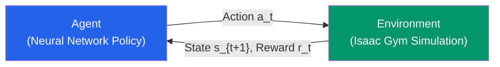
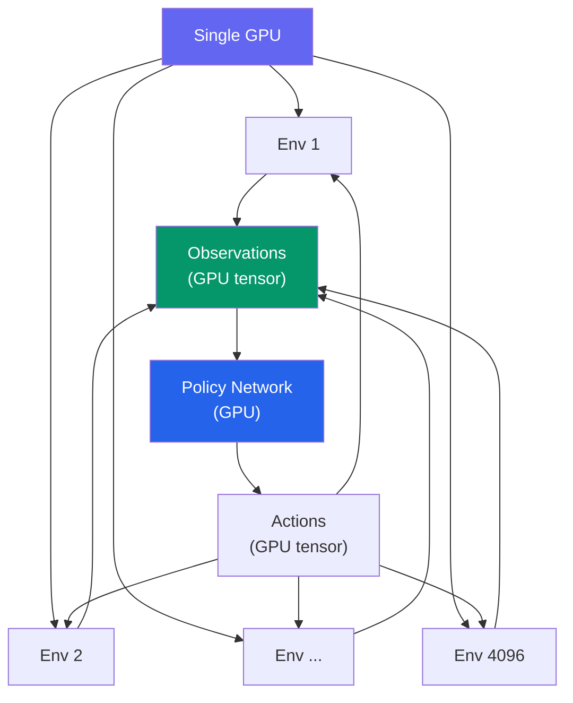

import KnowledgeCheck from '@site/src/components/KnowledgeCheck';


# Reinforcement Learning

Teaching a humanoid robot to walk, grasp objects, or recover from falls cannot be solved with hand-crafted rules alone — the space of possible body configurations and interactions is too vast. **Reinforcement Learning (RL)** lets the robot discover control policies through trial and error in simulation, running thousands of parallel environments on the GPU. In this chapter, we use NVIDIA Isaac Gym to train locomotion and manipulation policies from scratch.

---

## 3.1 RL Fundamentals for Robotics

Reinforcement Learning models robot control as a **Markov Decision Process (MDP)**:

| Component | Robotics Meaning | Example |
|---|---|---|
| **State** (s) | Robot + environment configuration | Joint angles, velocities, contact forces |
| **Action** (a) | Motor commands | Joint torques or target positions |
| **Reward** (r) | Task performance signal | Forward velocity, upright bonus, energy penalty |
| **Policy** (pi) | State-to-action mapping | Neural network controller |
| **Transition** (T) | Physics of the world | Simulation stepping one timestep |



The agent's goal: find a policy that maximizes the **cumulative discounted reward**:

```
J(pi) = E[ sum_{t=0}^{T} gamma^t * r_t ]
```

where `gamma` (0.95-0.99) discounts future rewards.

---

## 3.2 NVIDIA Isaac Gym

Isaac Gym is a GPU-accelerated physics simulator designed specifically for RL training. Its key advantage: **thousands of parallel environments run simultaneously on a single GPU**, eliminating the CPU bottleneck of traditional simulators.

| Feature | Isaac Gym | MuJoCo | PyBullet |
|---|---|---|---|
| Parallel environments | 4096+ on one GPU | CPU-bound (~32) | CPU-bound (~16) |
| Physics engine | PhysX (GPU) | MuJoCo engine (CPU) | Bullet (CPU) |
| Observation/action on GPU | Yes (zero-copy) | No (CPU tensors) | No |
| Rendering | Optional headless | MuJoCo viewer | OpenGL |
| Typical training speed | ~50K steps/sec | ~5K steps/sec | ~2K steps/sec |

### Installation

```bash
# Isaac Gym (from NVIDIA developer site)
pip install isaacgym

# IsaacGymEnvs (pre-built RL environments)
git clone https://github.com/NVIDIA-Omniverse/IsaacGymEnvs.git
cd IsaacGymEnvs
pip install -e .
```

---

## 3.3 Parallel Environment Setup

The core of Isaac Gym is running thousands of environments in parallel:

```python
"""Setting up parallel environments in Isaac Gym."""

import isaacgym
from isaacgym import gymapi, gymtorch
import torch


def create_sim(num_envs: int = 4096):
    """Create an Isaac Gym simulation with parallel environments."""
    gym = gymapi.acquire_gym()

    # Simulation parameters
    sim_params = gymapi.SimParams()
    sim_params.dt = 1.0 / 60.0
    sim_params.substeps = 2
    sim_params.up_axis = gymapi.UP_AXIS_Z
    sim_params.gravity = gymapi.Vec3(0.0, 0.0, -9.81)

    # Use GPU pipeline for maximum throughput
    sim_params.use_gpu_pipeline = True
    sim_params.physx.use_gpu = True
    sim_params.physx.num_threads = 4
    sim_params.physx.solver_type = 1  # TGS solver
    sim_params.physx.num_position_iterations = 4
    sim_params.physx.num_velocity_iterations = 1

    sim = gym.create_sim(0, 0, gymapi.SIM_PHYSX, sim_params)

    # Create ground plane
    plane_params = gymapi.PlaneParams()
    plane_params.normal = gymapi.Vec3(0.0, 0.0, 1.0)
    gym.add_ground(sim, plane_params)

    # Load robot asset
    asset_options = gymapi.AssetOptions()
    asset_options.fix_base_link = False
    robot_asset = gym.load_asset(
        sim, './assets', 'humanoid.urdf', asset_options
    )

    # Create environments in a grid
    env_spacing = 2.0
    envs = []
    for i in range(num_envs):
        env = gym.create_env(
            sim,
            gymapi.Vec3(-env_spacing, -env_spacing, 0.0),
            gymapi.Vec3(env_spacing, env_spacing, env_spacing),
            int(num_envs ** 0.5),
        )
        pose = gymapi.Transform()
        pose.p = gymapi.Vec3(0.0, 0.0, 1.0)  # Start 1m above ground
        actor = gym.create_actor(env, robot_asset, pose, f'humanoid_{i}')
        envs.append(env)

    return gym, sim, envs
```



:::note Zero-Copy GPU Tensors
Isaac Gym keeps observations and actions as GPU tensors throughout the entire training loop. No data is copied between CPU and GPU, which is why it achieves 10-50x speedups over CPU-based simulators.
:::

---

## 3.4 Reward Function Design

The reward function is the most critical component — it defines what the robot learns. A poorly designed reward leads to unintended behaviors.

### Locomotion Reward Example

```python
def compute_locomotion_reward(
    root_velocity: torch.Tensor,     # (num_envs, 3)
    joint_torques: torch.Tensor,     # (num_envs, num_joints)
    base_orientation: torch.Tensor,  # (num_envs, 4) quaternion
    target_velocity: float = 1.0,    # m/s forward
) -> torch.Tensor:
    """
    Compute reward for humanoid locomotion.

    Components:
      - Forward velocity reward (main objective)
      - Upright bonus (stay balanced)
      - Energy penalty (minimize torque usage)
      - Alive bonus (don't fall)
    """
    # Forward velocity reward
    forward_vel = root_velocity[:, 0]  # X-axis velocity
    vel_reward = torch.exp(
        -2.0 * (forward_vel - target_velocity) ** 2
    )

    # Upright bonus (penalize tilting)
    # quaternion w component = cos(angle/2), should be close to 1
    upright = base_orientation[:, 3] ** 2
    upright_reward = torch.clamp(upright, 0.0, 1.0)

    # Energy penalty (discourage excessive torque)
    energy_penalty = -0.001 * torch.sum(joint_torques ** 2, dim=-1)

    # Alive bonus (constant reward for not falling)
    alive_bonus = 1.0

    # Total reward
    reward = (
        1.0 * vel_reward
        + 0.5 * upright_reward
        + energy_penalty
        + alive_bonus
    )

    return reward
```

### Reward Design Guidelines

| Principle | Description |
|---|---|
| **Sparse vs Dense** | Dense rewards (every step) train faster; sparse rewards (only at goal) need more samples |
| **Shaping** | Intermediate rewards that guide toward the goal without changing the optimal policy |
| **Penalty terms** | Discourage unwanted behaviors (excessive force, joint limits, self-collision) |
| **Normalization** | Keep reward components on similar scales to prevent one from dominating |

---

## 3.5 Training Algorithms: PPO and SAC

### PPO (Proximal Policy Optimization)

PPO is the default choice for Isaac Gym RL training — it is stable, sample-efficient (with parallel envs), and easy to tune.

| Hyperparameter | Typical Value | Description |
|---|---|---|
| Learning rate | 3e-4 | Adam optimizer step size |
| Clip range | 0.2 | PPO clipping parameter |
| GAE lambda | 0.95 | Generalized Advantage Estimation |
| Discount (gamma) | 0.99 | Future reward discount |
| Mini-batch size | 4096 | Samples per gradient step |
| Num epochs | 5 | PPO epochs per rollout |
| Horizon | 24 | Steps per rollout |

### SAC (Soft Actor-Critic)

SAC is an off-policy algorithm that maximizes both reward and policy entropy (exploration). It excels at dexterous manipulation tasks.

| Aspect | PPO | SAC |
|---|---|---|
| **Policy type** | On-policy | Off-policy |
| **Sample efficiency** | Lower (needs many envs) | Higher (replay buffer) |
| **Stability** | Very stable | Requires tuning |
| **Best for** | Locomotion, large-scale | Manipulation, precision |
| **Parallelization** | Excellent (Isaac Gym) | Good |

---

## 3.6 Training Humanoid Locomotion

```python
"""Train humanoid locomotion with IsaacGymEnvs."""

# Training command using IsaacGymEnvs
# python train.py task=Humanoid num_envs=4096

# Key configuration (humanoid.yaml):
"""
env:
  numEnvs: 4096
  episodeLength: 1000
  enableDebugVis: false

  control:
    actionScale: 0.5
    decimation: 2

  reward:
    forwardVelocityScale: 1.0
    uprightScale: 0.5
    energyScale: -0.001
    aliveBonus: 1.0
    deathCost: -2.0

  termination:
    maxEpisodeLength: 1000
    minHeight: 0.3  # Reset if COM drops below 0.3m

train:
  algorithm: PPO
  learningRate: 3.0e-4
  clipRange: 0.2
  gamma: 0.99
  lam: 0.95
  numEpochs: 5
  miniBatchSize: 4096
  horizonLength: 24
"""
```

### Training Progress

A typical humanoid locomotion training run:

| Stage | Episodes | Behavior |
|---|---|---|
| 0-500K | Early | Robot falls immediately, random flailing |
| 500K-2M | Learning | Starts maintaining balance, short steps |
| 2M-5M | Walking | Consistent forward walking emerges |
| 5M-10M | Refinement | Smoother gait, better energy efficiency |
| 10M+ | Convergence | Stable walking at target velocity |

---

## 3.7 Curriculum Learning and Domain Randomization

### Curriculum Learning

Start with easy tasks and gradually increase difficulty:

```python
def update_curriculum(epoch: int, env_config: dict) -> dict:
    """Progressively increase task difficulty."""
    if epoch < 100:
        # Phase 1: Learn to stand
        env_config['target_velocity'] = 0.0
        env_config['terrain_roughness'] = 0.0
    elif epoch < 300:
        # Phase 2: Learn to walk slowly
        env_config['target_velocity'] = 0.5
        env_config['terrain_roughness'] = 0.01
    else:
        # Phase 3: Walk at full speed on rough terrain
        env_config['target_velocity'] = 1.0
        env_config['terrain_roughness'] = 0.05

    return env_config
```

### Domain Randomization

Randomize simulation parameters to make policies robust to real-world variations:

| Parameter | Randomization Range | Purpose |
|---|---|---|
| Mass | +/- 15% | Account for payload variation |
| Friction | 0.5 - 1.5 | Different floor surfaces |
| Motor strength | +/- 10% | Motor manufacturing tolerance |
| Sensor noise | Gaussian, sigma=0.01 | Real sensor imperfections |
| Latency | 0-20ms | Communication delays |

---

## 3.8 Chapter Summary

In this chapter, you learned:

- **RL fundamentals** — MDPs, policies, reward functions, and the training loop
- **Isaac Gym** — GPU-accelerated parallel simulation enabling 4096+ environments on one GPU
- **Parallel environments** — zero-copy GPU tensors for observations and actions
- **Reward design** — composing velocity rewards, upright bonuses, energy penalties, and alive bonuses
- **PPO and SAC** — on-policy vs off-policy algorithms and when to use each
- **Humanoid locomotion** — training a walking policy from random initialization
- **Curriculum learning** — progressively increasing task difficulty
- **Domain randomization** — making policies robust to sim-to-real transfer

In the next chapter, we tackle the **Sim-to-Real Transfer** problem — bridging the gap between simulation-trained policies and real-world deployment.

---

## Exercises

1. **Reward Engineering**: Design a reward function for a humanoid that learns to walk backward. What terms change compared to forward walking?

2. **Environment Scaling**: Train the same locomotion task with 256, 1024, and 4096 parallel environments. Plot training curves and compare wall-clock time to convergence.

3. **Curriculum Design**: Implement a curriculum that trains a robot to first stand, then walk on flat ground, then walk on uneven terrain. Compare final performance against training without curriculum.

4. **Algorithm Comparison**: Train humanoid locomotion with both PPO and SAC. Compare sample efficiency, training stability, and final gait quality.

---

## Knowledge Check

<KnowledgeCheck
  chapterTitle="Reinforcement Learning with Isaac Gym"
  questions={[
    {
      id: 1,
      question: "What is the primary advantage of using Isaac Gym for reinforcement learning compared to traditional simulation environments?",
      options: [
        "Isaac Gym provides pre-trained policies that only need fine-tuning",
        "Isaac Gym runs thousands of parallel physics simulations entirely on the GPU, dramatically accelerating training data collection",
        "Isaac Gym eliminates the need for reward function design",
        "Isaac Gym works offline without requiring a GPU"
      ],
      correctIndex: 1,
      explanation: "Isaac Gym runs thousands of robot environments simultaneously on a single GPU (vs. CPU-based simulators that run one or a few environments). This massive parallelism allows collecting millions of simulation steps per hour, reducing training time from weeks to hours.",
      sectionRef: "#isaac-gym-parallelism",
      sectionLabel: "Isaac Gym Parallelism"
    },
    {
      id: 2,
      question: "In reinforcement learning for robotics, what is the reward function, and why is reward shaping challenging?",
      options: [
        "The reward function is the neural network architecture; shaping means adjusting its size",
        "The reward function defines what behavior to encourage — the agent maximizes it; shaping is hard because poor reward design leads to unexpected, exploitative strategies",
        "The reward function measures simulation accuracy; shaping adjusts physics parameters",
        "Reward shaping refers to the process of normalizing sensor inputs before training"
      ],
      correctIndex: 1,
      explanation: "The reward function tells the agent what it should optimize. Poorly designed rewards lead to reward hacking — the agent finds unexpected ways to maximize reward without achieving the desired behavior. For example, a robot rewarded only for forward velocity might learn to fall forward instead of walk.",
      sectionRef: "#reward-function-design",
      sectionLabel: "Reward Function Design"
    },
    {
      id: 3,
      question: "What does PPO (Proximal Policy Optimization) do to stabilize reinforcement learning training?",
      options: [
        "PPO uses a fixed learning rate throughout training to prevent oscillation",
        "PPO limits how much the policy can change in each update step using a clipping ratio, preventing destructively large updates",
        "PPO replays past experiences to improve sample efficiency",
        "PPO uses model-based planning to generate synthetic training data"
      ],
      correctIndex: 1,
      explanation: "PPO's key innovation is clipping the policy update ratio within [1-ε, 1+ε]. This prevents the policy from changing too dramatically in a single gradient step — which could collapse training. This makes PPO much more stable than vanilla policy gradient methods while remaining on-policy.",
      sectionRef: "#ppo-algorithm",
      sectionLabel: "PPO Algorithm"
    },
    {
      id: 4,
      question: "What is 'curriculum learning' in the context of training robots with reinforcement learning?",
      options: [
        "Using a fixed set of textbook exercises to define the agent's training tasks",
        "Progressively increasing task difficulty — starting with simpler variations and adding complexity as the agent improves",
        "Teaching the robot using pre-recorded human demonstrations",
        "Scheduling GPU resources to maximize training throughput"
      ],
      correctIndex: 1,
      explanation: "Curriculum learning mirrors how humans learn — start easy, increase difficulty. For locomotion, you might start with flat ground, then add slopes, then uneven terrain, then payload. Starting too hard leads to no learning; curriculum accelerates convergence and improves final performance.",
      sectionRef: "#curriculum-learning",
      sectionLabel: "Curriculum Learning"
    },
    {
      id: 5,
      question: "Why must policies trained in Isaac Gym often be 'adapted' before deploying on real robots?",
      options: [
        "Isaac Gym uses different motor control protocols than real robots",
        "The sim-to-real gap — differences in physics, friction, actuator dynamics, and sensor noise between simulation and reality — causes policies to fail on real hardware",
        "Real robots have different joint ranges than those modeled in Isaac Gym",
        "Isaac Gym policies use GPU tensors that must be converted to CPU format for deployment"
      ],
      correctIndex: 1,
      explanation: "Simulation is an approximation. Real contact forces, motor backlash, cable elasticity, and sensor noise differ from the idealized simulation. A policy optimized purely in simulation will exploit simulation-specific behaviors that don't exist on real hardware, causing it to fail when deployed.",
      sectionRef: "#sim-to-real-considerations",
      sectionLabel: "Sim-to-Real Considerations"
    }
  ]}
/>
