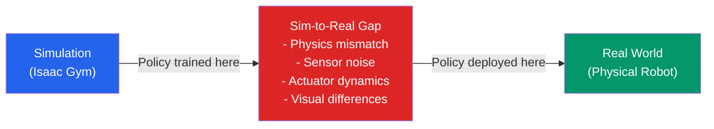
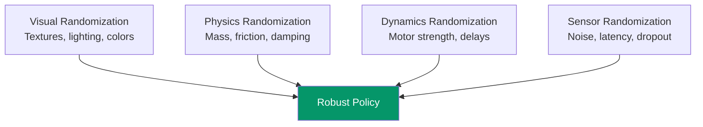
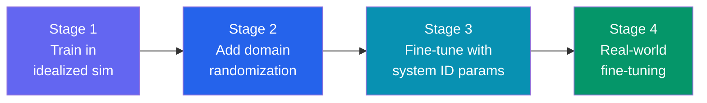

import KnowledgeCheck from '@site/src/components/KnowledgeCheck';


# Sim-to-Real Transfer

A policy that walks perfectly in simulation often stumbles on its first step in the real world. The **sim-to-real gap** — the mismatch between simulated and physical environments — is one of the greatest challenges in robot learning. In this chapter, we explore techniques to bridge this gap and deploy simulation-trained policies on real hardware.

---

## 4.1 The Sim-to-Real Gap



### Sources of the Gap

| Source | Simulation | Reality |
|---|---|---|
| **Physics** | Simplified contact, rigid bodies | Deformable surfaces, complex friction |
| **Actuators** | Instant torque, perfect tracking | Motor delays, backlash, saturation |
| **Sensors** | Clean data, known noise model | Drift, calibration errors, occlusion |
| **Visuals** | Synthetic textures, uniform lighting | Complex materials, varying light |
| **Dynamics** | Fixed parameters | Temperature, wear, load variations |

---

## 4.2 Domain Randomization

The most widely used sim-to-real technique: randomize simulation parameters so the policy learns to be robust across a wide range of conditions.

```python
"""Domain randomization for sim-to-real transfer."""

import torch
import numpy as np
from dataclasses import dataclass


@dataclass
class RandomizationConfig:
    """Ranges for domain randomization parameters."""
    mass_scale: tuple = (0.85, 1.15)       # +/- 15%
    friction: tuple = (0.5, 1.5)            # coefficient
    motor_strength: tuple = (0.9, 1.1)      # +/- 10%
    joint_damping: tuple = (0.8, 1.2)       # +/- 20%
    gravity_noise: tuple = (-0.1, 0.1)      # m/s^2
    observation_noise: float = 0.01         # Gaussian sigma
    action_delay_steps: tuple = (0, 3)      # 0-3 step delay
    terrain_roughness: tuple = (0.0, 0.05)  # meters


def apply_randomization(
    config: RandomizationConfig,
    num_envs: int,
    device: str = 'cuda',
) -> dict:
    """
    Sample randomized parameters for all environments.

    Returns a dictionary of tensors, one value per environment.
    """
    def uniform(low, high):
        return torch.FloatTensor(num_envs).uniform_(low, high).to(device)

    return {
        'mass_scale': uniform(*config.mass_scale),
        'friction': uniform(*config.friction),
        'motor_strength': uniform(*config.motor_strength),
        'joint_damping': uniform(*config.joint_damping),
        'gravity_z_offset': uniform(*config.gravity_noise),
        'action_delay': torch.randint(
            config.action_delay_steps[0],
            config.action_delay_steps[1] + 1,
            (num_envs,), device=device,
        ),
    }


def add_observation_noise(
    obs: torch.Tensor,
    noise_sigma: float = 0.01,
) -> torch.Tensor:
    """Add Gaussian noise to observations."""
    noise = torch.randn_like(obs) * noise_sigma
    return obs + noise
```

### Randomization Strategy



:::tip Start Conservative
Begin training with narrow randomization ranges. Once the policy learns the base task, gradually widen the ranges. Too much randomization early on prevents learning entirely.
:::

---

## 4.3 System Identification

Instead of randomizing blindly, **system identification** measures the actual physical parameters of your robot and tunes the simulation to match.

### Key Parameters to Identify

| Parameter | Measurement Method |
|---|---|
| Link masses | Weigh each component |
| Joint friction | Apply known torques, measure velocity |
| Motor constants | Step response tests |
| Sensor latency | Timestamp analysis |
| Spring/damping | Free oscillation experiments |

```python
"""Simple system identification for motor dynamics."""

import numpy as np
from scipy.optimize import curve_fit


def motor_step_response(
    t: np.ndarray,
    gain: float,
    time_constant: float,
    delay: float,
) -> np.ndarray:
    """
    First-order motor model with delay.

    y(t) = gain * (1 - exp(-(t - delay) / time_constant))
    """
    response = np.zeros_like(t)
    active = t > delay
    response[active] = gain * (
        1.0 - np.exp(-(t[active] - delay) / time_constant)
    )
    return response


def identify_motor(
    time_data: np.ndarray,
    position_data: np.ndarray,
) -> dict:
    """
    Fit motor parameters from step response data.

    Args:
        time_data: Timestamps in seconds.
        position_data: Measured joint positions.

    Returns:
        Identified gain, time_constant, and delay.
    """
    popt, _ = curve_fit(
        motor_step_response,
        time_data,
        position_data,
        p0=[1.0, 0.05, 0.01],  # Initial guess
        bounds=([0, 0, 0], [2.0, 0.5, 0.1]),
    )

    return {
        'gain': popt[0],
        'time_constant': popt[1],
        'delay': popt[2],
    }
```

---

## 4.4 Transfer Learning Strategies

### Progressive Training Pipeline



1. **Stage 1**: Train in clean simulation until the policy converges
2. **Stage 2**: Add domain randomization and continue training
3. **Stage 3**: Use system-identified parameters for the simulation, fine-tune
4. **Stage 4**: Deploy on the real robot with a small learning rate for online adaptation

### Teacher-Student Distillation

Train a **teacher** policy with privileged information (ground-truth state), then distill it into a **student** that uses only sensor observations:

| Aspect | Teacher | Student |
|---|---|---|
| Input | Ground-truth state (sim only) | Raw sensor observations |
| Performance | Upper bound | Slightly lower |
| Deployable | No (needs sim data) | Yes (real sensors) |
| Training | RL in simulation | Supervised (imitate teacher) |

---

## 4.5 Real-World Deployment Checklist

Before deploying a simulation-trained policy on real hardware:

### Safety

- [ ] Emergency stop button tested and accessible
- [ ] Joint position and velocity limits enforced in hardware
- [ ] Torque limits set below motor damage thresholds
- [ ] Collision detection enabled (self-collision and environment)
- [ ] Start with reduced action scaling (50% of training)

### Latency

- [ ] Measure end-to-end control latency (sensor → policy → actuator)
- [ ] Verify latency matches simulation assumptions
- [ ] Add latency buffer in simulation if real latency exceeds sim latency

### Calibration

- [ ] Camera intrinsics and extrinsics calibrated
- [ ] Joint zero positions verified against URDF
- [ ] IMU bias calibration performed
- [ ] Force/torque sensor offsets zeroed

### Monitoring

- [ ] Log all sensor data, actions, and rewards during real deployment
- [ ] Real-time visualization of policy state
- [ ] Automatic rollback if safety thresholds exceeded

---

## 4.6 Evaluation Metrics

| Metric | Definition | Good Threshold |
|---|---|---|
| **Sim-Real Correlation** | Pearson correlation of trajectories | > 0.8 |
| **Transfer Success Rate** | Task completion in real world / sim | > 70% |
| **Adaptation Speed** | Episodes to match sim performance | < 100 |
| **Robustness Score** | Performance across perturbation levels | Low variance |

```python
"""Compute sim-to-real transfer metrics."""

import numpy as np


def sim_real_correlation(
    sim_trajectory: np.ndarray,
    real_trajectory: np.ndarray,
) -> float:
    """
    Compute Pearson correlation between sim and real trajectories.

    Args:
        sim_trajectory: (T, D) array of sim states.
        real_trajectory: (T, D) array of real states.

    Returns:
        Mean Pearson correlation across dimensions.
    """
    correlations = []
    for d in range(sim_trajectory.shape[1]):
        corr = np.corrcoef(
            sim_trajectory[:, d],
            real_trajectory[:, d],
        )[0, 1]
        correlations.append(corr)

    return float(np.mean(correlations))
```

---

## 4.7 Case Studies

### Humanoid Locomotion (OpenAI → Unitree)

- **Method**: PPO + massive domain randomization (friction, mass, delays)
- **Sim training**: 10B steps across 4096 parallel Isaac Gym environments
- **Transfer result**: 85% walking success on first real-world attempt
- **Key insight**: Action delay randomization (0-40ms) was the most critical parameter

### Dexterous Manipulation (NVIDIA Isaac)

- **Method**: PPO + teacher-student distillation + tactile sim
- **Sim training**: 5B steps for in-hand cube rotation
- **Transfer result**: 70% success on Allegro Hand
- **Key insight**: Tactile sensor simulation and fingertip friction randomization were essential

---

## 4.8 Chapter Summary

In this chapter, you learned:

- **The sim-to-real gap** — physics, actuator, sensor, and visual mismatches between simulation and reality
- **Domain randomization** — randomizing mass, friction, motor strength, and sensor noise to train robust policies
- **System identification** — measuring physical robot parameters to calibrate the simulation
- **Progressive training** — staged training from clean sim to randomized sim to real fine-tuning
- **Teacher-student distillation** — training a deployable student policy from a privileged teacher
- **Deployment checklist** — safety, latency, calibration, and monitoring requirements
- **Evaluation metrics** — sim-real correlation, transfer success rate, and adaptation speed
- **Case studies** — successful sim-to-real transfers for locomotion and manipulation

In the next module, we shift from low-level control to high-level intelligence — exploring **Conversational Robotics** and language-driven robot behavior.

---

## Exercises

1. **Domain Randomization Ablation**: Train a locomotion policy with and without domain randomization. Compare robustness by testing on sim environments with unseen parameter values.

2. **System Identification**: Record step response data from a real motor (or simulated motor with hidden parameters). Fit the first-order model and compare predicted vs actual trajectories.

3. **Progressive Training**: Implement the 3-stage training pipeline (clean → randomized → system-ID). Compare final performance against training only in the randomized environment.

4. **Deployment Simulation**: Simulate the deployment checklist by adding realistic noise, latency, and actuator limits to a clean sim environment. Measure how much performance degrades.

---

## Knowledge Check

<KnowledgeCheck
  chapterTitle="Sim-to-Real Transfer"
  questions={[
    {
      id: 1,
      question: "What is domain randomization, and how does it improve sim-to-real transfer?",
      options: [
        "It randomly selects the simulation physics engine for each training episode",
        "It randomizes simulation parameters (friction, mass, appearance) during training so the policy learns to be robust across parameter variations including real-world conditions",
        "It generates random reward functions to prevent overfitting to one task",
        "It randomly swaps the robot model between different robot platforms during training"
      ],
      correctIndex: 1,
      explanation: "Domain randomization trains the policy across a wide distribution of simulated conditions. The real world is one sample from this distribution. If the training distribution is wide enough, the real robot's dynamics fall within it — and the policy transfers successfully.",
      sectionRef: "#domain-randomization",
      sectionLabel: "Domain Randomization"
    },
    {
      id: 2,
      question: "What is system identification (system ID) in the sim-to-real transfer pipeline?",
      options: [
        "The process of registering the robot with the NVIDIA Isaac SDK license server",
        "Measuring real robot parameters (friction, inertia, actuator delays) and updating the simulation to match — reducing the simulation gap",
        "Identifying which components of the robot need hardware replacement",
        "Assigning unique IDs to each robot in a multi-robot fleet"
      ],
      correctIndex: 1,
      explanation: "System ID closes the sim-to-real gap from the simulation side: measure real joint friction, motor response curves, and inertial properties, then update the simulation to match. Combined with domain randomization, this produces a tighter distribution around real-world conditions.",
      sectionRef: "#system-identification",
      sectionLabel: "System Identification"
    },
    {
      id: 3,
      question: "What is the purpose of a 'deployment checklist' before running a trained RL policy on a real robot?",
      options: [
        "It ensures the robot's software is properly licensed",
        "It systematically verifies safety constraints — joint limits, velocity caps, emergency stop functionality — before the autonomous policy controls the real robot",
        "It documents the robot's serial number and maintenance history",
        "It calibrates the simulation physics to match real-world conditions"
      ],
      correctIndex: 1,
      explanation: "Running an untested RL policy on real hardware risks damaging the robot or injuring people. A deployment checklist verifies: hardware limits are enforced in code, emergency stop is tested, the policy operates within safe velocity/torque bounds, and a human operator is present for the first runs.",
      sectionRef: "#deployment-checklist",
      sectionLabel: "Deployment Checklist"
    },
    {
      id: 4,
      question: "What does 'transfer learning' mean in the context of sim-to-real adaptation?",
      options: [
        "Moving the trained model file from the training server to the robot's computer",
        "Fine-tuning the simulation-trained policy on a small amount of real robot data to adapt to the real-world distribution",
        "Transferring the reward function from one task to another related task",
        "Converting the policy from PyTorch to TensorRT format for deployment"
      ],
      correctIndex: 1,
      explanation: "Transfer learning for sim-to-real takes a policy trained extensively in simulation and fine-tunes it with a small amount of real robot experience (which is expensive to collect). The simulation training provides a good initialization; fine-tuning adapts the final layers to the real-world distribution.",
      sectionRef: "#transfer-learning",
      sectionLabel: "Transfer Learning"
    },
    {
      id: 5,
      question: "Why is operating within 'safe joint velocity and torque limits' especially critical when deploying RL policies compared to traditional PID controllers?",
      options: [
        "RL policies run at higher frequency than PID controllers and need higher limits",
        "RL policies can generate extreme commands not seen in training, potentially commanding unsafe velocities — hard limits in the control stack prevent hardware damage",
        "PID controllers do not support joint velocity limits",
        "RL policies require wider limits because they were trained with domain randomization"
      ],
      correctIndex: 1,
      explanation: "Unlike PID controllers with well-understood stability guarantees, RL policies are black boxes. In out-of-distribution situations, they can produce extreme, unexpected commands. Hardware safety limits (enforced independently of the policy in the control stack) act as a final safety net.",
      sectionRef: "#safety-limits",
      sectionLabel: "Safety Limits"
    }
  ]}
/>
