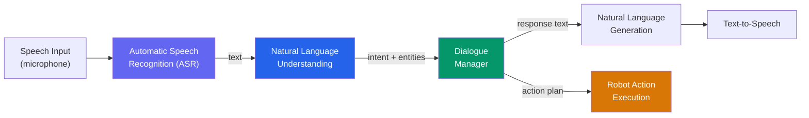
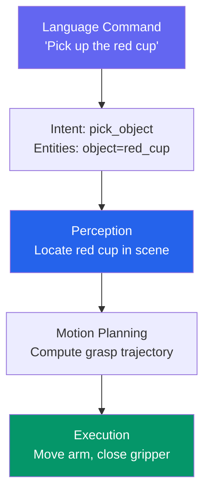

import KnowledgeCheck from '@site/src/components/KnowledgeCheck';


# Conversational Robotics

Humans communicate through language. For humanoid robots to work alongside people, they must understand natural language commands, ask clarifying questions, and report their status conversationally. In this chapter, we build the **Natural Language Understanding (NLU) pipeline** that connects human speech to robot actions.

---

## 1.1 Why Conversational Interfaces?

| Interaction Mode | Pros | Cons |
|---|---|---|
| GUI / Touchscreen | Precise, discoverable | Requires hands, eyes on screen |
| Gamepad / Joystick | Direct control | High cognitive load, not intuitive |
| Voice / Language | Hands-free, natural, accessible | Ambiguity, noise, latency |
| Gesture | Intuitive for spatial commands | Limited vocabulary, occlusion |

Voice and language interfaces are the most natural for non-expert users. A warehouse worker should be able to say "bring me the red box from shelf 3" without learning a control interface.

---

## 1.2 NLU Pipeline Architecture



The pipeline transforms spoken language into structured robot commands through five stages:

1. **ASR** — convert audio to text (Whisper, covered in next chapter)
2. **NLU** — extract intent and entities from text
3. **Dialogue Manager** — track conversation state, resolve ambiguity
4. **Action Execution** — translate commands to robot motions
5. **NLG + TTS** — generate spoken responses

---

## 1.3 Intent Recognition

**Intent** is what the user wants to do. **Entities** are the parameters of that intent.

| Utterance | Intent | Entities |
|---|---|---|
| "Pick up the red cup" | `pick_object` | object=cup, color=red |
| "Go to the kitchen" | `navigate` | location=kitchen |
| "What are you holding?" | `query_state` | attribute=held_object |
| "Put it on the table" | `place_object` | surface=table |
| "Stop" | `emergency_stop` | — |

### Intent Classification with Transformers

```python
"""Intent classification for robot commands."""

from dataclasses import dataclass
from typing import List, Optional


@dataclass
class ParsedCommand:
    """Structured output from the NLU pipeline."""
    intent: str
    confidence: float
    entities: dict
    raw_text: str


# Define the robot's intent schema
INTENT_SCHEMA = {
    'pick_object': {
        'description': 'Pick up an object',
        'required_entities': ['object'],
        'optional_entities': ['color', 'size', 'location'],
    },
    'place_object': {
        'description': 'Place held object on a surface',
        'required_entities': ['surface'],
        'optional_entities': ['position'],
    },
    'navigate': {
        'description': 'Move to a location',
        'required_entities': ['location'],
        'optional_entities': ['speed'],
    },
    'query_state': {
        'description': 'Ask about robot state',
        'required_entities': [],
        'optional_entities': ['attribute'],
    },
    'emergency_stop': {
        'description': 'Immediately stop all motion',
        'required_entities': [],
        'optional_entities': [],
    },
}


def classify_intent(
    text: str,
    schema: dict = INTENT_SCHEMA,
    confidence_threshold: float = 0.7,
) -> Optional[ParsedCommand]:
    """
    Classify user text into an intent with entities.

    In production, this calls a fine-tuned transformer model.
    Here we demonstrate the interface and output format.
    """
    # Simplified keyword matching (replace with model inference)
    text_lower = text.lower()

    if any(w in text_lower for w in ['pick', 'grab', 'get']):
        return ParsedCommand(
            intent='pick_object',
            confidence=0.9,
            entities=extract_entities(text_lower, 'pick_object'),
            raw_text=text,
        )
    elif any(w in text_lower for w in ['go', 'move', 'navigate']):
        return ParsedCommand(
            intent='navigate',
            confidence=0.85,
            entities=extract_entities(text_lower, 'navigate'),
            raw_text=text,
        )
    elif 'stop' in text_lower:
        return ParsedCommand(
            intent='emergency_stop',
            confidence=0.95,
            entities={},
            raw_text=text,
        )

    return None


def extract_entities(text: str, intent: str) -> dict:
    """Extract entities from text for a given intent."""
    entities = {}
    # Color extraction
    colors = ['red', 'blue', 'green', 'yellow', 'black', 'white']
    for color in colors:
        if color in text:
            entities['color'] = color
            break
    return entities
```

---

## 1.4 Dialogue Management

A dialogue manager tracks the conversation state, handles multi-turn interactions, and resolves ambiguity.

### Approaches Compared

| Approach | Complexity | Flexibility | Best For |
|---|---|---|---|
| **Finite State** | Low | Rigid | Simple command sequences |
| **Frame-Based** | Medium | Moderate | Slot-filling tasks |
| **Neural (LLM)** | High | Very flexible | Open-ended conversation |

### Frame-Based Dialogue Manager

```python
"""Frame-based dialogue manager for robot commands."""

from dataclasses import dataclass, field
from typing import Optional


@dataclass
class DialogueFrame:
    """A frame tracks required slots for an intent."""
    intent: str
    slots: dict = field(default_factory=dict)
    required_slots: list = field(default_factory=list)
    confirmed: bool = False

    @property
    def is_complete(self) -> bool:
        return all(
            slot in self.slots for slot in self.required_slots
        )

    @property
    def missing_slots(self) -> list:
        return [
            s for s in self.required_slots if s not in self.slots
        ]


class DialogueManager:
    """Manages multi-turn conversations with slot filling."""

    def __init__(self):
        self.current_frame: Optional[DialogueFrame] = None
        self.history: list = []

    def process(self, parsed: 'ParsedCommand') -> dict:
        """
        Process a parsed command and return the next action.

        Returns:
            {
                'action': 'execute' | 'clarify' | 'confirm',
                'message': str,
                'command': dict (if action == 'execute'),
            }
        """
        if parsed.intent == 'emergency_stop':
            self.current_frame = None
            return {
                'action': 'execute',
                'message': 'Stopping all motion.',
                'command': {'intent': 'emergency_stop'},
            }

        # Start or update frame
        if self.current_frame is None:
            schema = INTENT_SCHEMA.get(parsed.intent, {})
            self.current_frame = DialogueFrame(
                intent=parsed.intent,
                slots=parsed.entities,
                required_slots=schema.get('required_entities', []),
            )
        else:
            self.current_frame.slots.update(parsed.entities)

        # Check if all required slots are filled
        if not self.current_frame.is_complete:
            missing = self.current_frame.missing_slots
            return {
                'action': 'clarify',
                'message': f'I need more information: {missing[0]}. '
                           f'Can you specify the {missing[0]}?',
            }

        # Frame is complete — confirm and execute
        if not self.current_frame.confirmed:
            self.current_frame.confirmed = True
            slots = self.current_frame.slots
            return {
                'action': 'confirm',
                'message': (
                    f'I will {self.current_frame.intent} with '
                    f'{slots}. Shall I proceed?'
                ),
            }

        # Execute
        command = {
            'intent': self.current_frame.intent,
            **self.current_frame.slots,
        }
        self.history.append(command)
        self.current_frame = None
        return {
            'action': 'execute',
            'message': 'Executing command.',
            'command': command,
        }
```

---

## 1.5 Context Tracking in Multi-Turn Conversations

Robots must resolve references like "it", "there", and "the same one":

| Turn | User Says | Resolution |
|---|---|---|
| 1 | "Pick up the red cup" | object=red cup |
| 2 | "Put **it** on the table" | it → red cup (from turn 1) |
| 3 | "Now get the blue one" | one → cup (same type, different color) |
| 4 | "Take it **there**" | there → table (from turn 2) |

```python
"""Coreference resolution for multi-turn robot dialogue."""


class ConversationContext:
    """Track entities across conversation turns."""

    def __init__(self):
        self.last_object: Optional[str] = None
        self.last_location: Optional[str] = None
        self.held_object: Optional[str] = None

    def resolve(self, entities: dict) -> dict:
        """Replace pronouns with tracked entities."""
        resolved = dict(entities)

        # "it" / "that" → last mentioned object
        if resolved.get('object') in ['it', 'that', 'this']:
            if self.last_object:
                resolved['object'] = self.last_object

        # "there" → last mentioned location
        if resolved.get('location') in ['there', 'here']:
            if self.last_location:
                resolved['location'] = self.last_location

        # Update context
        if 'object' in resolved:
            self.last_object = resolved['object']
        if 'location' in resolved:
            self.last_location = resolved['location']

        return resolved
```

---

## 1.6 Grounding Language in Physical Actions

The bridge between language and robot behavior is **grounding** — mapping abstract commands to concrete motor actions.



### Grounding Table

| Language Concept | Physical Grounding |
|---|---|
| "red cup" | Object detector + color filter → 3D pose |
| "on the table" | Semantic scene map → surface coordinates |
| "gently" | Reduced velocity, force-limited grasp |
| "quickly" | Increased velocity, time-optimal trajectory |
| "next to" | Relative positioning with offset |

---

## 1.7 Error Handling and Clarification

Robots must handle misunderstandings gracefully:

```python
# Error recovery strategies
ERROR_STRATEGIES = {
    'low_confidence': {
        'threshold': 0.5,
        'response': "I'm not sure I understood. Did you mean '{top_intent}'?",
    },
    'missing_entity': {
        'response': "I understood you want to {intent}, but which {slot}?",
    },
    'impossible_action': {
        'response': "I can't {intent} right now because {reason}.",
    },
    'ambiguous_reference': {
        'response': "There are multiple {entity_type}s. Which one?",
    },
}
```

:::note Graceful Degradation
If the NLU pipeline fails completely, the robot should:
1. Acknowledge the failure: "I didn't understand that."
2. Suggest alternatives: "Could you rephrase, or try 'pick up [object]'?"
3. Never execute an uncertain command without confirmation.
:::

---

## 1.8 ROS 2 Conversational Interface Node

```python
#!/usr/bin/env python3
"""ROS 2 node for conversational robot control."""

import rclpy
from rclpy.node import Node
from std_msgs.msg import String


class ConversationalNode(Node):
    def __init__(self):
        super().__init__('conversational_interface')

        self.text_sub = self.create_subscription(
            String, '/speech/text', self.text_callback, 10
        )
        self.response_pub = self.create_publisher(
            String, '/speech/response', 10
        )
        self.command_pub = self.create_publisher(
            String, '/robot/command', 10
        )

        self.dialogue_manager = DialogueManager()
        self.context = ConversationContext()

        self.get_logger().info('Conversational interface ready.')

    def text_callback(self, msg: String):
        """Process incoming text from ASR."""
        text = msg.data
        self.get_logger().info(f'User: "{text}"')

        # Parse intent and entities
        parsed = classify_intent(text)
        if parsed is None:
            self.respond("I didn't understand that. Could you rephrase?")
            return

        # Resolve pronouns
        parsed.entities = self.context.resolve(parsed.entities)

        # Process through dialogue manager
        result = self.dialogue_manager.process(parsed)

        # Publish response
        self.respond(result['message'])

        # Execute if ready
        if result['action'] == 'execute' and 'command' in result:
            cmd_msg = String()
            cmd_msg.data = str(result['command'])
            self.command_pub.publish(cmd_msg)

    def respond(self, text: str):
        msg = String()
        msg.data = text
        self.response_pub.publish(msg)
        self.get_logger().info(f'Robot: "{text}"')


def main(args=None):
    rclpy.init(args=args)
    node = ConversationalNode()
    try:
        rclpy.spin(node)
    except KeyboardInterrupt:
        pass
    finally:
        node.destroy_node()
        rclpy.shutdown()


if __name__ == '__main__':
    main()
```

---

## 1.9 Chapter Summary

In this chapter, you learned:

- **Why conversational interfaces matter** — natural, hands-free, accessible interaction for non-expert users
- **NLU pipeline architecture** — ASR, intent classification, entity extraction, dialogue management, and response generation
- **Intent recognition** — classifying user commands into structured intents with entity parameters
- **Dialogue management** — frame-based slot filling, multi-turn tracking, and confirmation flows
- **Coreference resolution** — tracking "it", "there", and other pronouns across conversation turns
- **Language grounding** — mapping abstract commands to perception queries and motion plans
- **Error handling** — graceful degradation, clarification requests, and safety-first execution
- **ROS 2 integration** — a conversational node subscribing to ASR text and publishing robot commands

In the next chapter, we add **voice input** using Whisper for automatic speech recognition.

---

## Exercises

1. **Intent Schema Design**: Design an intent schema for a kitchen assistant robot with at least 8 intents (e.g., pour, stir, fetch, clean). Define required and optional entities for each.

2. **Dialogue Manager**: Extend the frame-based dialogue manager to handle intent switching mid-conversation (e.g., user changes from "pick up the cup" to "actually, go to the kitchen first").

3. **Coreference Resolution**: Implement and test coreference resolution for a 5-turn conversation involving multiple objects and locations.

4. **ROS 2 Integration**: Build the conversational node, connect it to a simulated robot, and test a full pick-and-place task driven entirely by text commands.

---

## Knowledge Check

<KnowledgeCheck
  chapterTitle="Conversational Robotics"
  questions={[
    {
      id: 1,
      question: "In a conversational robot system, what is the purpose of Named Entity Recognition (NER)?",
      options: [
        "It assigns names to ROS 2 nodes in the computation graph",
        "It identifies and classifies specific entities (objects, locations, quantities) within a natural language command",
        "It recognizes the speaker's name from voice recordings",
        "It maps entity names to robot joint identifiers"
      ],
      correctIndex: 1,
      explanation: "NER extracts structured information from natural language. In 'Pick up the red cup from the table', NER identifies 'red cup' as an object and 'table' as a location. This structured information is then passed to the action planner to generate robot commands.",
      sectionRef: "#natural-language-understanding",
      sectionLabel: "Natural Language Understanding"
    },
    {
      id: 2,
      question: "What is intent recognition in conversational robotics, and what does a well-designed intent system return?",
      options: [
        "It determines whether the user is speaking English or another language",
        "It classifies the user's goal (e.g., PICK_OBJECT, NAVIGATE_TO, STOP) and returns a structured intent label with extracted slots (parameters)",
        "It detects the emotional tone of the user's voice",
        "It decides which ROS 2 service to call based on voice pitch"
      ],
      correctIndex: 1,
      explanation: "Intent recognition maps natural language to a predefined set of robot actions. 'Bring me the bottle' → intent: PICK_AND_BRING, slots: {object: 'bottle', recipient: 'me'}. The slots provide the parameters needed to execute the action.",
      sectionRef: "#intent-recognition",
      sectionLabel: "Intent Recognition"
    },
    {
      id: 3,
      question: "What is the role of dialogue state tracking in a multi-turn robot conversation?",
      options: [
        "It tracks how long the current conversation has been running",
        "It maintains context across turns — remembering what was said, what actions were taken, and what remains to be clarified",
        "It detects when the user has finished speaking so the robot can respond",
        "It logs all conversation turns to a database for later analysis"
      ],
      correctIndex: 1,
      explanation: "Dialogue state tracking maintains the conversation context. If a user says 'Pick up the cup' then 'Now put it on the shelf', the tracker remembers 'it' refers to the cup. Without state tracking, each turn is interpreted in isolation, breaking multi-step instructions.",
      sectionRef: "#dialogue-state-tracking",
      sectionLabel: "Dialogue State Tracking"
    },
    {
      id: 4,
      question: "What is coreference resolution and why is it important for robot instruction following?",
      options: [
        "It resolves ambiguous joint names that appear in multiple robot models",
        "It determines what pronouns like 'it', 'there', or 'that one' refer to, linking them back to previously mentioned entities",
        "It matches ROS 2 service names to their correct packages",
        "It detects when the same instruction is repeated by the user"
      ],
      correctIndex: 1,
      explanation: "In 'Grab the apple. Put it in the basket', 'it' refers to 'the apple'. Coreference resolution links pronouns to their antecedents. Without it, the robot would not know what to put in the basket — making multi-step instructions impossible to follow.",
      sectionRef: "#coreference-resolution",
      sectionLabel: "Coreference Resolution"
    },
    {
      id: 5,
      question: "Why is it important for a conversational robot to explicitly ask for clarification when an instruction is ambiguous?",
      options: [
        "It is never important — robots should always attempt to execute with their best guess",
        "Asking for clarification prevents the robot from taking a wrong (potentially dangerous) action based on an incorrect interpretation of an ambiguous command",
        "Asking for clarification buys time for the planning algorithm to finish computing",
        "It is a legal requirement for robots operating near humans"
      ],
      correctIndex: 1,
      explanation: "If a user says 'move the thing' in a cluttered environment, guessing wrong could displace an important object or cause a collision. Explicitly asking 'Which object would you like me to move?' is safer and builds user trust — especially in household or collaborative robot settings.",
      sectionRef: "#clarification-strategies",
      sectionLabel: "Clarification Strategies"
    }
  ]}
/>
