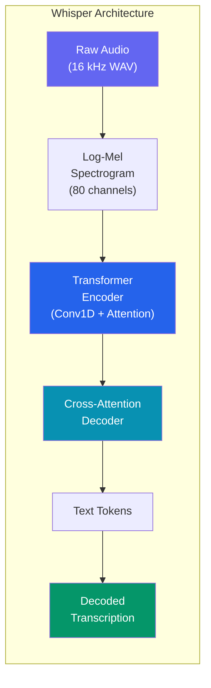
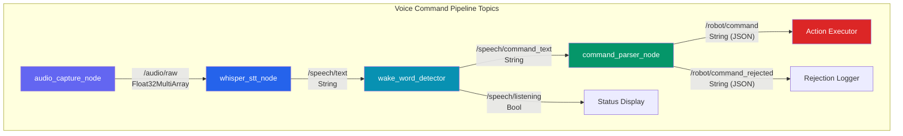

# Whisper Voice Integration

Giving robots the ability to understand spoken language is one of the most natural and powerful interaction paradigms in Physical AI. In this chapter, we integrate **OpenAI Whisper** -- a state-of-the-art automatic speech recognition (ASR) model -- into a ROS 2 robotics pipeline. You will learn how to capture audio from a microphone, transcribe it in real time, parse commands from natural language, and publish structured commands to ROS 2 topics.

---

## 2.1 Why Voice for Robots?

Human-robot interaction (HRI) research consistently shows that voice is the most intuitive modality for commanding robots in unstructured environments. Consider a warehouse worker whose hands are occupied, a patient in a hospital bed, or an astronaut in a spacesuit -- in all these cases, voice commands are the most practical interface.

| Modality | Advantages | Limitations |
|----------|-----------|-------------|
| **Voice** | Hands-free, natural, fast | Noisy environments, ambiguity |
| **Gesture** | Intuitive for spatial commands | Requires line-of-sight, camera |
| **GUI/Tablet** | Precise, structured input | Requires hands, attention |
| **Joystick** | Fine-grained control | Requires training, hands occupied |
| **Brain-Computer Interface** | Hands-free, no speech needed | Experimental, low bandwidth |

:::tip Key Insight
Voice commands are not just about convenience -- they enable **zero-training interaction**. A person who has never seen a robot before can still say "pick up the red cup" and expect the robot to understand. This is the promise of conversational robotics.
:::

---

## 2.2 OpenAI Whisper Overview

Whisper is a general-purpose speech recognition model trained on 680,000 hours of multilingual and multitask supervised data collected from the web. It approaches human-level robustness and accuracy on English speech recognition.

### Model Variants

Whisper comes in multiple sizes, trading off speed for accuracy:

| Model | Parameters | English-only | Multilingual | Relative Speed | VRAM Required |
|-------|-----------|-------------|-------------|----------------|---------------|
| `tiny` | 39 M | `tiny.en` | `tiny` | ~32x | ~1 GB |
| `base` | 74 M | `base.en` | `base` | ~16x | ~1 GB |
| `small` | 244 M | `small.en` | `small` | ~6x | ~2 GB |
| `medium` | 769 M | `medium.en` | `medium` | ~2x | ~5 GB |
| `large` | 1550 M | -- | `large-v3` | 1x | ~10 GB |
| `turbo` | 809 M | -- | `turbo` | ~8x | ~6 GB |

:::note Choosing the Right Model
For real-time robot voice commands in English, `base.en` or `small.en` offer the best tradeoff between latency and accuracy. For multilingual deployments or noisy factory environments, `medium` or `turbo` provide significantly better robustness. The `large-v3` model is best reserved for offline batch transcription.
:::

### Architecture

Whisper uses an encoder-decoder Transformer architecture. The audio is converted to an 80-channel log-Mel spectrogram, which is processed by the encoder. The decoder then autoregressively predicts text tokens.



### Installation

```bash
# Install Whisper and its dependencies
pip install openai-whisper

# For faster inference with GPU support
pip install openai-whisper torch torchvision torchaudio --index-url https://download.pytorch.org/whl/cu121

# Install audio capture dependencies
pip install sounddevice numpy scipy
```

---

## 2.3 Real-Time Audio Capture

Before we can transcribe speech, we need to capture audio from a microphone. We use the `sounddevice` library for cross-platform audio input.

### Audio Capture Node

```python
#!/usr/bin/env python3
"""
audio_capture_node.py

ROS 2 node that captures audio from a microphone and publishes
raw audio chunks to a ROS 2 topic for downstream processing.

Requirements:
    - Python 3.11+
    - rclpy, std_msgs, sounddevice, numpy
    - A working microphone device
"""

import numpy as np
import sounddevice as sd
import rclpy
from rclpy.node import Node
from std_msgs.msg import Float32MultiArray, MultiArrayDimension


class AudioCaptureNode(Node):
    """Captures audio from the system microphone and publishes chunks."""

    SAMPLE_RATE = 16000       # Whisper requires 16 kHz audio
    CHANNELS = 1              # Mono audio
    CHUNK_DURATION = 2.0      # Seconds per audio chunk
    DEVICE_INDEX = None       # None = default microphone

    def __init__(self):
        super().__init__('audio_capture_node')

        # Declare configurable parameters
        self.declare_parameter('sample_rate', self.SAMPLE_RATE)
        self.declare_parameter('chunk_duration', self.CHUNK_DURATION)
        self.declare_parameter('device_index', -1)  # -1 means default

        self.sample_rate = self.get_parameter('sample_rate').value
        self.chunk_duration = self.get_parameter('chunk_duration').value
        device_param = self.get_parameter('device_index').value
        self.device_index = None if device_param == -1 else device_param

        # Publisher for raw audio data
        self.audio_pub = self.create_publisher(
            Float32MultiArray,
            '/audio/raw',
            10
        )

        # Audio buffer
        self.chunk_size = int(self.sample_rate * self.chunk_duration)
        self.audio_buffer = np.zeros(self.chunk_size, dtype=np.float32)
        self.buffer_index = 0

        # Start the audio stream
        self.stream = sd.InputStream(
            samplerate=self.sample_rate,
            channels=self.CHANNELS,
            dtype='float32',
            device=self.device_index,
            callback=self._audio_callback,
            blocksize=1024,
        )
        self.stream.start()

        self.get_logger().info(
            f'Audio capture started: {self.sample_rate} Hz, '
            f'chunk={self.chunk_duration}s, '
            f'device={self.device_index or "default"}'
        )

    def _audio_callback(self, indata, frames, time_info, status):
        """Called by sounddevice for each audio block."""
        if status:
            self.get_logger().warn(f'Audio status: {status}')

        # Flatten to mono
        audio_data = indata[:, 0]

        # Fill the buffer
        remaining = self.chunk_size - self.buffer_index
        to_copy = min(len(audio_data), remaining)

        self.audio_buffer[self.buffer_index:self.buffer_index + to_copy] = (
            audio_data[:to_copy]
        )
        self.buffer_index += to_copy

        # When buffer is full, publish and reset
        if self.buffer_index >= self.chunk_size:
            self._publish_audio_chunk()
            self.buffer_index = 0

            # Copy any overflow into the new buffer
            overflow = len(audio_data) - to_copy
            if overflow > 0:
                self.audio_buffer[:overflow] = audio_data[to_copy:]
                self.buffer_index = overflow

    def _publish_audio_chunk(self):
        """Publish a complete audio chunk to the ROS 2 topic."""
        msg = Float32MultiArray()
        msg.layout.dim = [
            MultiArrayDimension(
                label='samples',
                size=self.chunk_size,
                stride=self.chunk_size
            )
        ]
        msg.data = self.audio_buffer.tolist()
        self.audio_pub.publish(msg)

        # Compute RMS for logging
        rms = np.sqrt(np.mean(self.audio_buffer ** 2))
        self.get_logger().debug(f'Published audio chunk, RMS={rms:.4f}')

    def destroy_node(self):
        """Clean up the audio stream."""
        self.stream.stop()
        self.stream.close()
        super().destroy_node()


def main(args=None):
    rclpy.init(args=args)
    node = AudioCaptureNode()
    try:
        rclpy.spin(node)
    except KeyboardInterrupt:
        node.get_logger().info('Audio capture interrupted.')
    finally:
        node.destroy_node()
        rclpy.shutdown()


if __name__ == '__main__':
    main()
```

:::caution Microphone Permissions
On Linux, ensure your user is in the `audio` group (`sudo usermod -aG audio $USER`). On Docker containers, you must pass `--device /dev/snd` and potentially use PulseAudio socket forwarding. Headless robots typically use USB microphones or microphone arrays.
:::

---

## 2.4 Voice Command Pipeline

The full voice command pipeline transforms raw audio into structured robot commands. Here is the end-to-end architecture:

```mermaid
flowchart LR
    A["Microphone<br/>Hardware"] --> B["Audio Capture<br/>Node"]
    B -->|"/audio/raw"| C["Voice Activity<br/>Detection"]
    C -->|"/audio/speech"| D["Whisper STT<br/>Node"]
    D -->|"/speech/text"| E["Wake Word<br/>Detector"]
    E -->|"/speech/command_text"| F["Command<br/>Parser"]
    F -->|"/robot/command"| G["Action<br/>Executor"]

    style A fill:#6366f1,color:#fff
    style D fill:#2563eb,color:#fff
    style F fill:#059669,color:#fff
    style G fill:#dc2626,color:#fff
```



### Pipeline Stages

1. **Audio Capture** -- Continuously records microphone input at 16 kHz mono.
2. **Voice Activity Detection (VAD)** -- Filters out silence to avoid unnecessary Whisper calls.
3. **Whisper STT** -- Transcribes speech segments into text.
4. **Wake Word Detection** -- Filters transcriptions for the robot's wake word (e.g., "Hey Robot").
5. **Command Parser** -- Extracts structured commands from natural language text.
6. **Action Executor** -- Translates parsed commands into ROS 2 action goals or topic messages.

---

## 2.5 Whisper Transcription Node

This node subscribes to raw audio chunks, runs Whisper inference, and publishes transcribed text.

```python
#!/usr/bin/env python3
"""
whisper_stt_node.py

ROS 2 node that subscribes to audio chunks, performs speech-to-text
transcription using OpenAI Whisper, and publishes the resulting text.

Requirements:
    - Python 3.11+
    - rclpy, std_msgs, openai-whisper, numpy, torch
"""

import numpy as np
import whisper
import torch
import rclpy
from rclpy.node import Node
from std_msgs.msg import Float32MultiArray, String


class WhisperSTTNode(Node):
    """Performs speech-to-text transcription using OpenAI Whisper."""

    def __init__(self):
        super().__init__('whisper_stt_node')

        # Parameters
        self.declare_parameter('model_size', 'base.en')
        self.declare_parameter('language', 'en')
        self.declare_parameter('temperature', 0.0)
        self.declare_parameter('energy_threshold', 0.01)
        self.declare_parameter('device', 'auto')

        model_size = self.get_parameter('model_size').value
        self.language = self.get_parameter('language').value
        self.temperature = self.get_parameter('temperature').value
        self.energy_threshold = self.get_parameter('energy_threshold').value
        device_param = self.get_parameter('device').value

        # Select device
        if device_param == 'auto':
            self.device = 'cuda' if torch.cuda.is_available() else 'cpu'
        else:
            self.device = device_param

        # Load the Whisper model
        self.get_logger().info(
            f'Loading Whisper model "{model_size}" on {self.device}...'
        )
        self.model = whisper.load_model(model_size, device=self.device)
        self.get_logger().info('Whisper model loaded successfully.')

        # Subscriber for raw audio
        self.audio_sub = self.create_subscription(
            Float32MultiArray,
            '/audio/raw',
            self._audio_callback,
            10
        )

        # Publisher for transcribed text
        self.text_pub = self.create_publisher(String, '/speech/text', 10)

        # Accumulation buffer for longer utterances
        self.accumulated_audio = np.array([], dtype=np.float32)
        self.max_accumulation_seconds = 10.0
        self.sample_rate = 16000

    def _audio_callback(self, msg: Float32MultiArray):
        """Process incoming audio chunks through Whisper."""
        audio_chunk = np.array(msg.data, dtype=np.float32)

        # Voice Activity Detection (simple energy-based)
        rms = np.sqrt(np.mean(audio_chunk ** 2))
        if rms < self.energy_threshold:
            # If we have accumulated audio, transcribe what we have
            if len(self.accumulated_audio) > self.sample_rate:
                self._transcribe_and_publish()
            return

        # Accumulate audio
        self.accumulated_audio = np.concatenate(
            [self.accumulated_audio, audio_chunk]
        )

        # Transcribe if we have enough audio
        max_samples = int(self.max_accumulation_seconds * self.sample_rate)
        if len(self.accumulated_audio) >= max_samples:
            self._transcribe_and_publish()

    def _transcribe_and_publish(self):
        """Run Whisper transcription and publish the result."""
        if len(self.accumulated_audio) < self.sample_rate * 0.5:
            # Less than 0.5s of audio -- skip
            self.accumulated_audio = np.array([], dtype=np.float32)
            return

        # Pad or trim to 30 seconds as Whisper expects
        audio = whisper.pad_or_trim(self.accumulated_audio)

        # Create log-Mel spectrogram
        mel = whisper.log_mel_spectrogram(audio).to(self.device)

        # Decode options
        options = whisper.DecodingOptions(
            language=self.language if self.language != 'auto' else None,
            temperature=self.temperature,
            without_timestamps=True,
        )

        # Transcribe
        result = whisper.decode(self.model, mel, options)

        # Publish if we got meaningful text
        text = result.text.strip()
        if text and text not in ('', '.', '...', '[BLANK_AUDIO]'):
            msg = String()
            msg.data = text
            self.text_pub.publish(msg)
            self.get_logger().info(f'Transcribed: "{text}"')

        # Reset buffer
        self.accumulated_audio = np.array([], dtype=np.float32)


def main(args=None):
    rclpy.init(args=args)
    node = WhisperSTTNode()
    try:
        rclpy.spin(node)
    except KeyboardInterrupt:
        node.get_logger().info('Whisper STT node interrupted.')
    finally:
        node.destroy_node()
        rclpy.shutdown()


if __name__ == '__main__':
    main()
```

---

## 2.6 Noise Handling Strategies

Real-world robot environments are noisy. Factory floors, kitchens, outdoor settings, and crowded rooms all present acoustic challenges. Here are the strategies we employ:

### Noise Mitigation Techniques

| Technique | Description | When to Use |
|-----------|------------|-------------|
| **Energy-based VAD** | Filter silence by RMS threshold | Basic; always on |
| **WebRTC VAD** | Google's neural VAD model | Moderate noise |
| **Spectral gating** | Frequency-domain noise subtraction | Stationary noise (fans, HVAC) |
| **Beamforming** | Microphone array spatial filtering | Multi-mic setups |
| **Whisper prompt conditioning** | Provide context to improve accuracy | Domain-specific vocabulary |
| **Noise-robust models** | Use `medium` or `large-v3` | High-noise, critical applications |

### Implementing Spectral Noise Gating

```python
"""
noise_gate.py

Simple spectral noise gating for preprocessing audio before
sending to Whisper. Reduces stationary background noise.

Requirements:
    - Python 3.11+
    - numpy, scipy
"""

import numpy as np
from scipy.signal import stft, istft


def spectral_noise_gate(
    audio: np.ndarray,
    sample_rate: int = 16000,
    noise_duration: float = 0.5,
    threshold_factor: float = 1.5,
    nperseg: int = 512,
) -> np.ndarray:
    """
    Apply spectral noise gating to an audio signal.

    Estimates the noise floor from the first `noise_duration` seconds
    of audio, then attenuates frequency bins below the threshold.

    Args:
        audio: Input audio signal (1D float32 array).
        sample_rate: Audio sample rate in Hz.
        noise_duration: Seconds of audio to use for noise estimation.
        threshold_factor: Multiplier for the noise floor threshold.
        nperseg: STFT window size.

    Returns:
        Denoised audio signal as a 1D float32 array.
    """
    # Compute STFT
    frequencies, times, Zxx = stft(
        audio, fs=sample_rate, nperseg=nperseg
    )

    # Estimate noise spectrum from the first N seconds
    noise_samples = int(noise_duration * sample_rate / (nperseg // 2))
    noise_spectrum = np.mean(np.abs(Zxx[:, :noise_samples]), axis=1)

    # Create a mask: attenuate bins below threshold
    threshold = noise_spectrum * threshold_factor
    magnitude = np.abs(Zxx)
    mask = magnitude > threshold[:, np.newaxis]

    # Apply mask with soft gating
    Zxx_clean = Zxx * mask.astype(np.float32)

    # Inverse STFT
    _, audio_clean = istft(Zxx_clean, fs=sample_rate, nperseg=nperseg)

    return audio_clean.astype(np.float32)


# Example usage
if __name__ == '__main__':
    # Generate a noisy test signal
    duration = 5.0
    sr = 16000
    t = np.linspace(0, duration, int(sr * duration), dtype=np.float32)

    # Clean speech-like signal (440 Hz tone)
    clean = 0.5 * np.sin(2 * np.pi * 440 * t)

    # Add white noise
    noise = 0.1 * np.random.randn(len(t)).astype(np.float32)
    noisy = clean + noise

    # Apply noise gate
    denoised = spectral_noise_gate(noisy, sample_rate=sr)
    print(f'Input RMS:    {np.sqrt(np.mean(noisy**2)):.4f}')
    print(f'Denoised RMS: {np.sqrt(np.mean(denoised**2)):.4f}')
    print(f'Noise reduction: {20 * np.log10(np.sqrt(np.mean(noisy**2)) / np.sqrt(np.mean(denoised**2))):.1f} dB')
```

:::note Microphone Arrays
For production humanoid robots, microphone arrays (4-8 microphones) with beamforming provide the best noise rejection. The ReSpeaker 4-Mic Array and MATRIX Voice are popular choices for ROS-based robots. Beamforming steers the "listening direction" toward the speaker, attenuating sounds from other directions by 10-20 dB.
:::

---

## 2.7 Wake Word Detection

A wake word prevents the robot from processing every ambient sound as a command. The robot only begins transcription after hearing a trigger phrase such as "Hey Robot" or "OK Atlas."

```python
#!/usr/bin/env python3
"""
wake_word_detector.py

ROS 2 node that listens for a configurable wake word in transcribed
text and gates command processing accordingly.

Requirements:
    - Python 3.11+
    - rclpy, std_msgs
"""

import re
import time
import rclpy
from rclpy.node import Node
from std_msgs.msg import String, Bool


class WakeWordDetector(Node):
    """Detects wake words in transcribed speech and gates commands."""

    def __init__(self):
        super().__init__('wake_word_detector')

        # Parameters
        self.declare_parameter('wake_words', ['hey robot', 'ok robot'])
        self.declare_parameter('timeout_seconds', 30.0)
        self.declare_parameter('case_sensitive', False)

        self.wake_words = self.get_parameter('wake_words').value
        self.timeout = self.get_parameter('timeout_seconds').value
        self.case_sensitive = self.get_parameter('case_sensitive').value

        # State tracking
        self.is_listening = False
        self.last_wake_time = 0.0

        # Subscriber for transcribed text
        self.text_sub = self.create_subscription(
            String, '/speech/text', self._text_callback, 10
        )

        # Publishers
        self.command_text_pub = self.create_publisher(
            String, '/speech/command_text', 10
        )
        self.listening_pub = self.create_publisher(
            Bool, '/speech/listening', 10
        )

        # Timer to check for timeout
        self.timeout_timer = self.create_timer(1.0, self._check_timeout)

        self.get_logger().info(
            f'Wake word detector started. '
            f'Wake words: {self.wake_words}, '
            f'Timeout: {self.timeout}s'
        )

    def _text_callback(self, msg: String):
        """Process incoming transcription for wake words or commands."""
        text = msg.data
        text_normalized = text if self.case_sensitive else text.lower()

        # Check for wake word
        wake_detected = False
        remaining_text = text_normalized
        for wake_word in self.wake_words:
            ww = wake_word if self.case_sensitive else wake_word.lower()
            if ww in text_normalized:
                wake_detected = True
                # Extract the command after the wake word
                pattern = re.escape(ww)
                parts = re.split(pattern, text_normalized, maxsplit=1)
                if len(parts) > 1:
                    remaining_text = parts[1].strip()
                else:
                    remaining_text = ''
                break

        if wake_detected:
            self.is_listening = True
            self.last_wake_time = time.time()
            self._publish_listening_state(True)
            self.get_logger().info('Wake word detected! Listening...')

            # If there is text after the wake word, publish it
            if remaining_text:
                self._publish_command(remaining_text)
        elif self.is_listening:
            # We are in listening mode -- forward the text
            self._publish_command(text)

    def _publish_command(self, text: str):
        """Publish command text for downstream processing."""
        msg = String()
        msg.data = text
        self.command_text_pub.publish(msg)
        self.get_logger().info(f'Command text: "{text}"')

        # Reset the timeout
        self.last_wake_time = time.time()

    def _publish_listening_state(self, listening: bool):
        """Publish the current listening state."""
        msg = Bool()
        msg.data = listening
        self.listening_pub.publish(msg)

    def _check_timeout(self):
        """Deactivate listening mode if timeout has elapsed."""
        if self.is_listening:
            elapsed = time.time() - self.last_wake_time
            if elapsed > self.timeout:
                self.is_listening = False
                self._publish_listening_state(False)
                self.get_logger().info(
                    f'Listening timed out after {self.timeout}s.'
                )


def main(args=None):
    rclpy.init(args=args)
    node = WakeWordDetector()
    try:
        rclpy.spin(node)
    except KeyboardInterrupt:
        node.get_logger().info('Wake word detector interrupted.')
    finally:
        node.destroy_node()
        rclpy.shutdown()


if __name__ == '__main__':
    main()
```

---

## 2.8 Command Parser

The command parser converts natural language transcriptions into structured robot commands. We use a rule-based approach with fallback to fuzzy matching.

```python
#!/usr/bin/env python3
"""
command_parser_node.py

ROS 2 node that parses natural language text into structured
robot commands with action, target, and parameter fields.

Requirements:
    - Python 3.11+
    - rclpy, std_msgs
"""

import re
import json
from dataclasses import dataclass, asdict
from typing import Optional
import rclpy
from rclpy.node import Node
from std_msgs.msg import String


@dataclass
class RobotCommand:
    """Structured robot command extracted from natural language."""
    action: str                       # e.g., "pick", "move", "wave"
    target: Optional[str] = None      # e.g., "red cup", "table"
    location: Optional[str] = None    # e.g., "kitchen", "left"
    parameters: Optional[dict] = None # e.g., {"speed": "slow"}
    confidence: float = 0.0           # Parser confidence [0, 1]
    raw_text: str = ''                # Original transcription


# Action vocabulary with synonyms
ACTION_VOCABULARY = {
    'pick': ['pick up', 'grab', 'grasp', 'take', 'get', 'fetch'],
    'place': ['put', 'place', 'set down', 'drop', 'release', 'leave'],
    'move': ['move', 'go', 'walk', 'navigate', 'drive', 'head'],
    'stop': ['stop', 'halt', 'freeze', 'pause', 'wait'],
    'wave': ['wave', 'greet', 'say hello', 'hi'],
    'look': ['look', 'see', 'find', 'search', 'locate', 'scan'],
    'turn': ['turn', 'rotate', 'spin', 'face'],
    'open': ['open', 'unlock'],
    'close': ['close', 'shut', 'lock'],
    'follow': ['follow', 'come with', 'track'],
}

# Location keywords
LOCATION_KEYWORDS = [
    'kitchen', 'living room', 'bedroom', 'bathroom', 'garage',
    'table', 'counter', 'shelf', 'floor', 'desk',
    'left', 'right', 'forward', 'backward', 'here', 'there',
]

# Speed modifiers
SPEED_MODIFIERS = {
    'slow': ['slowly', 'slow', 'carefully', 'gently'],
    'fast': ['fast', 'quickly', 'hurry', 'rapid'],
    'normal': ['normal', 'regular'],
}


def parse_command(text: str) -> RobotCommand:
    """
    Parse a natural language command into a structured RobotCommand.

    Uses pattern matching against a known action vocabulary, then
    extracts target objects, locations, and speed modifiers.

    Args:
        text: Natural language command string.

    Returns:
        RobotCommand with extracted fields and confidence score.
    """
    text_lower = text.lower().strip()
    command = RobotCommand(action='unknown', raw_text=text)

    # Step 1: Identify the action
    best_action = None
    best_match_len = 0
    for action, synonyms in ACTION_VOCABULARY.items():
        for synonym in synonyms:
            if synonym in text_lower:
                if len(synonym) > best_match_len:
                    best_action = action
                    best_match_len = len(synonym)

    if best_action:
        command.action = best_action
        command.confidence = 0.7
    else:
        command.confidence = 0.2

    # Step 2: Extract target object (noun phrase after the action verb)
    # Simple heuristic: look for "the <noun>" or "<adjective> <noun>"
    target_pattern = r'(?:the\s+)?(\w+(?:\s+\w+)?)\s*(?:from|on|to|in|at|$)'
    # Remove the action words from the text for target extraction
    remaining = text_lower
    for synonyms in ACTION_VOCABULARY.values():
        for synonym in synonyms:
            remaining = remaining.replace(synonym, '', 1)
    remaining = remaining.strip()

    if remaining:
        # Take the first meaningful noun phrase
        words = remaining.split()
        # Filter out prepositions and articles
        skip_words = {
            'the', 'a', 'an', 'to', 'from', 'on', 'in', 'at',
            'and', 'or', 'then', 'please', 'can', 'you',
        }
        target_words = [w for w in words if w not in skip_words]
        if target_words:
            command.target = ' '.join(target_words[:3])  # Max 3 words
            command.confidence += 0.15

    # Step 3: Extract location
    for loc in LOCATION_KEYWORDS:
        if loc in text_lower:
            command.location = loc
            command.confidence += 0.1
            break

    # Step 4: Extract speed modifier
    parameters = {}
    for speed, keywords in SPEED_MODIFIERS.items():
        for kw in keywords:
            if kw in text_lower:
                parameters['speed'] = speed
                break

    if parameters:
        command.parameters = parameters
        command.confidence += 0.05

    # Cap confidence at 1.0
    command.confidence = min(command.confidence, 1.0)

    return command


class CommandParserNode(Node):
    """ROS 2 node that parses voice commands into structured actions."""

    def __init__(self):
        super().__init__('command_parser_node')

        self.declare_parameter('min_confidence', 0.5)
        self.min_confidence = self.get_parameter('min_confidence').value

        # Subscriber for command text
        self.text_sub = self.create_subscription(
            String, '/speech/command_text', self._text_callback, 10
        )

        # Publisher for parsed commands (JSON)
        self.command_pub = self.create_publisher(
            String, '/robot/command', 10
        )

        # Publisher for rejected commands (low confidence)
        self.rejected_pub = self.create_publisher(
            String, '/robot/command_rejected', 10
        )

        self.get_logger().info(
            f'Command parser ready (min_confidence={self.min_confidence})'
        )

    def _text_callback(self, msg: String):
        """Parse incoming text and publish structured command."""
        command = parse_command(msg.data)

        if command.confidence >= self.min_confidence:
            cmd_msg = String()
            cmd_msg.data = json.dumps(asdict(command))
            self.command_pub.publish(cmd_msg)
            self.get_logger().info(
                f'Parsed: action={command.action}, '
                f'target={command.target}, '
                f'confidence={command.confidence:.2f}'
            )
        else:
            rej_msg = String()
            rej_msg.data = json.dumps(asdict(command))
            self.rejected_pub.publish(rej_msg)
            self.get_logger().warn(
                f'Rejected (low confidence={command.confidence:.2f}): '
                f'"{msg.data}"'
            )


def main(args=None):
    rclpy.init(args=args)
    node = CommandParserNode()
    try:
        rclpy.spin(node)
    except KeyboardInterrupt:
        node.get_logger().info('Command parser interrupted.')
    finally:
        node.destroy_node()
        rclpy.shutdown()


if __name__ == '__main__':
    main()
```

---

## 2.9 Streaming Transcription with Whisper

For lower latency, we can implement streaming transcription that processes audio in overlapping windows rather than waiting for complete utterances.

```python
"""
streaming_whisper.py

Streaming transcription engine that processes audio in overlapping
windows for near-real-time speech-to-text output.

Requirements:
    - Python 3.11+
    - openai-whisper, numpy, torch
"""

import numpy as np
import whisper
import torch
from collections import deque
from typing import Optional


class StreamingWhisper:
    """
    Streaming Whisper transcription engine.

    Maintains a sliding window of audio and produces partial
    transcriptions as new audio arrives. Uses overlap to avoid
    cutting words at window boundaries.

    Attributes:
        model: Loaded Whisper model.
        window_seconds: Length of each transcription window.
        overlap_seconds: Overlap between consecutive windows.
        sample_rate: Audio sample rate (must be 16000 for Whisper).
    """

    def __init__(
        self,
        model_size: str = 'base.en',
        window_seconds: float = 5.0,
        overlap_seconds: float = 1.0,
        language: str = 'en',
    ):
        self.device = 'cuda' if torch.cuda.is_available() else 'cpu'
        self.model = whisper.load_model(model_size, device=self.device)
        self.sample_rate = 16000
        self.window_seconds = window_seconds
        self.overlap_seconds = overlap_seconds
        self.language = language

        # Audio ring buffer
        self.window_samples = int(window_seconds * self.sample_rate)
        self.overlap_samples = int(overlap_seconds * self.sample_rate)
        self.step_samples = self.window_samples - self.overlap_samples
        self.audio_buffer = np.array([], dtype=np.float32)

        # Track previous transcriptions for deduplication
        self.previous_text = ''

    def feed_audio(self, audio_chunk: np.ndarray) -> Optional[str]:
        """
        Feed an audio chunk and return transcription if a full
        window is available.

        Args:
            audio_chunk: Audio samples as float32 numpy array.

        Returns:
            Transcribed text string, or None if not enough audio yet.
        """
        self.audio_buffer = np.concatenate(
            [self.audio_buffer, audio_chunk]
        )

        if len(self.audio_buffer) < self.window_samples:
            return None

        # Extract the current window
        window = self.audio_buffer[:self.window_samples]

        # Advance buffer by step size (keep overlap)
        self.audio_buffer = self.audio_buffer[self.step_samples:]

        # Transcribe
        audio_padded = whisper.pad_or_trim(window)
        mel = whisper.log_mel_spectrogram(audio_padded).to(self.device)

        options = whisper.DecodingOptions(
            language=self.language if self.language != 'auto' else None,
            temperature=0.0,
            without_timestamps=True,
        )
        result = whisper.decode(self.model, mel, options)
        text = result.text.strip()

        # Deduplicate: remove text already seen in previous window
        new_text = self._deduplicate(text)

        if new_text:
            self.previous_text = text
            return new_text

        return None

    def _deduplicate(self, text: str) -> str:
        """Remove overlapping text from consecutive windows."""
        if not self.previous_text:
            return text

        # Find the longest suffix of previous that is a prefix of current
        prev_words = self.previous_text.split()
        curr_words = text.split()

        for overlap_len in range(min(len(prev_words), len(curr_words)), 0, -1):
            if prev_words[-overlap_len:] == curr_words[:overlap_len]:
                # Return only the new words
                new_words = curr_words[overlap_len:]
                return ' '.join(new_words)

        return text

    def reset(self):
        """Clear the audio buffer and transcription history."""
        self.audio_buffer = np.array([], dtype=np.float32)
        self.previous_text = ''


# Example usage
if __name__ == '__main__':
    streamer = StreamingWhisper(model_size='base.en', window_seconds=5.0)

    # Simulate feeding audio chunks
    print('Streaming Whisper initialized.')
    print('Feed audio chunks via streamer.feed_audio(chunk)')
    print(f'Window: {streamer.window_seconds}s, '
          f'Overlap: {streamer.overlap_seconds}s')
```

---

## 2.10 Multilingual Support

Whisper natively supports transcription in 99 languages and can perform translation to English. This is critical for robots deployed in multilingual environments.

### Language Detection and Translation

```python
"""
multilingual_whisper.py

Demonstrates Whisper's multilingual capabilities: automatic language
detection, transcription in the source language, and translation
to English.

Requirements:
    - Python 3.11+
    - openai-whisper, numpy
"""

import whisper
import numpy as np


def detect_and_transcribe(
    audio: np.ndarray,
    model_size: str = 'small',
) -> dict:
    """
    Detect the spoken language, transcribe in the original language,
    and optionally translate to English.

    Args:
        audio: Audio signal as float32 numpy array at 16 kHz.
        model_size: Whisper model variant to use.

    Returns:
        Dictionary with 'language', 'transcription', and 'translation'.
    """
    model = whisper.load_model(model_size)

    # Step 1: Detect language from the first 30 seconds
    audio_padded = whisper.pad_or_trim(audio)
    mel = whisper.log_mel_spectrogram(audio_padded).to(model.device)
    _, probs = model.detect_language(mel)

    detected_lang = max(probs, key=probs.get)
    confidence = probs[detected_lang]

    # Step 2: Transcribe in original language
    result_transcribe = model.transcribe(
        audio,
        language=detected_lang,
        task='transcribe',
    )

    # Step 3: Translate to English (if not already English)
    translation = None
    if detected_lang != 'en':
        result_translate = model.transcribe(
            audio,
            language=detected_lang,
            task='translate',
        )
        translation = result_translate['text'].strip()

    return {
        'language': detected_lang,
        'language_confidence': float(confidence),
        'transcription': result_transcribe['text'].strip(),
        'translation': translation,
    }


# Supported languages (subset)
WHISPER_LANGUAGES = {
    'en': 'English',    'zh': 'Chinese',    'de': 'German',
    'es': 'Spanish',    'ru': 'Russian',    'ko': 'Korean',
    'fr': 'French',     'ja': 'Japanese',   'pt': 'Portuguese',
    'tr': 'Turkish',    'pl': 'Polish',     'ca': 'Catalan',
    'nl': 'Dutch',      'ar': 'Arabic',     'sv': 'Swedish',
    'it': 'Italian',    'id': 'Indonesian', 'hi': 'Hindi',
    'fi': 'Finnish',    'vi': 'Vietnamese', 'he': 'Hebrew',
    'uk': 'Ukrainian',  'el': 'Greek',      'ms': 'Malay',
    'cs': 'Czech',      'ro': 'Romanian',   'da': 'Danish',
    'hu': 'Hungarian',  'ta': 'Tamil',      'ur': 'Urdu',
}


if __name__ == '__main__':
    print(f'Whisper supports {len(WHISPER_LANGUAGES)}+ languages.')
    print('Use model.transcribe(audio, task="translate") for English translation.')
```

:::tip Urdu Language Support
Whisper's `small` and larger models support Urdu (`ur`) transcription. For the best Urdu recognition accuracy, use the `medium` or `large-v3` models. Combined with the translation feature, a robot deployed in Pakistan can accept Urdu voice commands and internally process them as English action primitives.
:::

---

## 2.11 ROS 2 Integration: Complete Launch File

Bringing all the nodes together into a single launch file:

```python
"""
voice_command.launch.py

ROS 2 launch file that starts the complete voice command pipeline:
audio capture, Whisper STT, wake word detection, and command parsing.

Requirements:
    - ROS 2 Humble+
    - All voice pipeline nodes installed in the workspace
"""

from launch import LaunchDescription
from launch.actions import DeclareLaunchArgument
from launch.substitutions import LaunchConfiguration
from launch_ros.actions import Node


def generate_launch_description():
    """Generate launch description for the voice command pipeline."""

    return LaunchDescription([
        # Launch arguments
        DeclareLaunchArgument(
            'whisper_model', default_value='base.en',
            description='Whisper model size'
        ),
        DeclareLaunchArgument(
            'wake_words', default_value="['hey robot', 'ok robot']",
            description='Wake words for activation'
        ),

        # Audio Capture Node
        Node(
            package='voice_pipeline',
            executable='audio_capture_node',
            name='audio_capture',
            output='screen',
            parameters=[{
                'sample_rate': 16000,
                'chunk_duration': 2.0,
            }],
        ),

        # Whisper STT Node
        Node(
            package='voice_pipeline',
            executable='whisper_stt_node',
            name='whisper_stt',
            output='screen',
            parameters=[{
                'model_size': LaunchConfiguration('whisper_model'),
                'language': 'en',
                'energy_threshold': 0.01,
            }],
        ),

        # Wake Word Detector
        Node(
            package='voice_pipeline',
            executable='wake_word_detector',
            name='wake_word_detector',
            output='screen',
            parameters=[{
                'timeout_seconds': 30.0,
            }],
        ),

        # Command Parser
        Node(
            package='voice_pipeline',
            executable='command_parser_node',
            name='command_parser',
            output='screen',
            parameters=[{
                'min_confidence': 0.5,
            }],
        ),
    ])
```

### Topic Architecture

The complete topic graph for the voice pipeline:



---

## 2.12 Performance Benchmarks

Understanding the latency characteristics of each pipeline stage is critical for real-time voice control.

| Stage | Model/Config | Latency (CPU) | Latency (GPU) | Notes |
|-------|-------------|---------------|---------------|-------|
| Audio capture | 2s chunks | 2000 ms | 2000 ms | Fixed by chunk size |
| VAD (energy) | RMS threshold | < 1 ms | < 1 ms | Negligible |
| Whisper `tiny.en` | 39M params | ~500 ms | ~50 ms | Fastest, least accurate |
| Whisper `base.en` | 74M params | ~1000 ms | ~80 ms | Good speed/accuracy |
| Whisper `small.en` | 244M params | ~3000 ms | ~150 ms | Best for most robots |
| Whisper `medium.en` | 769M params | ~8000 ms | ~400 ms | High accuracy |
| Wake word check | String matching | < 1 ms | < 1 ms | Negligible |
| Command parser | Rule-based | < 1 ms | < 1 ms | Negligible |
| **End-to-end** | `base.en` + GPU | -- | **~2.1 s** | Dominated by chunk size |

:::caution Real-Time Constraints
For responsive voice control, the total pipeline latency should be under 3 seconds. With a 2-second audio chunk and `base.en` on a GPU, you achieve approximately 2.1 seconds end-to-end. To reduce this further, decrease the chunk duration to 1 second (at the cost of shorter utterance support) or use the `tiny.en` model.
:::

---

## 2.13 Chapter Summary

In this chapter, you learned:

- **Why voice matters** for human-robot interaction -- it provides the most natural, hands-free command interface for robots in real-world environments.
- **OpenAI Whisper** architecture and model variants, from `tiny` (39M parameters, fastest) to `large-v3` (1.55B parameters, most accurate).
- **Real-time audio capture** using `sounddevice` with a ROS 2 publisher node that streams 16 kHz mono audio chunks.
- **Whisper transcription** integrated as a ROS 2 subscriber/publisher node with energy-based voice activity detection.
- **Noise handling** strategies including spectral noise gating, beamforming, and model selection for noisy environments.
- **Wake word detection** to gate command processing and prevent false activations from ambient speech.
- **Command parsing** from natural language into structured robot commands using vocabulary-based pattern matching.
- **Streaming transcription** with overlapping windows for lower-latency speech recognition.
- **Multilingual support** with automatic language detection and English translation for global robot deployments.
- **ROS 2 integration** with a complete launch file that orchestrates the entire voice pipeline.

In the next chapter, we will explore how **LLM Task Planning** takes these parsed voice commands and generates multi-step action plans for robot execution.

---

## Exercises

### Exercise 1: Basic Voice Capture

Set up the `AudioCaptureNode` and verify that it publishes audio data. Use `ros2 topic echo /audio/raw` to inspect the messages. Calculate the actual data rate (samples/second) and verify it matches the configured 16 kHz.

### Exercise 2: Whisper Model Comparison

Run the same set of 10 voice commands through `tiny.en`, `base.en`, and `small.en` models. Create a table comparing:
- Transcription accuracy (word error rate)
- Average latency per transcription
- GPU memory usage

Which model would you recommend for a mobile robot with an NVIDIA Jetson Orin Nano (8 GB VRAM)?

### Exercise 3: Noise Robustness

Record voice commands in three environments: quiet room, playing music, and running a vacuum cleaner. Test transcription accuracy with and without the spectral noise gate. Measure the word error rate improvement from noise gating.

### Exercise 4: Build a Voice-Controlled Robot Command System

Combine all nodes from this chapter into a working voice command pipeline. Your system should:

1. Listen for the wake word "Hey Robot"
2. Transcribe the following speech using Whisper
3. Parse the command into a structured `RobotCommand`
4. Publish the command to `/robot/command`
5. Handle at least these commands: `pick up <object>`, `move to <location>`, `stop`, `look at <target>`

Test with at least 20 different voice commands and report the end-to-end success rate (percentage of commands correctly parsed and published).

### Exercise 5: Multilingual Commands

Configure the pipeline to accept commands in two languages (e.g., English and Urdu or English and Spanish). Implement automatic language detection and translate non-English commands to English before parsing. Test with 10 commands in each language.
