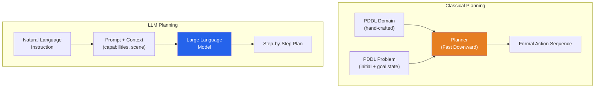
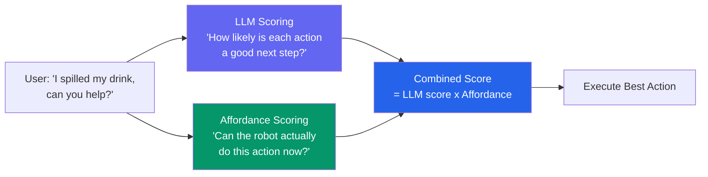
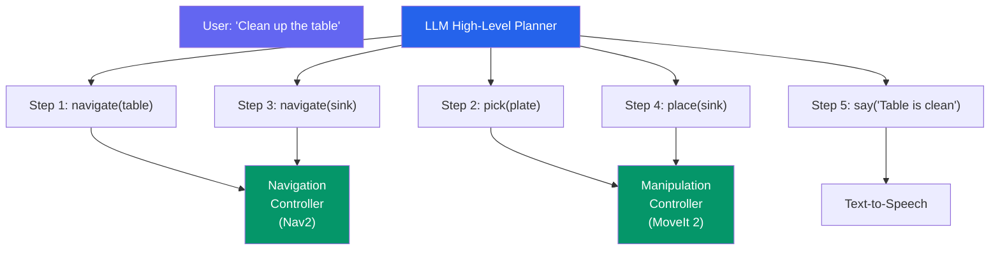

import KnowledgeCheck from '@site/src/components/KnowledgeCheck';


# LLM-Based Task Planning

Classical robot planners require hand-crafted domain definitions — every object, action, and precondition must be formally specified. **Large Language Models (LLMs)** offer an alternative: they can decompose high-level instructions into step-by-step plans using their world knowledge, without explicit domain engineering. In this chapter, we build an LLM-powered task planner that is grounded in the robot's actual capabilities and constrained by safety rules.

---

## 3.1 Classical vs LLM-Based Planning

| Aspect | Classical (PDDL) | LLM-Based |
|---|---|---|
| Domain definition | Hand-crafted predicates and actions | Implicit in model weights |
| Generalization | Only within defined domain | Broad world knowledge |
| Correctness guarantee | Provably optimal (if solvable) | No formal guarantee |
| Setup cost | High (domain engineering) | Low (prompt engineering) |
| Novel tasks | Cannot handle undefined actions | Can reason about new scenarios |
| Failure modes | Clean: "unsolvable" | Subtle: hallucinated actions |



---

## 3.2 Landmark Approaches

| System | Key Idea | Year |
|---|---|---|
| **SayCan** (Google) | LLM proposes actions; affordance functions score feasibility | 2022 |
| **Code as Policies** (Google) | LLM writes Python code that calls robot APIs | 2022 |
| **Inner Monologue** (Google) | LLM re-plans based on environment feedback | 2022 |
| **TidyBot** (Princeton) | LLM infers user preferences for object placement | 2023 |
| **VoxPoser** (Stanford) | LLM generates 3D value maps for manipulation | 2023 |
| **RT-2** (Google DeepMind) | VLA — LLM directly outputs actions (no separate planner) | 2023 |

### SayCan: Grounded Planning



---

## 3.3 Prompt Engineering for Robot Planning

The prompt is the interface between the LLM and the robot. A well-structured prompt includes:

1. **System context** — what the robot can do
2. **Scene description** — what the robot sees
3. **Task instruction** — what the user wants
4. **Output format** — structured plan format

```python
"""LLM-based task planner with structured prompts."""

from dataclasses import dataclass
from typing import List


@dataclass
class RobotCapability:
    name: str
    description: str
    preconditions: List[str]
    effects: List[str]


# Define robot's action repertoire
CAPABILITIES = [
    RobotCapability(
        name="pick(object)",
        description="Pick up an object with the gripper",
        preconditions=["gripper is empty", "object is reachable"],
        effects=["robot is holding object"],
    ),
    RobotCapability(
        name="place(surface)",
        description="Place held object on a surface",
        preconditions=["robot is holding an object"],
        effects=["object is on surface", "gripper is empty"],
    ),
    RobotCapability(
        name="navigate(location)",
        description="Move base to a location",
        preconditions=["path to location is clear"],
        effects=["robot is at location"],
    ),
    RobotCapability(
        name="open_gripper()",
        description="Open the gripper",
        preconditions=[],
        effects=["gripper is open"],
    ),
    RobotCapability(
        name="say(message)",
        description="Speak a message to the user",
        preconditions=[],
        effects=["user is informed"],
    ),
]


def build_planning_prompt(
    task: str,
    scene_description: str,
    capabilities: List[RobotCapability],
    robot_state: dict,
) -> str:
    """
    Construct the LLM prompt for task planning.

    Returns a structured prompt string.
    """
    cap_text = "\n".join(
        f"- {c.name}: {c.description} "
        f"[requires: {', '.join(c.preconditions) or 'none'}]"
        for c in capabilities
    )

    state_text = "\n".join(
        f"- {k}: {v}" for k, v in robot_state.items()
    )

    return f"""You are a robot task planner. Generate a step-by-step plan using ONLY the available actions.

## Available Actions
{cap_text}

## Current Scene
{scene_description}

## Robot State
{state_text}

## Task
{task}

## Rules
1. Use ONLY the actions listed above. Do not invent new actions.
2. Check preconditions before each action.
3. If the task is impossible with available actions, say so.
4. Output each step on a new line as: Step N: action_name(arguments)

## Plan
"""
```

---

## 3.4 Affordance Grounding

LLMs may propose actions the robot cannot physically execute. **Affordance functions** score whether an action is currently feasible:

```python
"""Affordance scoring for grounded LLM planning."""

from typing import Dict, Callable


class AffordanceChecker:
    """
    Scores whether proposed actions are physically feasible
    given the current robot and scene state.
    """

    def __init__(self, perception_state: dict):
        self.state = perception_state

    def score_pick(self, object_name: str) -> float:
        """Can the robot pick this object?"""
        obj = self.state.get('detected_objects', {}).get(object_name)
        if obj is None:
            return 0.0  # Object not detected

        # Check reachability
        distance = obj.get('distance', float('inf'))
        if distance > 0.8:  # Beyond arm reach
            return 0.1

        # Check gripper state
        if self.state.get('gripper_holding') is not None:
            return 0.0  # Already holding something

        # Object is reachable and gripper is free
        return 0.9

    def score_navigate(self, location: str) -> float:
        """Can the robot navigate to this location?"""
        known_locations = self.state.get('known_locations', [])
        if location not in known_locations:
            return 0.1  # Unknown location

        path_clear = self.state.get('path_clear', {}).get(location, False)
        return 0.9 if path_clear else 0.3

    def score_action(self, action: str, args: dict) -> float:
        """Score any action's feasibility."""
        scorers = {
            'pick': lambda: self.score_pick(args.get('object', '')),
            'place': lambda: 0.9 if self.state.get('gripper_holding') else 0.0,
            'navigate': lambda: self.score_navigate(args.get('location', '')),
            'open_gripper': lambda: 0.95,
            'say': lambda: 0.99,
        }
        scorer = scorers.get(action, lambda: 0.0)
        return scorer()
```

---

## 3.5 Safety Constraints

LLM planners must be constrained to prevent dangerous actions:

```python
"""Safety validation for LLM-generated plans."""

# Actions that are always forbidden
FORBIDDEN_ACTIONS = [
    'throw', 'drop_from_height', 'squeeze_hard',
    'move_fast_near_human', 'ignore_obstacle',
]

# Safety rules checked before execution
SAFETY_RULES = [
    {
        'rule': 'No movement while humans are within 0.5m',
        'check': lambda state: state.get('nearest_human_dist', 10) > 0.5,
        'override': 'emergency_stop',
    },
    {
        'rule': 'Gripper force must not exceed 20N',
        'check': lambda state: state.get('gripper_force', 0) < 20.0,
        'override': 'open_gripper',
    },
    {
        'rule': 'Joint velocities must stay within limits',
        'check': lambda state: all(
            v < limit for v, limit in
            zip(state.get('joint_velocities', []),
                state.get('joint_velocity_limits', []))
        ),
        'override': 'freeze_joints',
    },
]


def validate_plan(
    plan_steps: list,
    robot_state: dict,
) -> tuple:
    """
    Validate an LLM-generated plan against safety rules.

    Returns:
        (is_safe: bool, violations: list of str)
    """
    violations = []

    for step in plan_steps:
        action = step.get('action', '').lower()

        # Check forbidden actions
        if action in FORBIDDEN_ACTIONS:
            violations.append(
                f"Forbidden action: '{action}'"
            )

        # Check safety rules
        for rule in SAFETY_RULES:
            if not rule['check'](robot_state):
                violations.append(
                    f"Safety violation: {rule['rule']}"
                )

    return len(violations) == 0, violations
```

---

## 3.6 Hierarchical Planning

Combine high-level LLM planning with low-level motion controllers:



The LLM handles task decomposition (what to do) while specialized controllers handle execution (how to do it).

---

## 3.7 Feedback Loops and Re-Planning

Real-world execution fails. The planner must detect failures and adapt:

```python
"""Re-planning on execution failure."""


class AdaptivePlanner:
    """Plans with LLM, executes, and re-plans on failure."""

    def __init__(self, llm_client, affordance_checker):
        self.llm = llm_client
        self.checker = affordance_checker
        self.max_replans = 3

    def execute_plan(self, task: str, scene: str, state: dict):
        """Execute a task with automatic re-planning."""
        for attempt in range(self.max_replans):
            # Generate plan
            prompt = build_planning_prompt(
                task, scene, CAPABILITIES, state
            )
            plan = self.llm.generate(prompt)
            steps = parse_plan(plan)

            # Validate safety
            is_safe, violations = validate_plan(steps, state)
            if not is_safe:
                print(f"Safety violations: {violations}")
                task = f"{task} (avoid: {violations[0]})"
                continue

            # Execute step by step
            for i, step in enumerate(steps):
                success = self.execute_step(step)
                if not success:
                    # Get updated scene description
                    scene = self.get_current_scene()
                    state = self.get_current_state()
                    remaining = [s['action'] for s in steps[i:]]
                    task = (
                        f"Continue: {task}. "
                        f"Step '{step['action']}' failed. "
                        f"Remaining: {remaining}"
                    )
                    break
            else:
                # All steps succeeded
                return True

        return False

    def execute_step(self, step: dict) -> bool:
        """Execute a single plan step. Returns success."""
        # Implementation calls the appropriate controller
        pass

    def get_current_scene(self) -> str:
        """Get updated scene description from perception."""
        pass

    def get_current_state(self) -> dict:
        """Get current robot state."""
        pass


def parse_plan(plan_text: str) -> list:
    """Parse LLM output into structured steps."""
    steps = []
    for line in plan_text.strip().split('\n'):
        if line.startswith('Step'):
            # Extract action and arguments
            action_part = line.split(':', 1)[1].strip()
            steps.append({'action': action_part, 'raw': line})
    return steps
```

---

## 3.8 Building an LLM Planner with OpenAI and ROS 2

```python
#!/usr/bin/env python3
"""ROS 2 node for LLM-based task planning."""

import rclpy
from rclpy.node import Node
from std_msgs.msg import String
import json


class LLMPlannerNode(Node):
    def __init__(self):
        super().__init__('llm_planner')

        self.declare_parameter('model', 'gpt-4o-mini')
        self.declare_parameter('max_steps', 10)

        self.task_sub = self.create_subscription(
            String, '/task/instruction', self.task_callback, 10
        )
        self.plan_pub = self.create_publisher(
            String, '/task/plan', 10
        )
        self.action_pub = self.create_publisher(
            String, '/robot/command', 10
        )

        self.get_logger().info('LLM Planner node ready.')

    def task_callback(self, msg: String):
        task = msg.data
        self.get_logger().info(f'Planning: "{task}"')

        # Build prompt with current state
        prompt = build_planning_prompt(
            task=task,
            scene_description=self.get_scene(),
            capabilities=CAPABILITIES,
            robot_state=self.get_state(),
        )

        # Call LLM (simplified — use openai client in production)
        plan = self.call_llm(prompt)

        # Publish plan
        plan_msg = String()
        plan_msg.data = plan
        self.plan_pub.publish(plan_msg)

        # Parse and execute steps
        steps = parse_plan(plan)
        for step in steps:
            is_safe, violations = validate_plan([step], self.get_state())
            if is_safe:
                cmd = String()
                cmd.data = json.dumps(step)
                self.action_pub.publish(cmd)

    def call_llm(self, prompt: str) -> str:
        """Call the LLM API."""
        # Use openai.ChatCompletion in production
        return "Step 1: navigate(table)\nStep 2: pick(cup)"

    def get_scene(self) -> str:
        return "Table with red cup and blue plate."

    def get_state(self) -> dict:
        return {'gripper_holding': None, 'location': 'home'}


def main(args=None):
    rclpy.init(args=args)
    node = LLMPlannerNode()
    try:
        rclpy.spin(node)
    except KeyboardInterrupt:
        pass
    finally:
        node.destroy_node()
        rclpy.shutdown()


if __name__ == '__main__':
    main()
```

---

## 3.9 Chapter Summary

In this chapter, you learned:

- **Classical vs LLM planning** — formal guarantees vs flexible generalization
- **Landmark systems** — SayCan, Code as Policies, Inner Monologue, and their key innovations
- **Prompt engineering** — structuring prompts with capabilities, scene context, and output format
- **Affordance grounding** — scoring action feasibility to prevent hallucinated plans
- **Safety constraints** — forbidden actions, safety rules, and pre-execution validation
- **Hierarchical planning** — LLM for task decomposition, specialized controllers for execution
- **Re-planning** — detecting failures and adapting the plan with updated scene information
- **ROS 2 integration** — an LLM planner node that subscribes to tasks and publishes executable commands

In the next chapter, we explore **Vision-Language-Action (VLA) models** that collapse planning and control into a single end-to-end neural network.

---

## Exercises

1. **Prompt Design**: Write a planning prompt for a robot barista that can make coffee. Include at least 6 capabilities and test with 3 different customer orders.

2. **Affordance Scoring**: Implement affordance functions for a mobile manipulator. Test that the planner correctly rejects "pick" when the gripper is full and "navigate" when the path is blocked.

3. **Safety Validation**: Create a safety rule set for a household robot. Test that the validator catches at least 5 different types of unsafe plans.

4. **Re-Planning Loop**: Simulate a pick-and-place task where the first pick attempt fails (object slipped). Verify that the re-planner generates a corrected plan based on the updated scene.

---

## Knowledge Check

<KnowledgeCheck
  chapterTitle="LLM-Based Task Planning"
  questions={[
    {
      id: 1,
      question: "What is the primary advantage of using an LLM for robot task planning compared to handcrafted rule-based planners?",
      options: [
        "LLMs guarantee correct plans because they have memorized all possible robot scenarios",
        "LLMs can handle diverse, open-ended natural language instructions and generalize to novel situations without needing explicit rules for every scenario",
        "LLMs plan faster than rule-based systems for complex tasks",
        "LLMs eliminate the need for a robot action library"
      ],
      correctIndex: 1,
      explanation: "Rule-based planners require explicitly programmed rules for every situation — brittle and hard to scale. LLMs can interpret diverse natural language, understand context, and compose action sequences for novel scenarios using their broad world knowledge — without pre-defined rules for each case.",
      sectionRef: "#llm-planning-advantages",
      sectionLabel: "LLM Planning Advantages"
    },
    {
      id: 2,
      question: "What is 'structured output' in the context of LLM-based robot planning, and why is it important?",
      options: [
        "Structured output formats the LLM's response for display in a user interface",
        "Forcing the LLM to output valid JSON or a predefined schema makes the plan machine-readable and directly executable by the robot's action dispatcher",
        "Structured output limits the LLM to using only pre-approved vocabulary in its plans",
        "It refers to organizing the LLM's training data in a structured database"
      ],
      correctIndex: 1,
      explanation: "An LLM producing free-text plans requires complex parsing to extract robot commands. Structured output (enforced via function calling or output schemas) produces JSON like `{action: 'pick', object: 'cup', location: 'table'}` — directly parseable by the robot's execution layer without ambiguity.",
      sectionRef: "#structured-output",
      sectionLabel: "Structured Output"
    },
    {
      id: 3,
      question: "What is the purpose of a 'safety validator' in an LLM planning pipeline for robots?",
      options: [
        "It checks that the LLM's API key is valid before each request",
        "It reviews LLM-generated plans against safety constraints (joint limits, workspace boundaries, collision rules) and rejects or modifies unsafe plans before execution",
        "It validates that the robot's hardware sensors are functioning before running the plan",
        "It ensures the LLM does not use inappropriate language in its responses"
      ],
      correctIndex: 1,
      explanation: "LLMs can generate plans that are syntactically correct but physically dangerous — exceeding joint limits, commanding the robot into obstacles, or attempting impossible grasps. A safety validator applies domain-specific rules to filter or correct dangerous plans before the robot executes them.",
      sectionRef: "#safety-validation",
      sectionLabel: "Safety Validation"
    },
    {
      id: 4,
      question: "What is 'chain-of-thought prompting' and how does it benefit LLM-based robot task planning?",
      options: [
        "It chains multiple LLM API calls together to parallelize planning",
        "It asks the LLM to show its reasoning steps before outputting the final plan, improving plan quality and making errors easier to diagnose",
        "It creates a chain of prompt templates linked together for different robot tasks",
        "It is a technique to compress long robot plans into shorter prompt inputs"
      ],
      correctIndex: 1,
      explanation: "Chain-of-thought (CoT) prompting asks the LLM to reason step by step: 'First I need to locate the cup, then move the arm to it, then close the gripper...'. This structured reasoning improves plan quality for complex tasks and makes the LLM's assumptions visible — enabling better debugging and safety review.",
      sectionRef: "#chain-of-thought",
      sectionLabel: "Chain-of-Thought Prompting"
    },
    {
      id: 5,
      question: "What is 're-planning' in a closed-loop robot execution system, and when is it triggered?",
      options: [
        "Re-planning is scheduling the next autonomous mission",
        "Re-planning is triggered when execution feedback indicates the current plan has failed (e.g., object not found, grasp failed), generating a new plan based on the updated world state",
        "Re-planning creates a backup plan before the primary plan executes",
        "Re-planning optimizes an existing plan to reduce the number of steps"
      ],
      correctIndex: 1,
      explanation: "Robots operate in an uncertain world. If the object moved or a grasp failed, continuing the original plan is wrong. Re-planning queries the LLM with updated world state (from perception) to generate a corrected plan. This closed-loop adaptation is essential for reliable task execution.",
      sectionRef: "#closed-loop-replanning",
      sectionLabel: "Closed-Loop Re-planning"
    }
  ]}
/>
