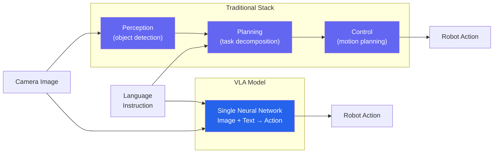
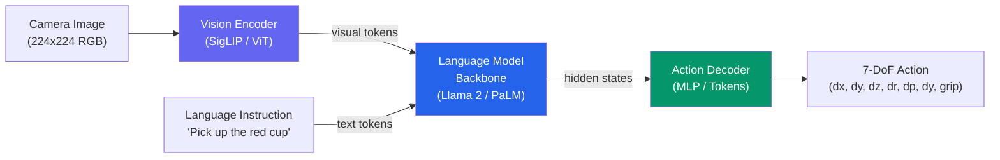
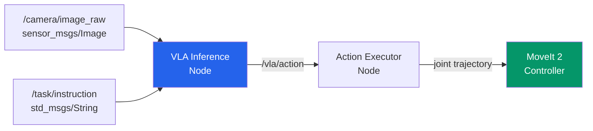

import KnowledgeCheck from '@site/src/components/KnowledgeCheck';


# VLA Integration

Vision-Language-Action (VLA) models represent the frontier of robot intelligence. Instead of separate perception, planning, and control modules, a VLA takes **camera images** and **language instructions** as input and directly outputs **robot actions**. In this chapter, we explore VLA architectures, fine-tune models for custom tasks, deploy them on edge hardware, and integrate them into a ROS 2 control pipeline.

---

## 4.1 What Are VLA Models?

A VLA model is an end-to-end neural network that collapses the traditional robotics stack:



### Key VLA Models

| Model | Organization | Architecture | Training Data | Year |
|---|---|---|---|---|
| **RT-2** | Google DeepMind | PaLI-X (55B) + action tokens | RT-2 dataset (130K demos) | 2023 |
| **Octo** | UC Berkeley | Transformer, multi-task | Open X-Embodiment (800K) | 2024 |
| **OpenVLA** | Stanford / TRI | Llama 2 7B + SigLIP | Open X-Embodiment (970K) | 2024 |
| **pi0** | Physical Intelligence | 3B VLM + flow matching | Diverse robot data | 2024 |
| **RT-H** | Google DeepMind | Hierarchical RT + language | RT dataset + human hints | 2024 |

---

## 4.2 VLA Architecture

Every VLA model has three core components:



### Vision Encoder

Converts camera images into a sequence of visual tokens that the language model can attend to. **SigLIP** (used by OpenVLA) and **ViT** (used by RT-2) are common choices.

### Language Model Backbone

The core reasoning engine. It processes both visual and text tokens, enabling the model to understand the relationship between what it sees and what it should do.

### Action Decoder

Converts the language model's hidden states into robot actions. Two main approaches:

| Approach | Method | Pros | Cons |
|---|---|---|---|
| **Discretized tokens** | Quantize continuous actions into 256 bins | Reuses LM generation, simple | Quantization error |
| **Continuous MLP** | MLP head on hidden states | No quantization loss | Requires separate training head |

---

## 4.3 Multimodal Input Processing

```python
"""VLA input preprocessing pipeline."""

import numpy as np
import torch
from torchvision import transforms
from typing import List


class VLAPreprocessor:
    """Preprocess camera images and text for VLA inference."""

    def __init__(
        self,
        image_size: int = 224,
        history_length: int = 2,
    ):
        self.image_size = image_size
        self.history_length = history_length
        self.image_history: List[torch.Tensor] = []

        self.transform = transforms.Compose([
            transforms.ToPILImage(),
            transforms.Resize(
                (image_size, image_size),
                interpolation=transforms.InterpolationMode.BICUBIC,
            ),
            transforms.ToTensor(),
            transforms.Normalize(
                mean=[0.485, 0.456, 0.406],
                std=[0.229, 0.224, 0.225],
            ),
        ])

    def process_image(self, image: np.ndarray) -> torch.Tensor:
        """
        Process image and maintain observation history.

        Args:
            image: RGB image (H, W, 3) uint8.

        Returns:
            Stacked tensor (history_length, 3, size, size).
        """
        img_tensor = self.transform(image)
        self.image_history.append(img_tensor)

        if len(self.image_history) > self.history_length:
            self.image_history.pop(0)

        # Pad if history not full
        while len(self.image_history) < self.history_length:
            self.image_history.insert(0, torch.zeros_like(img_tensor))

        return torch.stack(self.image_history, dim=0)

    def reset(self):
        """Clear observation history."""
        self.image_history = []
```

:::tip Observation History
A history of 2 frames (current + previous) provides implicit velocity information. This helps the model understand motion direction without explicit velocity inputs.
:::

---

## 4.4 Action Space Representations

| Representation | Dimensions | Best For |
|---|---|---|
| **End-effector delta** | 7 (dx, dy, dz, dr, dp, dy, grip) | Manipulation tasks |
| **Absolute end-effector** | 7 | Precise positioning |
| **Joint angles** | N (one per joint) | Whole-body control |
| **Joint velocities** | N | Smooth continuous motion |

### End-Effector Action Space (Most Common)

```python
"""Action space definitions for VLA models."""

from dataclasses import dataclass
import numpy as np


@dataclass
class ActionSpace:
    """7-DoF end-effector action space."""
    dim: int = 7
    labels: tuple = (
        'dx', 'dy', 'dz',        # Translation (meters)
        'droll', 'dpitch', 'dyaw', # Rotation (radians)
        'gripper',                  # 0=open, 1=closed
    )
    low: np.ndarray = None
    high: np.ndarray = None

    def __post_init__(self):
        self.low = np.array(
            [-0.05, -0.05, -0.05, -0.25, -0.25, -0.25, 0.0]
        )
        self.high = np.array(
            [0.05, 0.05, 0.05, 0.25, 0.25, 0.25, 1.0]
        )

    def clip(self, action: np.ndarray) -> np.ndarray:
        """Clip action to valid range."""
        return np.clip(action, self.low, self.high)

    def normalize(self, action: np.ndarray) -> np.ndarray:
        """Normalize action to [-1, 1] range."""
        return 2.0 * (action - self.low) / (self.high - self.low) - 1.0

    def denormalize(self, action: np.ndarray) -> np.ndarray:
        """Convert from [-1, 1] back to physical units."""
        return (action + 1.0) / 2.0 * (self.high - self.low) + self.low
```

---

## 4.5 Fine-Tuning VLA Models

Pretrained VLA models generalize broadly, but fine-tuning on your specific robot and tasks improves performance significantly.

### LoRA Fine-Tuning (Parameter-Efficient)

```python
"""Fine-tune OpenVLA with LoRA for custom tasks."""

import torch
from torch.utils.data import Dataset, DataLoader
import numpy as np
import json
from pathlib import Path


class RobotDemoDataset(Dataset):
    """Dataset of robot demonstrations for VLA fine-tuning."""

    def __init__(self, data_dir: str):
        self.data_dir = Path(data_dir)
        with open(self.data_dir / 'index.json') as f:
            self.demos = json.load(f)

    def __len__(self):
        return len(self.demos)

    def __getitem__(self, idx):
        demo = self.demos[idx]
        image = np.load(self.data_dir / demo['image_path'])
        action = np.array(demo['action'], dtype=np.float32)
        instruction = demo['instruction']

        return {
            'image': image,
            'instruction': instruction,
            'action': torch.tensor(action),
        }


def finetune_with_lora(
    model_name: str = "openvla/openvla-7b",
    data_dir: str = "./demos",
    lora_rank: int = 32,
    learning_rate: float = 2e-5,
    num_epochs: int = 10,
    batch_size: int = 4,
):
    """
    Fine-tune a VLA model using LoRA.

    LoRA adds small trainable matrices to the attention layers,
    keeping 99% of parameters frozen. This enables fine-tuning
    a 7B model on a single GPU with 24GB VRAM.
    """
    from transformers import AutoModelForVision2Seq, AutoProcessor
    from peft import LoraConfig, get_peft_model

    processor = AutoProcessor.from_pretrained(model_name)
    model = AutoModelForVision2Seq.from_pretrained(
        model_name, torch_dtype=torch.bfloat16, device_map="auto",
    )

    # Apply LoRA
    lora_config = LoraConfig(
        r=lora_rank,
        lora_alpha=lora_rank * 2,
        target_modules=[
            "q_proj", "v_proj", "k_proj", "o_proj",
            "gate_proj", "up_proj", "down_proj",
        ],
        lora_dropout=0.05,
        bias="none",
    )
    model = get_peft_model(model, lora_config)
    model.print_trainable_parameters()
    # Typical output: trainable params: 40M || all params: 7B || 0.57%

    dataset = RobotDemoDataset(data_dir)
    dataloader = DataLoader(dataset, batch_size=batch_size, shuffle=True)
    optimizer = torch.optim.AdamW(model.parameters(), lr=learning_rate)

    model.train()
    for epoch in range(num_epochs):
        total_loss = 0.0
        for batch in dataloader:
            outputs = model(
                pixel_values=batch['image'].to(model.device),
                input_ids=batch['instruction'].to(model.device),
            )
            loss = torch.nn.functional.mse_loss(
                outputs.logits[:, -7:].float(),
                batch['action'].to(model.device),
            )
            optimizer.zero_grad()
            loss.backward()
            torch.nn.utils.clip_grad_norm_(model.parameters(), 1.0)
            optimizer.step()
            total_loss += loss.item()

        print(f"Epoch {epoch+1}/{num_epochs}, "
              f"Loss: {total_loss/len(dataloader):.6f}")

    model.save_pretrained("./openvla-finetuned")
```

:::note Data Requirements
Fine-tuning typically requires **50-200 demonstrations per task**. Collect demonstrations via teleoperation (VR controllers or SpaceMouse) recording images at 10 Hz with paired actions and text instructions.
:::

---

## 4.6 Edge Deployment on Jetson

Deploying a 7B VLA model on a Jetson AGX Orin requires aggressive optimization:

| Technique | Speedup | Memory Savings | Quality Impact |
|---|---|---|---|
| FP16 inference | 1.5-2x | 50% | Negligible |
| INT8 quantization | 2-4x | 75% | 1-3% degradation |
| TensorRT compilation | 2-5x | Variable | None |
| KV-cache optimization | 1.5x | 30-50% | None |
| Model distillation | 5-10x | 80-95% | 3-8% degradation |

```python
"""Optimized VLA inference for Jetson deployment."""

import time
import numpy as np
import torch


class VLAInferenceEngine:
    """Optimized VLA inference for edge deployment."""

    def __init__(self, model_path: str, device: str = "cuda"):
        self.device = device
        self.model = torch.jit.load(model_path, map_location=device)
        self.model.eval()
        self.model = self.model.half()  # FP16

        self._warmup()
        self.latencies = []

    def _warmup(self, n: int = 5):
        dummy_img = torch.randn(1, 3, 224, 224, dtype=torch.float16,
                                device=self.device)
        dummy_tok = torch.zeros(1, 20, dtype=torch.long,
                                device=self.device)
        for _ in range(n):
            with torch.no_grad():
                self.model(dummy_img, dummy_tok)

    @torch.no_grad()
    def predict(
        self,
        image: np.ndarray,
        instruction_tokens: np.ndarray,
    ) -> np.ndarray:
        """Predict action from image and instruction."""
        t0 = time.perf_counter()

        img = torch.from_numpy(image).unsqueeze(0).half().to(self.device)
        tok = torch.from_numpy(instruction_tokens).unsqueeze(0).to(self.device)

        output = self.model(img, tok)
        action = output[:, -7:].float().cpu().numpy().squeeze()

        self.latencies.append((time.perf_counter() - t0) * 1000)
        return action

    def stats(self) -> dict:
        if not self.latencies:
            return {}
        arr = np.array(self.latencies)
        return {
            'mean_ms': float(arr.mean()),
            'p95_ms': float(np.percentile(arr, 95)),
            'p99_ms': float(np.percentile(arr, 99)),
        }
```

---

## 4.7 Evaluation Metrics

| Metric | Definition | Target |
|---|---|---|
| **Task success rate** | Full task completion percentage | > 80% (seen tasks) |
| **Generalization rate** | Success on unseen objects/instructions | > 50% |
| **Action MSE** | Error vs ground-truth actions | < 0.01 (normalized) |
| **Smoothness** | Trajectory jerk (low = smooth) | Low |
| **Inference latency** | Observation to action time | < 100ms at 10 Hz |
| **Safety violations** | Collisions per episode | 0 for deployment |

---

## 4.8 ROS 2 VLA Pipeline



```python
#!/usr/bin/env python3
"""ROS 2 node for VLA model inference."""

import numpy as np
import torch
import rclpy
from rclpy.node import Node
from sensor_msgs.msg import Image
from std_msgs.msg import String, Float32MultiArray, MultiArrayDimension
from cv_bridge import CvBridge


class VLANode(Node):
    def __init__(self):
        super().__init__('vla_inference')

        self.declare_parameter('model_path', './openvla_trt.pt')
        self.declare_parameter('control_hz', 10.0)
        self.declare_parameter('action_dim', 7)

        model_path = self.get_parameter('model_path').value
        control_hz = self.get_parameter('control_hz').value
        self.action_dim = self.get_parameter('action_dim').value

        self.bridge = CvBridge()
        self.current_image = None
        self.current_instruction = "stay still"

        # Load model
        self.get_logger().info(f'Loading VLA model: {model_path}')
        self.device = 'cuda' if torch.cuda.is_available() else 'cpu'
        self.model = torch.jit.load(model_path, map_location=self.device)
        self.model.eval()

        # Subscribers
        self.create_subscription(
            Image, '/camera/color/image_raw',
            self._image_cb, 10
        )
        self.create_subscription(
            String, '/task/instruction',
            self._instruction_cb, 10
        )

        # Publisher
        self.action_pub = self.create_publisher(
            Float32MultiArray, '/vla/action', 10
        )

        # Control loop
        self.create_timer(1.0 / control_hz, self._control_loop)
        self.get_logger().info(f'VLA node ready at {control_hz} Hz')

    def _image_cb(self, msg: Image):
        self.current_image = self.bridge.imgmsg_to_cv2(msg, 'rgb8')

    def _instruction_cb(self, msg: String):
        self.current_instruction = msg.data
        self.get_logger().info(f'Instruction: "{msg.data}"')

    @torch.no_grad()
    def _control_loop(self):
        if self.current_image is None:
            return

        from torchvision import transforms
        preprocess = transforms.Compose([
            transforms.ToPILImage(),
            transforms.Resize((224, 224)),
            transforms.ToTensor(),
            transforms.Normalize(
                mean=[0.485, 0.456, 0.406],
                std=[0.229, 0.224, 0.225],
            ),
        ])

        img = preprocess(self.current_image).unsqueeze(0).to(self.device)
        tokens = torch.zeros(1, 20, dtype=torch.long, device=self.device)

        output = self.model(img, tokens)
        action = output[:, -self.action_dim:].float().cpu().numpy().squeeze()

        msg = Float32MultiArray()
        msg.layout.dim = [
            MultiArrayDimension(
                label='action', size=self.action_dim,
                stride=self.action_dim,
            )
        ]
        msg.data = action.tolist()
        self.action_pub.publish(msg)


def main(args=None):
    rclpy.init(args=args)
    node = VLANode()
    try:
        rclpy.spin(node)
    except KeyboardInterrupt:
        pass
    finally:
        node.destroy_node()
        rclpy.shutdown()


if __name__ == '__main__':
    main()
```

---

## 4.9 Chapter Summary

In this chapter, you learned:

- **What VLA models are** — end-to-end networks mapping images + language to robot actions
- **The VLA landscape** — RT-2, Octo, OpenVLA, pi0, and their architectures
- **Three-component architecture** — vision encoder, language model backbone, and action decoder
- **Input processing** — image preprocessing, observation stacking, and text tokenization
- **Action spaces** — end-effector deltas, joint angles, and their tradeoffs
- **LoRA fine-tuning** — parameter-efficient adaptation with 50-200 demonstrations
- **Edge deployment** — FP16, INT8, and TensorRT optimization for Jetson inference
- **Evaluation** — task success rate, generalization, latency, and safety metrics
- **ROS 2 integration** — a VLA inference node running at 10 Hz with camera and instruction inputs

This concludes Module 4: VLA Robotics. You now have the complete toolkit — from ROS 2 fundamentals through simulation, perception, RL, and language-driven robot intelligence.

---

## Exercises

1. **Action Space Comparison**: Implement both discretized (256-bin) and continuous action decoders. Measure reconstruction error across 1000 random actions.

2. **Data Collection**: Teleoperate a simulated robot arm for 20 pick-and-place demonstrations. Record images, actions, and instructions in the `RobotDemoDataset` format.

3. **Latency Profiling**: Profile VLA inference on your hardware. Measure per-stage latency (image preprocessing, tokenization, model forward pass, action decoding) and identify the bottleneck.

4. **End-to-End Pipeline**: Build the full ROS 2 VLA pipeline with a simulated camera. Publish instructions and verify that the `/vla/action` topic outputs reasonable 7-DoF actions at 10 Hz.

---

## Knowledge Check

<KnowledgeCheck
  chapterTitle="VLA Integration"
  questions={[
    {
      id: 1,
      question: "What does VLA stand for, and what makes VLA models different from standard LLMs?",
      options: [
        "Virtual Learning Agent — LLMs that train on simulated robot data",
        "Vision-Language-Action model — multi-modal models that process images and language to directly output robot actions",
        "Variable-Length Architecture — LLMs with dynamic context windows",
        "Vectorized Language Automata — rule-based systems encoded as neural networks"
      ],
      correctIndex: 1,
      explanation: "VLA (Vision-Language-Action) models combine visual understanding, language understanding, and action generation. Unlike LLMs that output text, VLAs process camera images + language instructions and directly output robot action commands (joint velocities, end-effector deltas) — enabling end-to-end robot control.",
      sectionRef: "#vla-model-overview",
      sectionLabel: "VLA Model Overview"
    },
    {
      id: 2,
      question: "What is the key innovation of Google DeepMind's RT-2 model in the VLA space?",
      options: [
        "RT-2 was the first model to use transformer architecture for robotics",
        "RT-2 co-fine-tunes a vision-language model (PaLI-X) on both internet-scale vision-language data and robot trajectory data, enabling transfer of web knowledge to robot control",
        "RT-2 runs entirely on embedded Jetson hardware without cloud connectivity",
        "RT-2 eliminates the need for real robot training data by using only simulation"
      ],
      correctIndex: 1,
      explanation: "RT-2's key contribution: by training a large VLM on both internet data and robot demonstrations jointly, the model can apply semantic web knowledge to robot manipulation — understanding novel object categories and generalizing to instructions it was never explicitly trained on.",
      sectionRef: "#rt2-model",
      sectionLabel: "RT-2 Model"
    },
    {
      id: 3,
      question: "In a VLA pipeline, what does the 'action tokenizer' component do?",
      options: [
        "It converts robot sensor readings into image tokens for the visual encoder",
        "It discretizes continuous robot actions (joint velocities, gripper commands) into tokens so they can be generated by the language model head",
        "It tokenizes the language instruction for input to the text encoder",
        "It validates that generated action tokens correspond to safe robot motions"
      ],
      correctIndex: 1,
      explanation: "Language models generate discrete tokens. Robot actions are continuous values (joint angles, velocities). The action tokenizer bins continuous action dimensions into discrete tokens (e.g., 256 bins per dimension) — framing action generation as a text generation problem that standard LM decoders can handle.",
      sectionRef: "#action-tokenization",
      sectionLabel: "Action Tokenization"
    },
    {
      id: 4,
      question: "What is the typical output format of a VLA model's action head for a 7-DoF robot arm?",
      options: [
        "A natural language description of the next movement to execute",
        "A 7-dimensional action vector representing joint velocities or end-effector deltas (x,y,z, rotation, gripper)",
        "A sequence of waypoints as absolute joint angles for a trajectory planner",
        "A probability distribution over 10 high-level actions (pick, place, push, etc.)"
      ],
      correctIndex: 1,
      explanation: "For manipulation, VLA action heads typically output delta actions: small end-effector position changes (Δx,Δy,Δz), rotation changes, and gripper commands. These deltas are applied at control frequency (e.g., 10-30 Hz), creating smooth, reactive motions rather than discrete skill selections.",
      sectionRef: "#action-space-design",
      sectionLabel: "Action Space Design"
    },
    {
      id: 5,
      question: "What is the main challenge of deploying VLA models on embedded robot hardware like Jetson Orin?",
      options: [
        "Jetson Orin does not support Python, which VLA models require",
        "VLA models are large (billions of parameters) and require significant memory and compute — inference must be optimized with quantization and efficient scheduling to meet real-time control frequencies",
        "VLA models require internet connectivity to query cloud servers during operation",
        "Jetson Orin GPUs use a different instruction set than the GPUs used to train VLA models"
      ],
      correctIndex: 1,
      explanation: "State-of-the-art VLA models have 1-55B parameters. Inference at robot control frequencies (10+ Hz) requires aggressive optimization: INT8/INT4 quantization with TensorRT, model sharding, and careful scheduling. Smaller model variants (e.g., OpenVLA-7B) are specifically designed for edge deployment.",
      sectionRef: "#edge-deployment-challenges",
      sectionLabel: "Edge Deployment Challenges"
    }
  ]}
/>
